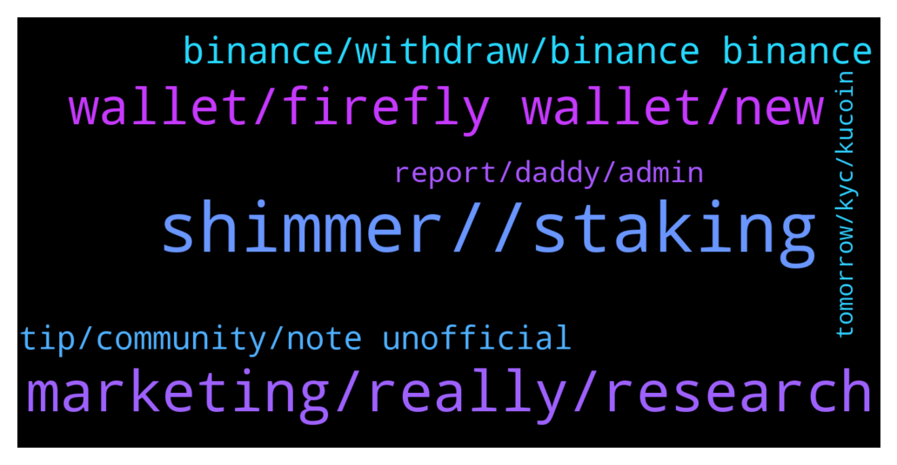

# **@iotatangle**
 ## Analysis for **2021-12-30** - **2021-12-31**.

---

## 📊 **Basic Stats**

**n_messages_sent**: 193

---

---

## 🔝 **Top keywords and related messages**

1. **shimmer, , staking**

    @everyday_burns_a_hole_in_my_soul --- *If 99% of coin will be stacked price would be unrealistically high* **--->** [TG Discussion](https://t.me/iotatangle/305075)

    @mahirnadi --- *Is this the total amount that will be distirbuted to iota stakers? Or will there be an other airdrop?* **--->** [TG Discussion](https://t.me/iotatangle/305180)

    @Tahmis --- *When staking you will get assembly and shimmer tokens every 10 seconds. The more you stake the more you get* **--->** [TG Discussion](https://t.me/iotatangle/305191)

    @Papa_Moose --- *And minimum of 10.000.000 SMR saved to get the airdrop* **--->** [TG Discussion](https://t.me/iotatangle/305170)

    @lalit1414 --- *most coins reached to the height with marketing.. not with tech   No marketing means we will go back to $1 again.* **--->** [TG Discussion](https://t.me/iotatangle/305243)

    @ash1taka1997 --- *100% agreed!  Look at all the extinct species, literally their supply in individual numbers went down to zero and humans didn't bother to save them.  On the other hand, look at pigs, cattle and chicken, they are bred in the millions but still hold up a certain price, because we want to eat them.  For something to hold value, function and utility is much more important than rarity.  That's why I'd rather the 60 Ti be put to good use to make our ecosystem fantastic.* **--->** [TG Discussion](https://t.me/iotatangle/305389)

2. **marketing, really, research**

    @Bill --- *If you would do your research you would know why the foundation cannot make any marketing.* **--->** [TG Discussion](https://t.me/iotatangle/305286)

    @Pantra86 --- *Unfotunatelly. I agree Without marketing you cant grow in this market. And i dont know really why iota team doesnt workbon it* **--->** [TG Discussion](https://t.me/iotatangle/305244)

    @Pantra86 --- *Yes, and i dont know why. The marketing team is really weak or doesnt exist* **--->** [TG Discussion](https://t.me/iotatangle/305241)

    @SeifertReid --- *Hey why isn’t IOTA listed yet on KuCoin??* **--->** [TG Discussion](https://t.me/iotatangle/305217)

    @Matt_Unwin --- *Hello Bill. Making a bold statement like this is worthy of some form of follow up. I am trying to conduct my own research but on other projects it is very valuable to share information and those that have a full grasp will usually help. That’s what TG channels such as this are for. I personally have never got on well with projects where ever question is met with (DYOR). Just be helpful and appreciative of those that are new … their legacy FIAT invested in this is as good as yours.* **--->** [TG Discussion](https://t.me/iotatangle/305299)

    @RevNine --- *Iota performed very well the last days… everyone into crypto got an eye on it.  2 days a row 98% red candle   Not for iota green those days* **--->** [TG Discussion](https://t.me/iotatangle/305248)

3. **wallet, firefly wallet, new**

    @Skypies --- *Hello admin good morning. Please I sent my oita from binance to my firefly wallet like 6 hours ago but till now, I am yet to see the iota tokens reflect on my firefly wallet though it’s saying transaction completed on Binance.   What could be the reason for this delay or is it normal ?* **--->** [TG Discussion](https://t.me/iotatangle/305277)

    @mahirnadi --- *Hi everyone Where can i buy iota and send to firefly for staking? Binance don’t allow iota network, can i send with bep20?* **--->** [TG Discussion](https://t.me/iotatangle/304739)

    @riagabriella --- *My binance is still showing error. On the MIOTA network. It doesn’t recognise the address/ QR code  from firefly to receive.* **--->** [TG Discussion](https://t.me/iotatangle/305131)

    @DanielWolfFIT --- *hey guys - one question. Was sending IOTA via 2 firefly wallets today 2 hours ago. from the sending adress the token already went away and in the tangle it seems the tx went through. but the reciever adresse still havent got the amount. what s the issue about that?* **--->** [TG Discussion](https://t.me/iotatangle/305328)

    @DanielWolfFIT --- *Haha don't punch me. Forgot to actively refreshing the balance at the 2. Wallet 🙄😅* **--->** [TG Discussion](https://t.me/iotatangle/305347)

    @Marv21 --- *Iam trying to migrate to the new firefly. But it Stuck at creating wallet for 10mins now* **--->** [TG Discussion](https://t.me/iotatangle/304910)

4. **binance, withdraw, binance binance**

    @Basti --- *But binance is working every few hours* **--->** [TG Discussion](https://t.me/iotatangle/304745)

    @Dietmar --- *2 days ago I had the chancev to withdraw from binance (1st using firefly) and just today I saw the value on firefly. How can that be?* **--->** [TG Discussion](https://t.me/iotatangle/304818)

    @ElmettS96 --- *A question to all, in Binance there is a huge sell wall in the order book (2500000 miota approximately), I read that is a manipulation move of Binance, someone can explain how they can do that ?* **--->** [TG Discussion](https://t.me/iotatangle/305406)

    @davicico94 --- *Now u can withdraw of binance* **--->** [TG Discussion](https://t.me/iotatangle/305124)

    @ash1taka1997 --- *Already listed, but Binance suspends withdrawals very often.* **--->** [TG Discussion](https://t.me/iotatangle/304977)

    @davicico94 --- *All day no work .. that binance..* **--->** [TG Discussion](https://t.me/iotatangle/304769)

5. **tip, community, note unofficial**

    @DanielWolfFIT --- *Now everything is fine and I am happy haha 😅* **--->** [TG Discussion](https://t.me/iotatangle/305348)

    @deviatkinlev --- *Sad that you haven’t tip bot 😅 I would tip you if you would have one* **--->** [TG Discussion](https://t.me/iotatangle/304906)

    @Tahmis --- *Great 👍 That was an easy solution then 😄* **--->** [TG Discussion](https://t.me/iotatangle/305351)

    @itsmedev --- *Glad to see 10k + members in a community managed group :)* **--->** [TG Discussion](https://t.me/iotatangle/305200)

    @mahirnadi --- *Thank you, i will definitely have 10 mln :)* **--->** [TG Discussion](https://t.me/iotatangle/305195)

    @mahirnadi --- *Thank you, i did it :) Just hesitating if i should make more* **--->** [TG Discussion](https://t.me/iotatangle/305176)

6. **report, daddy, admin**

    @Tahmis --- *I will ban him but doesnt help much. Please be careful! No admin will ever dm anyone!!* **--->** [TG Discussion](https://t.me/iotatangle/305342)

    @DanielWolfFIT --- *Petteri  is a scammer. please kick* **--->** [TG Discussion](https://t.me/iotatangle/305331)

    @Tahmis --- *Could you ask in discord? Easier to find help there and Im a bit busy right now* **--->** [TG Discussion](https://t.me/iotatangle/305332)

    @Tahmis --- *Hmm that doesnt have account name... might be impossible to report* **--->** [TG Discussion](https://t.me/iotatangle/305341)

    @Skypies --- *Dear scammers, remember your daddy wasn’t smart enough to become a millionaire and you are doing the exact things your daddy did. Be smart and work hard please.* **--->** [TG Discussion](https://t.me/iotatangle/305280)

    @Tahmis --- *Ty! Please report that account @notoscam* **--->** [TG Discussion](https://t.me/iotatangle/305340)

7. **tomorrow, kyc, kucoin**

    @Polka_Systems --- *You need to pass the basic registration of course* **--->** [TG Discussion](https://t.me/iotatangle/304897)

    @deviatkinlev --- *Says me I cant deposit crypto without KYC* **--->** [TG Discussion](https://t.me/iotatangle/304896)

    @UKSupplements --- *KuCoin had issue with deposits, sorting out soon hopefully* **--->** [TG Discussion](https://t.me/iotatangle/305218)

    @mahirnadi --- *Ok, i’ll wait till tomorrow, if not will try other exchanges But i don’t have account on others so i’m afraid they may be asking kyc or some days to withdraw* **--->** [TG Discussion](https://t.me/iotatangle/304746)

    @Basti --- *Kucoin will allow trading tomorrow and withdrawals on 31st of dec* **--->** [TG Discussion](https://t.me/iotatangle/304743)

