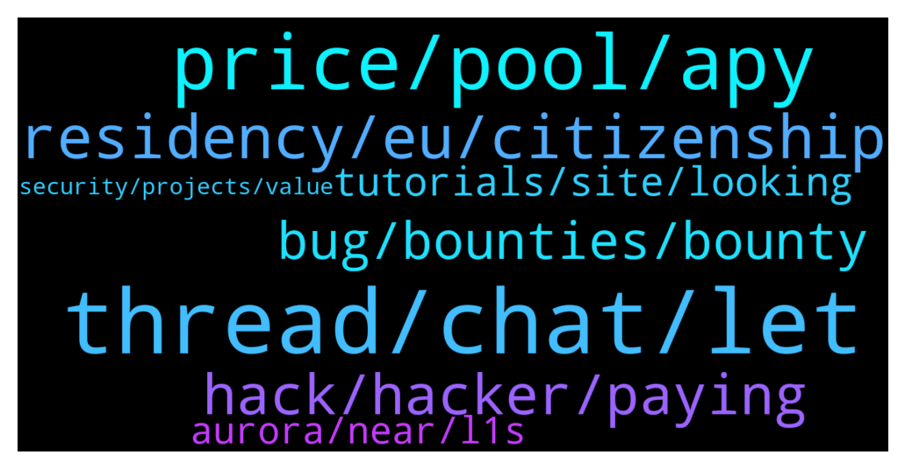

# **@lobsters_chat**
 ## Analysis for **2021-12-30** - **2021-12-31**.

---

## 📊 **Basic Stats**

**n_messages_sent**: 235

---

---

## 🔝 **Top keywords and related messages**

1. **thread, chat, let**

    @vPEPO --- *How the fuck someone writes a 206 tweet thread and promotes it?  https://twitter.com/adamscochran/status/1476652328736342023?t=EdDcKEKUq6aIHCEAbodGGg&s=19* **--->** [TG Discussion](https://t.me/lobsters_chat/311699)

    @vPEPO --- *Yeah, but that thread was lit af, Adam keeps trying to push twitter limits (he wants to look savvy but he lost everyone's attention at tweet 5/6)* **--->** [TG Discussion](https://t.me/lobsters_chat/311704)

    @kuzzel --- *In the interest of freeing @ivangbi of further moderation, would you be game of putting together your questions/points together and sharing them with me?  Sounds like I'd be doing everyone a favor if I just wrote a long form response via blog post, that people could just link to to get fully informed on the perspectives. That way it's less conversational and more 'here are the options and tradeoffs, you take the risk you think best fellow founders/DAO community members'.  Happy to write it with you if you're game* **--->** [TG Discussion](https://t.me/lobsters_chat/311565)

    @Sp33dyTT --- *Why don't they publicly post it then* **--->** [TG Discussion](https://t.me/lobsters_chat/311532)

    @Jatoch1 --- *Am I allowed to point a rugpuller? He’s in this chat* **--->** [TG Discussion](https://t.me/lobsters_chat/311692)

    @coine_r --- *Shifting the goalposts? Your earlier comment insinuated it's some sort of norm somewhere* **--->** [TG Discussion](https://t.me/lobsters_chat/311508)

2. **price, pool, apy**

    @garydefi --- *Why are there allocation limits to ohm bonds? Why would the protocol not want to allow anymore, if it’s down near ~0% discount? Because it wants less sell offs? But that doesn’t make too much sense, since ohm favors treasury, and at 0% there shouldn’t be sell offs. Or is it to cause supply limit fomo for bonds? Perhaps it wants people to buy on dex, not get at ~0%, to raise price?* **--->** [TG Discussion](https://t.me/lobsters_chat/311683)

    @strategst --- *As a sandwicher (and devil's advocate of course) I genuinely can't understand traders logic when buying with dexes. When I make a trade through ui I always put the slippage = 0, and it fails 1/10 times (own anecdotal experience), nothing special to make me to increase slippage. Of course high gas should be considered, but for hiding tx with flashbot rpc same high gas values should be used.  As for the fomo, or active trading phase, it is rarely good idea to trade, and if retail puts high slippage they obviously ready to lose money in slippage borders, so can't see any usage cases for such tools.* **--->** [TG Discussion](https://t.me/lobsters_chat/311593)

    @garydefi --- *But it wants to get treasury as always. It’s the reason bonds exist. And at 0% discount why not?* **--->** [TG Discussion](https://t.me/lobsters_chat/311685)

    @ivangbi --- *Because you dilute your ownership and treasury and sell at price of *today* while you are trying to build it into something bigger. So it makes no sense beyond a certain point to have too much treasury* **--->** [TG Discussion](https://t.me/lobsters_chat/311687)

    @ivangbi --- *Perhaps it doesn’t wanna to brr dilute?* **--->** [TG Discussion](https://t.me/lobsters_chat/311684)

    @phil_muhbags --- *I think a better metric might be the expected amount paid out by the pool a day at a given price.* **--->** [TG Discussion](https://t.me/lobsters_chat/311668)

3. **residency, eu, citizenship**

    @lefterisjp --- *That we did. I considered Estonia e citizenship and incorporating a company there in the past* **--->** [TG Discussion](https://t.me/lobsters_chat/311756)

    @jiji0x --- *What do you get as an Estonian e-citizen? What’s the use case?* **--->** [TG Discussion](https://t.me/lobsters_chat/311774)

    @rocket_fuel --- *Estonian e-residency isn’t a larp. They are just trying to monetizea ridiculously expensive system. It was a “success” originally (the entire digital state concept in Estonia), because in the beginning it consumed ~30% of the state budget for a few years. Too big too fail.* **--->** [TG Discussion](https://t.me/lobsters_chat/311766)

    @jiji0x --- *If you regularly work from some place else, you most likely will become resident there too? So now you’re resident in two places. What have you gained?  That you can sign documents electronically?* **--->** [TG Discussion](https://t.me/lobsters_chat/311776)

    @jiji0x --- *I always wanted to understand their e-citizenship etc and see the greatness of it all but each time I looked into it and its supposed benefits, it always felt as a complete larp* **--->** [TG Discussion](https://t.me/lobsters_chat/311758)

    @rbnd1 --- *E-residency scheme is not residency either* **--->** [TG Discussion](https://t.me/lobsters_chat/311783)

4. **hack, hacker, paying**

    @rata0x --- *I have friends at Bitfinex, lf anyone can help them to trace stolen 117k btc, they are willing to pay around a billion dollars.* **--->** [TG Discussion](https://t.me/lobsters_chat/311530)

    @muditg --- *Likely the same attack as previous time https://twitter.com/Mudit__Gupta/status/1455627465678749696?t=T9tXSDnlKkVjspaziQKxeQ&s=19* **--->** [TG Discussion](https://t.me/lobsters_chat/311728)

    @corp399 --- *https://etherscan.io/address/0xab5801a7d398351b8be11c439e05c5b3259aec9b#tokentxns  2022 looks like scam, but how did they do this?  If dev insert a specific code into the contract, can dev move the token without the wallet owner's approve?* **--->** [TG Discussion](https://t.me/lobsters_chat/311631)

    @spreek --- *https://etherscan.io/tx/0xd6a816cc291b24267c03c23c730a84a2699f32a7cf714c8cbe3e47321c76b08f sashimiswap exploited if anyone remembers that* **--->** [TG Discussion](https://t.me/lobsters_chat/311590)

    @rata0x --- *Three US detective solved case, hackers are arrested. And Binance rewarded them with maximum allowed reward amount in the state.* **--->** [TG Discussion](https://t.me/lobsters_chat/311553)

    @SpikeSpiege1 --- *Anyone know where the hacker actually took the tokens from? Team wallet? Bridge? Etc https://bitcoinist.com/hacker-exploits-vulnerability-on-polygon/* **--->** [TG Discussion](https://t.me/lobsters_chat/311857)

5. **bug, bounties, bounty**

    @StephanGoss --- *I'm going to make a wildly unpopular statement: I think it'd be money better spent for a project to spend $2M on some high quality private investigators to track down black hats and then cooperate with law enforcement than spend $180M on bounties.* **--->** [TG Discussion](https://t.me/lobsters_chat/311529)

    @coine_r --- *"cultural problem"  In which other culture is it normal to pay $180M+ for a bug bounty?* **--->** [TG Discussion](https://t.me/lobsters_chat/311503)

    @obaidoteth --- *“Codebase would end up being rock solid in no time”  If you pay $150M per high severity bug you will not have enough money to make the code rock solid* **--->** [TG Discussion](https://t.me/lobsters_chat/311496)

    @kuzzel --- *Btw, re: the '10%' number, I totally agree. My core thesis on this is that there is some variable % number that gets most of the benefits of bug bounties that is much less than 100% of funds at risk, which encompasses turning blackhats.  It may be 10%, but it could also be 20% or 1%. Finding optimal pricing is impossible due to the opacity of the market, but finding an effective range should be possible with a large enough dataset. Maybe when we have a few thousand critical reports?   Anyways, just hit me up if you'd like to write that piece, I have a lot of respect for willing to take a reasoned stance against this. Would happily write it up, just want to ensure that the thesis is properly steel-manned.* **--->** [TG Discussion](https://t.me/lobsters_chat/311567)

    @StephanGoss --- *I'm curious, do you guys offer recovery bounties or just bug bounty programs? Feels like having teams you work with that specialize in that work would be highly helpful to projects that get exploited especially since it's usually time senstivie. Retainer + Bounty or something like that. I'd personally be more likely to invest in a project that has a really aggressive and potentially pre-funded recovery program on top of just a bug bounty program. Be both the carrot AND the stick.* **--->** [TG Discussion](https://t.me/lobsters_chat/311568)

    @StephanGoss --- *Correct, it's fine paying good people that are white hat to find the bug, it's fine to pay good people that are white hat to recover it, I have an issue with just paying so much to basically bribe teh blackhats into not stealing* **--->** [TG Discussion](https://t.me/lobsters_chat/311545)

6. **tutorials, site, looking**

    @Don_Luv --- *Not sure if you’re looking for a specific one that was mentioned previously, but the one I always recommend to people is https://finematics.com* **--->** [TG Discussion](https://t.me/lobsters_chat/311799)

    @philippvienna --- *this one is in the works:  https://dune.xyz/kwizzles/LobsterDAO* **--->** [TG Discussion](https://t.me/lobsters_chat/311765)

    @perpetual_losses --- *Anyone can point me to the site that had a collection of DeFi tutorials?* **--->** [TG Discussion](https://t.me/lobsters_chat/311790)

    @norswap --- *this has most of what you might  want to know on OlympusDAO https://dune.xyz/shadow* **--->** [TG Discussion](https://t.me/lobsters_chat/311488)

    @DMA1086 --- *But more info on the new features:  https://twitter.com/Bancor/status/1476552049936457729?t=kyAGgHPn6dMyg0xeu5W47g&s=19* **--->** [TG Discussion](https://t.me/lobsters_chat/311689)

    @duckdegen --- *Nice dashboard. Sent you a pm* **--->** [TG Discussion](https://t.me/lobsters_chat/311837)

7. **aurora, near, l1s**

    @Kollossus --- *Anybody used NEAR here? It's quite empty projects wise for the moment.* **--->** [TG Discussion](https://t.me/lobsters_chat/311823)

    @rahemanAli --- *Yeah but mostly used Aurora given that it's EVM compatible, haven't explored any dApps natively deployed on NEAR as yet* **--->** [TG Discussion](https://t.me/lobsters_chat/311825)

    @Alphamint --- *Q: if you where to sort all the protocols with tokens that are actually of use and aren't L1s by legal risk for the founders starting with less risky, which ones would be in the top 10?  I'm guessing chain link would one of them cus theyrnt touching any money  (Only judging by the type of service they provide,  ignoring that some have legal buffers like no website, DAO decided on activation, foundation in BVI...)* **--->** [TG Discussion](https://t.me/lobsters_chat/311578)

    @ncerovac --- *Yeah realit is around for some time now. really great product* **--->** [TG Discussion](https://t.me/lobsters_chat/311622)

    @rahemanAli --- *that's cool, think the L2 to Eth narrative in general is the accepted standard for adoption. Dodo, curve, sushi I think have plans for Aurora deployment but not sure of the timeline.  I wonder if the recent interest/traction/growth in NEAR is largely associated with Aurora or there are some other catalysts?   I also hear there will be a bunch of incentives to drive liquidity/adoption of some of the protocols that are set to launch or are already live in Q1.* **--->** [TG Discussion](https://t.me/lobsters_chat/311832)

    @rata0x --- *Best project is gearbox, as far as l read till mid 100* **--->** [TG Discussion](https://t.me/lobsters_chat/311705)

