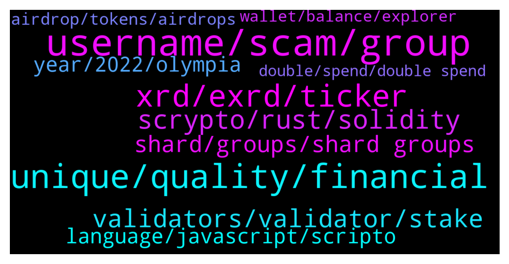

# **@radix_dlt**
 ## Analysis for **2021-12-30** - **2021-12-31**.

---

## 📊 **Basic Stats**

**n_messages_sent**: 643

---

---

## 🔝 **Top keywords and related messages**

1. **username, scam, group**

    @epsylon_1 --- *https://youtu.be/SS6L67BqTOM This is so cool to watch 😃* **--->** [TG Discussion](https://t.me/radix_dlt/329593)

    @Magal36 --- *We have in common being a permissionless network, and there's nothing you can do against scams in a a permissionless network except educate 🤷‍♂* **--->** [TG Discussion](https://t.me/radix_dlt/330602)

    @ChristopherHouse --- *2 guys it only looks like? Is there more team members?* **--->** [TG Discussion](https://t.me/radix_dlt/329639)

    @fpieper --- *And check out the getting started video on YouTube: https://youtu.be/Mu8L-BJFfQM* **--->** [TG Discussion](https://t.me/radix_dlt/330349)

    @Nalin19 --- *@Jacob_XRD he is a scam admin please remove this person he messaging me 😂* **--->** [TG Discussion](https://t.me/radix_dlt/329971)

    @Nalin19 --- *I copy his name from profile* **--->** [TG Discussion](https://t.me/radix_dlt/329976)

2. **unique, quality, financial**

    @ChristopherHouse --- *What is unique about Radix? Vs other blockchains?!* **--->** [TG Discussion](https://t.me/radix_dlt/329655)

    @Darren_Kc --- *For radix to be $100 dollars or so, wouldn’t it need a market cap above $1 trillion?  Do we really believe that this is the potential in the next 7+ years?   It certainly wouldn’t be plausible until after Xi’an, another bull run and a huge migration from Other L1 projects. All of which is hugely ambitious and extremely difficult!   Fingers crossed🤞🏻* **--->** [TG Discussion](https://t.me/radix_dlt/330197)

    @Geralt123456 --- *What makes impossible for other projects to copy radix and its atomic composability?* **--->** [TG Discussion](https://t.me/radix_dlt/330158)

    @Alex --- *Guys does any other blockchain or dlt that manage to compete even closely with the radix tech and is the radix tech already fully proven?* **--->** [TG Discussion](https://t.me/radix_dlt/329901)

    @LucPro --- *Is Concordium project competitor to Radix?* **--->** [TG Discussion](https://t.me/radix_dlt/329850)

    @Jazzer9F --- *Excellent article from Coin Telegraph highlighting the current issues faced by Solidity developers, and detailing how Radix will give developers the power to build quickly, securely, and know that scale will never be a bottleneck!  https://cointelegraph.com/news/watch-out-solidity-new-project-aims-to-tackle-downsides-of-coding-defi-projects* **--->** [TG Discussion](https://t.me/radix_dlt/329812)

3. **xrd, exrd, ticker**

    @donn --- *do u guys recommend if i hold exrd rather than the real xrd?* **--->** [TG Discussion](https://t.me/radix_dlt/330605)

    @Baldyo7 --- *My EXRD is on KuCoin, how do I transfer it to XRD and send to my radix wallet* **--->** [TG Discussion](https://t.me/radix_dlt/330004)

    @Face000 --- *Guys can you explain Whats the best to buy exrd or xrd  End Will it turn to one token or dus this stay like this* **--->** [TG Discussion](https://t.me/radix_dlt/329730)

    @jumpfetus --- *it blows my mind that there are people savvy enough to go through the effort of obtaining XRD but then falling for "send me coins to get more coins!1!1!!"* **--->** [TG Discussion](https://t.me/radix_dlt/329559)

    @eddy_Ip --- *Is there any bridge I can bridge XRD back to eXRD?* **--->** [TG Discussion](https://t.me/radix_dlt/329796)

    @fpieper --- *1) no, not exclusive. there can be more than one BTC ticker 2) no they can't be confiscated or deleted* **--->** [TG Discussion](https://t.me/radix_dlt/330562)

4. **scrypto, rust, solidity**

    @fpieper --- *Actually Scrypto is heavily using Rust syntax (actually the current version uses a Rust compiler under the hood). What Scrypto mainly does is adding a concept of native assets as a feature. This is very important and the main reason why it is much safer and you can't do that only with a library.  Also the reason not to use some mainstream language and libraries is that the execution environment is not some private computer but a public decentralised ledger which has its own challenges and requirements :)* **--->** [TG Discussion](https://t.me/radix_dlt/330222)

    @Adrien --- *Hi, I've got a dev friend who tried scrypto out for some kind of voting project. I'd like to give some of his feedback. He said it looked interesting and the concept was good but he wasn't impressed by the amount of errors in the supporting documentation. He added that from his experience, when other projects faced the same issues, pre launch, he was quite disappointed at launch. However, since it's still testing phase, there's lots of time ahead and documentation is probably not at the top of the list right now.* **--->** [TG Discussion](https://t.me/radix_dlt/329601)

    @fpieper --- *Scrypto is Radix's smart contract language. Much safer, easier and more fun than Solidity of Ethereum = drastically reduces hacks and exploits. Scrypto is Radix's unfair advantage ;)* **--->** [TG Discussion](https://t.me/radix_dlt/330216)

    @Jazzer9F --- *The third instalment in the blog series focusing on our new programming language, Scrypto, is now live on the blog!  https://www.radixdlt.com/post/scrypto-an-asset-oriented-smart-contract-language* **--->** [TG Discussion](https://t.me/radix_dlt/330068)

    @ChristopherHouse --- *Is scrypto as fast as Solana?* **--->** [TG Discussion](https://t.me/radix_dlt/329618)

    @momoreina --- *I didn't understand much on Scrypto from the website, is it a language as well as a framework for DeFi apps?* **--->** [TG Discussion](https://t.me/radix_dlt/330213)

5. **validators, validator, stake**

    @Baldyo7 --- *Nice. Can anybody recommend a few validators for me to look at with reasonable fees and a solid infrastructure* **--->** [TG Discussion](https://t.me/radix_dlt/329985)

    @mattiabe98 --- *Shameless plug: I run my own validator, if you want more info check here http://stake.mattia.wiki/ 😁* **--->** [TG Discussion](https://t.me/radix_dlt/329992)

    @S --- *If I know the validator set, can't I just bribe them?* **--->** [TG Discussion](https://t.me/radix_dlt/330291)

    @fpieper --- *No, because it is quite unlikely to find 33% of validators out of random validators which want to bribe with you* **--->** [TG Discussion](https://t.me/radix_dlt/330295)

    @ahsimon --- *Total supply = zero only for validators 157-161.   Those validators are very far from being in the top 100, and hence staking to them very unlikely to ever participate in consensus and earn emission rewards.  Anyone can run a validator node, if only to gain experience, but does not needed to have any stake delegated to them.* **--->** [TG Discussion](https://t.me/radix_dlt/329494)

    @S --- *However, that is actually not the biggest worry. The biggest worry is people simply bribing a known validator set.* **--->** [TG Discussion](https://t.me/radix_dlt/330284)

6. **shard, groups, shard groups**

    @thenotthatgreat --- *But you woun't be able to use all your stake in a single group at any point, and the more shard groups there are, the smaller the chance for that would be.* **--->** [TG Discussion](https://t.me/radix_dlt/330192)

    @S --- *Well, 10% of stake is 10% of stake. Somehow I will have 10% say in what goes on in the system (on average). At some places it will be lower, at others it will be higher. If there's 100 shard groups I just need to have 0.33% of total stake in a shard group at one point, I'd say. If there's 10K shard groups, it's 0.0033%. Obviously that will happen at some point. Now, I don't normall do math and normally I'd suspect I'm just talking out of my ass 😂. However, leaving aside my math skills, I just wouldn't say that this is a very controversial idea (that you can get a corrupted shard/shard group at some point), seeing as so many sharded blockchains don't dare to guarantee it will never happen, and use fishermen or something else* **--->** [TG Discussion](https://t.me/radix_dlt/330088)

    @thenotthatgreat --- *but lets say you have an even distribution in the nodes across 1000 shard groups. If someone then can put 10% of total stake in a single node, it would be hard to make sure they don't have control of a shard groupe. By forcing to split into several nodes you can make 10% total stake also not mean more then 10% in any given shard groupe(if forcing to split enough), ofc I might be missing something completely.* **--->** [TG Discussion](https://t.me/radix_dlt/330108)

    @thenotthatgreat --- *You still can't steal someone elses funds even with a majority stake in a shard groupe, for that you need the private key.* **--->** [TG Discussion](https://t.me/radix_dlt/330268)

    @S --- *If I don't care about what shard group I will eventually control, it shouldn't matter if my stake is split up, right. If you assume that there's lots of shard groups, and I have lots of validators, then by simple normal distribution you'd expect me end up with a few shard groups where I have lots of control, even though most of my stake will be quite evenly spread. Assuming I have 10% of stake thereabouts, it should still follow that I can spin up lots of validators with a reasonable amount of stake-power, that will sometimes cluster together at random points. Correct me if I'm wrong.* **--->** [TG Discussion](https://t.me/radix_dlt/330082)

    @S --- *No, security should in principle degenerate, the more fragmented the system is. At least in a normal blockchain. Like I said, that's why the more realistic projects around don't really trust that shards will never get corrupted. Although I think the most mentioned fear is the idea that your validator set will simply get bribed.* **--->** [TG Discussion](https://t.me/radix_dlt/330232)

7. **year, 2022, olympia**

    @Ant --- *Hi all, have there been any rumours of when in 2022 we might see Babylon released? Yes, I realize Alexandria just went live 🙂* **--->** [TG Discussion](https://t.me/radix_dlt/329493)

    @thenotthatgreat --- *doubt it, mabe in the distant future, completely up to metamask. there is Cerbymask tho, it's in beta or alpha atm* **--->** [TG Discussion](https://t.me/radix_dlt/330320)

    @even_Phteven --- *TBA. Estimates are later 2022 though* **--->** [TG Discussion](https://t.me/radix_dlt/330617)

    @fondor --- *11,14% of that period already over 😁* **--->** [TG Discussion](https://t.me/radix_dlt/329537)

    @Trunghee3871 --- *Good news in the end of year* **--->** [TG Discussion](https://t.me/radix_dlt/330519)

    @fpieper --- *No, it is happening end of the year 😜* **--->** [TG Discussion](https://t.me/radix_dlt/330461)

8. **language, javascript, scripto**

    @PVV31 --- *Hi, I have just heard of this project : https://agoric.com/. It looks like what Radix proposes. And it’s using JavaScript as a programming language. What advantages do Radix network and Scripto bring to the table that make it worth learning a new language when smart contracts can be written in JavaScript ?  Thanks in advance for your clarifications* **--->** [TG Discussion](https://t.me/radix_dlt/329752)

    @PVV31 --- *You’re welcome. When I saw that it really seemed to me it could be a direct competitor of Radix. I found the idea of making it possible to write smart contracts in a popular and existing language. I don’t know how to program in solidity so a can’t say if I’d rather write sensitive code in JavaScript or Solidity. But my guess is that many will take the risk. I hope scripto is as straightforward as announced* **--->** [TG Discussion](https://t.me/radix_dlt/329775)

    @momoreina --- *Though I still don't get why most projects don't use a "mainstream" language, smart contracts don't exactly need a new programming paradigm. I think almost all current languages can handle the logic needed without problems and already have full blown libraries.* **--->** [TG Discussion](https://t.me/radix_dlt/330221)

    @momoreina --- *I don't know that gas has anything to do with the programming language? Isn't that more a function of TPS and how many transactions are hitting the network, which hinges on the execution environment? Otherwise Solana and Radix would have the same TPS since they both use Rust?* **--->** [TG Discussion](https://t.me/radix_dlt/330237)

    @PVV31 --- *Thanks for the insights. I have planned to dedicate to learning scripto. I met some of the team members at web Summit last November and they got me convinced I should have a deep look at what they do ☺️.* **--->** [TG Discussion](https://t.me/radix_dlt/329885)

    @June --- *Why is Java better than Go?* **--->** [TG Discussion](https://t.me/radix_dlt/330045)

9. **airdrop, tokens, airdrops**

    @Blind5ight --- *The ideas that floated around were 1) Hiding tokens you don’t find useful and/or 2) have a setting where you can prevent airdrops to your wallet* **--->** [TG Discussion](https://t.me/radix_dlt/329469)

    @Radstakes --- *There is a list of airdrop tokens here with links to the relevant validators: https://radixtalk.com/t/why-do-i-have-these-weird-tokens-in-my-wallet/128  Also you can check out radixlist.com* **--->** [TG Discussion](https://t.me/radix_dlt/329845)

    @Kesswitz --- *In order to participate in the Oci airdrop you have to follow the instructions and register your wallet.  Since we are a partner-node, you will receive 10% bonus Oci tokens when you stake with us for their upcoming airdrop.  https://t.me/ociswap/29838* **--->** [TG Discussion](https://t.me/radix_dlt/329898)

    @momoreina --- *Changing topics here. Is the OCISWAP airdrop over?* **--->** [TG Discussion](https://t.me/radix_dlt/330452)

    @Blind5ight --- *Wow, high frequency of airdrops xd* **--->** [TG Discussion](https://t.me/radix_dlt/329478)

    @mattiabe98 --- *Because apparently people go crazy for airdrops* **--->** [TG Discussion](https://t.me/radix_dlt/330043)

10. **wallet, balance, explorer**

    @Avaunt --- *How long have you been waiting. It requires manual verification atm so may take a day or two this time of year. You can reach the instapass team at support@instapass.io* **--->** [TG Discussion](https://t.me/radix_dlt/329790)

    @ttadeleye --- *Ive been waiting for about 3 days* **--->** [TG Discussion](https://t.me/radix_dlt/329791)

    @giskard_rich --- *Is there a process to reapply?* **--->** [TG Discussion](https://t.me/radix_dlt/330513)

    @PMinarno --- *@Jacob_XRD - tried to put my  wallet issue in discord under #support and there is no response yet.* **--->** [TG Discussion](https://t.me/radix_dlt/329793)

    @PMinarno --- *All, could you please let me know a way to reset the wallet?* **--->** [TG Discussion](https://t.me/radix_dlt/329918)

    @Peter (HAM) --- *Can we check our hardware wallet's balance using Radix Desktop wallet without connecting the Ledger first? I only get "Unable to Connect to Ledger" as a result.* **--->** [TG Discussion](https://t.me/radix_dlt/329920)

