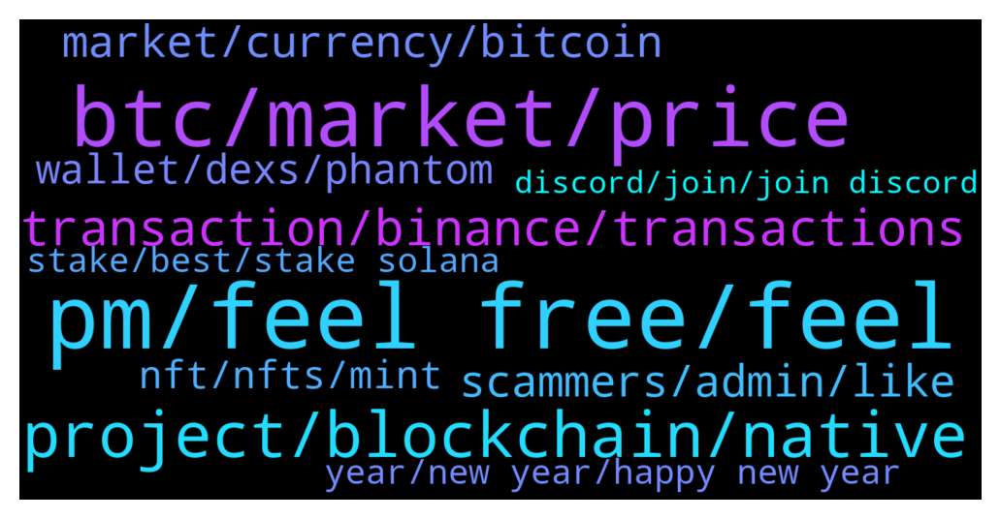

# **@solana**
 ## Analysis for **2021-12-30** - **2021-12-31**.

---

## 📊 **Basic Stats**

**n_messages_sent**: 358

---

---

## 🔝 **Top keywords and related messages**

1. **pm, feel free, feel**

    @likewinni --- *Does DeFi have a good friend who can teach me?* **--->** [TG Discussion](https://t.me/solana/883864)

    @cryptolover1987 --- *Hello How can I help you ?* **--->** [TG Discussion](https://t.me/solana/884116)

    @Monterrey_Rice --- *Hey hey hey! How we doing this afternoon SolFam??????* **--->** [TG Discussion](https://t.me/solana/884548)

    @mahib45 --- *Hello 👋  How may we help you ?* **--->** [TG Discussion](https://t.me/solana/883992)

    @Monterrey_Rice --- *Yeah I’d be careful with that one!* **--->** [TG Discussion](https://t.me/solana/883605)

    @RealPrinceOla --- *Do you still need to ask this question when you already know what is going to happen? 🤔* **--->** [TG Discussion](https://t.me/solana/884777)

2. **btc, market, price**

    @HERVYFLORIST --- *After 1.1 billion options expiry in 31 december. Is the market going to bearish or bullish? Please anyone* **--->** [TG Discussion](https://t.me/solana/884543)

    @Haruna --- *Hello can solana get to 200 usd by next tomorrow?* **--->** [TG Discussion](https://t.me/solana/884797)

    @kuchezin --- *oh no , the problem of the whole system shutdown at 5pm in september 2021 is due to 1 block overload with 400,000 transactions ?. The question is if it is decentralized, if one node goes down, the whole network will still work, why affect the whole network?* **--->** [TG Discussion](https://t.me/solana/885179)

    @VSiDV177 --- *We are far away from end of bull run but  Solana is more for stable income. It has already increased 200x since nov last year* **--->** [TG Discussion](https://t.me/solana/884293)

    @DaiLouise --- *SOL is more promising because it's always on the rise* **--->** [TG Discussion](https://t.me/solana/884906)

    @sophia_marti --- *Bitcoin outdid S&P 500 comparatively this year but today, the stock asset is trading near it's all time high while Btc is far below it's ATH. But it's market volatility and it shouldn't cause too much fright, I am buying the dip and so should you. 💪* **--->** [TG Discussion](https://t.me/solana/884173)

3. **project, blockchain, native**

    @kuchezin --- *Hi admin, Why is Solana centralized? Is there any development roadmap to become a 100% decentralized network?* **--->** [TG Discussion](https://t.me/solana/885048)

    @Ral_87 --- *Is there a platform like abracadabra in Solana ?* **--->** [TG Discussion](https://t.me/solana/884802)

    @AlexATB --- *Hello Admin, did Solana invested in this project Kirobo ??* **--->** [TG Discussion](https://t.me/solana/884659)

    @RN020 --- *Hi, do we have bridge from bep20 to solana? How can I convert my busd to usdc?* **--->** [TG Discussion](https://t.me/solana/883554)

    @cryptolover1987 --- *https://solana.com/ecosystem/starlaunch  Yet to be verified on Solana ecosystem* **--->** [TG Discussion](https://t.me/solana/883409)

    @Memoryz --- *Question, is "Starlaunch" an official partner of Solana?   Many users have had glitches and other issues using the launch app. Specifically Starlaunch does not credit users who cannot click buttons in time etc and its been very misleading* **--->** [TG Discussion](https://t.me/solana/883397)

4. **transaction, binance, transactions**

    @ks094 --- *Hello.  Yesterday I was withdrawing usdc from binance to phantom and the transaction was frozen* **--->** [TG Discussion](https://t.me/solana/883895)

    @Larissa669 --- *Why do transaction on Binance using Solana network take such a long time* **--->** [TG Discussion](https://t.me/solana/884719)

    @ks094 --- *and that transaction is still hangingthis is a new deal just* **--->** [TG Discussion](https://t.me/solana/883924)

    @ks094 --- *for the test, after a few hours I committed the transaction again and it went right away.* **--->** [TG Discussion](https://t.me/solana/883907)

    @Rx_Sulab --- *Pls how long does it take solana to arrive from binance. I made withdrawal over 2hrs now it has not arrived.* **--->** [TG Discussion](https://t.me/solana/883441)

    @GGiridhar --- *Can you please explain how to commit the txn again?* **--->** [TG Discussion](https://t.me/solana/883911)

5. **scammers, admin, like**

    @Emicabj --- *I have discovered 7 scammers in this group, before handing over your money, investigate before* **--->** [TG Discussion](https://t.me/solana/885462)

    @KoTaRo --- *Hi, would like to speak to admin/support team. concerns on a suspicious website* **--->** [TG Discussion](https://t.me/solana/884569)

    @zet07 --- *Dude holy sh** why you calling me a scammer, what the quack, stop it* **--->** [TG Discussion](https://t.me/solana/884242)

    @Emicabj --- *Be careful there are many scammers in this group, I already discovered two* **--->** [TG Discussion](https://t.me/solana/884381)

    @Chavex77 --- *@Real_Master_Yoda scammer take care spamming people* **--->** [TG Discussion](https://t.me/solana/884282)

    @Emicabj --- *Many scammers here, if they want information, they pass it on privately so they are cautious and do not waste their money* **--->** [TG Discussion](https://t.me/solana/884577)

6. **market, currency, bitcoin**

    @hakakskjsks --- *Hello, I'm currently frustrated with the current market conditions. Is there any way to make decent money without checking the market every day?* **--->** [TG Discussion](https://t.me/solana/884699)

    @Nuskymeda --- *Many people make money in cryptocurrency too* **--->** [TG Discussion](https://t.me/solana/883485)

    @elyyss88 --- *Many countries now restrict bank transfers to cryptocurrency accounts. I don’t know how much such news will affect the cryptocurrency market.* **--->** [TG Discussion](https://t.me/solana/884482)

    @Monterrey_Rice --- *Welcome to the wild world of crypto fam!* **--->** [TG Discussion](https://t.me/solana/885486)

    @Dmitry --- *Ask yourself if you’re doing this to get rich quick, or if you’re building up for future peace of mind. If it’s the latter, tell yourself that the movement does not matter in grand scheme of things. If it’s the first one, then keep checking and selling for gains (in other words, do you). Hope this helps* **--->** [TG Discussion](https://t.me/solana/884712)

    @CryptoQween --- *I wonder why we complain when the market tanks, obviously if you in long term you know what you want tbh it’s awkward if I’m looking for short term gains I’d preferably farm my crypto n stack w my earning into my position* **--->** [TG Discussion](https://t.me/solana/884174)

7. **wallet, dexs, phantom**

    @Dial_M_for_Marlon --- *Does phantom already have a mobile wallet?* **--->** [TG Discussion](https://t.me/solana/884396)

    @K --- *Hi, do you guys know if there is a Solana Name Service support team?  I bought a .sol and wanted to see how it can be used in Phantom wallet as a deposit address.* **--->** [TG Discussion](https://t.me/solana/885498)

    @Folaross --- *Yes, if you want to trade on DEXs for the first time.* **--->** [TG Discussion](https://t.me/solana/883840)

    @grigeraa --- *hello, is there any ways to convert sol to wsol* **--->** [TG Discussion](https://t.me/solana/883904)

    @RealPrinceOla --- *Check it out link below on how you can buy SOL here - https://coinmarketcap.com/currencies/solana/markets/  Or https://www.coingecko.com/en/coins/solana#markets  You can also buy on DEXs by connecting your wallet with DEXs. For DEXs - https://t.me/solana/481292   Please note that our admins won't DM you first* **--->** [TG Discussion](https://t.me/solana/885243)

    @mahib45 --- *List of wallets where SOL is supported.  You can store your Sol tokens in any wallet of your preference below. Make sure you save your Private key or phrase words in a safe place. And don't share your private key or phrase words with anyone.  🖥 Desktop Wallets ▪️ Solflare   • https://www.solflare.com/access-wallet?hardware  Solflare wallet guide using Nano S and X - https://docs.solana.com/wallet-guide/solflare  ▪️Solong chrome extension - https://chrome.google.com/webstore/detail/solong/memijejgibaodndkimcclfapfladdchj  ▪️ Ledger Live   • Ledger Nano S and X      Guide - https://docs.solana.com/wallet-guide/ledger-live  https://support.ledger.com/hc/en-us/articles/360016265659/  ▪️Math wallet    • Chrome extension - https://mathwallet.org/en-us/      🌐 Web Wallets ▪️Solflare    • https://www.solflare.com/create-wallet  ▪️Sollet    • https://www.sollet.io/    ▪️Sollet extension wallet  •https://chrome.google.com/webstore/detail/sollet/fhmfendgdocmcbmfikdcogofphimnkno?hl=en  ▪️Math wallet    • Web Wallet - https://mathwallet.org/en-us/   📱Mobile Wallets ▪️Trust wallet    • Download Trust Wallet app for iOS or Android app and create or import your wallet with multi-coin wallet and press add + button and search for SOL then switch on - https://trustwallet.com/  ▪️Math wallet    • Download Mathwallet app for iOS or Android app - https://mathwallet.org/en-us/  ▪️Coin98 wallet    • Android       https://play.google.com/store/apps/details?id=coin98.crypto.finance.media  • iPhone    https://apps.apple.com/vn/app/coin98-crypto-super-app/id1483029574    https://coin98.net/  ▪️SwipeWallet    • Android       https://play.google.com/store/apps/details?id=com.swipe.wallet     • iPhone          https://apps.apple.com/app/swipe-wallet/id1476726454    https://swipe.io/  https://moonlet.io/  Note: Sollet wallet is supporting Erc20 <-> SPL conversion. And Coin98 wallet is supporting Sol and SPL tokens.* **--->** [TG Discussion](https://t.me/solana/884729)

8. **nft, nfts, mint**

    @Saritaa9 --- *Hello I have made an offer on solanart and the seller has removed the nft from the sale when I get my sol?* **--->** [TG Discussion](https://t.me/solana/884583)

    @Tulpar_Ot --- *i just opened my Phantom and i see there is solana NFT, it say official NFT 1500, is it real ?* **--->** [TG Discussion](https://t.me/solana/883594)

    @eddrinyeo --- *Hi Support, is this the right place to asked about hte NFTtokenredeem?* **--->** [TG Discussion](https://t.me/solana/885021)

    @Omidzarei1380 --- *I received an nft and then when I went to a site that it said  I click to mint and my wallet get empty  Why?* **--->** [TG Discussion](https://t.me/solana/884085)

    @JSR619 --- *Cool thanks for the info. I haven’t bought any NFTs on SOL yet but just got a WL for one* **--->** [TG Discussion](https://t.me/solana/884994)

    @mahib45 --- *Hello 👋  That's fake! There is no NFT or any kind of the giveaway! @franckdataz* **--->** [TG Discussion](https://t.me/solana/884549)

9. **year, new year, happy new year**

    @Hailey --- *More Love as we are about to round-up 2021* **--->** [TG Discussion](https://t.me/solana/885166)

    @E --- *Happy New Year and wish all of us the best in 2022* **--->** [TG Discussion](https://t.me/solana/885543)

    @Monterrey_Rice --- *Happy New Year fam! I hope 2022 is the best yet!* **--->** [TG Discussion](https://t.me/solana/885539)

    @mahib45 --- *GM and happy new year 🚀🥰* **--->** [TG Discussion](https://t.me/solana/885473)

    @elizabeth_baker --- *May 2022 be the best year of your life. May we all find success, happiness and everything our heart desires* **--->** [TG Discussion](https://t.me/solana/885417)

    @Aimee722 --- *Happy New Year everyone💝💝New Year wishes come true* **--->** [TG Discussion](https://t.me/solana/885559)

10. **stake, best, stake solana**

    @Innervision0021 --- *Is there a way to auto stake solana (i.e. New solana which is sent to wallet automatically added to stake amount) or does this have to be manual? Thanks in advance* **--->** [TG Discussion](https://t.me/solana/883526)

    @cryptolover1987 --- *On which platform do you staking ?* **--->** [TG Discussion](https://t.me/solana/884127)

    @Esquireqrc --- *Hi admin - could you tell me the best place to stake Solana - I heard it’s phantom but it’s only desktop based - is there an equivalent app or not? Thanks* **--->** [TG Discussion](https://t.me/solana/885283)

    @cryptolover1987 --- *Stake/Unstake takes several epoch to warm up or to cool down (aprox. 2-3 days). You can read more about it here:  🔗https://docs.solana.com/staking/stake-accounts  You can use the   🔗 https://solanabeach.io/ explorer for monitoring the Epoch* **--->** [TG Discussion](https://t.me/solana/884130)

    @Arslan --- *which wallet is best to stake and store solana and buy solana Blockchain coins* **--->** [TG Discussion](https://t.me/solana/884720)

    @holmes2487 --- *Can someone tell me the best wallet for storing any Crypto ?* **--->** [TG Discussion](https://t.me/solana/885042)

