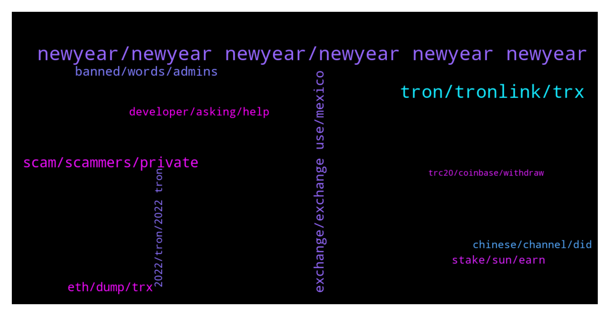

# **@tronnetworkEN**
 ## Analysis for **2021-12-30** - **2021-12-31**.

---

## 📊 **Basic Stats**

**n_messages_sent**: 236

---

---

## 🔝 **Top keywords and related messages**

1. **newyear, newyear newyear, newyear newyear newyear**

    @thebigguns --- *I agree that they are biased but I also want to keep a level head here and determine what was actually done* **--->** [TG Discussion](https://t.me/tronnetworkEN/3799074)

    @agentpiki --- *Don't lie. The voting is over* **--->** [TG Discussion](https://t.me/tronnetworkEN/3801005)

    @Richard --- *If I vote must I claim my rewards on daily basis?* **--->** [TG Discussion](https://t.me/tronnetworkEN/3798068)

    @Jyotiprakash --- *A warm remender please vote guys* **--->** [TG Discussion](https://t.me/tronnetworkEN/3799263)

    @Carlos_TRX --- *check https://tronwiki.com and check the tutorials to know how to vote* **--->** [TG Discussion](https://t.me/tronnetworkEN/3798017)

    @xPommepote --- *You freeze your TRX to get votes. Then you vote for a SR and the SR rewards you for the vote.* **--->** [TG Discussion](https://t.me/tronnetworkEN/3797989)

2. **tron, tronlink, trx**

    @David --- *Is this page affiliated with tron ac were you can mine and receive tron?* **--->** [TG Discussion](https://t.me/tronnetworkEN/3797945)

    @rwothomiobrian --- *Please note that TRON ANGEL is a scam* **--->** [TG Discussion](https://t.me/tronnetworkEN/3798948)

    @PiterSpain --- *You can't Import your trustwallet account in Tronlink.org app. Trustwallet is almost useless for TRON Ecosystem* **--->** [TG Discussion](https://t.me/tronnetworkEN/3798128)

    @Eyoh --- *Is there any airdrop going on today on TRON* **--->** [TG Discussion](https://t.me/tronnetworkEN/3800700)

    @PiterSpain --- *TRON is another blockchain, you can't see TRX Mainnet coins on etherscan* **--->** [TG Discussion](https://t.me/tronnetworkEN/3798485)

    @KingsDove_TRX --- *We have a governance system that allows you to earn Tron* **--->** [TG Discussion](https://t.me/tronnetworkEN/3797950)

3. **scam, scammers, private**

    @KingsDove_TRX --- *If you are getting a DM from a bit it is a scam!!* **--->** [TG Discussion](https://t.me/tronnetworkEN/3797942)

    @maestrostoic --- *I thought she is genuine and will guide* **--->** [TG Discussion](https://t.me/tronnetworkEN/3799314)

    @simon866 --- *He means the only legit guide's you will find are here in this chat  Anyone that may directly message you is a scammer* **--->** [TG Discussion](https://t.me/tronnetworkEN/3799377)

    @RahulKumar1901 --- *is there a way to check legitimacy* **--->** [TG Discussion](https://t.me/tronnetworkEN/3799244)

    @ccmedianetwork --- *If ask private keys - scam* **--->** [TG Discussion](https://t.me/tronnetworkEN/3801040)

    @PiterSpain --- *Only scammers will contact you in private. Block and report.* **--->** [TG Discussion](https://t.me/tronnetworkEN/3798908)

4. **exchange, exchange use, mexico**

    @agentpiki --- *We are not your financial advisor.  You asking exchange for US now mexico? Why not china* **--->** [TG Discussion](https://t.me/tronnetworkEN/3800310)

    @Fabs_trx --- *I guess your withdrawal are limited* **--->** [TG Discussion](https://t.me/tronnetworkEN/3799250)

    @遠山 --- *What exchange should I use in Mexico？* **--->** [TG Discussion](https://t.me/tronnetworkEN/3800286)

    @遠山 --- *So which exchange should I use in the United States* **--->** [TG Discussion](https://t.me/tronnetworkEN/3800214)

    @xPommepote --- *Maybe parubu exchange can because they own the wallet.* **--->** [TG Discussion](https://t.me/tronnetworkEN/3799762)

    @遠山 --- *I'm going to sign up for another exchange?* **--->** [TG Discussion](https://t.me/tronnetworkEN/3800211)

5. **banned, words, admins**

    @RahulKumar1901 --- *I am trying to ask my query, but it keeps getting deleted* **--->** [TG Discussion](https://t.me/tronnetworkEN/3799234)

    @maestrostoic --- *Alexsa why you deleted your comments?* **--->** [TG Discussion](https://t.me/tronnetworkEN/3799266)

    @agentpiki --- *Admins and moderators never message you  golden rule. block and report* **--->** [TG Discussion](https://t.me/tronnetworkEN/3801018)

    @Fabs_trx --- *No pictures, some words are banned as well.* **--->** [TG Discussion](https://t.me/tronnetworkEN/3799236)

    @Fabs_trx --- *Probably using banned words and the bot is automatically deleting them* **--->** [TG Discussion](https://t.me/tronnetworkEN/3798944)

    @agentpiki --- *Got banned for 12 hours til doves' unban* **--->** [TG Discussion](https://t.me/tronnetworkEN/3798878)

6. **eth, dump, trx**

    @thebigguns --- *Anybody else seen the top post on Reddit fudding Justin Sun and Tron? Basically it says JS has been dumping 165,000 ETH through Binance. What are your guys thoughts about this? In my opinion, the on-chain data doesn’t really prove anything.* **--->** [TG Discussion](https://t.me/tronnetworkEN/3799066)

    @thebigguns --- *They are saying that he is dumping it from the money he made from TRX investors* **--->** [TG Discussion](https://t.me/tronnetworkEN/3799072)

    @simon866 --- *Who cares, he should dump ETH, they always FUD us so they would deserve it 🤷‍♂️* **--->** [TG Discussion](https://t.me/tronnetworkEN/3799069)

    @simon866 --- *That would not make sense as its ETH, if he buys back TRX then what would they say?* **--->** [TG Discussion](https://t.me/tronnetworkEN/3799073)

    @simon866 --- *Also if he did diversify that's his thing but they should be careful as he holds more ETH than vitalik and can dump it anytime   This would only hurt ETH at this point* **--->** [TG Discussion](https://t.me/tronnetworkEN/3799078)

    @simon866 --- *Well remember Justin worked with ETH before he started Tron so it makes sense as he got in early* **--->** [TG Discussion](https://t.me/tronnetworkEN/3799076)

7. **developer, asking, help**

    @FaridKahiji --- *oh lol then thats it XD sorry for being dumb. Should I delete?* **--->** [TG Discussion](https://t.me/tronnetworkEN/3798493)

    @xPommepote --- *No if you need assistance ask here* **--->** [TG Discussion](https://t.me/tronnetworkEN/3799315)

    @ccmedianetwork --- *Yes, i do it. Wait answer, thx* **--->** [TG Discussion](https://t.me/tronnetworkEN/3799045)

    @MilNoslen --- *No, you're just wasting developer's resources* **--->** [TG Discussion](https://t.me/tronnetworkEN/3798669)

    @MilNoslen --- *If you're not a developer then no* **--->** [TG Discussion](https://t.me/tronnetworkEN/3798665)

    @PiterSpain --- *We are here to help! If you need more help ask all what you need* **--->** [TG Discussion](https://t.me/tronnetworkEN/3798510)

8. **stake, sun, earn**

    @syedmuneb --- *How much do you earn from stake* **--->** [TG Discussion](https://t.me/tronnetworkEN/3799564)

    @xPommepote --- *Buy TRX on exchanges and stake to earn* **--->** [TG Discussion](https://t.me/tronnetworkEN/3799560)

    @Ny_Ando --- *Hey guys, how to stake tron on trustwallet for energy?* **--->** [TG Discussion](https://t.me/tronnetworkEN/3798127)

    @agentpiki --- *Choose one of these legit ways to earn rewards:  1 - FREEZE AND VOTE  https://tron7010.zendesk.com/hc/en-us/articles/360043589352-How-to-Vote-and-Gain-Reward  2 - EARN ADDING LIQUIDITY POOLS   SUNSwap.com  3 - STAKE LP TOKENS  SUNSwap.com/mining  4 - SUN MINING      a) Stake SUNSwap LP tokens         (SUN/TRX)          SUN.io/#/stake         b) Deposit & Stake 3pool tokens         (USDT/USDJ/TUSD)          SUN.io/#/3pool/deposit         SUN.io/#/stake     c) Deposit & Stake USDC pool         tokens         SUN.io/#/usdc/deposit         SUN.io/#/stake  5 - LOCK SUN AND EARN TUSD & veSUN  SUN.io/#/stake  6 - EARN SUPPLYING IN JUSTLEND  JustLend.org  JustLend.org/#/market  7 - STAKE jTokens FROM JUSTLEND   JustLend.org/#/miningPool   You have a lot of ways to earn with TRON and protect your investments.  Pay attention to /GAS requirements (network fees).   Using https://Tronlink.org wallet you can see the network fees before confirm the transaction. Try it.* **--->** [TG Discussion](https://t.me/tronnetworkEN/3799594)

    @simon866 --- *Choose one of these legit ways to earn rewards:  1 - FREEZE AND VOTE  https://tron7010.zendesk.com/hc/en-us/articles/360043589352-How-to-Vote-and-Gain-Reward  2 - EARN ADDING LIQUIDITY POOLS   SUNSwap.com  3 - STAKE LP TOKENS  SUNSwap.com/mining  4 - SUN MINING      a) Stake SUNSwap LP tokens         (SUN/TRX)          SUN.io/#/stake         b) Deposit & Stake 3pool tokens         (USDT/USDJ/TUSD)          SUN.io/#/3pool/deposit         SUN.io/#/stake     c) Deposit & Stake USDC pool         tokens         SUN.io/#/usdc/deposit         SUN.io/#/stake  5 - LOCK SUN AND EARN TUSD & veSUN  SUN.io/#/stake  6 - EARN SUPPLYING IN JUSTLEND  JustLend.org  JustLend.org/#/market  7 - STAKE jTokens FROM JUSTLEND   JustLend.org/#/miningPool   You have a lot of ways to earn with TRON and protect your investments.  Pay attention to /GAS requirements (network fees).   Using https://Tronlink.org wallet you can see the network fees before confirm the transaction. Try it.* **--->** [TG Discussion](https://t.me/tronnetworkEN/3799847)

    @xPommepote --- *So just cash out as much as possible and do not put more in it. Instead stake your TRX in tronlink, cash out every day also but the safest and the legit way to do it* **--->** [TG Discussion](https://t.me/tronnetworkEN/3799258)

9. **chinese, channel, did**

    @PiterSpain --- *Read the message above you 👆* **--->** [TG Discussion](https://t.me/tronnetworkEN/3798925)

    @太阳 --- *I am a Chinese user and cannot use Binance* **--->** [TG Discussion](https://t.me/tronnetworkEN/3800673)

    @agentpiki --- *Try asking in bittorrent channel  @bttbittorrent << click* **--->** [TG Discussion](https://t.me/tronnetworkEN/3800386)

    @agentpiki --- *Oh did you ask for Chinese channel? Sorry about that  @tronnetworkCN << click here* **--->** [TG Discussion](https://t.me/tronnetworkEN/3800344)

    @skyeyes83 --- *Sorry this Is the correct link* **--->** [TG Discussion](https://t.me/tronnetworkEN/3799334)

    @agentpiki --- *Obviously did not work. Had to seek help from exclusive channel* **--->** [TG Discussion](https://t.me/tronnetworkEN/3798876)

10. **2022, tron, 2022 tron**

    @musa_mareer --- *Shasta Tron  When will it be ready  ?* **--->** [TG Discussion](https://t.me/tronnetworkEN/3800697)

    @lastbro3 --- *we'll see, hopefully, tron ​​2022 will grow* **--->** [TG Discussion](https://t.me/tronnetworkEN/3801196)

    @lastbro3 --- *tron is also not stable huh, hopefully 2022 he gives hope to the holder* **--->** [TG Discussion](https://t.me/tronnetworkEN/3801161)

    @Shahin_khan --- *I'm worried about the future of Tron and APEnft too* **--->** [TG Discussion](https://t.me/tronnetworkEN/3800587)

    @Nat093 --- *Who have something great to say about TRON next year* **--->** [TG Discussion](https://t.me/tronnetworkEN/3799703)

    @gift_23 --- *2 days to 2022.. TRON will rule the crypto world 2022* **--->** [TG Discussion](https://t.me/tronnetworkEN/3798737)

