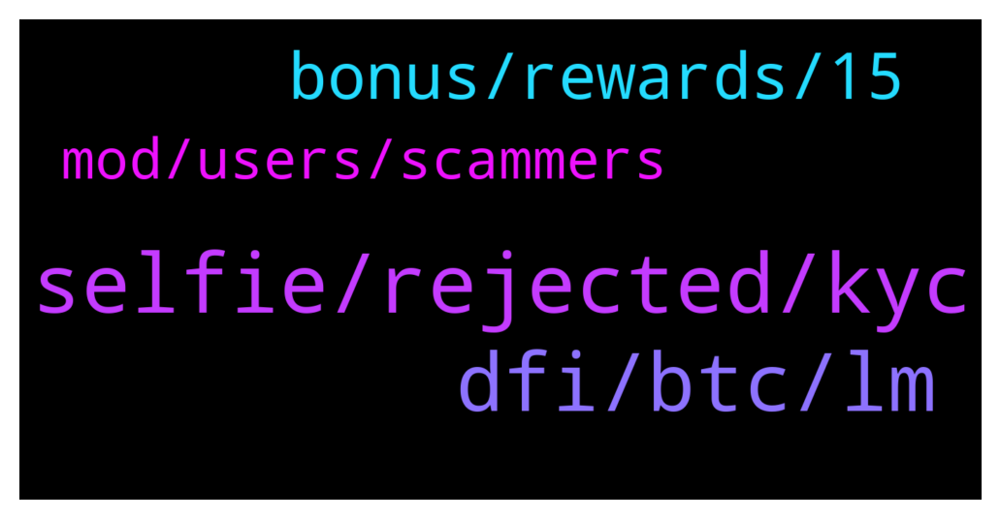

# **@CakeDeFi_EN**
 ## Analysis for **2021-12-31** - **2022-01-01**.

---

## 📊 **Basic Stats**

**n_messages_sent**: 71

---

---

## 🔝 **Top keywords and related messages**

1. **selfie, rejected, kyc**

    @Nhlaka311 --- *My verification selfie is getting rejected please help* **--->** [TG Discussion](https://t.me/CakeDeFi_EN/158528)

    @ankit --- *I upload proof of address document plz resolve my issue* **--->** [TG Discussion](https://t.me/CakeDeFi_EN/158758)

    @Michael_Schredl --- *Works for me - Please try another browser or another device* **--->** [TG Discussion](https://t.me/CakeDeFi_EN/158594)

    @Nhlaka311 --- *They accepted id only thong rejected is tye selfie .. I have been resubmitting non stop* **--->** [TG Discussion](https://t.me/CakeDeFi_EN/158530)

    @BBCPanzone --- *Hello guys, i have a question. I'm trying to log in these days but i can't. It appears a text saying that The site is not available. When will it be fixed?* **--->** [TG Discussion](https://t.me/CakeDeFi_EN/158593)

    @ABIOLA SYLVESTER --- *Thank you but I am always asked a question which does not seems to not have a right answer but I appreciate this* **--->** [TG Discussion](https://t.me/CakeDeFi_EN/158555)

2. **dfi, btc, lm**

    @Mats_1992 --- *Can i swap DFI to BTC?* **--->** [TG Discussion](https://t.me/CakeDeFi_EN/158437)

    @Albert --- *I could not wrap my mind around the risk of LM. What will happen for LM dbtc-dfi if BTC goes to 60,000usd but dfi drop to 1.5, similar what will happen if BTC drop to 30k, and dfi goes to 30 USD? How will the LM be affected?* **--->** [TG Discussion](https://t.me/CakeDeFi_EN/158725)

    @Kassius84 --- *You need to withdraw your DFI via Ethereum Network as ERC20 Token. You need to define the DFI AS Custom token in your MM. Here you will find the needed contract adress and some further informations. But be aware of the high Ethereum gas fees 👍  https://blog.cakedefi.com/another-sweet-transfer-option-erc-20-version-of-the-dfi-coin/* **--->** [TG Discussion](https://t.me/CakeDeFi_EN/158544)

    @frnklfrt --- *DeFiChain DEX offers dBTC-DFI at 78.46% APR while Cake DeFi offers BTC-DFI at 67.97% APR, I'm assuming there's more hoops to jump through to get dBTC paried with DFI for the higher rate as opposed to BTC-DFI, hence the higher APR?* **--->** [TG Discussion](https://t.me/CakeDeFi_EN/158460)

    @enalettin --- *we already know such a platform it is LP lm staking dfi on cake thanks for your kindness* **--->** [TG Discussion](https://t.me/CakeDeFi_EN/158646)

    @Eddie_Leow --- *Hi! Why my liquidity mining value (DUSD-DFI)  Was a lower value than what I invested. E.g. I invested 1.3k USD, and the current amount I saw I only 1k USD?* **--->** [TG Discussion](https://t.me/CakeDeFi_EN/158802)

3. **bonus, rewards, 15**

    @babas555 --- *then can i make $70 withdrawal after $50 deposit* **--->** [TG Discussion](https://t.me/CakeDeFi_EN/158614)

    @Michael_Schredl --- *Do you mean the sign up bonus?* **--->** [TG Discussion](https://t.me/CakeDeFi_EN/158610)

    @Eddie_Leow --- *i did not receive any additional tokens.* **--->** [TG Discussion](https://t.me/CakeDeFi_EN/158807)

    @Eddie_Leow --- *i only manage to get 22DFI from the liquity rewards* **--->** [TG Discussion](https://t.me/CakeDeFi_EN/158808)

    @Michael_Schredl --- *No, the Bonus is locked for 180 days* **--->** [TG Discussion](https://t.me/CakeDeFi_EN/158616)

    @Thomas --- *No, the funds you get from the promo are frozen for 6 months in the freezer* **--->** [TG Discussion](https://t.me/CakeDeFi_EN/158615)

4. **mod, users, scammers**

    @DmgBautista --- *Be carefull, asking such questions here will get you flooded by scammers DM you. Do not answer to any DM or call, even if it looks a mod. No mod will ever DM you and is also against the rule to any other user to DM you. Refer your communications only to this official chat and take care!* **--->** [TG Discussion](https://t.me/CakeDeFi_EN/158620)

    @yellowjellow88 --- *I’ve experienced it once. It’s so scary! I find it weird to have so many mod coming to my rescue. Lol* **--->** [TG Discussion](https://t.me/CakeDeFi_EN/158631)

    @Michael_Schredl --- *This is an english speaking group* **--->** [TG Discussion](https://t.me/CakeDeFi_EN/158772)

    @DmgBautista --- *Message deleted. Never DM anyone, as well as never answer any DM, scammers will not be obviously tolerated, as well as requests for DM. Anyway, sweet answer of yours 😁👍* **--->** [TG Discussion](https://t.me/CakeDeFi_EN/158651)

    @Xu --- *Too many scammers, here and there* **--->** [TG Discussion](https://t.me/CakeDeFi_EN/158546)

    @Thomas --- *The real one (the mod) is @Michael_Schredl , your scammer has a Q in his name. A mod would never be dm you, keep in mind* **--->** [TG Discussion](https://t.me/CakeDeFi_EN/158542)

