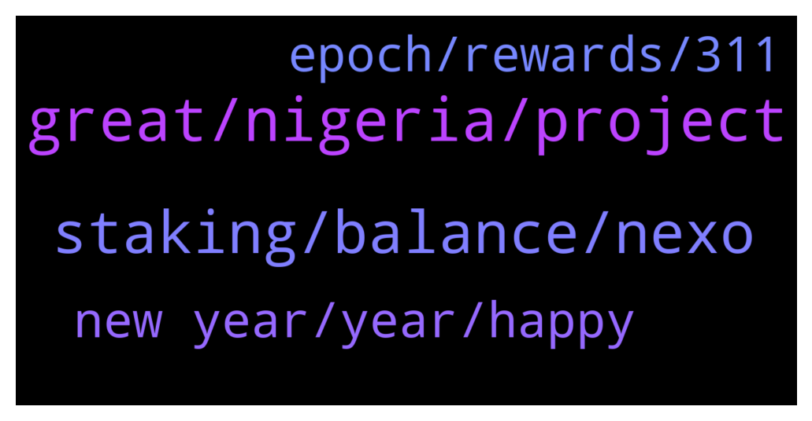

# **@Cardano**
 ## Analysis for **2021-12-31** - **2022-01-01**.

---

## 📊 **Basic Stats**

**n_messages_sent**: 90

---

---

## 🔝 **Top keywords and related messages**

1. **great, nigeria, project**

    @Jose Leni --- *Hi guys. Any news when hydra is going live mainnet?* **--->** [TG Discussion](https://t.me/Cardano/764038)

    @apex_pool_spo --- *each defi project will launch when the team is ready to launch, I assume. it seems a few will launch at the end of January.* **--->** [TG Discussion](https://t.me/Cardano/764437)

    @Rabbitholepools --- *I welcome the suggestion and will make efforts to anonimise the guide. I feel like a couple of points need to be made though:  I have used this guide on a variety of channels since March and not a single delegation has resulted from it;  There are countless community tools around Cardano which not so subtly point to specific pools (eg brought to you by, etc). Most of these are great tools that make a better user experience of the whole. Some of them i personally consider essential, and i  am sure I don't need to name them. Such tools are not only frequently "advertised" on official channels, but also presented directly to the community by prominent figures in the space. I personally have no issue with that: some SPOs have gone to great lengths to help the community and should be allowed to get some credit for it. Officially or otherwise.* **--->** [TG Discussion](https://t.me/Cardano/764010)

    @cryptojack6317 --- *any update on the defi? last I heard its coming sooner than expected* **--->** [TG Discussion](https://t.me/Cardano/764436)

    @georgelovegrove --- *Final video before the new year on Cardano Contributors League -https://www.youtube.com/watch?v=_wo8yXrX9oM  Discusses how funding contributors directly that have a simple objective to maximise impact could help core parts of the ecosystem like Project Catalyst thrive in 2022.  Have a great new year everyone 😄🎉* **--->** [TG Discussion](https://t.me/Cardano/764177)

    @Sephire420 --- *Hey guys, greetings from Germany  I just found out I am blocked by @CardanoStiftung (Cardano Foundation) on Twitter, don’t have any Idea why, didn’t ever do anything bad like spaming or trolling on Twitter.  Anyone in here experienced smth similar? Is there a way to get unblocked?* **--->** [TG Discussion](https://t.me/Cardano/764151)

2. **staking, balance, nexo**

    @Cat --- *Hey everyone! I’m new here. Just about to start staking some ADA. I found some news regarding Ledger. Can someone tell me if this applies to Daedleus wallet too? (I’ve pair my ledger with Daedleus) https://support.ledger.com/hc/en-us/articles/360020669680-U2F-API-deprecation* **--->** [TG Discussion](https://t.me/Cardano/764259)

    @Tustyrusty --- *I've spoken to IR about this. They have put a technical doc on Gov.uk I will either treat stake as income or interest on savings or a capital gain based on £0 purchase. I believe all are acceptable. I put exact what I've done in email to accountant. IR will not chastise you if you are genuinely trying to be legit. Worst case they will alter your return which could even be in your favour!* **--->** [TG Discussion](https://t.me/Cardano/763957)

    @glitch04 --- *They offer returns based on their own system not the networks native option. Is that a good platform? Sure for many that find it useful but they have different functions. Staking on the network is done with out releasing control of your wallet balance or having lock periods, where as with a platform like Nexo or Celsius you release custody of your assets to them in exchange for interest paid out while they loan your balance (assets) out.* **--->** [TG Discussion](https://t.me/Cardano/764079)

    @srinivas2121 --- *Need small info.. i am staking using yoroi..(browser). i have 3 wallets. 1 and 2 having good amounts. but 3rd wallet is having less ada means around 5k.. Issue is why i am not able to see asset tab for 3rd wallet... is there any thing which is related to staking amount or is there any option i need to enable... need suggestions..* **--->** [TG Discussion](https://t.me/Cardano/764520)

    @Rabbitholepools --- *Ok, it might be worth pointing Antho to one such non-branded staking guide then. Could you please help with that?* **--->** [TG Discussion](https://t.me/Cardano/764015)

    @apex_pool_spo --- *you might want to take a look at ccvault.io and typhonwallet.io, too, for your Ledger.* **--->** [TG Discussion](https://t.me/Cardano/764414)

3. **new year, year, happy**

    @glitch04 --- *what is your twitter id? I will forward the information* **--->** [TG Discussion](https://t.me/Cardano/764154)

    @apex_pool_spo --- *and you already show you know how it works by saying that 👍* **--->** [TG Discussion](https://t.me/Cardano/764427)

    @Sephire420 --- *@joseph_bohm (Joseph Böhm)  Thx for the quick support!* **--->** [TG Discussion](https://t.me/Cardano/764156)

    @srinivas2121 --- *thank u understood....what u r saying...* **--->** [TG Discussion](https://t.me/Cardano/764524)

    @rdalio321 --- *Yah I read a lot on Reddit...but not too much because they get it wrong sometimes too...hahah* **--->** [TG Discussion](https://t.me/Cardano/764428)

    @Tonyno456 --- *Mmmmh, the bot for annoyed. Dripdropz my friend, Google it* **--->** [TG Discussion](https://t.me/Cardano/764285)

4. **epoch, rewards, 311**

    @rdalio321 --- *Ok I see, and then E311 rewards are not paid until E313 so have to wait 2 more epochs to see them...think I got it* **--->** [TG Discussion](https://t.me/Cardano/764408)

    @apex_pool_spo --- *yes, because rewards for Epoch 311 will be payed when Epoch 313 starts.* **--->** [TG Discussion](https://t.me/Cardano/764403)

    @apex_pool_spo --- *when you redelegate to another pool, you will start earning rewards from the new pool after 3 full epochs (after the epoch when you redelegated). until then, you will earn rewards from the old stake pool. for example, if you redelegated  during Epoch 311 (which ended about 12 hours ago), you will see the first rewards from the new stake pool at the beginning of Epoch 315.* **--->** [TG Discussion](https://t.me/Cardano/764393)

    @apex_pool_spo --- *if you delegated during Epoch 309, you start earning rewards from the Epoch 311.* **--->** [TG Discussion](https://t.me/Cardano/764405)

    @rdalio321 --- *Hey guys, I recently re-delegated to a pool. The rewards for the pool on adapools says "minting" for Epoch 311, does this mean they have not been paid out yet?* **--->** [TG Discussion](https://t.me/Cardano/764391)

    @rdalio321 --- *Ok so if I delegated on 14-Dec then that was E309, shows they minted 1 block then as well* **--->** [TG Discussion](https://t.me/Cardano/764404)

