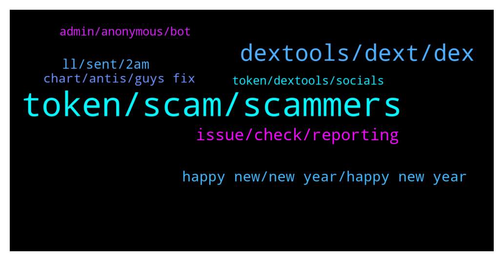

# **@DEXToolsCommunity**
 ## Analysis for **2021-12-30** - **2022-01-01**.

---

## 📊 **Basic Stats**

**n_messages_sent**: 275

---

---

## 🔝 **Top keywords and related messages**

1. **token, scam, scammers**

    @tatiana211 --- *posible to buy scam? im cant undersand* **--->** [TG Discussion](https://t.me/DEXToolsCommunity/319856)

    @napascual --- *i.e. Pancakeswap (BSC exchange with bep20 token support) uses Uniswap v2 base protocols* **--->** [TG Discussion](https://t.me/DEXToolsCommunity/320478)

    @nihiLismistheway --- *I prefer this way to be honest, so if I see a price variation know if setting civtrade on polygon or eth without losing time* **--->** [TG Discussion](https://t.me/DEXToolsCommunity/319845)

    @napascual --- *We listen to well known exchange's routers* **--->** [TG Discussion](https://t.me/DEXToolsCommunity/320723)

    @CliffordGrows --- *Is it different for BEP20 tokens?  Thanks!* **--->** [TG Discussion](https://t.me/DEXToolsCommunity/320477)

    @OMOONXT1 --- *I don't know .. ask on their TG better* **--->** [TG Discussion](https://t.me/DEXToolsCommunity/319863)

2. **dextools, dext, dex**

    @Gideon649 --- *What do I need to list on Dextool ?* **--->** [TG Discussion](https://t.me/DEXToolsCommunity/319755)

    @masterFrogda --- *there was an incident a few days ago with dextools, so that's why I was wondering...* **--->** [TG Discussion](https://t.me/DEXToolsCommunity/320606)

    @stanes --- *I mean, you have to be a standard member. So yes, standard sub or by holding 1k DEXT.* **--->** [TG Discussion](https://t.me/DEXToolsCommunity/320502)

    @hmk18990 --- *Guys this is dextools support. please try to keep conversation about "dextools support". for other talks you can use: https://t.me/DEXTtraderslounge* **--->** [TG Discussion](https://t.me/DEXToolsCommunity/319965)

    @LIRItheBobm --- *How can i subscribe on dextool ??? I have dex on my wallet that i connect.* **--->** [TG Discussion](https://t.me/DEXToolsCommunity/320496)

    @napascual --- *@semin_d Dext support or related only. Please refer here https://t.me/DEXTtraderslounge* **--->** [TG Discussion](https://t.me/DEXToolsCommunity/320000)

3. **issue, check, reporting**

    @stanes --- *The issue has been forwarded to the devs. They will check and fix it asap.  Thanks for reporting 🙏* **--->** [TG Discussion](https://t.me/DEXToolsCommunity/320779)

    @FredericDEXT --- *All feedback is noted , we will deliver fixes for all reported issues in the next days.* **--->** [TG Discussion](https://t.me/DEXToolsCommunity/319630)

    @napascual --- *Hey, we've fixed that yesterday already, added several checks and security. It won't happen again* **--->** [TG Discussion](https://t.me/DEXToolsCommunity/319566)

    @BuyTheCheeseDip --- *just stays at the loading screen* **--->** [TG Discussion](https://t.me/DEXToolsCommunity/320657)

    @abrahamgoblinhead --- *why are you guys responding to everything but the MASK issue? @napascual @stanes   @EricCryptoman* **--->** [TG Discussion](https://t.me/DEXToolsCommunity/319565)

    @FredericDEXT --- *Good to know, we didn't have that issue before* **--->** [TG Discussion](https://t.me/DEXToolsCommunity/319840)

4. **happy new, new year, happy new year**

    @Qboybm --- *Can i change layout on mobile vesion?* **--->** [TG Discussion](https://t.me/DEXToolsCommunity/319677)

    @bastardganpunk --- *Happy New Year Community 🚀  🎉 🎊* **--->** [TG Discussion](https://t.me/DEXToolsCommunity/320700)

    @stanes --- *Glad you guys appreciate the update. As promised, team listened to the feedbacks.  Expect more and more improvements in the next few days/weeks. Thanks for your support 🙏* **--->** [TG Discussion](https://t.me/DEXToolsCommunity/320563)

    @napascual --- *🙏🙏 We wanted to have your feedback reflected in the UI. We're still working on our mobile ux/ui. Much more updated will come these weeks!* **--->** [TG Discussion](https://t.me/DEXToolsCommunity/320405)

    @esshack --- *new update for mobile is great guys for* **--->** [TG Discussion](https://t.me/DEXToolsCommunity/320402)

    @FredericDEXT --- *We will add several layouts in the following updates* **--->** [TG Discussion](https://t.me/DEXToolsCommunity/319672)

5. **ll, sent, 2am**

    @napascual --- *Sure, but I'll go through it tomorrow (2am here)* **--->** [TG Discussion](https://t.me/DEXToolsCommunity/319691)

    @FredericDEXT --- *Dm me the link and I'll check* **--->** [TG Discussion](https://t.me/DEXToolsCommunity/319621)

    @genialcronyTAMC6 --- *Thanks can I DM you now?* **--->** [TG Discussion](https://t.me/DEXToolsCommunity/319688)

    @napascual --- *Dm me your wallet I'll take a look* **--->** [TG Discussion](https://t.me/DEXToolsCommunity/320647)

    @jaimealepm --- *hello can I write you DM please?* **--->** [TG Discussion](https://t.me/DEXToolsCommunity/320422)

    @Rv8 --- *Can I dm  you for a deal ?* **--->** [TG Discussion](https://t.me/DEXToolsCommunity/320276)

6. **chart, antis, guys fix**

    @esshack --- *nice to see the mcap and chart on page again* **--->** [TG Discussion](https://t.me/DEXToolsCommunity/320404)

    @Firesstrat --- *Can you guys please fix the antis inu chart? Contract 0xcf64701d4567172a1de9177c319945589ed81b13* **--->** [TG Discussion](https://t.me/DEXToolsCommunity/320793)

    @AJ --- *when someone new open the chart it looks like crashed untill we zoom it !! like really hard* **--->** [TG Discussion](https://t.me/DEXToolsCommunity/320774)

    @AJ --- *please we have an issue with Antis Chart .. released on 28th Dec 6PM EST* **--->** [TG Discussion](https://t.me/DEXToolsCommunity/320773)

    @Janice --- *Says no chart available for last 24 hr* **--->** [TG Discussion](https://t.me/DEXToolsCommunity/320634)

    @napascual --- *That chart is fine, but it doesn't have trades since yesterday* **--->** [TG Discussion](https://t.me/DEXToolsCommunity/320637)

7. **token, dextools, socials**

    @RhoToken --- *Hello, how do I add new info (e.g. website, telegram links) to a new token on dextools? Thanks.* **--->** [TG Discussion](https://t.me/DEXToolsCommunity/320856)

    @CryptoCoinRahman --- *i have a question for admins.  If I launch a token, and part of the community involvement is to encourage the community to go onto dextools, register, and follow the socials links for our token....to do this manually, as humans...no bots.  Does Dextools watch token TGs for this, and delist tokens for this?* **--->** [TG Discussion](https://t.me/DEXToolsCommunity/320403)

    @cyK3r --- *Hi, I have a question. We launched Dragon Infinity 2 months ago and we had an issue, as we did it again under Dragon Infinity v2.. and we had an issue again. We will launch on Monday once again. My question is, can we hide the other two from Dex so it doesn't show anymore? We want to use Dragon Infinity as name.. On poocoin it works after a while, but on dex, it still shows. And we don't want our investors to look or buy the wrong token.* **--->** [TG Discussion](https://t.me/DEXToolsCommunity/320320)

    @geddasridhar --- *May i know how to find a social profile for any new token listed on dextools? Is there a way to find that if not listed on etherscan? trying to figure out if a project is legit. any suggestions would really be appreciated.* **--->** [TG Discussion](https://t.me/DEXToolsCommunity/320497)

    @EthanGalateaCash --- *Hey mate for dextools score on cronos how to update socials as there are no etherscan or bscscan* **--->** [TG Discussion](https://t.me/DEXToolsCommunity/319708)

    @Un4giv3nz --- *i try in dextools to swap token to wbnb* **--->** [TG Discussion](https://t.me/DEXToolsCommunity/319602)

