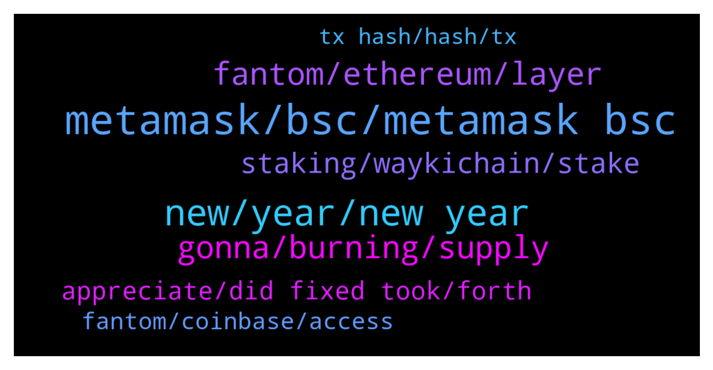

# **@Fantom_English**
 ## Analysis for **2021-12-31** - **2022-01-01**.

---

## 📊 **Basic Stats**

**n_messages_sent**: 158

---

---

## 🔝 **Top keywords and related messages**

1. **metamask, bsc, metamask bsc**

    @Edouard3 --- *anyone know how you get WFTM?* **--->** [TG Discussion](https://t.me/Fantom_English/619147)

    @AaH2o --- *I've been poking around the transactions, but only see fractions of FTM transferred* **--->** [TG Discussion](https://t.me/Fantom_English/619377)

    @faisal_chawdhary --- *it is not found on the FTM explorer but on BSC is shows as successful* **--->** [TG Discussion](https://t.me/Fantom_English/619209)

    @x --- *is the pwawallet the official ftm wallet?* **--->** [TG Discussion](https://t.me/Fantom_English/619658)

    @aceonion --- *is anyone having issues confirming transactions while using a ledger on FTM right now?* **--->** [TG Discussion](https://t.me/Fantom_English/619152)

    @faisal_chawdhary --- *done. I see the FTM in my metamask on BSC network. Thanks for your help.  How do I get to FTM network in my metamask?* **--->** [TG Discussion](https://t.me/Fantom_English/619223)

2. **new, year, new year**

    @SYED8010 --- *My wish would be SOL like move from FTM 🤞👍* **--->** [TG Discussion](https://t.me/Fantom_English/619332)

    @tomenow5 --- *Good day everyone. I wish y'all a happy new year😊* **--->** [TG Discussion](https://t.me/Fantom_English/619550)

    @tomenow5 --- *You can make here active. I'm kinda new to this ecosystem* **--->** [TG Discussion](https://t.me/Fantom_English/619741)

    @SYED8010 --- *Wishing All FTM community members Friends A Very Happy and Healthy New Year2022* **--->** [TG Discussion](https://t.me/Fantom_English/619326)

    @otroserhumano --- *Hello everyone! Happy new year!!   One thought, whats going up sooner and higher between beets and soul* **--->** [TG Discussion](https://t.me/Fantom_English/619402)

    @AhmadAlfadhli --- *Luna was better 😂 change your wish little bit* **--->** [TG Discussion](https://t.me/Fantom_English/619340)

3. **gonna, burning, supply**

    @Heisenbvrg --- *Never gonna see this prices again haha* **--->** [TG Discussion](https://t.me/Fantom_English/619330)

    @Heisenbvrg --- *Thx maybe it's more who knows haha* **--->** [TG Discussion](https://t.me/Fantom_English/619327)

    @Heisenbvrg --- *i have patience til we top10 bruh :D* **--->** [TG Discussion](https://t.me/Fantom_English/619690)

    @jaywillizigah --- *I don't have a plan of selling and I wouldn't advise anyone to do so* **--->** [TG Discussion](https://t.me/Fantom_English/619764)

    @SY --- *What is total supply and any burning?* **--->** [TG Discussion](https://t.me/Fantom_English/619020)

    @Heisenbvrg --- *Never bruh this time passed haha* **--->** [TG Discussion](https://t.me/Fantom_English/619331)

4. **fantom, ethereum, layer**

    @Mcjig --- *How does Fantom work? Fantom is modular Lachesis represents one layer, the consensus, of the blockchain technology stack and can be plugged into any distributed ledger. Lachesis powers Fantom’s Opera mainnet deployment, that uses the Ethereum Virtual Machine (EVM) and it’s compatible with Ethereum.* **--->** [TG Discussion](https://t.me/Fantom_English/618948)

    @Janevietani --- *Yes but if you wanna use dapps on fantom you can use metamask* **--->** [TG Discussion](https://t.me/Fantom_English/619659)

    @pako --- *Hello everyone, does anyone know anything about FANTOM LAUNCH (FTML) and the team behind it because I can't find anything ???* **--->** [TG Discussion](https://t.me/Fantom_English/619580)

    @abz352 --- *Its just commonly known information, you can research it you'll see it's layer 1. However, fantom does use the EVM ethereum virtual machine to deploy smart contracts (If a smart contract is valid on ethereum it will be valid on fantom)* **--->** [TG Discussion](https://t.me/Fantom_English/618945)

    @gigimobile --- *Is fantom blockchain a fork of Ethereum?* **--->** [TG Discussion](https://t.me/Fantom_English/619761)

    @gigimobile --- *Is fantom block chain a fork of Eth?* **--->** [TG Discussion](https://t.me/Fantom_English/619347)

5. **staking, waykichain, stake**

    @jaywillizigah --- *I am planning on staking my ftm on waykichain wallet.* **--->** [TG Discussion](https://t.me/Fantom_English/619767)

    @Mcjig --- *use the staking calculator at website/ your restake gets whatever the rate is for time left. so whatever 6 months pay is* **--->** [TG Discussion](https://t.me/Fantom_English/619615)

    @Aileskay --- *What's waykichain wallet, is it possible to stake ftm on the wallet 🤔* **--->** [TG Discussion](https://t.me/Fantom_English/619780)

    @americo90 --- *best place to stake my FTM?* **--->** [TG Discussion](https://t.me/Fantom_English/619788)

    @tomenow5 --- *Ok thanks, which tokens can I stake, does it support WICC, the native token for WaykiChain?* **--->** [TG Discussion](https://t.me/Fantom_English/619751)

    @tomenow5 --- *What's the name of FTM wallet and does it have a staking feature?* **--->** [TG Discussion](https://t.me/Fantom_English/619743)

6. **appreciate, did fixed took, forth**

    @inpp2000 --- *Ye but i can find it* **--->** [TG Discussion](https://t.me/Fantom_English/619471)

    @klatschpatsch --- *Oh great, appreciate it very much! 🤗* **--->** [TG Discussion](https://t.me/Fantom_English/619735)

    @Janevietani --- *You can ask it to abracadabra* **--->** [TG Discussion](https://t.me/Fantom_English/619667)

    @dstemidire --- *Thank you, I have been able to resolve it.* **--->** [TG Discussion](https://t.me/Fantom_English/619541)

    @faisal_chawdhary --- *ok. thank you once again for your help. Appreciate it.* **--->** [TG Discussion](https://t.me/Fantom_English/619225)

    @Kiefx --- *I did that once and they fixed it for me. Took a couple days of back and forth tho.* **--->** [TG Discussion](https://t.me/Fantom_English/619028)

7. **fantom, coinbase, access**

    @saeed_radin --- *The Coinex Exchange introduce Fantom like this :   Coin POS Layer 2* **--->** [TG Discussion](https://t.me/Fantom_English/618946)

    @officially_jason --- *But the transfer is not in the Coinbase wallet so I don’t understand why Fantom Foundation can’t help retrieve since it’s still on Fantom network.* **--->** [TG Discussion](https://t.me/Fantom_English/619488)

    @Mcjig --- *sorry, but fantom cant help. only the owner of the receiving address can access it. since coinbase doesnt support usdc on fantom network they cant access it. and there is no way for fantom to access a wallet owned by coinbase* **--->** [TG Discussion](https://t.me/Fantom_English/619451)

    @officially_jason --- *Hola Fantom Fam. I made a pretty big mistake sending USDC from Metmask Fantom Opera to my Coinbase USDC wallet address. I have it showing success on FTM scan. However the transfer never showed up in Coinbase. I asked coinbase to help retreive the funds and they said it's not a network they support and I need to reach out to Fantom @FantomianBot* **--->** [TG Discussion](https://t.me/Fantom_English/619447)

    @mallamgaga --- *I sent my hector to my Fantom wallet and I’m yet to receive it* **--->** [TG Discussion](https://t.me/Fantom_English/619136)

    @Ozzie_B --- *Damn! This has got to be the hardest coin to get on its own network! Anybody know how I can get some fantom on my fantom opera network wallet?* **--->** [TG Discussion](https://t.me/Fantom_English/619008)

8. **tx hash, hash, tx**

    @pajamasfreak --- *Basically they just don’t give that kind of service. Save your tx hash until they support that* **--->** [TG Discussion](https://t.me/Fantom_English/619457)

    @pajamasfreak --- *This was discontinued, use the one Jane sent* **--->** [TG Discussion](https://t.me/Fantom_English/619480)

    @Janevietani --- *check your tx hash on explorer* **--->** [TG Discussion](https://t.me/Fantom_English/619208)

    @mallamgaga --- *I sent it from trust wallet account* **--->** [TG Discussion](https://t.me/Fantom_English/619137)

    @mikelorozko --- *okay so it looks like the one in Apple Store is fake* **--->** [TG Discussion](https://t.me/Fantom_English/619189)

    @Janevietani --- *Where do you check your tx hash? Etherscan?* **--->** [TG Discussion](https://t.me/Fantom_English/619467)

