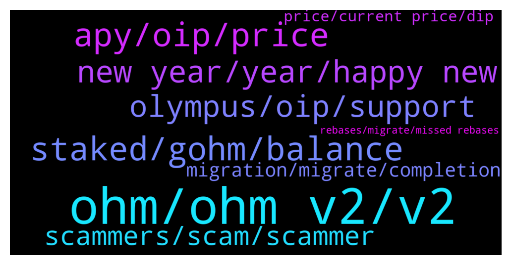

# **@OlympusTG**
 ## Analysis for **2021-12-31** - **2022-01-01**.

---

## 📊 **Basic Stats**

**n_messages_sent**: 909

---

---

## 🔝 **Top keywords and related messages**

1. **ohm, ohm v2, v2**

    @Aman_Garuda --- *Is OHM on Gate.io v1 or v2* **--->** [TG Discussion](https://t.me/OlympusTG/139656)

    @QTmightbehere --- *I’ve spent $750 in fees to stake half an ohm when it was $1500.* **--->** [TG Discussion](https://t.me/OlympusTG/138769)

    @Winter_Chemistry --- *alternatively i feel comfortable buying ohm v2 tokens and then stake on dashboard* **--->** [TG Discussion](https://t.me/OlympusTG/139439)

    @CoachLuko --- *I bought 1 Ohm in Mai for 300usd. Now I have 27ohm. I like this project* **--->** [TG Discussion](https://t.me/OlympusTG/139168)

    @theMagicUnicorn --- *a lot of people flock to the instantly attractive high apy for the short term benefit, but the smart ones know that ohm has to be about long term value...people who read about it and educate themselves on it get it* **--->** [TG Discussion](https://t.me/OlympusTG/138783)

    @stacyd82d --- *Was it a scam. The symbol used had the ohm symbol in the middle* **--->** [TG Discussion](https://t.me/OlympusTG/138312)

2. **apy, oip, price**

    @AllochkaMeow --- *Hello, can anyone suggest high yield APY projects?🙏* **--->** [TG Discussion](https://t.me/OlympusTG/138118)

    @nfwaple --- *slightly, but apy is scheduled to be decrease anyway, look up oip-18 and oip-63* **--->** [TG Discussion](https://t.me/OlympusTG/139578)

    @nfwaple --- *APY is going to drop, look up OIP-18 and OIP-63, regardless of price* **--->** [TG Discussion](https://t.me/OlympusTG/139435)

    @Dave_881010 --- *It’s either price or APY level am looking for. If price keeps dropping was expecting the APY to be stable. Ever since migration it’s been down from 7,000% to 5,000% +* **--->** [TG Discussion](https://t.me/OlympusTG/139425)

    @nfwaple --- *I don't think APY is drop is bearish at all, might be for people that can only think on APY level* **--->** [TG Discussion](https://t.me/OlympusTG/139408)

    @timon_k --- *yeah because ****% apy is not enough haha :)* **--->** [TG Discussion](https://t.me/OlympusTG/138519)

3. **staked, gohm, balance**

    @A. --- *What's the difference when I activate "stake to gohm“ or not? Whats best?* **--->** [TG Discussion](https://t.me/OlympusTG/139629)

    @Winter_Chemistry --- *So from here https://etherscan.io/token/0x0ab87046fbb341d058f17cbc4c1133f25a20a52f#tokenTrade , I use the contract address on uniswap for gohm by swapping with ETH and thats its. No staking or anything I have to do since its gohm  Am I correct @nfwaple ?* **--->** [TG Discussion](https://t.me/OlympusTG/139491)

    @A. --- *My total money is then staked sOhm + wrapped gOhm. Right?Please tag.* **--->** [TG Discussion](https://t.me/OlympusTG/139758)

    @Winter_Chemistry --- *So from here https://etherscan.io/token/0x0ab87046fbb341d058f17cbc4c1133f25a20a52f#tokenTrade , I use the contract address on uniswap for gohm by swapping with ETH and thats its. No staking or anything I have to do since its gohm. Am I correct @nfwaple ?* **--->** [TG Discussion](https://t.me/OlympusTG/139484)

    @jfbaron --- *I recently bought gohm through uniswap. Traded for some ETH.   Should I stake it as well to earn the yield?* **--->** [TG Discussion](https://t.me/OlympusTG/138186)

    @B --- *but if i hold gohm how am i supposed to be in the stake? I get rewards from the stake every 8 hours. how is that supposed to work with gohm?* **--->** [TG Discussion](https://t.me/OlympusTG/139530)

4. **new year, year, happy new**

    @Hdler --- *Ooo yes!!! I’m on holidays 😎…* **--->** [TG Discussion](https://t.me/OlympusTG/138273)

    @bike4peace --- *lets start the new year with good vibes only and keep on them 😉* **--->** [TG Discussion](https://t.me/OlympusTG/139332)

    @Dean --- *Happy new year peace & love to all 🥳✌🏾😉💯* **--->** [TG Discussion](https://t.me/OlympusTG/139271)

    @FLankarooo --- *Happy new year everyone btw 😁* **--->** [TG Discussion](https://t.me/OlympusTG/139519)

    @Max --- *BTW happy new year everyone 🥳* **--->** [TG Discussion](https://t.me/OlympusTG/139478)

    @ibaniba --- *A happy new year everyone! Hodl on!* **--->** [TG Discussion](https://t.me/OlympusTG/139312)

5. **olympus, oip, support**

    @Ap0l1o --- *The difference between Olympus and the other DAOs is that Olympus put it’s money to work, always building something more and improving* **--->** [TG Discussion](https://t.me/OlympusTG/138831)

    @shogunfx1 --- *This is unrelated and not affiliated to Olympus* **--->** [TG Discussion](https://t.me/OlympusTG/138304)

    @Ap0l1o --- *If the math behind Olympus was not good, there wouldn’t be so many forks behind it* **--->** [TG Discussion](https://t.me/OlympusTG/138961)

    @ccryii --- *Exactly . That’s the point. My first entry in olympus was at 300$ and it worth’s a lot. 100$ would be my lottery* **--->** [TG Discussion](https://t.me/OlympusTG/139779)

    @Ap0l1o --- *It should be shown in the Olympus page* **--->** [TG Discussion](https://t.me/OlympusTG/138012)

    @S --- *Does anyone know what Olympus price is actually based on or do we not discuss price here?* **--->** [TG Discussion](https://t.me/OlympusTG/138603)

6. **scammers, scam, scammer**

    @fpietrosanti --- *Removed, just wanted to share the scam schema* **--->** [TG Discussion](https://t.me/OlympusTG/138539)

    @Winter_Chemistry --- *scammers as usual are impersonating you* **--->** [TG Discussion](https://t.me/OlympusTG/139025)

    @mandingo_0 --- *half the people in here are scammers. ffs i cant deal with these dm's* **--->** [TG Discussion](https://t.me/OlympusTG/138038)

    @pappo175 --- *It's amazing how lame scammers are and they still manage to scam so many people out there* **--->** [TG Discussion](https://t.me/OlympusTG/139015)

    @shogunfx1 --- *Did you receive a dm from another bot?* **--->** [TG Discussion](https://t.me/OlympusTG/138365)

    @nfwaple --- *you just said they rug pulled, if so then yes it was a scam* **--->** [TG Discussion](https://t.me/OlympusTG/138315)

7. **migration, migrate, completion**

    @Dave_881010 --- *The current migration handling doesn’t give confidence to the stakers. One of the contribution factors* **--->** [TG Discussion](https://t.me/OlympusTG/138485)

    @fpietrosanti --- *Are there any specific technical reason for the migration?* **--->** [TG Discussion](https://t.me/OlympusTG/138487)

    @Jay_1010 --- *And remember complaining is not changing the reality of the situation. Migrate or don't...* **--->** [TG Discussion](https://t.me/OlympusTG/138911)

    @cdp279 --- *I think the uncertainty about the migration making people worried. Unjustly* **--->** [TG Discussion](https://t.me/OlympusTG/138280)

    @KingMozzie --- *How is the migration taking so long, how can we track what's happening?* **--->** [TG Discussion](https://t.me/OlympusTG/138125)

    @H2O22 --- *so do I need to migrate ASAP?* **--->** [TG Discussion](https://t.me/OlympusTG/138060)

8. **price, current price, dip**

    @cdp279 --- *Stop looking at the price. Go outside and smell the fresh air. You know what that is right?* **--->** [TG Discussion](https://t.me/OlympusTG/138271)

    @kevalbaba --- *Is there a reason the price is tanking?* **--->** [TG Discussion](https://t.me/OlympusTG/139454)

    @Newton --- *Price ever going to go up* **--->** [TG Discussion](https://t.me/OlympusTG/139042)

    @Art_Huss --- *Why the price keeps going down?? It slipped 72.5% in the past 60 days!!!!!* **--->** [TG Discussion](https://t.me/OlympusTG/139800)

    @GoldenFuture7 --- *Who has bought the dip? I want to buy some more but not sure how much further it’s going to drop.* **--->** [TG Discussion](https://t.me/OlympusTG/139033)

    @kssckkgs --- *What are the current price fluctuations about?* **--->** [TG Discussion](https://t.me/OlympusTG/138352)

