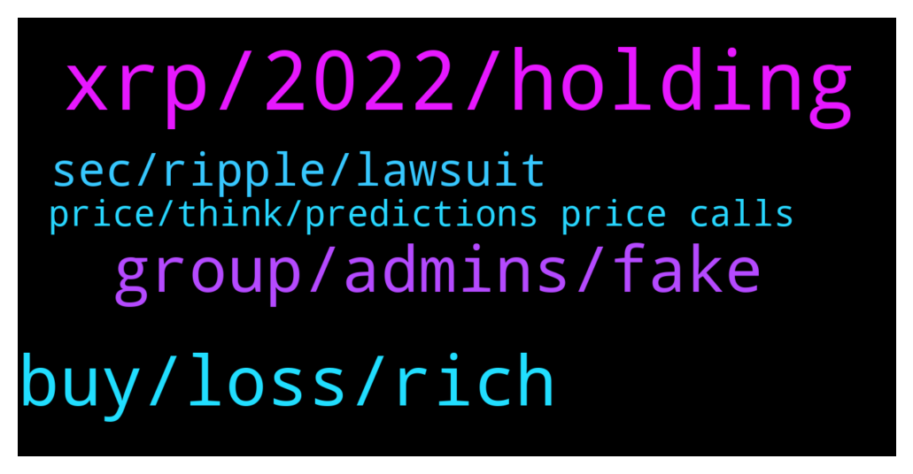

# **@Ripple**
 ## Analysis for **2021-12-31** - **2022-01-01**.

---

## 📊 **Basic Stats**

**n_messages_sent**: 176

---

---

## 🔝 **Top keywords and related messages**

1. **xrp, 2022, holding**

    @Cheapsuit --- *People don’t understand that XRP wasn’t meant for regular people like us. All the more reason to HODL it.* **--->** [TG Discussion](https://t.me/Ripple/3033719)

    @regiokiller --- *I dont see a realistic price for XRP over 1 USD... it cant even surpass 0.90 centile range... more than 1 USD is just hopium now* **--->** [TG Discussion](https://t.me/Ripple/3033700)

    @SamSakamoto --- *Can we all make a promise? When XRP hits 10$, we do a meet up in Lambos at the SEC In Washington?* **--->** [TG Discussion](https://t.me/Ripple/3033741)

    @EML1993 --- *I couldn’t find it anywhere. Wasn’t there a time when Xrp overtook Bitcoin for the number 1 spot in terms of marketcap?* **--->** [TG Discussion](https://t.me/Ripple/3033548)

    @NSantan --- *Not sure at what rate you've bought your XRP and what your situation is, but a general plan would be to not sell and just sit on the investment.   At least hold till you think you have found a better investment, again it isn't an actual loss till you hit the sell button* **--->** [TG Discussion](https://t.me/Ripple/3033691)

    @erik_sz91 --- *There should be an official message explaining "what if" XRP replaced Swift, XRP becomes global reserve currency, and XRP moving all money from the world, but everything explained by math (and not magic)* **--->** [TG Discussion](https://t.me/Ripple/3033527)

2. **buy, loss, rich**

    @Paisa_earn_through_cse --- *Bro i am already lost of money loss.* **--->** [TG Discussion](https://t.me/Ripple/3033679)

    @mohaferragamo --- *wrong because they buy high and sell low just hold thats the same thing as saving money you never lose untill you sell* **--->** [TG Discussion](https://t.me/Ripple/3033686)

    @BennyBennyBlanco --- *You won’t get rich right now, market is in correction* **--->** [TG Discussion](https://t.me/Ripple/3033678)

    @BennyBennyBlanco --- *You don’t need to buy over and over keep what u have and save. Day trading there’s days u get lucky and there’s days u get destroyed. See if your at a gain for the year or at a loss. There’s the answer why many are broke* **--->** [TG Discussion](https://t.me/Ripple/3033685)

    @skakiaiso --- *Hey, I'm not sure where the market is going. What is the best way to ride the Volatility?* **--->** [TG Discussion](https://t.me/Ripple/3033190)

    @novaandromedus --- *People are mad because of crypto* **--->** [TG Discussion](https://t.me/Ripple/3033271)

3. **group, admins, fake**

    @JesusJames --- *there is no fake admim in any group lol you are seriously mis-imformed you can't have fake admin in telegram haha* **--->** [TG Discussion](https://t.me/Ripple/3033478)

    @Lallulu --- *Correct, there are lots of scammers in that group and there are no basic verification to join a group like here eg visible profile. Username captcha verification. Lot of imposter admins* **--->** [TG Discussion](https://t.me/Ripple/3033479)

    @Lallulu --- *Because of you and other admins. You guys so doing great work here* **--->** [TG Discussion](https://t.me/Ripple/3033472)

    @JesusJames --- *and what about the other groups you commented scam in ?* **--->** [TG Discussion](https://t.me/Ripple/3033474)

    @JesusJames --- *don't see you yelling scam here like in other projects lol* **--->** [TG Discussion](https://t.me/Ripple/3033470)

    @JesusJames --- *I am not a bot and yes thanks for following the rules* **--->** [TG Discussion](https://t.me/Ripple/3033228)

4. **sec, ripple, lawsuit**

    @EML1993 --- *On researching the sec case, I’m beginning more and more convinced that the case will be thrown out on the basis of lack of fair notice.* **--->** [TG Discussion](https://t.me/Ripple/3033458)

    @Jozo --- *When is ripple vs sec case over* **--->** [TG Discussion](https://t.me/Ripple/3033176)

    @neliedechavez --- *So is the court case the only thing holding it back?* **--->** [TG Discussion](https://t.me/Ripple/3033556)

    @Hendrikhaverkamp22 --- *Google translate . The infamous lawsuit between Ripple (XRP) and the US Securities and Exchange Commission (SEC) has been going on for a year and the judge has still not given a final verdict. The lawsuit hangs like a dark cloud over Ripple, but according to a lawyer for the company, the end is in sight. Ripple is accused by the SEC of illegally selling XRP tokens as unregistered securities. Ripple, of course, strongly disagrees with these SEC allegations. Ripple lawsuit Attorney Jeremy Hogan, who serves as a legal counsel to the XRP2 project, expects the lawsuit to conclude in the first half of next year. According to him, it is likely that the chapter will close in April. A worst-case scenario, according to Hogan, is an end to the lawsuit in the summer of 2022.* **--->** [TG Discussion](https://t.me/Ripple/3033710)

    @NSantan --- *It's a great token, but the crooks over at the SEC are trying to drown it* **--->** [TG Discussion](https://t.me/Ripple/3033214)

    @dZaTom --- *The outcome of the lawsuit against Ripple will be important for the crypto industry, as it may influence how other digital assets are regulated by the SEC in the future. Although regulators have stated that Bitcoin and Ether are not securities in the US, they have not given the same exemption to other tokens, which has caused many to fear that other cryptocurrencies may potentially face SEC lawsuits in the future, just like XRP did.* **--->** [TG Discussion](https://t.me/Ripple/3033468)

5. **price, think, predictions price calls**

    @Dmitro_Sh --- *Reminding that life is not a tale )   Realisticly I think 2$ is top* **--->** [TG Discussion](https://t.me/Ripple/3033525)

    @JonesRick --- *To prove to you that I wasn't making it up obviously, you should look it up now to confirm my price and you'll see that I'm right.* **--->** [TG Discussion](https://t.me/Ripple/3033320)

    @JustNNM --- *I don’t do predictions or price calls, no admin here would do that.* **--->** [TG Discussion](https://t.me/Ripple/3033846)

    @BrownSeed17 --- *I think a realistic price prediction is between $8-$12* **--->** [TG Discussion](https://t.me/Ripple/3033524)

    @ibrahimda35 --- *Today is EOY And you can see the price* **--->** [TG Discussion](https://t.me/Ripple/3033175)

