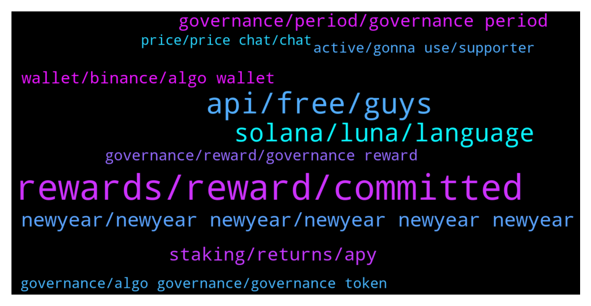

# **@algorand**
 ## Analysis for **2021-12-31** - **2022-01-01**.

---

## 📊 **Basic Stats**

**n_messages_sent**: 303

---

---

## 🔝 **Top keywords and related messages**

1. **rewards, reward, committed**

    @mhrasel --- *Hmm but they already said if you commit 10 algo you got .45 algo This is holding reward 😁* **--->** [TG Discussion](https://t.me/algorand/328229)

    @cryptocoque 🍷 --- *I have 2 questions: 1) i put 100algo for gouvernance to the 2d period: how many rewards i will get? 2) how will be informed for sessions votes? Thanks* **--->** [TG Discussion](https://t.me/algorand/328276)

    @Borosniper77 --- *Yes but I dont want to commit my algo until I receive my rewards from gov 1 then I know how much I will get to commit* **--->** [TG Discussion](https://t.me/algorand/328563)

    @Thomas_ZH --- *says rewards are given between now and the 5th* **--->** [TG Discussion](https://t.me/algorand/328279)

    @MackDenver --- *The reward depends on the amount of ALGO that you committed.* **--->** [TG Discussion](https://t.me/algorand/328171)

    @DTX234 --- *Guys what s the indicator in the right side? =>* **--->** [TG Discussion](https://t.me/algorand/328482)

2. **api, free, guys**

    @Pablo_cast --- *In the meanwhile you can get CSV from site* **--->** [TG Discussion](https://t.me/algorand/327996)

    @Akansha --- *Hello everyone, I need help.  I am trying to find online IDE like remix for Algorand blockchain smart contract. But I didn't find anything. Plz guide me* **--->** [TG Discussion](https://t.me/algorand/328094)

    @Pablo_cast --- *Thanks, that's encourage me. You know limiting an API is much more harsh than writing the api itself* **--->** [TG Discussion](https://t.me/algorand/327990)

    @MackDenver --- *You mean you want to join the Algorand team? We have full development documentation available for new devs* **--->** [TG Discussion](https://t.me/algorand/328215)

    @c_blecar --- *Do you have a rough roadmap?* **--->** [TG Discussion](https://t.me/algorand/327989)

    @c_blecar --- *is there an api to get price history of a token?* **--->** [TG Discussion](https://t.me/algorand/327984)

3. **solana, luna, language**

    @DTX234 --- *I don't understand why ETH Is the number 2 whereas much better blockchain technology exist like Algorand...* **--->** [TG Discussion](https://t.me/algorand/327956)

    @bernijw --- *Network Effect. It will take time to develop an ecosystem remotely as huge as Ethereum. Ethereum will stay big, it won't go away, but Algorand will grow much faster. Think about it...Bitcoin is dominant, even though it really can't do anything but store and transfer value (the latter quite slowly), but it has a huge first mover advantage.* **--->** [TG Discussion](https://t.me/algorand/327957)

    @defirlkp --- *why do you think algorand will grow faster? it uses a different development language doesn't it which reduces the pool of available developers compared to evm-based chains using solidity* **--->** [TG Discussion](https://t.me/algorand/327967)

    @Teo --- *Important decision. I kindly ask you for your opinion. Why prefer algo to solana and terra luna today? thank you very much for your availability* **--->** [TG Discussion](https://t.me/algorand/328012)

    @defirlkp --- *i'm also looking at the future - all i said is because algorand uses a different language it can only draw from a smaller pool of developers which may slow down work* **--->** [TG Discussion](https://t.me/algorand/327977)

    @Nakibruce --- *Network doeant go down like solana algos devs much better tech much better and isn't reliant on a flawed stable coin base price model like luna or a delegated aystem like luna* **--->** [TG Discussion](https://t.me/algorand/328405)

4. **newyear, newyear newyear, newyear newyear newyear**

    @yue666777 --- *Happy new year, congratulations on getting rich* **--->** [TG Discussion](https://t.me/algorand/328069)

    @EldarDRM --- *My monthly elevator pitch/summary updated. Happy New Year!* **--->** [TG Discussion](https://t.me/algorand/328153)

    @Landy9956 --- *I hope that the coins you hold will reach the moon in 2022* **--->** [TG Discussion](https://t.me/algorand/328310)

    @littlemix55 --- *youre thinking of now when all I see is future* **--->** [TG Discussion](https://t.me/algorand/327975)

    @MackDenver --- *Good morning Algorand community!  How is everyone doing today?* **--->** [TG Discussion](https://t.me/algorand/328097)

    @Jillani1256 --- *Got it its simple staking🤣 but really at least 50% peoples thinking they get some huge money after 31st dec noice* **--->** [TG Discussion](https://t.me/algorand/328238)

5. **staking, returns, apy**

    @james8794 --- *What can you get for just staking? Approx* **--->** [TG Discussion](https://t.me/algorand/328126)

    @jumpfetus --- *1) if the APY is like 12%-20%, you'll get like 3-5 Algos for 100 algos staked in 3 months* **--->** [TG Discussion](https://t.me/algorand/328282)

    @Awehilary --- *I would like to ask a question,  do people who have algo on exchanges receive the staking rewards like those who have algo in algo wallets?* **--->** [TG Discussion](https://t.me/algorand/327948)

    @earlyearner --- *Just wondering, what do you get for staking as a govonour?* **--->** [TG Discussion](https://t.me/algorand/328550)

    @Igwetoo --- *I guess is perfect when staking with mobile wallet like Atomic Wallet that has provision for that* **--->** [TG Discussion](https://t.me/algorand/328031)

    @jumpfetus --- *well what do you expect from staking 100 coins? that return is what you would get from the vast majority of other major chains too.* **--->** [TG Discussion](https://t.me/algorand/328301)

6. **governance, period, governance period**

    @MackDenver --- *It will start on January 1, you can already sign up for the next governance phase via the governance website* **--->** [TG Discussion](https://t.me/algorand/328237)

    @Raju --- *I'm so mad I missed out on governance* **--->** [TG Discussion](https://t.me/algorand/328333)

    @jumpfetus --- *the official algorand wallet has a banner that says Governance Period #2 registration window ends Jan 6, 16:00 UTC. Don't think that's accurate.* **--->** [TG Discussion](https://t.me/algorand/328329)

    @Martin --- *Is there anywhere I can see how much people applied for the second governance, compared to last governance?* **--->** [TG Discussion](https://t.me/algorand/328159)

    @MackDenver --- *Yes, it is visible on the governance website  https://governance.algorand.foundation/* **--->** [TG Discussion](https://t.me/algorand/328160)

    @james8794 --- *What’s the minimum to becoming part of the governance?* **--->** [TG Discussion](https://t.me/algorand/328128)

7. **wallet, binance, algo wallet**

    @cryptotuna --- *Hi there, when I deposit USDC to algo wallet what Network is erc20 or I can use polygon?* **--->** [TG Discussion](https://t.me/algorand/328429)

    @MackDenver --- *You need to get your binance deposit address and send your ALGO there.* **--->** [TG Discussion](https://t.me/algorand/328146)

    @MackDenver --- *USDC in your Algorand wallet means it is on Algorand blockchain. You have to use algorand blockchain for that.* **--->** [TG Discussion](https://t.me/algorand/328430)

    @RUK2354 --- *Hi ! How do i send funds from my algo wallet to binance account?* **--->** [TG Discussion](https://t.me/algorand/328145)

    @Mahngee1 --- *Hello admin pls I have problem sending out algo from my wallet. Its popping out an error message* **--->** [TG Discussion](https://t.me/algorand/328436)

    @EmanuelFortuna --- *Deposit in erc20 and widraw in algorand chain* **--->** [TG Discussion](https://t.me/algorand/328435)

8. **governance, reward, governance reward**

    @MackDenver --- *Check out the link below. The distribution of the governance reward will start from January 1 to January 5  https://algorand.foundation/news/key-dates-algorand-governance* **--->** [TG Discussion](https://t.me/algorand/328149)

    @uswock --- *hello sir, how to claim reward governance period 1?* **--->** [TG Discussion](https://t.me/algorand/328100)

    @Todd --- *Governance commitment ends 31st with rewards to be distributed after, starting the 1st. Cutoff for next governance is the 6th midnight Singapore time (7th).* **--->** [TG Discussion](https://t.me/algorand/328383)

    @Borosniper77 --- *Do we receive our governance rewards today?* **--->** [TG Discussion](https://t.me/algorand/328462)

    @Borosniper77 --- *I'm waiting for my rewards in order to pledge for governance 2 when have we got until to pledge for governance 2 if the rewards will take up 5th to be received?* **--->** [TG Discussion](https://t.me/algorand/328539)

    @MackDenver --- *The governance reward depends on the total committed amount in a phase* **--->** [TG Discussion](https://t.me/algorand/328109)

9. **active, gonna use, supporter**

    @Lord_Shin_Chan_2_O --- *Just 3 to 5 algos for 3 months...🤦‍♂* **--->** [TG Discussion](https://t.me/algorand/328295)

    @Shane --- *Because the ship has sailed on those, and algo is still on boarding.* **--->** [TG Discussion](https://t.me/algorand/328402)

    @Skydr4k3 --- *The project has been awarded by the algo foundation* **--->** [TG Discussion](https://t.me/algorand/328267)

    @TenaciuousT --- *also I have only a few algo to participate with* **--->** [TG Discussion](https://t.me/algorand/328039)

    @TenaciuousT --- *I was gonna use all my algo but from reading online they don't really recommend that* **--->** [TG Discussion](https://t.me/algorand/328034)

    @aji_on --- *I know I have not been active, but I am big supporter of algo, for those that know me* **--->** [TG Discussion](https://t.me/algorand/327941)

10. **governance, algo governance, governance token**

    @MackDenver --- *Governance rewards are for people who have committed their ALGO tokens during the governance period.* **--->** [TG Discussion](https://t.me/algorand/328478)

    @mhrasel --- *He'llo admin what is the planing for listing algo governance token* **--->** [TG Discussion](https://t.me/algorand/328218)

    @thetreeman --- *So is ALGO governance worth it?* **--->** [TG Discussion](https://t.me/algorand/328366)

    @MackDenver --- *There is no separate governance token. It's ALGO* **--->** [TG Discussion](https://t.me/algorand/328219)

    @MackDenver --- *There is no separate governance token. ALGO is used for governance* **--->** [TG Discussion](https://t.me/algorand/328132)

    @Martin --- *Which of these platforms do you find more profitable: Yieldly, Tinyman, Algofi, or Governance ????* **--->** [TG Discussion](https://t.me/algorand/328495)

