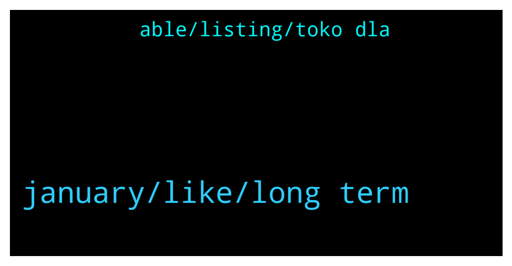

# **@ampnetapxchat**
 ## Analysis for **2021-12-27** - **2022-01-01**.

---

## 📊 **Basic Stats**

**n_messages_sent**: 35

---

---

## 🔝 **Top keywords and related messages**

1. **january, like, long term**

    @BMontana3 --- *You guys should allow us to stake, the price has completely got destroyed. Atleast get some people hope again and reward them for still holding the coin..* **--->** [TG Discussion](https://t.me/ampnetapxchat/35971)

    @E_Don --- *Why's AAPX price dropping to zero?Is this project still alive or dead?* **--->** [TG Discussion](https://t.me/ampnetapxchat/35862)

    @MrCrypto504 --- *yeah i havent sold anything, staking would had been nice like yesterday* **--->** [TG Discussion](https://t.me/ampnetapxchat/35972)

    @KonradCapital --- *Tokenized real world assets is a very new concept and will take trial and error to be done correctly. But I know @mislavjavor won’t give up so it’s just a matter of time before AMPNET gets it right. Like I said before I would recommend they make a platform and that platform provides all the services needed for tokenizing and investing in tokenized real world assets* **--->** [TG Discussion](https://t.me/ampnetapxchat/35797)

    @IlDiavolo92 --- *Importance of investing what u can afford to lose + diversified portfolio will make your paper hands diamondish.* **--->** [TG Discussion](https://t.me/ampnetapxchat/35857)

    @KonradCapital --- *AMPNET will do well long term feel bad for those who cannot hold long term.* **--->** [TG Discussion](https://t.me/ampnetapxchat/35796)

2. **able, listing, toko dla**

    @arikthereal --- *Hi Team, who would I be able to disucss listing opportunity on BitMart with ? Verification will be provided if requested.* **--->** [TG Discussion](https://t.me/ampnetapxchat/35900)

    @iamdiarrhoea --- *can you confirm me your username just in case its a scammer. thanks!* **--->** [TG Discussion](https://t.me/ampnetapxchat/35891)

    @<UNK> --- *You can check the latest update here https://t.me/ampnetapxchat/35378* **--->** [TG Discussion](https://t.me/ampnetapxchat/35863)

    @matejmz --- *Just google TOKO by Dla Piper. It leverages Hedera and Algorand.* **--->** [TG Discussion](https://t.me/ampnetapxchat/35801)

    @iamdiarrhoea --- *Any admins online that can help me plz?* **--->** [TG Discussion](https://t.me/ampnetapxchat/35888)

