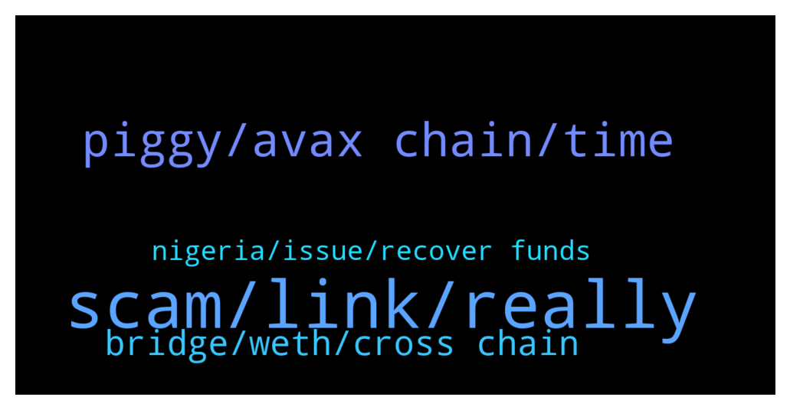

# **@avalancheavax**
 ## Analysis for **2021-12-31** - **2022-01-01**.

---

## 📊 **Basic Stats**

**n_messages_sent**: 109

---

---

## 🔝 **Top keywords and related messages**

1. **scam, link, really**

    @Joe --- *Does anyone have a non scam link to roco chat* **--->** [TG Discussion](https://t.me/avalancheavax/318672)

    @Joe --- *Ok si there is no official chat for rocofiniance* **--->** [TG Discussion](https://t.me/avalancheavax/318674)

    @Islam --- *I was told I would be banned from discord for 24 hours yesterday because I made a joke. Can I be unbanned now?* **--->** [TG Discussion](https://t.me/avalancheavax/318794)

    @Juris --- *@Nicolas_A hi, could you or anyone from the team say a few words about Lydia Finance. There are a lot of fud around them saying it's a scam. What are Avalanche thoughts about it?* **--->** [TG Discussion](https://t.me/avalancheavax/318839)

    @FutureTiger --- *that's what i thought.. thanx for confirming!* **--->** [TG Discussion](https://t.me/avalancheavax/318723)

    @bbbernas --- *Is there a public list of the wallets that are eligible actually? This airdrop should happen in about 3-5 months right?* **--->** [TG Discussion](https://t.me/avalancheavax/318683)

2. **piggy, avax chain, time**

    @FutureTiger --- *Hullo chaps, when withdrawing AVAX from gateIO, I am offered 2 Chains, AVAX chain and AVAX C-Chain. The fee for AVAX chain is small but AVAX C-Chain is very expensive. Is it safe to send AVAX from Gate to Metamask using AVAX Chain? If it is not safe, perhaps I should buy TIME on gateIO itself, and then send TIME to MM using AVAX C-Chain. For some mysterious reason the fee is small when withdrawing TIME from Gate using AVAX C-Chain !* **--->** [TG Discussion](https://t.me/avalancheavax/318702)

    @Bebeumaf --- *2022 Starts in Red: AVAX is the Only Top 20 in Green https://cryptonews.net/2963339/?utm_source=CryptoNews&utm_medium=app&utm_campaign=shared* **--->** [TG Discussion](https://t.me/avalancheavax/318998)

    @Timur --- *https://twitter.com/nfdnaclub/status/1477297984807313409?s=20 hey friends we have a avax based nft and we are doing giveaway chheck this out* **--->** [TG Discussion](https://t.me/avalancheavax/319017)

    @bobby_blanco --- *You use the c chain for that sort of stuff .. because gate.io is an exchange they are on the x chain.. you need to move it from the x chain to the c chain .. and then send it to your MetaMask wallet .. if you can buy the time on gate.io and send it to your MetaMask you will be saving a swap feee on trader joe.. once the time is in your MetaMask you then connect your MetaMask to the time website make sure you get the official one and click stake .. make sure there is at least half an avax in your MetaMask wallet for gas fees although these should be only a few cents .. but always good to have some avax there for peace of mind* **--->** [TG Discussion](https://t.me/avalancheavax/318710)

    @luisao8788 --- *Question, can I stake AVAX? where?* **--->** [TG Discussion](https://t.me/avalancheavax/318898)

    @CryptoGator --- *Hey guys. Where can I get the beat returns single staking AVAX right now? I’ve currently got it in Banker joe.* **--->** [TG Discussion](https://t.me/avalancheavax/318849)

3. **bridge, weth, cross chain**

    @ghoti42 --- *I started a transfer on the Avalanche Bridge, ETH from Ethereum to Avalanche, about 20 minutes ago.  The avax bridge still shows the balance on Ethereum, even though my wallet doesn't agree.  How long does the bridge usually take?  Is there a 2nd step i'm missing?* **--->** [TG Discussion](https://t.me/avalancheavax/319016)

    @wai_chung --- *Hi, which is the best cross chain bridge for avalanche?* **--->** [TG Discussion](https://t.me/avalancheavax/318752)

    @Nicolas_A --- *You might have just wrapped your ETH into WETH and didn't yet bridge the WETH to Avalanche* **--->** [TG Discussion](https://t.me/avalancheavax/319020)

    @bestcoderna --- *Join us for our Avalanche Weekly Wrap-up https://twitter.com/i/spaces/1lDxLLOEwezxm* **--->** [TG Discussion](https://t.me/avalancheavax/318935)

    @bobby_blanco --- *For bridging here is the link  https://bridge.avax.network/login* **--->** [TG Discussion](https://t.me/avalancheavax/318864)

    @Nicolas_A --- *If you have at least 25 avax you can delegate it https://docs.avax.network/build/tutorials/nodes-and-staking/staking-avax-by-validating-or-delegating-with-the-avalanche-wallet   Else you could use some of the Defi apps ecosystem.avax.network* **--->** [TG Discussion](https://t.me/avalancheavax/318902)

4. **nigeria, issue, recover funds**

    @Olayinka --- *Are you able to sort out the issue because I’m experiencing the same issue here as a newbie* **--->** [TG Discussion](https://t.me/avalancheavax/318994)

    @ItzaKO --- *Had to split my contract into 2 when i added liquidity i was unable to buy in through my other account.* **--->** [TG Discussion](https://t.me/avalancheavax/318717)

    @w4zii --- *I've sent a message to binance but been told by a number of people that they can help if they wanted to recover the funds but won't. Just waiting for Thier reply* **--->** [TG Discussion](https://t.me/avalancheavax/318995)

    @ItzaKO --- *Only could swap thru the owners wallet* **--->** [TG Discussion](https://t.me/avalancheavax/318718)

    @bobby_blanco --- *Paxful allow Nigeria.. but the problem in general is the banks forbid crypto trading from Nigeria* **--->** [TG Discussion](https://t.me/avalancheavax/318918)

    @oathtobarbatos --- *Is there any way I can help?* **--->** [TG Discussion](https://t.me/avalancheavax/318716)

