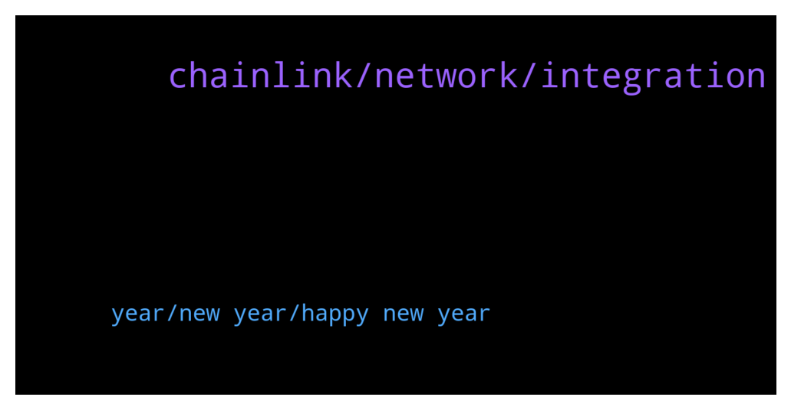

# **@chainlinkofficial**
 ## Analysis for **2021-12-31** - **2022-01-01**.

---

## 📊 **Basic Stats**

**n_messages_sent**: 37

---

---

## 🔝 **Top keywords and related messages**

1. **chainlink, network, integration**

    @kp773 --- *Hello, in which Wallet do you recommend saving chainlink to have it in the long term?  I would not like to have it long term in an exchange.. and under what network would the chainlink be stored in a Wallet?  under the ETH network?  why for example, I use Trust Wallet, and there I can store chainlink, in ETH network and also in Binance's BEP2 network, but I don't know how good it would be to save them in Binance network .. the good thing about the network of Binance are the low commissions when sending them and when withdrawing them since in the ETH network the commissions are high .. but I feel that it is safer to save them in the ERC20 network .. what do you think?  any advice?  thank you very much group* **--->** [TG Discussion](https://t.me/chainlinkofficial/358581)

    @marcromeron --- *Any integration will be announced through official channels like twitter.com/chainlink. Anything else can be considered speculation. Also you can check chainlinkecosystem.com* **--->** [TG Discussion](https://t.me/chainlinkofficial/358578)

    @Hiroshi00 --- *Hello, I want to confirm whether chainlink partnered with a project. Who do I message* **--->** [TG Discussion](https://t.me/chainlinkofficial/358570)

    @marcromeron --- *Welcome new members to the Official Chainlink Telegram Community!  Please review the pinned post for our community rules and resources.   Be aware that price/trading discussion is strictly prohibited.  New to Chainlink? Check out these resources:  - What is Chainlink? - Chainlink 2.0 Whitepaper Overview - The Community Factsheet - Explicit Staking in Chainlink 2.0  - 77 Smart Contract Use Cases Enabled By Chainlink  - The Ultimate Chainlink Deep Dive: Completing The God Protocols: A Comprehensive Overview of Chainlink in 2021   ‼️Remember: We will not PM you first. We will never ask for your passwords, keys, or funds for any reason. We don’t have special deals to offer you and there is not now nor will there ever be a Chainlink airdrop. See this article to learn how to avoid the most common scams.* **--->** [TG Discussion](https://t.me/chainlinkofficial/358547)

    @Sylvarantt --- *Please be aware that there is no price, market, trading, or yield farming discussions allowed here. Please find an unofficial channel if that is what you want to talk about. You can find some groups by searching Telegram for "Chainlink Community" but be aware that they are not operated or endorsed by the Chainlink team or admins of this chat.* **--->** [TG Discussion](https://t.me/chainlinkofficial/358383)

    @Adrxcrypto --- *can i stake my chainlink ?* **--->** [TG Discussion](https://t.me/chainlinkofficial/358225)

2. **year, new year, happy new year**

    @Rachel165 --- *I named my dog ​​Dodge coin😂* **--->** [TG Discussion](https://t.me/chainlinkofficial/358462)

    @Heart of --- *Hello everyone . Happy new year to you all and I wish you a blessed year ahead in 2022 with great level of joy happiness and success* **--->** [TG Discussion](https://t.me/chainlinkofficial/358535)

    @JoshSimenhoff --- *Wishing everyone a wonderful and happy new year 🥳* **--->** [TG Discussion](https://t.me/chainlinkofficial/358521)

    @WeAreTheGoodGuys --- *Happy new year 🎊🎆🎈 in 2 hours by me* **--->** [TG Discussion](https://t.me/chainlinkofficial/358485)

    @Moy --- *hello happy new year everyone 🙌* **--->** [TG Discussion](https://t.me/chainlinkofficial/358448)

    @AlexisPetriCosta --- *Seeing this at the entrance of this group was the best welcome gift I could ever get.* **--->** [TG Discussion](https://t.me/chainlinkofficial/358415)

