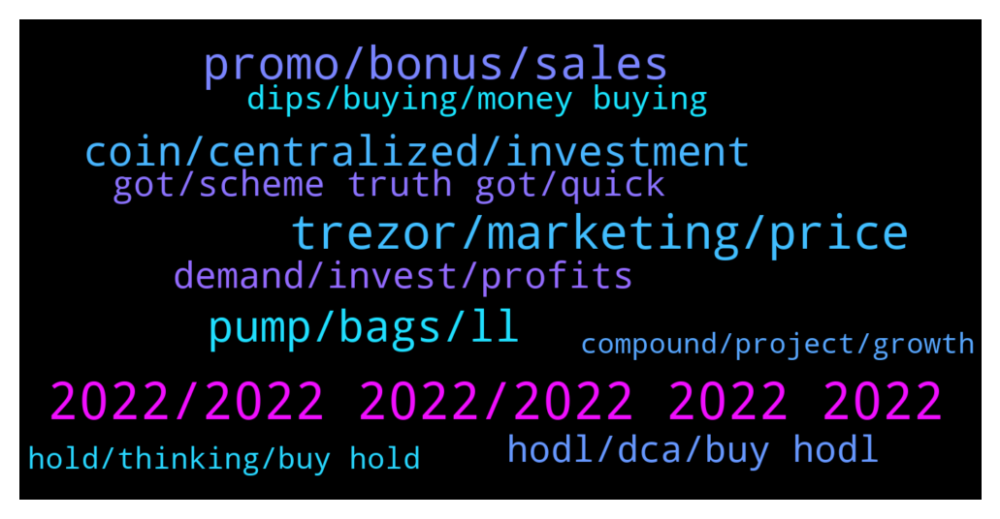

# **@compoundofficialgroup**
 ## Analysis for **2021-12-31** - **2022-01-01**.

---

## 📊 **Basic Stats**

**n_messages_sent**: 268

---

---

## 🔝 **Top keywords and related messages**

1. **2022, 2022 2022, 2022 2022 2022**

    @c_dias4 --- *What are your 2022 crypto goals?* **--->** [TG Discussion](https://t.me/compoundofficialgroup/26194)

    @Finn_jan --- *Happy New Year All...here's hoping for a Market Lengthened 2022 with a bullish blow off top that makes us all rich!* **--->** [TG Discussion](https://t.me/compoundofficialgroup/26436)

    @na3312 --- *Same, coolest thing I've done in 2021 was to stop buying dumb and luxurious stuff I don't really need and invest in projects and myself instead* **--->** [TG Discussion](https://t.me/compoundofficialgroup/26187)

    @denis2301123 --- *In 2022 things will be different* **--->** [TG Discussion](https://t.me/compoundofficialgroup/26441)

    @J3764 --- *All I want for 2022 is moons.* **--->** [TG Discussion](https://t.me/compoundofficialgroup/26226)

    @DOLAPDERELİ --- *When  will be 400 usd?* **--->** [TG Discussion](https://t.me/compoundofficialgroup/26106)

2. **trezor, marketing, price**

    @Charles --- *aave has risen, but comp has not followed suit🥺😡* **--->** [TG Discussion](https://t.me/compoundofficialgroup/26177)

    @Alvaro_467 --- *COMP definitely has a lot going for it. Hope it gets some well deserved price growth.* **--->** [TG Discussion](https://t.me/compoundofficialgroup/26322)

    @Robert_4536 --- *This community might be smaller in comparison to more hyped projects(for now), but you would have to be blind to not see the passion behind COMP from its developers and community. I was one of many who just recently found this project and since then ive seen more and more talk about COMP. The growth of this project right now is astonishing, and the value it brings to the table is big.* **--->** [TG Discussion](https://t.me/compoundofficialgroup/26366)

    @denis2301123 --- *Comp is about a great idea. It has huge potential and the very nature of how it adapts puts it far beyond many alternatives.I will keep accumulating* **--->** [TG Discussion](https://t.me/compoundofficialgroup/26256)

    @Raulafonso2 --- *Looks like another long drawn out accumulation phase for Comp* **--->** [TG Discussion](https://t.me/compoundofficialgroup/26472)

    @Antonie --- *COMP has done a great job really upping their marketing game.* **--->** [TG Discussion](https://t.me/compoundofficialgroup/26320)

3. **promo, bonus, sales**

    @Ethan_864 --- *I just love participating on this promo sales, this is the best and safest platform so far. All thanks to COMP and also the admin.  Going to hodl on Binance.. wish me luck😎💪* **--->** [TG Discussion](https://t.me/compoundofficialgroup/26147)

    @Ethan_864 --- *I'm so afraid the promo sales will end before I'll be able to accumulate enough COMP* **--->** [TG Discussion](https://t.me/compoundofficialgroup/26359)

    @Gab_4327 --- *My goal is to keep utilizing on opportunities like the promo sales* **--->** [TG Discussion](https://t.me/compoundofficialgroup/26208)

    @Alvaro_467 --- *The promo sales is really a blessing 🔥🔥* **--->** [TG Discussion](https://t.me/compoundofficialgroup/26391)

    @Harper7688 --- *If there wasn't a limit I think no one would have the chance utilize it. If the idea is to get more people to buy tokens. Then having a promo sales without limit defeats the purpose* **--->** [TG Discussion](https://t.me/compoundofficialgroup/26253)

    @Elizabeth_166 --- *The promo is still on so that's the only good news I can afford to hold onto right now.* **--->** [TG Discussion](https://t.me/compoundofficialgroup/26494)

4. **pump, bags, ll**

    @Bakker --- *Pump is paused 1-2 days because everyone waiting for cheaper price just 5% disc* **--->** [TG Discussion](https://t.me/compoundofficialgroup/26417)

    @Clark042 --- *I'll advise you buy more in preparation for the pump* **--->** [TG Discussion](https://t.me/compoundofficialgroup/26121)

    @Cassandra --- *Once we continue pumping, the only problem anyone will have is that they didn't BUY more* **--->** [TG Discussion](https://t.me/compoundofficialgroup/26243)

    @Gab_4327 --- *This is the period to BUY more COMP  The pump is here  You'll be amazed at how much Recovery we'll experience soon🚀🚀💥  The market is only giving everyone time to adjust and fill their bags* **--->** [TG Discussion](https://t.me/compoundofficialgroup/26264)

    @Noah_0980 --- *It's a new day New year Time to get more comp in advance for the coming pump* **--->** [TG Discussion](https://t.me/compoundofficialgroup/26401)

    @Noah_0980 --- *Who took profit during the last pump?* **--->** [TG Discussion](https://t.me/compoundofficialgroup/26141)

5. **coin, centralized, investment**

    @Bakker --- *Comp is definitely going to be a top Crypto investment in 2022* **--->** [TG Discussion](https://t.me/compoundofficialgroup/26299)

    @Ag_less54 --- *Inventory of the cryptocurrency market in 2022: Bitcoin is still the overlord, NFT enters the public eye* **--->** [TG Discussion](https://t.me/compoundofficialgroup/26457)

    @micheal00001 --- *I have more "savings" in COMP than I do fiat in my bank account lol.* **--->** [TG Discussion](https://t.me/compoundofficialgroup/26182)

    @ander_1256 --- *What are your thoughts on this coin? I’m about to buy some how’s the community and long term plans?* **--->** [TG Discussion](https://t.me/compoundofficialgroup/26371)

    @Noah_0980 --- *Guys, as more and more states and countries adopt crypto as a legal tender it’s a huge plus for the COMP team to be working in the Middle East for government partnerships. I truly think this market right now is a massive accumulation phase for world governments and it’s comfy knowing that COMP has been working at it for year* **--->** [TG Discussion](https://t.me/compoundofficialgroup/26263)

    @k_weber002 --- *COMP is definitely going to be a top Crypto investment in 2022* **--->** [TG Discussion](https://t.me/compoundofficialgroup/26464)

6. **hodl, dca, buy hodl**

    @Paulmiller021 --- *It's pretty simple for me - DCA and HODL.* **--->** [TG Discussion](https://t.me/compoundofficialgroup/26195)

    @Sophia4558 --- *Hey guys  I've got 98BNB to invest   Do I go all in with their sales program now or DCA 30 every week ?* **--->** [TG Discussion](https://t.me/compoundofficialgroup/26287)

    @Mich3123 --- *DCA, HODL & Stake - it’s my strategy forever* **--->** [TG Discussion](https://t.me/compoundofficialgroup/26207)

    @Alvaro_467 --- *Buy as much as you can and hodl* **--->** [TG Discussion](https://t.me/compoundofficialgroup/26191)

    @Yhng43 --- *Hodl as much as you can too* **--->** [TG Discussion](https://t.me/compoundofficialgroup/26172)

    @santos259 --- *Massive gains come to those who hodl* **--->** [TG Discussion](https://t.me/compoundofficialgroup/26135)

7. **demand, invest, profits**

    @Alvaro_467 --- *The problem is that everyone is satisfied with low profits and most people do not invest in the long run* **--->** [TG Discussion](https://t.me/compoundofficialgroup/26469)

    @Harper7688 --- *When you invest ... it is for profit and it is natural* **--->** [TG Discussion](https://t.me/compoundofficialgroup/26468)

    @scott23033 --- *The problem is that everyone is satisfied with low profits and most people do not invest in the long run* **--->** [TG Discussion](https://t.me/compoundofficialgroup/26308)

    @scott23033 --- *It doesn’t create wealth but it’s necessary to prop up demand during bad times in order for bad times to not last* **--->** [TG Discussion](https://t.me/compoundofficialgroup/26274)

    @teresamill --- *Making money is good. I just want to make good decisions for the long term. Not fussed if I don’t make a short term profit.* **--->** [TG Discussion](https://t.me/compoundofficialgroup/26201)

    @scott23033 --- *When you invest ... it is for profit and it is natural* **--->** [TG Discussion](https://t.me/compoundofficialgroup/26307)

8. **got, scheme truth got, quick**

    @ander_1256 --- *Convincing my family that crypto is the future* **--->** [TG Discussion](https://t.me/compoundofficialgroup/26204)

    @ander_1256 --- *I hope so. Red was my favorite color before I got into crypto, now not so much* **--->** [TG Discussion](https://t.me/compoundofficialgroup/26480)

    @Bakker --- *You got that right  People should buy more and hold  People with partners who are also into crypto are considered extra Lucky* **--->** [TG Discussion](https://t.me/compoundofficialgroup/26355)

    @santos259 --- *Too many folks that are new to crypto somehow have it in their head that crypto is a get rich quick scheme.  Nothing could be further from the truth.* **--->** [TG Discussion](https://t.me/compoundofficialgroup/26309)

    @Jan --- *It's true. Crypto got the reputation of free money and the whole world turned up. Freedom from central banks and the whole banking industry was forgotten. The people in the crypto space want more dollars, not cryptocurrency.* **--->** [TG Discussion](https://t.me/compoundofficialgroup/26306)

    @Bakker --- *We learn from the experience. I missed out since i didn't even know about crypto. I wished i knew about it during sol too, but COMP feels right.* **--->** [TG Discussion](https://t.me/compoundofficialgroup/26242)

9. **dips, buying, money buying**

    @Rose_109 --- *What bothers me the most is that most of the time I do not have the money to buy the dip.* **--->** [TG Discussion](https://t.me/compoundofficialgroup/26476)

    @Jan --- *I am not fucking afraid to buy the dips on COMP no matter how hard it dips* **--->** [TG Discussion](https://t.me/compoundofficialgroup/26405)

    @Clark042 --- *A lot of people in this community has made a lot of money from buying COMP  Especially by buying dips when everyone else is scared to.* **--->** [TG Discussion](https://t.me/compoundofficialgroup/26250)

    @santos259 --- *if you want to enjoy crypto learn how to buy dips* **--->** [TG Discussion](https://t.me/compoundofficialgroup/26178)

    @Cort201 --- *I've seen that happen too many times to be worried by dips* **--->** [TG Discussion](https://t.me/compoundofficialgroup/26138)

    @Alvaro_467 --- *As much as I'm happy about the dip Need to see my portfolio on green soonest* **--->** [TG Discussion](https://t.me/compoundofficialgroup/26410)

10. **hold, thinking, buy hold**

    @Antonie --- *Holding is not as easy as you think* **--->** [TG Discussion](https://t.me/compoundofficialgroup/26174)

    @Raulafonso2 --- *Good if you are buying and boring if you are holding* **--->** [TG Discussion](https://t.me/compoundofficialgroup/26473)

    @Rose_109 --- *I’ve got a little that I hold. There’s potential there but a lot to do to fulfill it…* **--->** [TG Discussion](https://t.me/compoundofficialgroup/26319)

    @Cort201 --- *If you're thinking long-term buy as much as you can then hold* **--->** [TG Discussion](https://t.me/compoundofficialgroup/26293)

    @Popov --- *Whether you bought the top or at its lowest The smartest thing to do is hold and continue buying* **--->** [TG Discussion](https://t.me/compoundofficialgroup/26285)

    @santos259 --- *Buy and  hold with strong hands   Holder never loss   Comp is a 💎 gem* **--->** [TG Discussion](https://t.me/compoundofficialgroup/26262)

