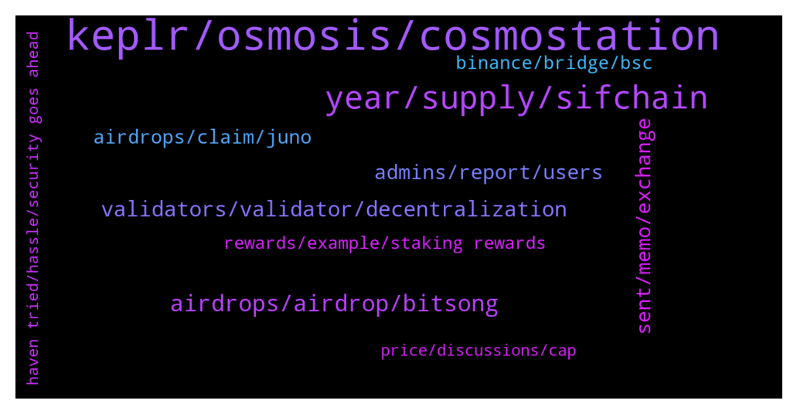

# **@cosmosproject**
 ## Analysis for **2021-12-31** - **2022-01-01**.

---

## 📊 **Basic Stats**

**n_messages_sent**: 391

---

---

## 🔝 **Top keywords and related messages**

1. **keplr, osmosis, cosmostation**

    @ZoltanAtom --- *It’s holiday time. I think you can’t now. Please try to clear your browser cache and reconnect Keplr. This might help you.* **--->** [TG Discussion](https://t.me/cosmosproject/464012)

    @AtomJazz --- *That's really strange. Never see anything like it. Probably best to ask Keplr support team https://keplr.crunch.help/* **--->** [TG Discussion](https://t.me/cosmosproject/463803)

    @anonym21 --- *Hey guys why is Cosmos doing so good in the last few days despite the bleed everywhere ? I know about interchain staking and all but that has been announced some few months ago.* **--->** [TG Discussion](https://t.me/cosmosproject/464459)

    @Ultimatejoy --- *I already delegated in Keplr can I redelegate the same with cosmostation?* **--->** [TG Discussion](https://t.me/cosmosproject/464024)

    @drakend --- *hello guys does anyone know how to translate the cosmos address of a cronos wallet to the equivalent ethereum address?* **--->** [TG Discussion](https://t.me/cosmosproject/463984)

    @Matthew_Lockie --- *https://bridge.scrt.network/ keplr can bridge to scrt then trade scrt to atom in osmosis* **--->** [TG Discussion](https://t.me/cosmosproject/464267)

2. **year, supply, sifchain**

    @interne7y --- *I’m seeing a huge amount of slippage when converting ETH to ATOM on Sifchain. Is there any way to convert like ETH to ATOM with less slippage than Sifchain other than on a centralized exchange?* **--->** [TG Discussion](https://t.me/cosmosproject/464381)

    @staycat1on --- *Does the drop of %staked/bonded of atom related to the increase defi activity such as flow to LP?* **--->** [TG Discussion](https://t.me/cosmosproject/463715)

    @JasonOfArgonaut --- *I dont see atom going below 20 again tbh,* **--->** [TG Discussion](https://t.me/cosmosproject/464348)

    @AtomJazz --- *Superfluid is Osmosis feature. Doubt it will have much effect on ATOM* **--->** [TG Discussion](https://t.me/cosmosproject/463858)

    @ndcast --- *i did, and only have atom, scrt and cro* **--->** [TG Discussion](https://t.me/cosmosproject/463626)

    @ZoltanAtom --- *Ofcourse. Check this one if you couldn’t find how to redelegate your atoms ;  a step by step guide: https://medium.com/chainapsis/how-to-use-keplr-wallet-40afc80907f6* **--->** [TG Discussion](https://t.me/cosmosproject/463790)

3. **airdrops, airdrop, bitsong**

    @W --- *where are all of these airdrops people keep talking about? I haven't received a single one, yet have been staking on Ledger for about a year.* **--->** [TG Discussion](https://t.me/cosmosproject/463389)

    @W --- *As I said earlier.... some people have lives outside of crypto too... so an airdrop shouldn't require 24/7 attention.* **--->** [TG Discussion](https://t.me/cosmosproject/463435)

    @AtomJazz --- *Those airdrops are not coming from the Cosmos Hub. It's from sovereign projects building on the Cosmos tech stack. They make their own rules* **--->** [TG Discussion](https://t.me/cosmosproject/463416)

    @ZoltanAtom --- *It’s Bitsong airdrop which is sensed by Bitsong team. Follow Bitsong official Twitter and wait for new announcement for next steps.* **--->** [TG Discussion](https://t.me/cosmosproject/463703)

    @W --- *less than 3K members in that airdrop chat group, so clearly most people are missing out.* **--->** [TG Discussion](https://t.me/cosmosproject/463423)

    @StefStuntpilot --- *Is there a list of upcoming airdrops?* **--->** [TG Discussion](https://t.me/cosmosproject/463542)

4. **validators, validator, decentralization**

    @JasonOfArgonaut --- *You can pick any of the list, up to you.  Choosing lower ranked validators is better for decentralization.* **--->** [TG Discussion](https://t.me/cosmosproject/463535)

    @AtomJazz --- *You should be able to see the whole validator set in that case then* **--->** [TG Discussion](https://t.me/cosmosproject/463796)

    @bcosmos --- *id like to begin validating on a server* **--->** [TG Discussion](https://t.me/cosmosproject/463751)

    @sofbou --- *Hi all, how can I compare Cosmos validators performance? Tough to find who to delegate to..* **--->** [TG Discussion](https://t.me/cosmosproject/464518)

    @baszawns --- *is validator GAME okey? because btsg aidrop I did not get?* **--->** [TG Discussion](https://t.me/cosmosproject/463588)

    @Ultimatejoy --- *I can see few validators list, which are not part of top 50 validators list, and I recently added Keplr* **--->** [TG Discussion](https://t.me/cosmosproject/464013)

5. **admins, report, users**

    @ZoltanAtom --- *If someone DM to you,block and report it immediately ⚠️⚠️⚠️* **--->** [TG Discussion](https://t.me/cosmosproject/464026)

    @Mark --- *is this an automated messasge all can see - re -bot-* **--->** [TG Discussion](https://t.me/cosmosproject/464453)

    @MrFalconi --- *use of a VPN to circumvent the restrictions is also prohibited,  oh well 😉* **--->** [TG Discussion](https://t.me/cosmosproject/464196)

    @Ultimatejoy --- *I already received multiple DMs and blocked all of them 😁* **--->** [TG Discussion](https://t.me/cosmosproject/464029)

    @Mark --- *Ah, no dm I just keep seeing  - ❗️New users are restricted until they ➡️ CLICK HERE ⬅️ and pass the captcha or be kicked.* **--->** [TG Discussion](https://t.me/cosmosproject/464465)

    @ZoltanAtom --- *If someone DM to you,block and report. No wallet support on telegram. ⚠️⚠️⚠️* **--->** [TG Discussion](https://t.me/cosmosproject/464462)

6. **sent, memo, exchange**

    @Peter Schiff --- *Send them an email describing the issue you are having. I had the same thing happen to me and it was resolved. Do not stress over it, but it might be a while as everyone is off from work* **--->** [TG Discussion](https://t.me/cosmosproject/464319)

    @Peter Schiff --- *Yeah, because of the holidays they are probably not working. The tokens are safe.. when you don’t add a memo it just ends up in the exchange’s wallet. All they have to do is track it down using the transaction ID* **--->** [TG Discussion](https://t.me/cosmosproject/464323)

    @JasonOfArgonaut --- *Not for a private wallet.  You usually need a note or memo to deposit onto exchanges.* **--->** [TG Discussion](https://t.me/cosmosproject/463508)

    @Peter Schiff --- *If the tokens were send to an exchange wallet they can retrieve them* **--->** [TG Discussion](https://t.me/cosmosproject/464316)

    @M --- *Hello . I sent it from Atom Wallet but I have not received it yet, I called the support several times and they said (you did not attach any notes for this deposit) but I sent you the transaction page to see if I attached the note, please follow up.* **--->** [TG Discussion](https://t.me/cosmosproject/464306)

    @M --- *Yes, I sent it to an exchange office. How do I recover?* **--->** [TG Discussion](https://t.me/cosmosproject/464317)

7. **airdrops, claim, juno**

    @W --- *People staking ATOM should be able to claim them at any time, not have to jump through hoops or keep up with the network 24/7 to avoid missing out. Communication about the airdrops is also terrible to be honest.* **--->** [TG Discussion](https://t.me/cosmosproject/463427)

    @Bringme11 --- *Thanks for the reply ser. Assuming 10 Atoms staked AirDrop received would make sense or would it be better not to claim them?* **--->** [TG Discussion](https://t.me/cosmosproject/463885)

    @VizRima --- *Yes, most of the airdrops exclude wallets staking with CEX* **--->** [TG Discussion](https://t.me/cosmosproject/463668)

    @tochiike123 --- *Hello can I stake on atomic wallet to be elligible for airdrops?* **--->** [TG Discussion](https://t.me/cosmosproject/463426)

    @Ultimatejoy --- *I staked with coinbase, but I am hearing that this won't be eligible for airdrops, is that true?* **--->** [TG Discussion](https://t.me/cosmosproject/463664)

    @Ragnarlothbrok_9_9 --- *Hey guys i was looking into yhe bitsong airdrop and saw that the airdrop isnt going to people staking atom with the game validator. Why exclude validators?* **--->** [TG Discussion](https://t.me/cosmosproject/463757)

8. **binance, bridge, bsc**

    @AtomJazz --- *There's no Cosmos - BSC bridge built by Cosmos devs. So whatever you use pls be careful, Binance is a centralized solution* **--->** [TG Discussion](https://t.me/cosmosproject/464402)

    @JasonOfArgonaut --- *Binance bridge is okay, never had an issue.  I wouldnt leave my tokens with the cex though* **--->** [TG Discussion](https://t.me/cosmosproject/464407)

    @AtomJazz --- *IDK, the multisig design of those bridges is scary to say the least* **--->** [TG Discussion](https://t.me/cosmosproject/464408)

    @interne7y --- *Do you know the best bridge to use for Cosmos to BSC?* **--->** [TG Discussion](https://t.me/cosmosproject/464396)

    @interne7y --- *I just confirmed that Binance bridge was retired on Nov 25th. So it seems like there’s no way to move ATOM from BSC to Cosmos now, right?* **--->** [TG Discussion](https://t.me/cosmosproject/464474)

    @interne7y --- *When I search for “binance bridge” I get taken to a binance page that links to two other bridges: Celer and Anyswap. Neither of them seems to allow moving from Cosmos as far as I can see. Did Binance maybe remove its own bridge recently for regulatory reasons?* **--->** [TG Discussion](https://t.me/cosmosproject/464413)

9. **rewards, example, staking rewards**

    @AtomJazz --- *So if you're staking 1000 ATOMs for example you earn 10 ATOMs of staking rewards. Validators charge 5% of that staking rewards for example* **--->** [TG Discussion](https://t.me/cosmosproject/463852)

    @Rico --- *When i stake, what difference does it make when i choose the gas fee?* **--->** [TG Discussion](https://t.me/cosmosproject/463963)

    @LP --- *Ok but i do have to select a centralized entity to stake, no ?* **--->** [TG Discussion](https://t.me/cosmosproject/463533)

    @LP --- *So i finally succeeded in transferring my ATOMs from Binance to personnal Keplr wallet : now a las question regarding the staking. It indicates Cosmos Hub staking rewards at 14.32% but when i click on stake, i have a long list of possibilities...Which one is from COSMOS for example ? And also why is it written 100% commission for Kraken for example ??* **--->** [TG Discussion](https://t.me/cosmosproject/463522)

    @Mark --- *replied to wrong message lots of reasons.  People are flipping out of those last gen coins an in to coins that actually have an ecosytems with use value.  Also a big reason is Fibonacci retracements short term trader entry points have met pushed the it up to a Wykoff traders entry point* **--->** [TG Discussion](https://t.me/cosmosproject/464504)

    @W --- *It makes no sense why long term holders are not rewarded and are expected to follow every little update.* **--->** [TG Discussion](https://t.me/cosmosproject/463412)

10. **price, discussions, cap**

    @Iván --- *When super fluid staking arrive, utility improve but liquid supply as well, do you think we will see drop price when is released?* **--->** [TG Discussion](https://t.me/cosmosproject/463857)

    @AtomJazz --- *Well DOT's supply is 4x higher so they still have much bigger market cap. We have live IBC though and a huge interconnected network* **--->** [TG Discussion](https://t.me/cosmosproject/464607)

    @turnipdabeets --- *I love it when people cry about free money they didn’t pay attention to 😂* **--->** [TG Discussion](https://t.me/cosmosproject/463394)

    @JasonOfArgonaut --- *All the news.  Possible interchain security,  eth and btc bridges, osmo superfluid staking* **--->** [TG Discussion](https://t.me/cosmosproject/464346)

    @AtomJazz --- *Can you pls move price discussions to @AtomPrice* **--->** [TG Discussion](https://t.me/cosmosproject/464351)

    @ZoltanAtom --- *Please join @Atomprice for price discussions.* **--->** [TG Discussion](https://t.me/cosmosproject/463936)

