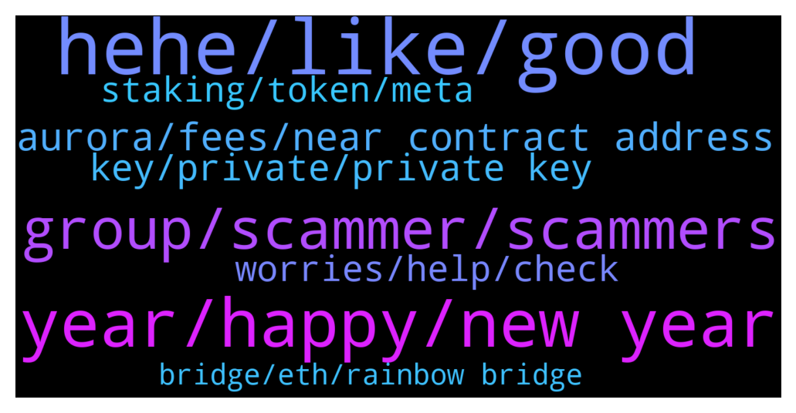

# **@cryptonear**
 ## Analysis for **2021-12-31** - **2022-01-01**.

---

## 📊 **Basic Stats**

**n_messages_sent**: 642

---

---

## 🔝 **Top keywords and related messages**

1. **hehe, like, good**

    @akhilajay --- *Its not much attractive I meant* **--->** [TG Discussion](https://t.me/cryptonear/257449)

    @akhilajay --- *I can't say but I can say its not much attractive atleast for me.* **--->** [TG Discussion](https://t.me/cryptonear/257455)

    @traderkojo --- *Starting my html journey to learn the basics so I can be bey productive in the near university training coming up next week 🙏🏾* **--->** [TG Discussion](https://t.me/cryptonear/257480)

    @larry_lang --- *https://twitter.com/NEAR_Blockchain/status/1476597987501654026 for artists and NFT-savy people u might wanna loook at this NFT design contest^^* **--->** [TG Discussion](https://t.me/cryptonear/256515)

    @FritzWagner --- *Sir, welcome, I bet these are good wishes from you thanks, but please only English here 🤘* **--->** [TG Discussion](https://t.me/cryptonear/257565)

    @thanano46 --- *What colour combination attracts you sir? 😅* **--->** [TG Discussion](https://t.me/cryptonear/257451)

2. **year, happy, new year**

    @kenjay60 --- *Happy New year to you all guys* **--->** [TG Discussion](https://t.me/cryptonear/257524)

    @NEARverse_xd --- *Happy New Year to all Nearians💸* **--->** [TG Discussion](https://t.me/cryptonear/256600)

    @ShmagPolyp --- *Hello peoples. New to the group and just wanted to say happy new year to you all 🎉🥂* **--->** [TG Discussion](https://t.me/cryptonear/257464)

    @larry_lang --- *Happy new year to all of u^^ and for those who have been with me through ups and downs this year- it has been a great journey and really looking forward continue it with u guys* **--->** [TG Discussion](https://t.me/cryptonear/256596)

    @kenjay60 --- *Happy New year to you 🤝* **--->** [TG Discussion](https://t.me/cryptonear/257858)

    @planetaryjim --- *Happy new year to all and to all a good night!* **--->** [TG Discussion](https://t.me/cryptonear/257750)

3. **group, scammer, scammers**

    @menco86 --- *Happy new year guys...there is a scam with the same name of this group....Be careful* **--->** [TG Discussion](https://t.me/cryptonear/257957)

    @ugurkc --- *Kripto raptor sent me message on dm. Is he scammer?* **--->** [TG Discussion](https://t.me/cryptonear/256327)

    @Kripto_Raptor --- *watch out for scammers block them. 😃* **--->** [TG Discussion](https://t.me/cryptonear/256577)

    @Alex --- *Oh wow the second I joined here I started getting a ton of calls via TG from scammers omg* **--->** [TG Discussion](https://t.me/cryptonear/256552)

    @cuongdcc --- *caused that account was banned from telefram* **--->** [TG Discussion](https://t.me/cryptonear/257773)

    @hvisdukane --- *Guys please beware of scammers acting as support. If u are a newbie they try to target you* **--->** [TG Discussion](https://t.me/cryptonear/257998)

4. **aurora, fees, near contract address**

    @larry_lang --- *Hmm pretty sure the hype is around aurora ecosystem with projects onboarding each weeks* **--->** [TG Discussion](https://t.me/cryptonear/256752)

    @hoangca6789 --- *Now, I cant find aurora on ht.* **--->** [TG Discussion](https://t.me/cryptonear/256941)

    @Albert --- *Idk. You said I check Aurora and I did and I gave you the answer.* **--->** [TG Discussion](https://t.me/cryptonear/257722)

    @Kaiguy69 --- *Are there no taxes on near like there arent on aurora?* **--->** [TG Discussion](https://t.me/cryptonear/256781)

    @marko_eth --- *can someone explain me the utility of AURORA token...i know what we use NEAR for everything, but what do we use aurora for?* **--->** [TG Discussion](https://t.me/cryptonear/256895)

    @kv9990 --- *$NEAR contract address on AURORA  "0xC42C30aC6Cc15faC9bD938618BcaA1a1FaE8501d"  $NEAR contract address on ETH "0x85F17Cf997934a597031b2E18a9aB6ebD4B9f6a4"  $NEAR contract address on BSC "0x1fa4a73a3f0133f0025378af00236f3abdee5d63"* **--->** [TG Discussion](https://t.me/cryptonear/256935)

5. **key, private, private key**

    @butola_ravi --- *So if someone send wnear to exchange and in this case crypto.com they are not lost right* **--->** [TG Discussion](https://t.me/cryptonear/257605)

    @Kripto_Raptor --- *because it(that token: wNear) has a contract on the Near blockchain and they own the private key* **--->** [TG Discussion](https://t.me/cryptonear/257592)

    @bailey_12 --- *If you send something to the exchange, it is always in their vault no matter it is a wrong network or wrong token to a wrong network  But it is not guaranteed for them to try to recover the fund (depending on the size and what kind of assets) . Because some vault can not be accessed since there might be no private key (or lost)* **--->** [TG Discussion](https://t.me/cryptonear/257613)

    @xerophyte --- *is crypto going down because of omicon?* **--->** [TG Discussion](https://t.me/cryptonear/256722)

    @ammarkhanx --- *I sent wnear to crypto,com and didn't get it 200 near* **--->** [TG Discussion](https://t.me/cryptonear/257575)

    @Kripto_Raptor --- *it has nothing to do with crypto com, same with all centralized exchanges. but they may refuse to help as they warn you not to send any other asset, and to use the right network* **--->** [TG Discussion](https://t.me/cryptonear/257620)

6. **worries, help, check**

    @iforbusiness2 --- *please check here https://near.org/decentralize/ for more details* **--->** [TG Discussion](https://t.me/cryptonear/257846)

    @FritzWagner --- *And I use this one to keep me informed https://t.me/nearweek* **--->** [TG Discussion](https://t.me/cryptonear/256483)

    @bailey_12 --- *haha no worries. Glad I could help. Let me know if you need anything else. Careful for scammers and imposter* **--->** [TG Discussion](https://t.me/cryptonear/256682)

    @LegacyTee --- *I confused myself😆 but I think you answered my question in spite of it all. I'll go try that.  Thank you much!* **--->** [TG Discussion](https://t.me/cryptonear/256676)

    @thiszvincent --- *Because I am really finding it difficult* **--->** [TG Discussion](https://t.me/cryptonear/257766)

    @bailey_12 --- *no worries, I am just trying to help. that's all. Happy New Year to you ser* **--->** [TG Discussion](https://t.me/cryptonear/257908)

7. **staking, token, meta**

    @larry_lang --- *hmm i think  u can see the token use cases here: https://aurora.dev/tokenomics* **--->** [TG Discussion](https://t.me/cryptonear/256899)

    @rob0008 --- *Any one know what those metapool tokens are for that we earn when staking in metapool ?* **--->** [TG Discussion](https://t.me/cryptonear/257403)

    @D --- *What is the token address to add to my metamask ?* **--->** [TG Discussion](https://t.me/cryptonear/256932)

    @daplek --- *Create near wallet and stake on near wallet* **--->** [TG Discussion](https://t.me/cryptonear/258173)

    @sathviknarayan --- *Is staking available in near protocol* **--->** [TG Discussion](https://t.me/cryptonear/256631)

    @TheGo1denBull --- *Welcome All NEARCOMERS! Here is a nice guide on the token, where to buy and where to store. If you want to stake I recommended making a wallet at wallet.near.org with your specialized username  https://near.org/tokens/* **--->** [TG Discussion](https://t.me/cryptonear/256233)

