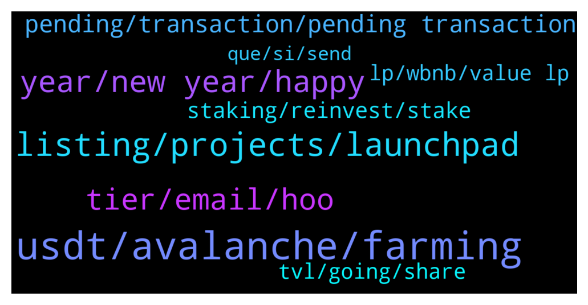

# **@dypfinance**
 ## Analysis for **2021-12-31** - **2022-01-01**.

---

## 📊 **Basic Stats**

**n_messages_sent**: 164

---

---

## 🔝 **Top keywords and related messages**

1. **usdt, avalanche, farming**

    @hemanrock --- *https://www.youtube.com/watch?v=2pOUmRTMN1o&t=304s  please watch this video tutorial for reference (FARMS)   https://dyp.finance/farmv2* **--->** [TG Discussion](https://t.me/dypfinance/235825)

    @Marinecommandoz --- *Is farming here get to do with Ethereum? Admin!* **--->** [TG Discussion](https://t.me/dypfinance/235819)

    @appliepietrade --- *Hi Heman, ask you another question. I have some USDT in my exchange, can i just send this usdt to metamask avalache network to do farming using usdt?   the reason i ask is that I try to add usdt to my metamask in avalanche network and it could not find the usdt token. The usdt token address i try to add is this:0xdac17f958d2ee523a2206206994597c13d831ec7* **--->** [TG Discussion](https://t.me/dypfinance/235889)

    @iamJubi --- *Hello. Avalanche have their version of usdt which is usdt.e.   These are the supported asset to farm on avalanche chain:  WAVAX, USDC.e, USDT.e, WETH.e, PNG, QI, XAVA, WBTC.e, LINK.e, or iDYP👇* **--->** [TG Discussion](https://t.me/dypfinance/235893)

    @appliepietrade --- *Thanks. I will just buy avax to do farming then!* **--->** [TG Discussion](https://t.me/dypfinance/235902)

    @iamJubi --- *Hello. The dyp you will be getting is on avalanche network. You need to bridge your DYP from avalanche net to eth net first before you can transfer it to kucoin erc20 deposit.* **--->** [TG Discussion](https://t.me/dypfinance/235934)

2. **listing, projects, launchpad**

    @DhoniMSD516 --- *The first project on launchpad will be announced soon can be by Mid Jan* **--->** [TG Discussion](https://t.me/dypfinance/236026)

    @WatermelonNoia --- *Have you had any interest in the launchpad from crypto based projects, and equally have you been approaching crypto based projects to entice them to the launchpad?  @timdyp @DhoniMSD516 @iamJubi* **--->** [TG Discussion](https://t.me/dypfinance/235691)

    @iamJubi --- *Rest assured that the team will do what is the necessary/needed procedure before launching any products. :)* **--->** [TG Discussion](https://t.me/dypfinance/235630)

    @BullishForeverr --- *when launchpad is going to live* **--->** [TG Discussion](https://t.me/dypfinance/236025)

    @WatermelonNoia --- *Great! What's your gut feel on the quality and type of projects?* **--->** [TG Discussion](https://t.me/dypfinance/235693)

    @DhoniMSD516 --- *Hey pls email your proposal to contact@dyp.finance* **--->** [TG Discussion](https://t.me/dypfinance/236000)

3. **year, new year, happy**

    @timdyp --- *Happy New Year #DYPians family🥳🎉 A huge thank you for coming along for the ride.  Looking forward to 2022!  👉https://twitter.com/dypfinance/status/1476946094156353597* **--->** [TG Discussion](https://t.me/dypfinance/235783)

    @StillHodlTulips --- *awesome, thanks. Have a great new year in advance!* **--->** [TG Discussion](https://t.me/dypfinance/235775)

    @appliepietrade --- *excellent. Thanks Jubi. You guys are great. I am very new to this. I learnt lots of stuff from you guys. Appreciated very much! Happy New Year!* **--->** [TG Discussion](https://t.me/dypfinance/235937)

    @iamJubi --- *#NFTGiveaway time🐱  🔥10 lucky people will get a Cats and Watches Society #NFT which starts minting on January 17, 2022👇 https://dyp.finance/nft  Enter to win: ✅Retweet ✅Tag 3 friends that loves #NFTs ✅Follow @dypfinance ✅Join https://t.me/dypfinance  #NFTCommunity #NFTdrop  👉https://twitter.com/dypfinance/status/1475805248887439360* **--->** [TG Discussion](https://t.me/dypfinance/235939)

    @iamJubi --- *Appreciate your feedback. Happy new year. ❤️* **--->** [TG Discussion](https://t.me/dypfinance/235938)

    @EnLaMira --- *hey dypians.. happy new year to all 🍾* **--->** [TG Discussion](https://t.me/dypfinance/235878)

4. **tier, email, hoo**

    @nok_mun --- *Hoo. Com not tier 1. Rank on cmc at 129* **--->** [TG Discussion](https://t.me/dypfinance/235919)

    @nok_mun --- *I think tier 1 exchanger always use thats domain on their email. Not use yahoo..* **--->** [TG Discussion](https://t.me/dypfinance/235924)

    @timdyp --- *You can be 100% sure that it is a Tier 1 exchange :) Plus we have another Tier 1 exchange in the pipeline.* **--->** [TG Discussion](https://t.me/dypfinance/235766)

    @ahuman516 --- *Lol what mate? If team says Tier 1 it will be tier 1 rest assured, the email id is half hidden so stop making false guess or confirmations* **--->** [TG Discussion](https://t.me/dypfinance/235923)

    @DhoniMSD516 --- *Top 5 cex are considered as tier 1* **--->** [TG Discussion](https://t.me/dypfinance/235959)

    @nok_mun --- *I saw it hoo. Hoo exchanger i think not tier 1 exchanger* **--->** [TG Discussion](https://t.me/dypfinance/235917)

5. **pending, transaction, pending transaction**

    @hemanrock --- *please check on internet about (nonce) or how to fast pending tx.* **--->** [TG Discussion](https://t.me/dypfinance/235828)

    @appliepietrade --- *soemthing is no right. when i do approve, it is pretty much instant* **--->** [TG Discussion](https://t.me/dypfinance/235673)

    @Globbysats --- *when i hover it doesnt do anything and its been 60 days 11 hrs* **--->** [TG Discussion](https://t.me/dypfinance/235585)

    @hemanrock --- *Please hover to withdraw button to see remaining days* **--->** [TG Discussion](https://t.me/dypfinance/235584)

    @appliepietrade --- *Hi admin, is there anything that you can do for a pending transaction(deposit) that is lasting for more than 11 hours and still pending?* **--->** [TG Discussion](https://t.me/dypfinance/235826)

    @appliepietrade --- *Hi admin, i talked to you last night about my staking in eth network. I reapproved and tried to do the deposit now, but it has been 17 minutes after I hit the deposit and it is still pending, is this normal?* **--->** [TG Discussion](https://t.me/dypfinance/235661)

6. **staking, reinvest, stake**

    @appliepietrade --- *now let me ask you another question. There is an option for reinvest for the staking reward. I don't quite understand it. Let's say I staked 1000 dyp and i have 10 dyp for the rewards, if I click reinvest, does this 10 dyp add back to the 1000 to get the compound?* **--->** [TG Discussion](https://t.me/dypfinance/235831)

    @appliepietrade --- *thanks sir!  I understand that reinvesting will need gas fee, so I will definitely take this into account when I do reinvest. Now thank you very much for answering my question. Happy new year to you Sir!* **--->** [TG Discussion](https://t.me/dypfinance/235836)

    @robertqin86 --- *I just reinvested so I can answer this qn. Ur stake amt after reinvesting is 1010 dyp. If u are eligible to withdraw after ur lock in period it will also be 1010. Do note that reinvesting will require eth gas fees so do ur own calculations on when is the best time to reinvest.* **--->** [TG Discussion](https://t.me/dypfinance/235832)

    @StillHodlTulips --- *Hey all, the iDYP from airdrop is now staking away nicely (vested over 12 months I believe). After those 12 months, is there a place to stake them then? Or does staking iDYP continue after 12 months* **--->** [TG Discussion](https://t.me/dypfinance/235772)

    @appliepietrade --- *Hi Admin, ask you a question regarding the staking 90 days, does it mean after 90 days is up, the staking amount will return back to me for withdraw or i can continue to do the staking?* **--->** [TG Discussion](https://t.me/dypfinance/235881)

    @appliepietrade --- *yeah, that is what I am thinking. The rewards must be big enough to perform this claim or reinvest.* **--->** [TG Discussion](https://t.me/dypfinance/235846)

7. **tvl, going, share**

    @chunshern90 --- *Why TVL and "My Share" keep going down?* **--->** [TG Discussion](https://t.me/dypfinance/235636)

    @BigGUN01 --- *what's going on, the value keeps dropping down considerably* **--->** [TG Discussion](https://t.me/dypfinance/235621)

    @hosimo --- *Is that related to TVL in the contract* **--->** [TG Discussion](https://t.me/dypfinance/235726)

    @QTMiner --- *TVL could be goin down due to the whole crypto market taking a dip* **--->** [TG Discussion](https://t.me/dypfinance/235641)

    @QTMiner --- *TVL is going up as other people deposit, so your share of X is still X/TVL but if TVL goes up your gate gets smaller* **--->** [TG Discussion](https://t.me/dypfinance/235639)

    @chunshern90 --- *but looks like TVL and "My Share" going down at the same time..* **--->** [TG Discussion](https://t.me/dypfinance/235638)

8. **lp, wbnb, value lp**

    @iamJubi --- *you can check dollar value of your LP here https://app-bsc.dyp.finance/staking-stats* **--->** [TG Discussion](https://t.me/dypfinance/235718)

    @v1ruzz --- *Any site where we can track LP breakdown for dyp* **--->** [TG Discussion](https://t.me/dypfinance/236016)

    @DhoniMSD516 --- *If you are asking about knowing USD value of your LP you can find it on Stats page* **--->** [TG Discussion](https://t.me/dypfinance/236017)

    @hosimo --- *Since i deposit the lp its decresed 400% 😂* **--->** [TG Discussion](https://t.me/dypfinance/235731)

    @hosimo --- *I mean by raising the price of both the LP RAISE or if one of them also increased the lp increase as well?* **--->** [TG Discussion](https://t.me/dypfinance/235727)

    @iamJubi --- *iDYP and WBNB price affects the value of your LP deposited on our pools.* **--->** [TG Discussion](https://t.me/dypfinance/235725)

9. **que, si, send**

    @Paulus --- *Few QA may I dm the admin* **--->** [TG Discussion](https://t.me/dypfinance/235606)

    @Marinecommandoz --- *Did I put the question in the right way?👆 Admin!* **--->** [TG Discussion](https://t.me/dypfinance/235823)

    @Jonathan --- *Hola , alguien habla español que me pueda explicar de que trata este grupo? Si invierte con la muchacha o si ayudan a invertir en Defi.* **--->** [TG Discussion](https://t.me/dypfinance/235805)

    @rachel_xt_agents --- *can i send direct on dm?* **--->** [TG Discussion](https://t.me/dypfinance/236002)

    @Marinecommandoz --- *Network issues over here. I'd like to continue tomorrow.* **--->** [TG Discussion](https://t.me/dypfinance/235865)

    @DhoniMSD516 --- *Hello please keep the chat in English :)* **--->** [TG Discussion](https://t.me/dypfinance/235806)

