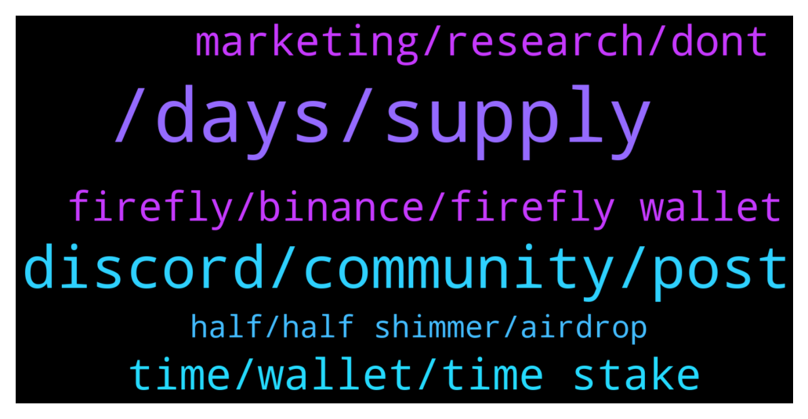

# **@iotatangle**
 ## Analysis for **2021-12-31** - **2022-01-01**.

---

## 📊 **Basic Stats**

**n_messages_sent**: 137

---

---

## 🔝 **Top keywords and related messages**

1. **, days, supply**

    @Pantra86 --- *I am thinking about selling iota afte staking or in the middle of it even. In this way it will never go to the moon* **--->** [TG Discussion](https://t.me/iotatangle/305249)

    @punikus --- *Guys, until the stake event I was not aware of IOTA's existence. I am about two years into crypto and I never saw a project like this. Now I believe that this one's gonna change everything. Happy holydays everybody* **--->** [TG Discussion](https://t.me/iotatangle/305468)

    @lalit1414 --- *Now the supply may be reduced for 3 months but it really doesn’t make a dent on price because there is no FOMO at all.* **--->** [TG Discussion](https://t.me/iotatangle/305247)

    @satoshi_legend --- *Iota was recently listed on Kucoin I believe.  ~Let's keep spreading the global adoption of IOTA.~  The free market should and will decide IOTA's true value.  IOTA with its directed acyclic graph, and advanced infrastructure - it has all the pieces to become the leading cryptocurrency in the transition to web 3.0 - era of Internet of Things (IOT), 5G (partnership w/ TMobile, Huawei, Fujitsu), connected Robotics (partner w/ ABB), automotive connectivity (partnership with VW & German car makers), Smart City, & Metaverse.* **--->** [TG Discussion](https://t.me/iotatangle/305416)

    @lalit1414 --- *How many people from crypto space knows IOTA started staking in 2 different tokens ??  There is no one from outside even talking about it..* **--->** [TG Discussion](https://t.me/iotatangle/305239)

    @SeifertReid --- *Hey why isn’t IOTA listed yet on KuCoin??* **--->** [TG Discussion](https://t.me/iotatangle/305217)

2. **discord, community, post**

    @Tahmis --- *Could you ask in discord? Easier to find help there and Im a bit busy right now* **--->** [TG Discussion](https://t.me/iotatangle/305332)

    @Cheng0228 --- *Wish everyone a happy new year.* **--->** [TG Discussion](https://t.me/iotatangle/305459)

    @Skypies --- *I have but the channel isn’t allowing me to post* **--->** [TG Discussion](https://t.me/iotatangle/305435)

    @Tahmis --- *Hi, please ask in official discord. You can find a help channel in there* **--->** [TG Discussion](https://t.me/iotatangle/305432)

    @lalit1414 --- *Just be aware of scammers now.. they will contact you directly* **--->** [TG Discussion](https://t.me/iotatangle/305278)

    @DanielWolfFIT --- *Now everything is fine and I am happy haha 😅* **--->** [TG Discussion](https://t.me/iotatangle/305348)

3. **time, wallet, time stake**

    @ef4ort --- *What i mean is that  if you are not seeing it in your wallet its just as bad as you not having it the first place . and the evidence of convincing them without an email confirming the staking will be hard to prove even with the screenshot* **--->** [TG Discussion](https://t.me/iotatangle/305485)

    @Bartleby --- *Is it possible to stake any time we want or is there definite starting time ?* **--->** [TG Discussion](https://t.me/iotatangle/305262)

    @ef4ort --- *But if that happens and you restore your wallet using your mnemonic phrase you should be able to get everything back as it was when u staked it with your staking rewards intact   i would expect but my friend found an empty wallet still showing no trace at all of any transactions whatsoever.. Could that have been an external intrusion happening within the last 24 hours while NY festivities was ongoing ?* **--->** [TG Discussion](https://t.me/iotatangle/305465)

    @ash1taka1997 --- *Oh yeah I forgot that one, we have a voting event yet to come.* **--->** [TG Discussion](https://t.me/iotatangle/305385)

    @Sailor --- *Any time you can stake and unstake it* **--->** [TG Discussion](https://t.me/iotatangle/305281)

    @punikus --- *you don't need to split your stake* **--->** [TG Discussion](https://t.me/iotatangle/305208)

4. **marketing, research, dont**

    @Bill --- *If you would do your research you would know why the foundation cannot make any marketing.* **--->** [TG Discussion](https://t.me/iotatangle/305286)

    @Pantra86 --- *But i am wondering why there is no marketin & an strong community* **--->** [TG Discussion](https://t.me/iotatangle/305442)

    @Pantra86 --- *Yes, and i dont know why. The marketing team is really weak or doesnt exist* **--->** [TG Discussion](https://t.me/iotatangle/305241)

    @cryptokioskio --- *Dont talk like this here. Stay or sell. Only belivers here🖖* **--->** [TG Discussion](https://t.me/iotatangle/305439)

    @Pantra86 --- *Ofcourse that is funny. I am talking about marketing not price for now* **--->** [TG Discussion](https://t.me/iotatangle/305445)

    @Pantra86 --- *Unfotunatelly. I agree Without marketing you cant grow in this market. And i dont know really why iota team doesnt workbon it* **--->** [TG Discussion](https://t.me/iotatangle/305244)

5. **firefly, binance, firefly wallet**

    @Skypies --- *Hello admin good morning. Please I sent my oita from binance to my firefly wallet like 6 hours ago but till now, I am yet to see the iota tokens reflect on my firefly wallet though it’s saying transaction completed on Binance.   What could be the reason for this delay or is it normal ?* **--->** [TG Discussion](https://t.me/iotatangle/305277)

    @Skypies --- *Hello admin good morning. Please I sent my oita from binance to my firefly wallet like 24 hours ago but till now, I am yet to see the iota tokens reflect on my firefly wallet though it’s saying transaction completed on Binance.   What could be the reason for this delay or is it normal ?* **--->** [TG Discussion](https://t.me/iotatangle/305427)

    @DanielWolfFIT --- *hey guys - one question. Was sending IOTA via 2 firefly wallets today 2 hours ago. from the sending adress the token already went away and in the tangle it seems the tx went through. but the reciever adresse still havent got the amount. what s the issue about that?* **--->** [TG Discussion](https://t.me/iotatangle/305328)

    @David --- *Withdrew from Binance successfully and now staked in Firefly - all good 🙏* **--->** [TG Discussion](https://t.me/iotatangle/305308)

    @ElmettS96 --- *No, Firefly don't give the possibility (in this moment) to buy directly IOTA, you can buy it from different exchange (Binance Bitpanda bitfinex ecc) and then send to Firefly in order to stake it for shimmer and assembly crypto, but consider that this week Binance often suspend withdrawal.* **--->** [TG Discussion](https://t.me/iotatangle/305228)

    @B --- *When will Bnance US allow withdrawal so I can send to my firefly wallet?* **--->** [TG Discussion](https://t.me/iotatangle/305252)

6. **half, half shimmer, airdrop**

    @Papa_Moose --- *But Shimmer and Assembly will do marketing and drag iota with them* **--->** [TG Discussion](https://t.me/iotatangle/305452)

    @REGALIS --- *I put them all in Assembly and now want to get Back thé half to  stocke in shimmer. What and how Will i do? I dont want to be in trouble* **--->** [TG Discussion](https://t.me/iotatangle/305206)

    @sy-subrc --- *What do you mean by „half of them out and put on shimmer?* **--->** [TG Discussion](https://t.me/iotatangle/305204)

    @REGALIS --- *Hi, I would need some help.  I staked my iota and it all went to Assembly.  How do we get half of them out and put them on Shimmer?* **--->** [TG Discussion](https://t.me/iotatangle/305202)

    @JohnPhishingman --- *u have to migrate them to chrysalis* **--->** [TG Discussion](https://t.me/iotatangle/305400)

    @mahirnadi --- *Thank you for the info Do i need to do anything else to get the airdrop after staking ends?* **--->** [TG Discussion](https://t.me/iotatangle/305197)

