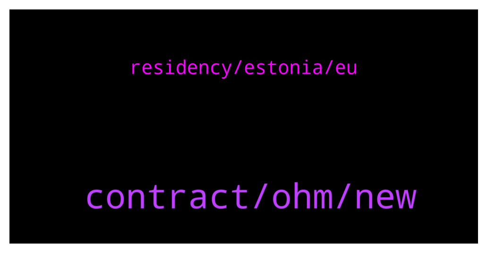

# **@lobsters_chat**
 ## Analysis for **2021-12-31** - **2022-01-01**.

---

## 📊 **Basic Stats**

**n_messages_sent**: 211

---

---

## 🔝 **Top keywords and related messages**

1. **contract, ohm, new**

    @vPEPO --- *How the fuck someone writes a 206 tweet thread and promotes it?  https://twitter.com/adamscochran/status/1476652328736342023?t=EdDcKEKUq6aIHCEAbodGGg&s=19* **--->** [TG Discussion](https://t.me/lobsters_chat/311699)

    @Kollossus --- *Anybody used NEAR here? It's quite empty projects wise for the moment.* **--->** [TG Discussion](https://t.me/lobsters_chat/311823)

    @ivangbi --- *What a chad! @ncerovac @farm42 @etartakovsky we need to gib the ser a lobster* **--->** [TG Discussion](https://t.me/lobsters_chat/311771)

    @vPEPO --- *Yeah, but that thread was lit af, Adam keeps trying to push twitter limits (he wants to look savvy but he lost everyone's attention at tweet 5/6)* **--->** [TG Discussion](https://t.me/lobsters_chat/311704)

    @ivangbi --- *How is “we bought some stuff early” = “reserve currency of the defi”? I am not dunking or anything, just wanna see if I missed some new narrative?* **--->** [TG Discussion](https://t.me/lobsters_chat/311991)

    @SpikeSpiege1 --- *Anyone know where the hacker actually took the tokens from? Team wallet? Bridge? Etc https://bitcoinist.com/hacker-exploits-vulnerability-on-polygon/* **--->** [TG Discussion](https://t.me/lobsters_chat/311857)

2. **residency, estonia, eu**

    @lefterisjp --- *That we did. I considered Estonia e citizenship and incorporating a company there in the past* **--->** [TG Discussion](https://t.me/lobsters_chat/311756)

    @jiji0x --- *What do you get as an Estonian e-citizen? What’s the use case?* **--->** [TG Discussion](https://t.me/lobsters_chat/311774)

    @rocket_fuel --- *Estonian e-residency isn’t a larp. They are just trying to monetizea ridiculously expensive system. It was a “success” originally (the entire digital state concept in Estonia), because in the beginning it consumed ~30% of the state budget for a few years. Too big too fail.* **--->** [TG Discussion](https://t.me/lobsters_chat/311766)

    @xmons --- *Seems quite stringent for a normally digitally forward country :(* **--->** [TG Discussion](https://t.me/lobsters_chat/311746)

    @jiji0x --- *If you regularly work from some place else, you most likely will become resident there too? So now you’re resident in two places. What have you gained?  That you can sign documents electronically?* **--->** [TG Discussion](https://t.me/lobsters_chat/311776)

    @reednaaxeelaa --- *It is pretty easy to enforce if the target is in Estonia.* **--->** [TG Discussion](https://t.me/lobsters_chat/311770)

