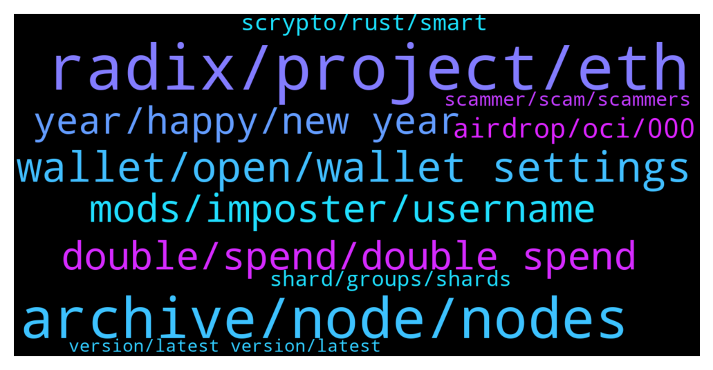

# **@radix_dlt**
 ## Analysis for **2021-12-31** - **2022-01-01**.

---

## 📊 **Basic Stats**

**n_messages_sent**: 713

---

---

## 🔝 **Top keywords and related messages**

1. **radix, project, eth**

    @Darren_Kc --- *For radix to be $100 dollars or so, wouldn’t it need a market cap above $1 trillion?  Do we really believe that this is the potential in the next 7+ years?   It certainly wouldn’t be plausible until after Xi’an, another bull run and a huge migration from Other L1 projects. All of which is hugely ambitious and extremely difficult!   Fingers crossed🤞🏻* **--->** [TG Discussion](https://t.me/radix_dlt/330197)

    @Geralt123456 --- *What makes impossible for other projects to copy radix and its atomic composability?* **--->** [TG Discussion](https://t.me/radix_dlt/330158)

    @Tron83 --- *Is Radix EVM compatible. What is the easiest way to move a project from ETH to Radix.* **--->** [TG Discussion](https://t.me/radix_dlt/330331)

    @Steve7555 --- *Radix is clearly very advanced. But I just wonder who it will be used by. Are banks and institutions etc waiting on the sidelines?* **--->** [TG Discussion](https://t.me/radix_dlt/331122)

    @Jazzer9F --- *Excellent article from Coin Telegraph highlighting the current issues faced by Solidity developers, and detailing how Radix will give developers the power to build quickly, securely, and know that scale will never be a bottleneck!  https://cointelegraph.com/news/watch-out-solidity-new-project-aims-to-tackle-downsides-of-coding-defi-projects* **--->** [TG Discussion](https://t.me/radix_dlt/331136)

    @Ebmagic --- *are there any apps built on radix yet? I can't find any* **--->** [TG Discussion](https://t.me/radix_dlt/330728)

2. **archive, node, nodes**

    @Radstakes --- *All of the community archive nodes listed here are from well known validators and radvocates which should give some peace of mind.  https://radixtalk.com/t/what-community-archive-nodes-can-i-use-with-the-radix-desktop-wallet/156?u=faraz.* **--->** [TG Discussion](https://t.me/radix_dlt/331102)

    @Magal36 --- *it's new years eve gguys. I wouldn't be looking into it if I were the team 😂😂😂 Funds are safu, consensus is working fine, just switch to a community archive node and you'll be ok* **--->** [TG Discussion](https://t.me/radix_dlt/330901)

    @Magal36 --- *When new archive node architecture is implemented after the new API. In a couple of weeks. Right now the solution is changing archive nodes as stated on pinned message* **--->** [TG Discussion](https://t.me/radix_dlt/331200)

    @mx471 --- *Is it not possible to change the archive node if you haven't yet set up the wallet? General question, not related to pastet.* **--->** [TG Discussion](https://t.me/radix_dlt/331316)

    @mx471 --- *are there more archive nodes & explorer sites?* **--->** [TG Discussion](https://t.me/radix_dlt/330787)

    @Peter (HAM) --- *Okay, I got that. But what can happen when using a bad guys archive node?* **--->** [TG Discussion](https://t.me/radix_dlt/331103)

3. **wallet, open, wallet settings**

    @mx471 --- *can you try to edit the wallet settings in the wallet.json (i don't know if this file exist on linux)?  can you paste this ( "selectedNode": "https://node.radixscan.io", )?* **--->** [TG Discussion](https://t.me/radix_dlt/331320)

    @Magal36 --- *If you can't go past the login, then what's left is to try a VPN from another region. The funds are safe and the network is functional, but indeed this wallet issue is a pain. If you can't try the VPN I suggest you wait a bit* **--->** [TG Discussion](https://t.me/radix_dlt/331306)

    @Leo_Pax --- *I had the problem too. I have not been able to access my wallet for the last 3 hours. I ironed the 1.2.6 version over again although I had installed the version since November 21. Has also brought nothing. Just wanted to reinstall the wallet on a laptop and test my pw phrase before I restore the old PC wallet. Finally, the authentication on the old wallet surprisingly worked after a few minutes. I then immediately changed the archive node. Apparently it takes forever for the synchronization although it is a local authentication. Log in to the wallet and go drink coffee.* **--->** [TG Discussion](https://t.me/radix_dlt/331282)

    @mx471 --- *try update your wallet to the newest version 1.2.6 https://wallet.radixdlt.com/* **--->** [TG Discussion](https://t.me/radix_dlt/331303)

    @Ant --- *Yass & Spitz 126 - I just tried to connect to my wallet now and same issue. Maybe it's all related* **--->** [TG Discussion](https://t.me/radix_dlt/330735)

    @Tokyorider1611 --- *anyone else experiencing issues with the wallet? Can't login...* **--->** [TG Discussion](https://t.me/radix_dlt/330697)

4. **double, spend, double spend**

    @Blind5ight --- *But double spends is basically where it all starts* **--->** [TG Discussion](https://t.me/radix_dlt/330409)

    @fpieper --- *It is not so much that the double spent happened, but that they tried to hide it (by removing the transaction from their official explorer)   Though Bitcoin or Ethereum never had a double spend as far as I know.  Anyway, story of the past* **--->** [TG Discussion](https://t.me/radix_dlt/330424)

    @S --- *I guess it depends on what you call double spend. He didn't create money out of thin air. He just exploited the reorg* **--->** [TG Discussion](https://t.me/radix_dlt/330438)

    @fpieper --- *https://bitcointalk.org/index.php?topic=152348.msg1617201#msg1617201  Doesn't sound like a double spend* **--->** [TG Discussion](https://t.me/radix_dlt/330440)

    @mx471 --- *Avalanche also had double spends. That was at the beginning of this year. And now look where it stands today.* **--->** [TG Discussion](https://t.me/radix_dlt/330382)

    @S --- *But for all intents and purposes, he got to spend his money twice* **--->** [TG Discussion](https://t.me/radix_dlt/330439)

5. **mods, imposter, username**

    @AndreVon777 --- *Just ban this guy if you see him in the Discord!* **--->** [TG Discussion](https://t.me/radix_dlt/331174)

    @PMinarno --- *@Radstakes did you contact me in PM?* **--->** [TG Discussion](https://t.me/radix_dlt/330144)

    @Cpt_Charles --- *Probably better to ask them and not me 😂* **--->** [TG Discussion](https://t.me/radix_dlt/331055)

    @Magal36 --- *Please tag mods there, I am logged off there, can't act on it right now* **--->** [TG Discussion](https://t.me/radix_dlt/331175)

    @d1scere --- *What are you asking for? I don't know what you're getting at.* **--->** [TG Discussion](https://t.me/radix_dlt/330993)

    @Radstakes --- *They put my username in the bio. Sneaky* **--->** [TG Discussion](https://t.me/radix_dlt/330152)

6. **year, happy, new year**

    @aj4269 --- *Happy new year guys from India. 🔥looking forward to a bullish 2022.* **--->** [TG Discussion](https://t.me/radix_dlt/330686)

    @PirataRobert --- *Hello and good year, what this message mean?* **--->** [TG Discussion](https://t.me/radix_dlt/331074)

    @Malekith_PL --- *Happy New Year all! I wish to wish "happy NY" in this channel to at least 1M people next year this time! :)* **--->** [TG Discussion](https://t.me/radix_dlt/330705)

    @Baldyo7 --- *Happy new year from the UK* **--->** [TG Discussion](https://t.me/radix_dlt/330688)

    @Nina --- *Hello everyone, I am glad to meet you here, I want to make friends here and learn more* **--->** [TG Discussion](https://t.me/radix_dlt/330633)

    @hobotheclown --- *Happy New Year everyone!  where ever you are* **--->** [TG Discussion](https://t.me/radix_dlt/331016)

7. **airdrop, oci, 000**

    @momoreina --- *Changing topics here. Is the OCISWAP airdrop over?* **--->** [TG Discussion](https://t.me/radix_dlt/330452)

    @crypt_punk --- *😂😂😂radix inu? who is create that* **--->** [TG Discussion](https://t.me/radix_dlt/330866)

    @Healthy_HS --- *What is radix inu? i just check my wallet Radix Inu airdrop.* **--->** [TG Discussion](https://t.me/radix_dlt/330492)

    @Khan4486 --- *Gotta catch peoples attention somehow and everyone in crypto knows memes are the best way to do that* **--->** [TG Discussion](https://t.me/radix_dlt/330094)

    @luke55 --- *✨ Binance Community Airdrop ✨  Happy New Year OCI fam 🎆 The first community airdrop challenge in 2022 is already waiting for you.   Receive 100 $OCI when you do the following steps until the 3rd of January 23:59 UTC (11:59pm).  How to participate on this Twitter airdrop:  👉 Register your Radix wallet and Twitter handle inside the @ocicatbot with the commands /wallet and /twitter (if not already happened in the past)  👉 Like and quote retweet this: https://twitter.com/ociswap/status/1477289074222325761 with the hashtags #MyCryptoWish, #Ociswap and tag a friend who does not yet know Ociswap (feel free to say a few nice words about this great community as well)  ‼ Comments under this tweet or simple retweets without quote will not count ‼  👉 All done ✅  Maybe we have a chance to generate attention for Radix and Ociswap from the big brother Binance.    Let's do this #OciArmy 🐈 2️⃣0️⃣2️⃣2️⃣ 🔥* **--->** [TG Discussion](https://t.me/radix_dlt/331263)

    @luke55 --- *🚀 Happy New Year 2022! 🚀  As announced, the "End of December" staking airdrop is distributed now!   3,000,000 $OCI will be send to all registered wallets and we'll even add a bit more $OCI on top 🤑  We did not expect that about 45% of all $XRD staked were registered for this $OCI airdrop. What a great demand. You are just amazing! 🤩   ℹ️ The airdrop is based on the amount of stake considered as follows: 👉 Up to 1 million $XRD 100% 👉 1 million $XRD to 5 million $XRD 50%. 👉 Above 5 million $XRD 5%  Included are the bonus $OCI of 10%, 25% and 50% from our partner nodes.  🐈 In order to give everyone a fair share we have decided to send additional 200 $OCI per wallet. So even participants with smaller staked amounts can get some $OCI while at the same time big ones can feel like $OCI whales from now on 🐳.  This increases the total amount of OCI in this airdrop to 3,500,000 OCI.  🥰 Thanks for everything. We would like to point out that at least 1 more staking airdrop is planned. More details will follow in January.   Happy New Year Oci community 🎉🎊* **--->** [TG Discussion](https://t.me/radix_dlt/330674)

8. **scrypto, rust, smart**

    @fpieper --- *Actually Scrypto is heavily using Rust syntax (actually the current version uses a Rust compiler under the hood). What Scrypto mainly does is adding a concept of native assets as a feature. This is very important and the main reason why it is much safer and you can't do that only with a library.  Also the reason not to use some mainstream language and libraries is that the execution environment is not some private computer but a public decentralised ledger which has its own challenges and requirements :)* **--->** [TG Discussion](https://t.me/radix_dlt/330222)

    @momoreina --- *Ah ok that explains some of it, thanks. So Scrypto is basically a Rust DSL* **--->** [TG Discussion](https://t.me/radix_dlt/330223)

    @fpieper --- *Scrypto is Radix's smart contract language. Much safer, easier and more fun than Solidity of Ethereum = drastically reduces hacks and exploits. Scrypto is Radix's unfair advantage ;)* **--->** [TG Discussion](https://t.me/radix_dlt/330216)

    @fpieper --- *#Scrypto  No you don't need previous Solidity knowledge, maybe even easier if you don't know the "wrong" concepts of Solidity.  However, it probably helps what you can do with smart contracts and what they are for.   Join the developer group https://t.me/RadixDevelopers  There are quite some developers without smart contract experience who had a lot of fun to start with Scrypto (based on Rust syntax - to learn the Rust basics the first part of this book is good https://www.manning.com/books/rust-in-action)  In general these are some helpful links  https://www.radixdlt.com/post/the-problem-with-smart-contracts-today  Also these are great videos regarding Scrypto and the Alexandria release:  https://www.youtube.com/watch?v=Hn20w1gmpMw https://www.youtube.com/watch?v=he9TunEXgcY https://www.youtube.com/watch?v=PKFmdWqRfy0  https://github.com/radixdlt/radixdlt-scrypto  Also this is a nice tutorial for Scrypto https://www.scrypto-tutorial.com/getting-started/readme* **--->** [TG Discussion](https://t.me/radix_dlt/330348)

    @momoreina --- *I didn't understand much on Scrypto from the website, is it a language as well as a framework for DeFi apps?* **--->** [TG Discussion](https://t.me/radix_dlt/330213)

    @Mik3ology --- *Isn't the size of a tx actually the amount of computational power   required to process that tx. And so if your programming language and vertual machine are too heavy for the job, then your complex tx's will take up way more gas(compute) than necessary, leading to all your claimed thousands of tps capabilities being crunched to a pathetic 28 TPS when trying to perform Defi.  But I'm far from the expert here and most likely still don't understand.* **--->** [TG Discussion](https://t.me/radix_dlt/330267)

9. **shard, groups, shards**

    @S --- *No, security should in principle degenerate, the more fragmented the system is. At least in a normal blockchain. Like I said, that's why the more realistic projects around don't really trust that shards will never get corrupted. Although I think the most mentioned fear is the idea that your validator set will simply get bribed.* **--->** [TG Discussion](https://t.me/radix_dlt/330232)

    @thenotthatgreat --- *You still can't steal someone elses funds even with a majority stake in a shard groupe, for that you need the private key.* **--->** [TG Discussion](https://t.me/radix_dlt/330268)

    @thenotthatgreat --- *But you woun't be able to use all your stake in a single group at any point, and the more shard groups there are, the smaller the chance for that would be.* **--->** [TG Discussion](https://t.me/radix_dlt/330192)

    @S --- *"The random sampling prevents the attacker from concentrating their power on one shard. In a 100-chain multichain ecosystem, the attacker only needs ~0.5% of the total stake to wreak havoc: they can focus on 51% attacking a single chain. In a sharded blockchain, the attacker must have close to ~30-40% of the entire stake to do the same (in other words, the chain has shared security). Certainly, they can wait until they get lucky and get 51% in a single shard by random chance despite having less than 50% of the total stake, but this gets exponentially harder for attackers that have much less than 51%. If an attacker has less than ~30%, it's virtually impossible." I got this from a blog post by 'Ole Vitalik* **--->** [TG Discussion](https://t.me/radix_dlt/330217)

    @thenotthatgreat --- *Ye, can never be 100% secure, but Dan has talked abit about this, can't remember all he said tho. it should also be very limited what you can do, even with a majority in a given shard group. Also, the more shard groups there are, the more transactions would span across different groups, if you wanna do something about those you need majority in both/all groups(I think).* **--->** [TG Discussion](https://t.me/radix_dlt/330236)

    @thenotthatgreat --- *but lets say you have an even distribution in the nodes across 1000 shard groups. If someone then can put 10% of total stake in a single node, it would be hard to make sure they don't have control of a shard groupe. By forcing to split into several nodes you can make 10% total stake also not mean more then 10% in any given shard groupe(if forcing to split enough), ofc I might be missing something completely.* **--->** [TG Discussion](https://t.me/radix_dlt/330108)

10. **scammer, scam, scammers**

    @Magal36 --- *We have in common being a permissionless network, and there's nothing you can do against scams in a a permissionless network except educate 🤷‍♂* **--->** [TG Discussion](https://t.me/radix_dlt/330602)

    @HelmutSch --- *I assume Emre is a scammer as he just contacted me? In case he is please be aware and remove him from this group.* **--->** [TG Discussion](https://t.me/radix_dlt/330950)

    @MassieFur --- *He is a scammer and is not in this group. Thansk for flagging* **--->** [TG Discussion](https://t.me/radix_dlt/330952)

    @HankyPanky79 --- *Another scam? Just got another message and phone call* **--->** [TG Discussion](https://t.me/radix_dlt/331166)

    @Ant --- *Yeah just got the same scammer* **--->** [TG Discussion](https://t.me/radix_dlt/330849)

    @satoshixy --- *All scammers have terrible English. One way to know a scammer.* **--->** [TG Discussion](https://t.me/radix_dlt/330970)

