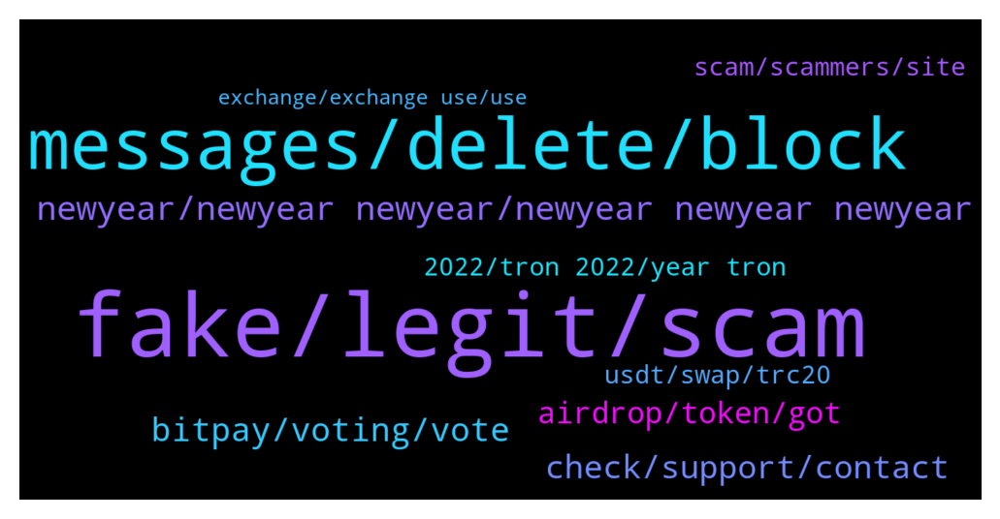

# **@tronnetworkEN**
 ## Analysis for **2021-12-31** - **2022-01-01**.

---

## 📊 **Basic Stats**

**n_messages_sent**: 212

---

---

## 🔝 **Top keywords and related messages**

1. **fake, legit, scam**

    @Arjung15 --- *Tron nz problem, anybody know about it* **--->** [TG Discussion](https://t.me/tronnetworkEN/3801539)

    @Xieon1 --- *I know both of that. What threw me is that official website lists the TRN token ID as their official ID and their pancake swap for that chain.   I don't think it's a fake token like the others, maybe a slick way to drive up hype, but a ton of users will eventually come to them and say hey you said token #xxxx is official on Tron...whats going on.   I'll update you as I contacted them* **--->** [TG Discussion](https://t.me/tronnetworkEN/3802293)

    @Gasperinix --- *I tried but my post was deleted ... I got a link about tron and I wanted to know if it is legit* **--->** [TG Discussion](https://t.me/tronnetworkEN/3802664)

    @agentpiki --- *Did you know:  There are fake XRPs, fake ADAs, fake SHIBs, fake DOGEs   most of which in TRC10 form.   BSC and TRC are not interchangeable* **--->** [TG Discussion](https://t.me/tronnetworkEN/3802287)

    @Namala999 --- *I am unable to  with draw  daily tron-life coins... 208 tron in my account but daily limit 0.18 showing.... Can please explain any one* **--->** [TG Discussion](https://t.me/tronnetworkEN/3802711)

    @Arjung15 --- *Can u pls suggest any legit app* **--->** [TG Discussion](https://t.me/tronnetworkEN/3799846)

2. **messages, delete, block**

    @lastbro3 --- *what's with the admins here? why did you click me? can i not have an opinion?* **--->** [TG Discussion](https://t.me/tronnetworkEN/3802051)

    @遠山 --- *I wouldn't need to ask here if I knew* **--->** [TG Discussion](https://t.me/tronnetworkEN/3800338)

    @agentpiki --- *What you should do:  1. Forward their messages to me 2. Forward their messages to @notoscam  Let me be the one to ban them. Swift action 👍* **--->** [TG Discussion](https://t.me/tronnetworkEN/3802597)

    @遠山 --- *I already asked and no one answered* **--->** [TG Discussion](https://t.me/tronnetworkEN/3800342)

    @Carlos_TRX --- *Adk whst u need here pls* **--->** [TG Discussion](https://t.me/tronnetworkEN/3802635)

    @Donsine --- *That what they did to me to take my phrase when I ask a question here bro* **--->** [TG Discussion](https://t.me/tronnetworkEN/3801523)

3. **newyear, newyear newyear, newyear newyear newyear**

    @joem123tel --- *@MilNoslen @agentpiki and all people who i know i wish you Happy New Year in advance. Make it happy and full of bliss so you enjoy in quality forever becouse what you bound here you will have eternally...love you guys.💖😁* **--->** [TG Discussion](https://t.me/tronnetworkEN/3800613)

    @Jadaasva --- *Hi everyone :) Happy New Year* **--->** [TG Discussion](https://t.me/tronnetworkEN/3802665)

    @Elia724 --- *Hello, Happy New Year everyone! 🎉🪅🎊🙆‍♀️* **--->** [TG Discussion](https://t.me/tronnetworkEN/3801842)

    @xPommepote --- *This is great for us all !* **--->** [TG Discussion](https://t.me/tronnetworkEN/3800837)

    @AnaSs --- *Happy new year to you ❤️❤️❤️❤️❤️* **--->** [TG Discussion](https://t.me/tronnetworkEN/3801652)

    @blacksheepbsc --- *Happy new year 🥳 from @blacksheepcoin* **--->** [TG Discussion](https://t.me/tronnetworkEN/3802360)

4. **bitpay, voting, vote**

    @agentpiki --- *Don't lie. The voting is over* **--->** [TG Discussion](https://t.me/tronnetworkEN/3801005)

    @Supermr2 --- *How long after we win bitpay contest will it take to be implemented?* **--->** [TG Discussion](https://t.me/tronnetworkEN/3799928)

    @Nobupalasar --- *So when do you think BitPay will announce ?* **--->** [TG Discussion](https://t.me/tronnetworkEN/3802107)

    @simon866 --- *📢 2 hours left until the winner is decided for listing on the Bitpay wallet, we are ahead at 45% well done everyone for voting 👊👊👊  https://twitter.com/bitpay/status/1458977852230180868?s=21* **--->** [TG Discussion](https://t.me/tronnetworkEN/3800752)

    @musa_mareer --- *When will it be in use in platforms?* **--->** [TG Discussion](https://t.me/tronnetworkEN/3800703)

    @avcsabri --- *If I start the legal process, will it be positive for me?* **--->** [TG Discussion](https://t.me/tronnetworkEN/3799785)

5. **check, support, contact**

    @GajendraMahesh --- *I am withdrawing 473 trx on binance to Lbank, transfer is successful but I don't recived on lbank and i am also check on tronscan network what is issue* **--->** [TG Discussion](https://t.me/tronnetworkEN/3802358)

    @my --- *unstake is disable in my wallet* **--->** [TG Discussion](https://t.me/tronnetworkEN/3802847)

    @rashidasari --- *Dear Sir why I'm not withdrawal my tron?* **--->** [TG Discussion](https://t.me/tronnetworkEN/3801868)

    @avcsabri --- *yes, the transaction cannot be undone, but since it is done in the same network, I want to know if they can do a manual transaction and return it.  so is this technically possible* **--->** [TG Discussion](https://t.me/tronnetworkEN/3799759)

    @Hiffeh --- *It's not in my wallet o...I couldn't withdraw* **--->** [TG Discussion](https://t.me/tronnetworkEN/3801745)

    @Unknownpkayer --- *Thank u admin, I had an unauthorized withdrawal from my account , pls can you look into it for me* **--->** [TG Discussion](https://t.me/tronnetworkEN/3802070)

6. **airdrop, token, got**

    @Eyoh --- *Is there any airdrop going on today on TRON* **--->** [TG Discussion](https://t.me/tronnetworkEN/3800700)

    @Xieon1 --- *It says it's worth quite a bit but theres no way to do anything with it? I got it airdroped for staking a while back?* **--->** [TG Discussion](https://t.me/tronnetworkEN/3802246)

    @Xieon1 --- *Yes, I know, I don't know if you know much about PAL, but it's actually a legit project, traded on BSC, and it's out of India.   I got airdropped the tokens worthless in August, then last month they became worth a lot, according to safepal still are.   Not sure what the end game was? Tokens you can't sell and didn't buy? Very strange to me.  But not going to beat a dead horse, thanks for talking 2 me about it* **--->** [TG Discussion](https://t.me/tronnetworkEN/3802280)

    @Hiffeh --- *Pls I have not gotten the token..why* **--->** [TG Discussion](https://t.me/tronnetworkEN/3801813)

    @Xieon1 --- *Hey guys, is there anything I can do with the TRC10 PAL Token?* **--->** [TG Discussion](https://t.me/tronnetworkEN/3802242)

    @Gasperinix --- *The message said there was kind of airdrop* **--->** [TG Discussion](https://t.me/tronnetworkEN/3802669)

7. **scam, scammers, site**

    @Xieon1 --- *So frustrating. I can't stand what scammers to do the hard working people of these communities.   I didn't lose anything, but still its frustrating.* **--->** [TG Discussion](https://t.me/tronnetworkEN/3802276)

    @Gasperinix --- *OMG I ask Carlo’s help and wtf 10 scammers in a second* **--->** [TG Discussion](https://t.me/tronnetworkEN/3802595)

    @Xieon1 --- *All of the chains need to increase the cost to pull these scams. BSC Is so cheap I have like trillions of scam tokens.   Dont get those on ETH anymore because of the gas fee to pull scam.   Wish there was some way to deal with all these scams and crap.   I've lost a lot of money, learned a lot, but still, I hate to see honest people get robbed* **--->** [TG Discussion](https://t.me/tronnetworkEN/3802300)

    @simon866 --- *Nothing to do with us mate and also it's a complete scam* **--->** [TG Discussion](https://t.me/tronnetworkEN/3802836)

    @simon866 --- *Be careful as some are scam tokens that link you to their site in order to drain your account   Best to ignore them* **--->** [TG Discussion](https://t.me/tronnetworkEN/3802421)

    @agentpiki --- *Because you might be scammed in scam site that's what* **--->** [TG Discussion](https://t.me/tronnetworkEN/3801814)

8. **2022, tron 2022, year tron**

    @agentpiki --- *2022 and still give ghost followers* **--->** [TG Discussion](https://t.me/tronnetworkEN/3801957)

    @musa_mareer --- *Shasta Tron  When will it be ready  ?* **--->** [TG Discussion](https://t.me/tronnetworkEN/3800697)

    @skyeyes83 --- *Good year to all Tron Community!* **--->** [TG Discussion](https://t.me/tronnetworkEN/3801611)

    @Rocky --- *Hello guys will this year be tron, s* **--->** [TG Discussion](https://t.me/tronnetworkEN/3802082)

    @lastbro3 --- *we'll see, hopefully, tron ​​2022 will grow* **--->** [TG Discussion](https://t.me/tronnetworkEN/3801196)

    @lastbro3 --- *tron is also not stable huh, hopefully 2022 he gives hope to the holder* **--->** [TG Discussion](https://t.me/tronnetworkEN/3801161)

9. **usdt, swap, trc20**

    @... --- *Hello, why can't I convert or exchange PLAYANDLIKE TRX10 digital currency in tron ​​link pro wallet? Please help me* **--->** [TG Discussion](https://t.me/tronnetworkEN/3802778)

    @遠山 --- *I have a USDT in my Coinbase* **--->** [TG Discussion](https://t.me/tronnetworkEN/3800204)

    @Carlos_TRX --- *i know but I prefer not to sell the bear skin before hunting it* **--->** [TG Discussion](https://t.me/tronnetworkEN/3799933)

    @thebigguns --- *Wait up, you’re not selling bear skin futures? I was hoping to buy some...* **--->** [TG Discussion](https://t.me/tronnetworkEN/3799989)

    @simon866 --- *Unfortunately it's their exchange so they have control   Also another reason to use dex in the future such as sun swap https://sunswap.com/#/home* **--->** [TG Discussion](https://t.me/tronnetworkEN/3799779)

    @agentpiki --- *Yes. Investors can swap now in sunswap.com* **--->** [TG Discussion](https://t.me/tronnetworkEN/3802263)

10. **exchange, exchange use, use**

    @agentpiki --- *We are not your financial advisor.  You asking exchange for US now mexico? Why not china* **--->** [TG Discussion](https://t.me/tronnetworkEN/3800310)

    @遠山 --- *What exchange should I use in Mexico？* **--->** [TG Discussion](https://t.me/tronnetworkEN/3800286)

    @遠山 --- *So which exchange should I use in the United States* **--->** [TG Discussion](https://t.me/tronnetworkEN/3800214)

    @遠山 --- *What exchange should I use in California？* **--->** [TG Discussion](https://t.me/tronnetworkEN/3800197)

    @xPommepote --- *Maybe parubu exchange can because they own the wallet.* **--->** [TG Discussion](https://t.me/tronnetworkEN/3799762)

    @遠山 --- *I'm going to sign up for another exchange?* **--->** [TG Discussion](https://t.me/tronnetworkEN/3800211)

