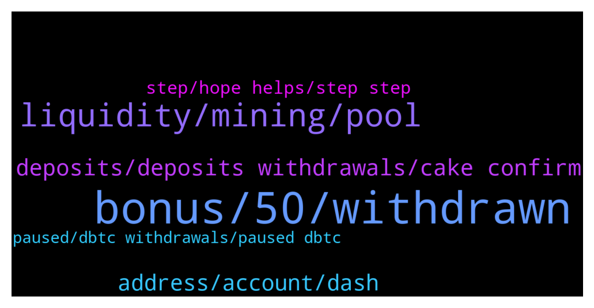

# **@CakeDeFi_EN**
 ## Analysis for **2022-01-01** - **2022-01-02**.

---

## 📊 **Basic Stats**

**n_messages_sent**: 184

---

---

## 🔝 **Top keywords and related messages**

1. **bonus, 50, withdrawn**

    @KBerger --- *Thats not true. Every of my withdrawels needed more than 24 hours. Maybe they are to big to do it automatic. But it sucks anyway. Should be good if i can decide to set up my security Level lower to have faster payout* **--->** [TG Discussion](https://t.me/CakeDeFi_EN/159196)

    @Alex --- *Are noraml BTC (non-wrapped) withdraws being processed? I submitted one ~24 hours ago and it's still in process. Normally takes minutes.* **--->** [TG Discussion](https://t.me/CakeDeFi_EN/159014)

    @Kassius84 --- *I can understand that well 😂😃  But be patient, most withdrawals are processed in under 60 minutes.  Only very few need the maximum time of 72 hours.* **--->** [TG Discussion](https://t.me/CakeDeFi_EN/159192)

    @TimescapeHD --- *Most dfi withdrawls within 1 hour. If you withdraw anything else outside of the dfi system (e.g. cex). Expect delays of 24hours+. Can be up to 72hours which is considered “fast” by cake. 🤦🏻‍♂️* **--->** [TG Discussion](https://t.me/CakeDeFi_EN/159193)

    @AIex_78 --- *How long will it take and whats the reason for? Did withdraw, got no message like this here and now Stuck half/half. Oben of the pair still in my wallet, other Part Pending* **--->** [TG Discussion](https://t.me/CakeDeFi_EN/159051)

    @Alex --- *@DmgBautista - Above, Michael said BTC withdraws *are* working normally. Can someone confirm which is accurate?* **--->** [TG Discussion](https://t.me/CakeDeFi_EN/159097)

2. **liquidity, mining, pool**

    @Albert --- *I could not wrap my mind around the risk of LM. What will happen for LM dbtc-dfi if BTC goes to 60,000usd but dfi drop to 1.5, similar what will happen if BTC drop to 30k, and dfi goes to 30 USD? How will the LM be affected?* **--->** [TG Discussion](https://t.me/CakeDeFi_EN/158725)

    @Jan-Niklas --- *When can we change dfi to BTC?* **--->** [TG Discussion](https://t.me/CakeDeFi_EN/158999)

    @jiayingo --- *would like to know more about this as well, trying to learn what's the catch with the high yield on LM* **--->** [TG Discussion](https://t.me/CakeDeFi_EN/158738)

    @J --- *Further, if you’re you’re referring to staking the price of DFI is variable.* **--->** [TG Discussion](https://t.me/CakeDeFi_EN/158965)

    @jumbolin --- *Morning, can someone explain to me please why the value of the investment dropped after investing into mining. Obviously converting from fiat currency to DFI and then investing in mining. Thanx* **--->** [TG Discussion](https://t.me/CakeDeFi_EN/158955)

    @TruuMax --- *Well... I like to see it like: More transactions - more traffic.  Maybe I'm wrong but... its not a bad sign for the dfi prices.* **--->** [TG Discussion](https://t.me/CakeDeFi_EN/159208)

3. **deposits, deposits withdrawals, cake confirm**

    @enalettin --- *Maybe this is not the best time to reiterate my past criticism but it is better for the future of cake to make the withdrawals fast, easy and seamless however much cake insists that it is not a cex both withdrawal and deposit timings very important for customers.* **--->** [TG Discussion](https://t.me/CakeDeFi_EN/159066)

    @TruuMax --- *I think cake is already pretty much aware about the slow transactions in some cases.  This topic comes up day by day.* **--->** [TG Discussion](https://t.me/CakeDeFi_EN/159202)

    @MaveJ --- *This is really a mess. One issue and you are completely stuck and can do nothing. The wrapped coins can‘t be transferred anywhere other than to cake who don‘t want to take them currently. So you can do really nothing?* **--->** [TG Discussion](https://t.me/CakeDeFi_EN/159020)

    @DmgBautista --- *As per the announcement, deposits and withdrawals are at the moment stopped until further notice from defichain. A deposit from this at Cake configures an unwrapping event, so its also not available at the moment* **--->** [TG Discussion](https://t.me/CakeDeFi_EN/159086)

    @MaveJ --- *This is hilirious. When will cake enable deposits and withdrawals again? Is there any other chance to swap dbtc to btc?* **--->** [TG Discussion](https://t.me/CakeDeFi_EN/159075)

    @Alex --- *Are BCH, ETH and DOGE withdrawals enabled from Cake? The announcement ignores them, so I'm assuming that's a yes..?* **--->** [TG Discussion](https://t.me/CakeDeFi_EN/159110)

4. **address, account, dash**

    @MaveJ --- *Could someone have hacked your account? Receiving strange messages from with your handle* **--->** [TG Discussion](https://t.me/CakeDeFi_EN/159007)

    @zxcvz3 --- *When I search with a dash scan, there is no such transaction in the block, and the withdrawal request is not seen.* **--->** [TG Discussion](https://t.me/CakeDeFi_EN/159184)

    @ankit --- *I upload proof of address document plz resolve my issue* **--->** [TG Discussion](https://t.me/CakeDeFi_EN/158758)

    @Michael_Schredl --- *No, that is not my account, that is a fake account* **--->** [TG Discussion](https://t.me/CakeDeFi_EN/159008)

    @Eddie_Leow --- *i did not receive any additional tokens.* **--->** [TG Discussion](https://t.me/CakeDeFi_EN/158807)

    @Investor_1983 --- *We need a little more help from you to get your account ready. Your identity verification was rejected for the following reasons. Please enter your expiry date exactly as it is written in your identity document. (1) Please Remove Alias Name. Kindly re-upload the correct necessary documents in your profile.* **--->** [TG Discussion](https://t.me/CakeDeFi_EN/159136)

5. **step, hope helps, step step**

    @moneydelics --- *Hey, Priya! I made a step by step tutorial for Cake DeFi new users. Hope it helps 😊  https://m.youtube.com/watch?v=D_98N4jx0fo&feature=youtu.be* **--->** [TG Discussion](https://t.me/CakeDeFi_EN/159145)

    @enalettin --- *we already know such a platform it is LP lm staking dfi on cake thanks for your kindness* **--->** [TG Discussion](https://t.me/CakeDeFi_EN/158646)

    @justintew --- *https://www.youtube.com/watch?v=dVJzcFDo498 Try this video! It has pretty clear and easy to understand explanations. Hope it helps* **--->** [TG Discussion](https://t.me/CakeDeFi_EN/158741)

    @Serhat --- *https://app.cakedefi.com/learn I just completed this crypto Learn & Earn course on Cake DeFi and earned $5 in crypto for free! Try it out with this link.* **--->** [TG Discussion](https://t.me/CakeDeFi_EN/158732)

    @moneydelics --- *Can find one here, with Cake step by step tutorial 😄   https://m.youtube.com/watch?v=D_98N4jx0fo&feature=youtu.be* **--->** [TG Discussion](https://t.me/CakeDeFi_EN/159164)

    @enalettin --- *Thanks for your efforts as well, I support cake and dfi protocols* **--->** [TG Discussion](https://t.me/CakeDeFi_EN/159069)

6. **paused, dbtc withdrawals, paused dbtc**

    @Kangoroooo2000 --- *Thats strange. I thought all dbtc transfers were paused* **--->** [TG Discussion](https://t.me/CakeDeFi_EN/158990)

    @MaveJ --- *But my dBtC transaction was confirmed by cake and the pinned announcement confirms that only DFI are paused* **--->** [TG Discussion](https://t.me/CakeDeFi_EN/158987)

    @DmgBautista --- *The announcement is referred about the defichain network, therefore the mention to dBTC. Withdrawing to defichain will involve the wrap into dBTC, as well as a deposit into Cake from this will be in the form of dBTC, beijng this unwrapped.* **--->** [TG Discussion](https://t.me/CakeDeFi_EN/159111)

    @Alex --- *My question was in response to the announcement posted here. I think it could be clarified more as it causes a lot of confusion that it states "dBTC withdrawals", which does not imply BTC withdrawals. Also, are other types of withdrawas stopped (BCH, ETH, etc)?* **--->** [TG Discussion](https://t.me/CakeDeFi_EN/159103)

    @Alex --- *When you say dBTC withdrawals, does that mean unwrapping or just dBTC transfers on DFI chain?* **--->** [TG Discussion](https://t.me/CakeDeFi_EN/159083)

    @MaveJ --- *Holy shit. dBTC is heavily dumping in DEX. All my dBTC are losing severe value* **--->** [TG Discussion](https://t.me/CakeDeFi_EN/159081)

