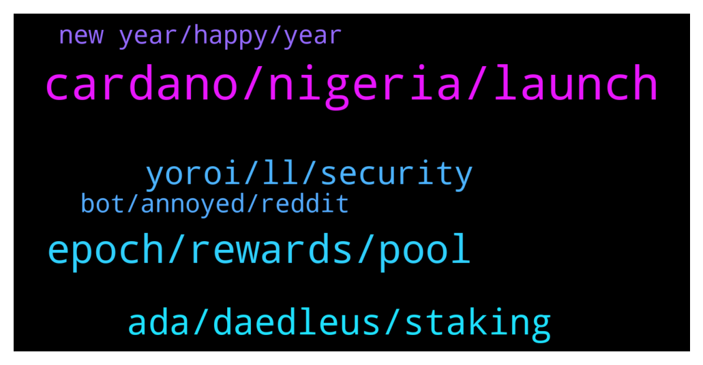

# **@Cardano**
 ## Analysis for **2022-01-01** - **2022-01-02**.

---

## 📊 **Basic Stats**

**n_messages_sent**: 116

---

---

## 🔝 **Top keywords and related messages**

1. **cardano, nigeria, launch**

    @Greg --- *Hey guy's just watched Alexander Lorenzo latest video on YouTube. There was a lot of FUD on cardano any opinions if anybody has watched the video?* **--->** [TG Discussion](https://t.me/Cardano/764532)

    @mensrea --- *For real? As architect of Cardano's main implementation it's a bit weird to not hear anything from the guy at all, even by proxy, especially in this time when we're talking about scaling limitations* **--->** [TG Discussion](https://t.me/Cardano/764788)

    @Isaac --- *Any one know of upcoming airdrops on cardano?* **--->** [TG Discussion](https://t.me/Cardano/764275)

    @Greg --- *I also know about vyfi going live in about two weeks maybe sooner.* **--->** [TG Discussion](https://t.me/Cardano/764542)

    @apex_pool_spo --- *each defi project will launch when the team is ready to launch, I assume. it seems a few will launch at the end of January.* **--->** [TG Discussion](https://t.me/Cardano/764437)

    @Block101 --- *The features look cool on Maladex, its whether or not the team delivers. The roadmap doesn't even have dates.  + I don't invest in projects without seeing who's building it.* **--->** [TG Discussion](https://t.me/Cardano/764623)

2. **epoch, rewards, pool**

    @apex_pool_spo --- *yes, because rewards for Epoch 311 will be payed when Epoch 313 starts.* **--->** [TG Discussion](https://t.me/Cardano/764403)

    @apex_pool_spo --- *if you delegated during Epoch 309, you start earning rewards from the Epoch 311.* **--->** [TG Discussion](https://t.me/Cardano/764405)

    @Lgbeano --- *Your wallet is staked, not the ₳ inside, so you can use your ₳ whenever you want.   Simply select a pool to delegate to, which registers your wallets staking key.   When staking, your ₳ is never locked up, it's pretty much like not delegating, you are free to do what you want with your ₳. Any ₳ added to the wallet is auto staked, including your rewards. Your ₳ never leaves your wallet.   When you initially delegate to a pool it costs a transaction fee which is 0.17 ₳ and takes 2 ₳ as a deposit. That 2 ₳ you get back (minus the transaction fee) if you ever un delegate.   When delegating to a pool it takes 15 - 20 days for you to start seeing rewards, then it's every 5 days. Epochs are 5 days.   The reason it takes 15 - 20 days to get your first reward is because the first epoch doesn't count, it doesn't matter where you delegate within that epoch (5 days). Once the epoch finishes, snapshots are taken of ₳ within pools.   - 1st epoch, your ₳ is not included   - 2nd epoch your ₳ is ready to be included  - 3rd epoch your ₳ is included and earning rewards.   - End of 4th epoch you receive rewards for 3rd epoch.   When you receive rewards they are an epoch behind.  If you remove all your ₳ but keep your wallet delegated (do not de register), you will continue receiving rewards for three epochs before the rewards drop to match the ₳ in your wallet.   Same as if you add more ₳, it will take 3 epochs before you notice a difference in rewards.   If you want to move pools, you do not need to un delegate first, just select the pool you want to move to. You will continue to receive rewards from your old pool for three epochs (as long as it creates blocks) before you start receiving rewards from your new pool.   Your ₳ is never at risk, nor does it leave the wallet, you can not lose any ₳. If the pool you delegate to is shut down or doesn't get any blocks for what ever reason, the worst that happens is you wont receive any rewards. But you never lose your ₳.   This video is really good at explaining what staking is  https://youtu.be/Cs_stEnEvpg* **--->** [TG Discussion](https://t.me/Cardano/764564)

    @apex_pool_spo --- *when you redelegate to another pool, you will start earning rewards from the new pool after 3 full epochs (after the epoch when you redelegated). until then, you will earn rewards from the old stake pool. for example, if you redelegated  during Epoch 311 (which ended about 12 hours ago), you will see the first rewards from the new stake pool at the beginning of Epoch 315.* **--->** [TG Discussion](https://t.me/Cardano/764393)

    @rdalio321 --- *I had done the re-delegation about 3 epochs ago, where can I check the date of the delegation?* **--->** [TG Discussion](https://t.me/Cardano/764395)

    @rdalio321 --- *Ok I see, and then E311 rewards are not paid until E313 so have to wait 2 more epochs to see them...think I got it* **--->** [TG Discussion](https://t.me/Cardano/764408)

3. **ada, daedleus, staking**

    @sul4x --- *Is there a calculator which shows how much ADA you would get by delegating to a specific validator?* **--->** [TG Discussion](https://t.me/Cardano/764769)

    @Cat --- *Hey everyone! I’m new here. Just about to start staking some ADA. I found some news regarding Ledger. Can someone tell me if this applies to Daedleus wallet too? (I’ve pair my ledger with Daedleus) https://support.ledger.com/hc/en-us/articles/360020669680-U2F-API-deprecation* **--->** [TG Discussion](https://t.me/Cardano/764259)

    @apex_pool_spo --- *only if you use a wallet with the "Accounts" feature and split your ADA between the different accounts, and delegate each account to one stake pool.* **--->** [TG Discussion](https://t.me/Cardano/764435)

    @apex_pool_spo --- *yes, you can take a look. I like them a lot more. they also have the multi-account feature, you can have multiple accounts staked to different stake pools with only one wallet. I prefer ccvault.io. both are community wallets.* **--->** [TG Discussion](https://t.me/Cardano/764418)

    @Lord_Hermes6 --- *can i delegate my ada for 3 project with 1 wallet?* **--->** [TG Discussion](https://t.me/Cardano/764434)

    @sul4x --- *I delegated to it but I think I got fairly few ADA.* **--->** [TG Discussion](https://t.me/Cardano/764779)

4. **yoroi, ll, security**

    @Giovanni --- *I have a question about wallets in general but in particular Yoroi. What would happen if Chrome no longer exists in 10 years? How will I retrieve my wallet? Ok, it's absurd that it happens, but what if it happens?* **--->** [TG Discussion](https://t.me/Cardano/764509)

    @rdalio321 --- *Sorry...silly question, the security it actually with Ledger as private keys inside the hardware device* **--->** [TG Discussion](https://t.me/Cardano/764424)

    @apex_pool_spo --- *you might want to take a look at ccvault.io and typhonwallet.io, too, for your Ledger.* **--->** [TG Discussion](https://t.me/Cardano/764414)

    @Tonyno456 --- *If I'm not mistaken you don't see the asset tab until you receive at least one asset in the wallet* **--->** [TG Discussion](https://t.me/Cardano/764522)

    @rdalio321 --- *Thanks George, that is awesome. Much appreciate that feedback I'll take a look at ccvault.io - what about security...as strong as Yoroi?* **--->** [TG Discussion](https://t.me/Cardano/764422)

    @sul4x --- *Is this the original yoroi wallet?: https://yoroi-wallet.com* **--->** [TG Discussion](https://t.me/Cardano/764748)

5. **new year, happy, year**

    @Dontlookatmeairlines --- *wen pab? wen cip's? happy new year!* **--->** [TG Discussion](https://t.me/Cardano/764635)

    @Cat --- *Wow, thank you so much! Super good information and communication! Very much appreciated and I am forever grateful for your help!! Keep up the good work and Happy New Year!!* **--->** [TG Discussion](https://t.me/Cardano/764570)

    @Madison --- *Hey here! A beautiful weekend to all. Glad to see how we have improved in here to be very productive honestly glad to stack every dip* **--->** [TG Discussion](https://t.me/Cardano/764513)

    @final6j --- *Happy new year to all!!!  2022🚀🚀🚀🪙🪙🪙* **--->** [TG Discussion](https://t.me/Cardano/764357)

    @LexMatt5 --- *Have a Happy & Very Prosperous New Year folks!* **--->** [TG Discussion](https://t.me/Cardano/764349)

    @Vo Huu --- *Hi everyone, happy new year 🎆* **--->** [TG Discussion](https://t.me/Cardano/764656)

6. **bot, annoyed, reddit**

    @apex_pool_spo --- *I tried to write its name, but the message was deleted by the bot.* **--->** [TG Discussion](https://t.me/Cardano/764754)

    @apex_pool_spo --- *and you already show you know how it works by saying that 👍* **--->** [TG Discussion](https://t.me/Cardano/764427)

    @rdalio321 --- *Yah I read a lot on Reddit...but not too much because they get it wrong sometimes too...hahah* **--->** [TG Discussion](https://t.me/Cardano/764428)

    @Tonyno456 --- *Mmmmh, the bot for annoyed. Dripdropz my friend, Google it* **--->** [TG Discussion](https://t.me/Cardano/764285)

    @Rabbitholepools --- *🥰funny how the bot seems to be a bit biased. Would you mind posting it in your channel, please?* **--->** [TG Discussion](https://t.me/Cardano/764756)

    @glitch04 --- *Yes that and all others like it are scams* **--->** [TG Discussion](https://t.me/Cardano/764673)

