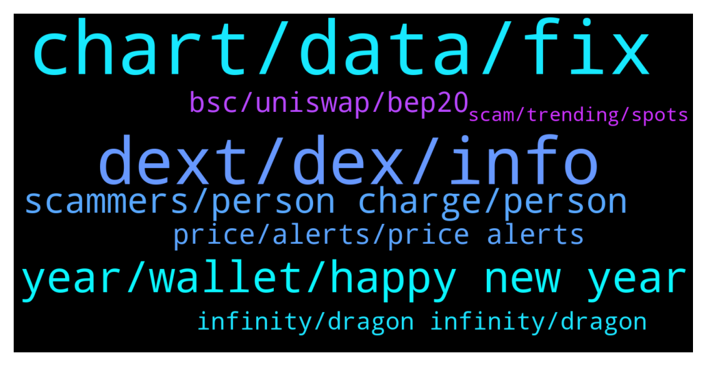

# **@DEXToolsCommunity**
 ## Analysis for **2021-12-31** - **2022-01-02**.

---

## 📊 **Basic Stats**

**n_messages_sent**: 282

---

---

## 🔝 **Top keywords and related messages**

1. **chart, data, fix**

    @Mojomagick --- *Please can you fix or tell me what the issue is:  The chart for AVT a few times wicks have been removed after a few days. This has happened on several different occassions for a few weeks.  For example yesterday  Price went to $1.82 But today that price was removed from the chart. Even though 2 transactions at that price are still on the transaction log under the chart.  https://www.dextools.io/app/ether/pair-explorer/0xcdff6ddfc9e4807c9927fd58708c2ef3484cc305  @napascual* **--->** [TG Discussion](https://t.me/DEXToolsCommunity/321028)

    @napascual --- *Nothing to fix there. A candle normalization has already been done, those candles just cannot be avoided. That's just blockchain data. You can still stretch the candles to display the chart dates you're interested in.* **--->** [TG Discussion](https://t.me/DEXToolsCommunity/320928)

    @wealthyhobo --- *Fix the chart for ANTIS Inu, someone added liquidity before the launch date to sabotage it, and we need that resolved ASAP.* **--->** [TG Discussion](https://t.me/DEXToolsCommunity/320916)

    @Reza --- *Please look at the full chart... There is a big red candle that occurred prior to launching. It's inaccurate and misleading. Please take appropriate action, as this can be detrimental.* **--->** [TG Discussion](https://t.me/DEXToolsCommunity/321044)

    @gumbercules --- *As stated...no action can be taken. That's the data that's been picked up from when the token was launched* **--->** [TG Discussion](https://t.me/DEXToolsCommunity/321045)

    @wealthyhobo --- *If you zoom out of the chart you will see a massive red candle way before that current chart. The first green candle you see is the actual day the project was launched* **--->** [TG Discussion](https://t.me/DEXToolsCommunity/320931)

2. **dext, dex, info**

    @JoeyDieleman --- *Yeah thats sad, the whole purpose of DexTools if to give you info to not fall for scams, only buys, low score no public contract should give people red flags, of course even then dextools can never be 100% accurate, there will always be a fight between detecting scams and scammers comming up with new things. Please use dextools as intended and always do extra research on top of that. See the socials and check those too (and don'y fall for bots saying all the time the project is awesome and 100x is the only way). But for the tokens you gave, Dextools is pretty clear.* **--->** [TG Discussion](https://t.me/DEXToolsCommunity/321274)

    @RhoToken --- *Hello, how do I add new info (e.g. website, telegram links) to a new token on dextools? Thanks.* **--->** [TG Discussion](https://t.me/DEXToolsCommunity/320856)

    @gumbercules --- *DeXTools doesn't list tokens but I will forward to @napascual* **--->** [TG Discussion](https://t.me/DEXToolsCommunity/321030)

    @LIRItheBobm --- *How can i subscribe on dextool ??? I have dex on my wallet that i connect.* **--->** [TG Discussion](https://t.me/DEXToolsCommunity/320496)

    @masterFrogda --- *there was an incident a few days ago with dextools, so that's why I was wondering...* **--->** [TG Discussion](https://t.me/DEXToolsCommunity/320606)

    @Firepoke --- *Why don't you create your own dex, maybe something like sushiswap operating on your platform but your own* **--->** [TG Discussion](https://t.me/DEXToolsCommunity/321177)

3. **year, wallet, happy new year**

    @stanes --- *It's currently 10 o'clock on January 1st in Spain 😅 but be sure devs will take care of it as soon as they can. Just give them couple hours should be fine.* **--->** [TG Discussion](https://t.me/DEXToolsCommunity/320799)

    @gumbercules --- *Not going to say it again sir. Devs have answered you* **--->** [TG Discussion](https://t.me/DEXToolsCommunity/321100)

    @AJ --- *any ETAs please so that I can remind you after that again !* **--->** [TG Discussion](https://t.me/DEXToolsCommunity/320797)

    @napascual --- *There's never been a problem connecting your wallet* **--->** [TG Discussion](https://t.me/DEXToolsCommunity/320603)

    @amorris11 --- *https://www.dextools.io/#choose your plan you can also see it here. Please note no admin will dm you asking to connect wallet to verify* **--->** [TG Discussion](https://t.me/DEXToolsCommunity/320749)

    @onebaldegg --- *ADMINS, what is the APE BOARD link that shows up next to the wallet address on the wallet info tab? is this a safe site you have linked?* **--->** [TG Discussion](https://t.me/DEXToolsCommunity/320517)

4. **scammers, person charge, person**

    @stanes --- *Please DM @guillermorodriguez78 he is the person-in-charge.  Be aware of scammers, HE WILL NEVER DM YOU FIRST.* **--->** [TG Discussion](https://t.me/DEXToolsCommunity/320548)

    @napascual --- *You can check the badges. Admins never DM first* **--->** [TG Discussion](https://t.me/DEXToolsCommunity/320270)

    @stanes --- *You have to DM @guillermorodriguez78 he is the person-in-charge. He will give you all the informations and assist you in the process. And ofc don't trust anybody DMing you first.* **--->** [TG Discussion](https://t.me/DEXToolsCommunity/321286)

    @dazedcrypto --- *Hey! im getting hundreds of messages from scammers telling me they can list me on your site* **--->** [TG Discussion](https://t.me/DEXToolsCommunity/321284)

    @sirsirmoon --- *He is using your name to scam people* **--->** [TG Discussion](https://t.me/DEXToolsCommunity/320100)

    @stanes --- *If no official announcement from CG with this contract address, then scam.* **--->** [TG Discussion](https://t.me/DEXToolsCommunity/320178)

5. **price, alerts, price alerts**

    @stanes --- *Yes you can set price alerts. Standard users can even get alerts on TG and email. Indeed devs are working on a native mobile app.* **--->** [TG Discussion](https://t.me/DEXToolsCommunity/321150)

    @gumbercules --- *yes there's price alerts on DEXTools* **--->** [TG Discussion](https://t.me/DEXToolsCommunity/321063)

    @elialearn --- *does dextools have api to get price of token (will add a backlink on dapp)* **--->** [TG Discussion](https://t.me/DEXToolsCommunity/320378)

    @spfr236 --- *can u make setting alarm for a price availible? is that possible from a browser? do u have any plan for an app?* **--->** [TG Discussion](https://t.me/DEXToolsCommunity/321148)

    @DogecointotheMoon --- *sorry to repeat, but is it possible to receive % cahnge price alerts on dextools?* **--->** [TG Discussion](https://t.me/DEXToolsCommunity/321060)

    @stanes --- *Free users can only set alerts for ETH pairs.* **--->** [TG Discussion](https://t.me/DEXToolsCommunity/321152)

6. **bsc, uniswap, bep20**

    @napascual --- *i.e. Pancakeswap (BSC exchange with bep20 token support) uses Uniswap v2 base protocols* **--->** [TG Discussion](https://t.me/DEXToolsCommunity/320478)

    @bastardganpunk --- *this is the bsc link to the tokenpair https://www.dextools.io/app/bsc/pair-explorer/0x4b729d5d871057f3a9c424792729217cde72410d* **--->** [TG Discussion](https://t.me/DEXToolsCommunity/320893)

    @MarkusLangebraun --- *like for example 1 Shibaswap 2 Uniswap* **--->** [TG Discussion](https://t.me/DEXToolsCommunity/321213)

    @CliffordGrows --- *Is it different for BEP20 tokens?  Thanks!* **--->** [TG Discussion](https://t.me/DEXToolsCommunity/320477)

    @napascual --- *Follow Uniswap docs, you can Google that* **--->** [TG Discussion](https://t.me/DEXToolsCommunity/320475)

    @gooood9baby --- *Excuse me, where can I get the data of sandwich attack on different chains, except ETH BSC SOL* **--->** [TG Discussion](https://t.me/DEXToolsCommunity/320211)

7. **infinity, dragon infinity, dragon**

    @wllindless --- *I'm anxious i want to advertise* **--->** [TG Discussion](https://t.me/DEXToolsCommunity/320554)

    @dazedcrypto --- *how does your advertising work ?* **--->** [TG Discussion](https://t.me/DEXToolsCommunity/321285)

    @cyK3r --- *Hi, I have a question. We launched Dragon Infinity 2 months ago and we had an issue, as we did it again under Dragon Infinity v2.. and we had an issue again. We will launch on Monday once again. My question is, can we hide the other two from Dex so it doesn't show anymore? We want to use Dragon Infinity as name.. On poocoin it works after a while, but on dex, it still shows. And we don't want our investors to look or buy the wrong token.* **--->** [TG Discussion](https://t.me/DEXToolsCommunity/320320)

    @airdreher --- *@guillermorodriguez78 is who i dm regarding banner ads ? etc* **--->** [TG Discussion](https://t.me/DEXToolsCommunity/320910)

    @stanes --- *Contact Guillermo, he is the only one in charge of advertising.* **--->** [TG Discussion](https://t.me/DEXToolsCommunity/320555)

    @Ercx --- *Who can I find for business cooperation?* **--->** [TG Discussion](https://t.me/DEXToolsCommunity/320341)

