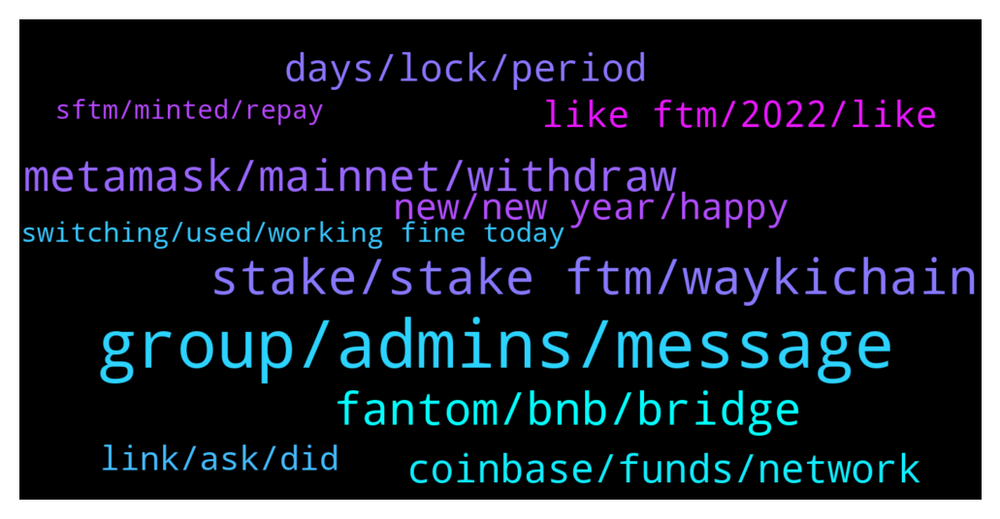

# **@Fantom_English**
 ## Analysis for **2022-01-01** - **2022-01-02**.

---

## 📊 **Basic Stats**

**n_messages_sent**: 298

---

---

## 🔝 **Top keywords and related messages**

1. **group, admins, message**

    @dstemidire --- *Don't admins respond on this group or something...* **--->** [TG Discussion](https://t.me/Fantom_English/619378)

    @noirjackson --- *Did he give anyone his seed phrases* **--->** [TG Discussion](https://t.me/Fantom_English/620060)

    @PricesSlahed --- *I'm new to this group, but the same as any crypto telegram group, admin never DM, and would never steel your funds* **--->** [TG Discussion](https://t.me/Fantom_English/620054)

    @Mcjig --- *thats why we will never message first. only scammers using the same name message first* **--->** [TG Discussion](https://t.me/Fantom_English/620045)

    @Johnnyfantom --- *But when you realise you are wrong, you may apologise to @Mcjig* **--->** [TG Discussion](https://t.me/Fantom_English/620008)

    @getat7 --- *I still don't get why some people still go about thinking admins are trying to scam them. Don't they understand that these guys are only hiding under the image of admins 🤦‍♂️* **--->** [TG Discussion](https://t.me/Fantom_English/620248)

2. **stake, stake ftm, waykichain**

    @jaywillizigah --- *I am planning on staking my ftm on waykichain wallet.* **--->** [TG Discussion](https://t.me/Fantom_English/619767)

    @Thaddaeus --- *Hey guys. I’m new to cryptocurrency , please I need some guidelines on how to stake Ftm correctly. I need help atm, anyone ? 🙏. Scammers should stay off please* **--->** [TG Discussion](https://t.me/Fantom_English/619927)

    @Aileskay --- *What's waykichain wallet, is it possible to stake ftm on the wallet 🤔* **--->** [TG Discussion](https://t.me/Fantom_English/619780)

    @Luke --- *I found staking via spookyswap to be easiest, you’ll need to stake as a pair (ftm-boo for example) though. Same with Tomb finance.* **--->** [TG Discussion](https://t.me/Fantom_English/619939)

    @jaywillizigah --- *Yah, it's possible to stake ftm on waykichain,  Don't know if the team are planning on integrating ftm on the waykichain network* **--->** [TG Discussion](https://t.me/Fantom_English/619831)

    @Zafunflex --- *Hey guys. Can I stake my ftm? If yes, how* **--->** [TG Discussion](https://t.me/Fantom_English/619910)

3. **fantom, bnb, bridge**

    @Janevietani --- *Yes but if you wanna use dapps on fantom you can use metamask* **--->** [TG Discussion](https://t.me/Fantom_English/619659)

    @pako --- *Hello everyone, does anyone know anything about FANTOM LAUNCH (FTML) and the team behind it because I can't find anything ???* **--->** [TG Discussion](https://t.me/Fantom_English/619580)

    @Janevietani --- *why dont bridge BNB BEP20 to BNB Fantom then you can swap BNB Fantom for FTM on spookyswap later* **--->** [TG Discussion](https://t.me/Fantom_English/620311)

    @Paper_Prophet --- *Need to bridge some ETH from fantom to etherium. What’s the best cheapest way please?* **--->** [TG Discussion](https://t.me/Fantom_English/620475)

    @Janevietani --- *example bridge BNB BEP20 to BNB Fantom with https://spookyswap.finance/bridge* **--->** [TG Discussion](https://t.me/Fantom_English/620318)

    @ColinClark --- *Thanks, it’s just so frustrating, Fantom Is a great project and starting to fly, I get so frustrated when everything I do with the erc20 costs money or is so awkward.* **--->** [TG Discussion](https://t.me/Fantom_English/620240)

4. **metamask, mainnet, withdraw**

    @Alberto --- *My FTM on metamask are shown as BNB ... and all transactions fails* **--->** [TG Discussion](https://t.me/Fantom_English/619918)

    @Matthew_Lockie --- *Native ftm withdrawal fee is 1ftm if open. 15 ftm fee is for erc20 ftm* **--->** [TG Discussion](https://t.me/Fantom_English/620209)

    @ColinClark --- *Yes mainnet withdrawals when their not shut ? Hardly great. Your missing the point. Surely FTM should be standalone and have the direct facility so we don’t need to wait when it suits exchanges, spend additional monies to bridge, exchange, wrap etc etc* **--->** [TG Discussion](https://t.me/Fantom_English/620230)

    @pajamasfreak --- *Binance, bitfinex, gate.io, kucoin and huobi do have mainnet withdrawal. Metamask or any other wallets are the same, different networks have different fees.* **--->** [TG Discussion](https://t.me/Fantom_English/620228)

    @pnxjkeee --- *Guys is there is anyway to not pay 15 ftm gas for transferring form kucoin to MetaMask?* **--->** [TG Discussion](https://t.me/Fantom_English/620193)

    @pnxjkeee --- *So if I want to withdraw to MetaMask opera mainnet I need to choose native ftm ? Or erc 20?* **--->** [TG Discussion](https://t.me/Fantom_English/620210)

5. **coinbase, funds, network**

    @officially_jason --- *But the transfer is not in the Coinbase wallet so I don’t understand why Fantom Foundation can’t help retrieve since it’s still on Fantom network.* **--->** [TG Discussion](https://t.me/Fantom_English/619488)

    @Mcjig --- *save your tx hash, and if coinbase ever does support usdc on fantom network/ then it can be fixed* **--->** [TG Discussion](https://t.me/Fantom_English/619454)

    @Mcjig --- *sorry, but fantom cant help. only the owner of the receiving address can access it. since coinbase doesnt support usdc on fantom network they cant access it. and there is no way for fantom to access a wallet owned by coinbase* **--->** [TG Discussion](https://t.me/Fantom_English/619451)

    @officially_jason --- *Hola Fantom Fam. I made a pretty big mistake sending USDC from Metmask Fantom Opera to my Coinbase USDC wallet address. I have it showing success on FTM scan. However the transfer never showed up in Coinbase. I asked coinbase to help retreive the funds and they said it's not a network they support and I need to reach out to Fantom @FantomianBot* **--->** [TG Discussion](https://t.me/Fantom_English/619447)

    @pajamasfreak --- *Of course we couldn’t help that. It was sent to one of coinbase custodian wallet which they own, it is a valid tx under different network.* **--->** [TG Discussion](https://t.me/Fantom_English/619489)

    @pajamasfreak --- *Basically they just don’t give that kind of service. Save your tx hash until they support that* **--->** [TG Discussion](https://t.me/Fantom_English/619457)

6. **days, lock, period**

    @Quantanamoto👻 --- *You will get a penalty if you unstake before the end of the locking period.* **--->** [TG Discussion](https://t.me/Fantom_English/620520)

    @Mcjig --- *use the staking calculator at website/ your restake gets whatever the rate is for time left. so whatever 6 months pay is* **--->** [TG Discussion](https://t.me/Fantom_English/619615)

    @Nida --- *For staking locking period, does everyone choose the max (like 200+ days) to get the high apr, and then you can unstake at any time , only 7 days ???* **--->** [TG Discussion](https://t.me/Fantom_English/620512)

    @Nida --- *Like say I plan to stake for 30 days, should I still choose 365 days, just to get highest APR* **--->** [TG Discussion](https://t.me/Fantom_English/620513)

    @r --- *Hi is there any advantage if I lock delegation ?* **--->** [TG Discussion](https://t.me/Fantom_English/619962)

    @Mcjig --- *once you undelegate then its a 7 day unbonding* **--->** [TG Discussion](https://t.me/Fantom_English/620496)

7. **new, new year, happy**

    @AhmadAlfadhli --- *Luna was better 😂 change your wish little bit* **--->** [TG Discussion](https://t.me/Fantom_English/619340)

    @Blanco1790 --- *Hello everyone , happy new year* **--->** [TG Discussion](https://t.me/Fantom_English/619679)

    @getat7 --- *Good day everyone. I wish y'all a happy new year😊* **--->** [TG Discussion](https://t.me/Fantom_English/619550)

    @CryptoQween --- *May the joys of the new year last forever in your life. May you find the light that guides you towards your desired destination. Happy new year!* **--->** [TG Discussion](https://t.me/Fantom_English/619426)

    @otroserhumano --- *Hello everyone! Happy new year!!   One thought, whats going up sooner and higher between beets and soul* **--->** [TG Discussion](https://t.me/Fantom_English/619402)

    @SYED8010 --- *Wishing All FTM community members Friends A Very Happy and Healthy New Year2022* **--->** [TG Discussion](https://t.me/Fantom_English/619326)

8. **like ftm, 2022, like**

    @SYED8010 --- *My wish would be SOL like move from FTM 🤞👍* **--->** [TG Discussion](https://t.me/Fantom_English/619332)

    @iamveritas --- *ftm rocked in 2021 2022 will be better* **--->** [TG Discussion](https://t.me/Fantom_English/619919)

    @coinmania222 --- *ftm is really pushing to the moon guys* **--->** [TG Discussion](https://t.me/Fantom_English/619689)

    @Heisenbvrg --- *3 digit ftm would kill me literally 🤣🤣🤣* **--->** [TG Discussion](https://t.me/Fantom_English/619333)

    @coinmania222 --- *why are we all keeping quiet like ftm isn’t going to the mood 🚀🚀🚀🚀🚀🚀🚀🚀* **--->** [TG Discussion](https://t.me/Fantom_English/619722)

    @miragele --- *Good starting year for FTM 🚀🚀🚀* **--->** [TG Discussion](https://t.me/Fantom_English/619739)

9. **link, ask, did**

    @dsteve26 --- *Can  you send me the link ?* **--->** [TG Discussion](https://t.me/Fantom_English/620309)

    @pajamasfreak --- *Scroll up a bit you find one* **--->** [TG Discussion](https://t.me/Fantom_English/620265)

    @inpp2000 --- *Ye but i can find it* **--->** [TG Discussion](https://t.me/Fantom_English/619471)

    @Nida --- *Yes now I got it. Thankyou ! 👍* **--->** [TG Discussion](https://t.me/Fantom_English/620499)

    @klatschpatsch --- *Thank you, but how to get this tip? Sorry, I'm a lost on this one. 😆😅* **--->** [TG Discussion](https://t.me/Fantom_English/619727)

    @Janevietani --- *You can ask it to abracadabra* **--->** [TG Discussion](https://t.me/Fantom_English/619667)

10. **switching, used, working fine today**

    @Ziga --- *https://coinmarketcap.com/currencies/waykichain/  if you click the waykichain the website doesnt even run anymore. whatever it is, seems like a project that is not being up to date* **--->** [TG Discussion](https://t.me/Fantom_English/620092)

    @slickrick6 --- *Try refreshing / resetting your MetaMask , or switching between networks* **--->** [TG Discussion](https://t.me/Fantom_English/619924)

    @kelvinDirh --- *And it's quite active. Cmc not updated them? I am scared of links now, would have used your link to check 😂* **--->** [TG Discussion](https://t.me/Fantom_English/620095)

    @Alberto --- *Great, it worked just by switching network and transaction now go though easily* **--->** [TG Discussion](https://t.me/Fantom_English/619925)

    @Alberto --- *the wierd thing is that it has been working fine until today* **--->** [TG Discussion](https://t.me/Fantom_English/619923)

    @dstemidire --- *Thank you, I have been able to resolve it.* **--->** [TG Discussion](https://t.me/Fantom_English/619541)

