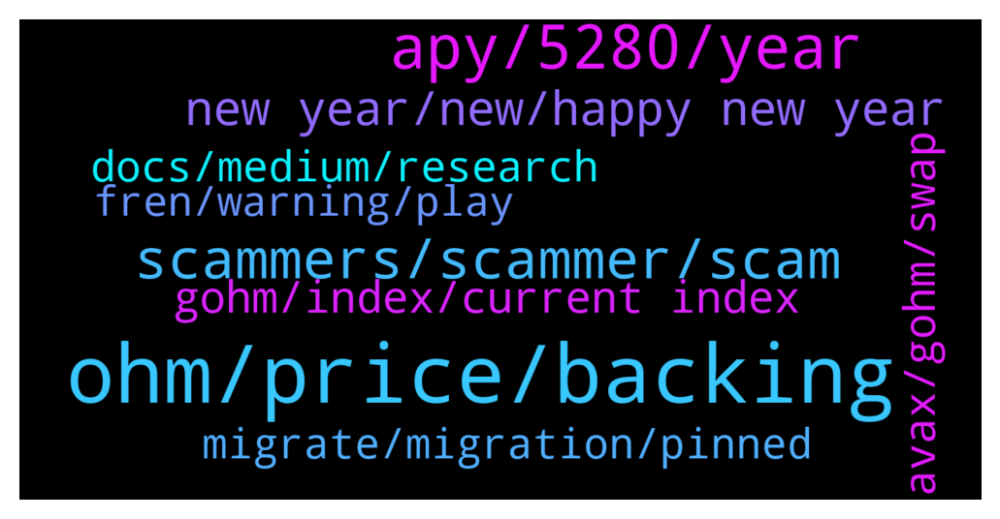

# **@OlympusTG**
 ## Analysis for **2022-01-01** - **2022-01-02**.

---

## 📊 **Basic Stats**

**n_messages_sent**: 792

---

---

## 🔝 **Top keywords and related messages**

1. **ohm, price, backing**

    @CoachLuko --- *I bought 1 Ohm in Mai for 300usd. Now I have 27ohm. I like this project* **--->** [TG Discussion](https://t.me/OlympusTG/139168)

    @Winter_Chemistry --- *alternatively i feel comfortable buying ohm v2 tokens and then stake on dashboard* **--->** [TG Discussion](https://t.me/OlympusTG/139439)

    @Robbert --- *So contract of my staked ohm on ethscan is: 0x31932....aee77fbbe. is this correct or do I hold scam coins?* **--->** [TG Discussion](https://t.me/OlympusTG/140462)

    @Harshilp100 --- *Where can I buy ohm with eth with less fees ?* **--->** [TG Discussion](https://t.me/OlympusTG/139764)

    @Encrypted --- *can i leave ohm on v1* **--->** [TG Discussion](https://t.me/OlympusTG/139416)

    @nfwaple --- *Swapping other assets to ohm increases price, swapping ohm to other assets decreases price* **--->** [TG Discussion](https://t.me/OlympusTG/139746)

2. **apy, 5280, year**

    @nfwaple --- *assuming 5280% APY for the entire year and you don't withdraw any of them for an entire year, your total OHM would be 3 OHM x 52.80, but it doesn't make sense to be assuming that APY does not change for one whole year* **--->** [TG Discussion](https://t.me/OlympusTG/140275)

    @miansatar --- *How we calculate profit at 5280% APY* **--->** [TG Discussion](https://t.me/OlympusTG/140262)

    @nfwaple --- *I don't think APY is drop is bearish at all, might be for people that can only think on APY level* **--->** [TG Discussion](https://t.me/OlympusTG/139408)

    @SSDDGO --- *When APY will fall down? 🙏* **--->** [TG Discussion](https://t.me/OlympusTG/140514)

    @Dave_881010 --- *It’s either price or APY level am looking for. If price keeps dropping was expecting the APY to be stable. Ever since migration it’s been down from 7,000% to 5,000% +* **--->** [TG Discussion](https://t.me/OlympusTG/139425)

    @nfwaple --- *APY is going to drop, look up OIP-18 and OIP-63, regardless of price* **--->** [TG Discussion](https://t.me/OlympusTG/139435)

3. **scammers, scammer, scam**

    @nfwaple --- *well good on you for only sending a small amount* **--->** [TG Discussion](https://t.me/OlympusTG/139692)

    @cdp279 --- *No dude. It’s a scammer. Ignore those bitches* **--->** [TG Discussion](https://t.me/OlympusTG/140246)

    @Winter_Chemistry --- *scammers as usual are impersonating you* **--->** [TG Discussion](https://t.me/OlympusTG/139025)

    @stacyd82d --- *Yeah. I’m having trust issues these days especially with the ring and safemoon scams. Can’t be careful enough these days* **--->** [TG Discussion](https://t.me/OlympusTG/140207)

    @Ap0l1o --- *I am happy that today I banned only one scammer here, and they might’ve been here for some time. So at this moment we have nobody in the channel with fake admin name. This doesn’t mean that there aren’t any, so please remain vigilant and block + report those DM-ing bastards. 🙏* **--->** [TG Discussion](https://t.me/OlympusTG/139991)

    @Михаил --- *Guys please tell me because my account was hacked* **--->** [TG Discussion](https://t.me/OlympusTG/138982)

4. **new year, new, happy new year**

    @bike4peace --- *lets start the new year with good vibes only and keep on them 😉* **--->** [TG Discussion](https://t.me/OlympusTG/139332)

    @Ap0l1o --- *Happy new year Ohmies, I wish you all good health and more 3, 3* **--->** [TG Discussion](https://t.me/OlympusTG/139583)

    @Dean --- *Happy new year peace & love to all 🥳✌🏾😉💯* **--->** [TG Discussion](https://t.me/OlympusTG/139271)

    @Ap0l1o --- *Thank you for the kind words* **--->** [TG Discussion](https://t.me/OlympusTG/139996)

    @Max --- *BTW happy new year everyone 🥳* **--->** [TG Discussion](https://t.me/OlympusTG/139478)

    @Z1YADI --- *Hey hey keep the good vibes* **--->** [TG Discussion](https://t.me/OlympusTG/139335)

5. **gohm, index, current index**

    @TurboLaserClip --- *like, is there a calculator to check what could be liquidation price if borrowed 20% of total collateral, where could i check in the UI where exactly to repay and  in general how does it feel to use rari with gohm* **--->** [TG Discussion](https://t.me/OlympusTG/139730)

    @Max --- *gohm = current index x ohm price. The amount of your gohm won't grow but the value of gohm will* **--->** [TG Discussion](https://t.me/OlympusTG/139875)

    @nfwaple --- *Gohm price = ohm price x current index, and not sure how you get the 14%...* **--->** [TG Discussion](https://t.me/OlympusTG/140222)

    @CryptoCobiUSA --- *I wish there is just simply a function to see the value . My gOHM stays the same ... So where does it actually compound ?* **--->** [TG Discussion](https://t.me/OlympusTG/140179)

    @nfwaple --- *we used to use that 9,9 calculator, but obviously since gOHM is the collateral now, it might affect the calculation abit, you can save a copy and make changes manually though* **--->** [TG Discussion](https://t.me/OlympusTG/139736)

    @CryptoCobiUSA --- *Yeah I see that but it does stay the same. The gOHM value does not move* **--->** [TG Discussion](https://t.me/OlympusTG/140175)

6. **avax, gohm, swap**

    @nfwaple --- *use the wrap function on the website to unwrap it, but you can't unwrap on AVAX because sOHM only exists on ETH chain* **--->** [TG Discussion](https://t.me/OlympusTG/140185)

    @J. --- *Hi all! Can you please help me here? I can't vote on snapshot even though I have gOHM. Is it because I have it on AVAX chain and not on ERC20?* **--->** [TG Discussion](https://t.me/OlympusTG/139608)

    @B --- *So yeah I didn't know that. Because I still have a few sohms in the stake should I then take them and swap them in gohm? and what would be the cheapest way to get to gohm now?* **--->** [TG Discussion](https://t.me/OlympusTG/139533)

    @Ian --- *Get Avax then swap to gohm* **--->** [TG Discussion](https://t.me/OlympusTG/140370)

    @CryptoCobiUSA --- *That's prob why, I am on AVAX* **--->** [TG Discussion](https://t.me/OlympusTG/140184)

    @Ap0l1o --- *Traderjoe, swap it for avax to gOhm* **--->** [TG Discussion](https://t.me/OlympusTG/139783)

7. **docs, medium, research**

    @CryptoCobiUSA --- *Thank you  It's all so complicated* **--->** [TG Discussion](https://t.me/OlympusTG/140177)

    @Alex --- *perfect. got it. thanks and have a nice weekend.* **--->** [TG Discussion](https://t.me/OlympusTG/139639)

    @Ap0l1o --- *You as well, read my message above* **--->** [TG Discussion](https://t.me/OlympusTG/139857)

    @Ap0l1o --- *Where is the targeting, you asked for me to explain, I just provided you where to start reading exactly what you asked, so that I don’t repeat myself* **--->** [TG Discussion](https://t.me/OlympusTG/139144)

    @Xander --- *If you read normal and just do some research you will know.* **--->** [TG Discussion](https://t.me/OlympusTG/139105)

    @Ap0l1o --- *Read above or in the provided docs, I don’t want to start my year explaining something for the 1000th time to someone who is ignorant and lazy to do his own research* **--->** [TG Discussion](https://t.me/OlympusTG/139106)

8. **fren, warning, play**

    @Михаил --- *It is my fault of course but shit happen* **--->** [TG Discussion](https://t.me/OlympusTG/139008)

    @Ap0l1o --- *It is not a threat, but a warning* **--->** [TG Discussion](https://t.me/OlympusTG/139124)

    @Ap0l1o --- *You will get back from it Fren, don’t worry* **--->** [TG Discussion](https://t.me/OlympusTG/139011)

    @Ap0l1o --- *I will ban you Fren, last warning* **--->** [TG Discussion](https://t.me/OlympusTG/139086)

    @FLankarooo --- *Basically we can safely say it’s the worst shit storm since a while* **--->** [TG Discussion](https://t.me/OlympusTG/139791)

    @Xander --- *You are crying just shut up* **--->** [TG Discussion](https://t.me/OlympusTG/139101)

