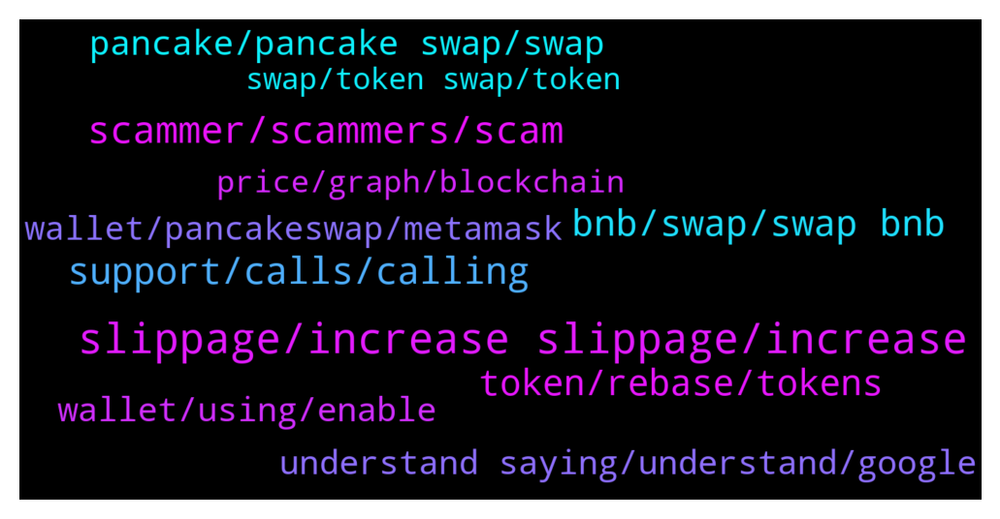

# **@PancakeSwap**
 ## Analysis for **2022-01-01** - **2022-01-02**.

---

## 📊 **Basic Stats**

**n_messages_sent**: 1114

---

---

## 🔝 **Top keywords and related messages**

1. **slippage, increase slippage, increase**

    @Robert --- *Apos I can’t sell my babydoge for steamx on bsc MetaMask I have increased the slippage to 15 and even 20 percent but each time is tr it says insufficient output amount* **--->** [TG Discussion](https://t.me/PancakeSwap/2237245)

    @Aosh1ma --- *make sure select reveceive wbnb + %slippage + %70 amount* **--->** [TG Discussion](https://t.me/PancakeSwap/2239957)

    @Aosh1ma --- *set high slippage, select receive wbnb and try %60 amount ser!* **--->** [TG Discussion](https://t.me/PancakeSwap/2240521)

    @Sancho --- *Now I increase the slipage to 12 % but is still not going* **--->** [TG Discussion](https://t.me/PancakeSwap/2239159)

    @Mikunel --- *Done with wbnb but what slippage should be? I put 10,15,20%. Should be more, like 50% or?* **--->** [TG Discussion](https://t.me/PancakeSwap/2239958)

    @TomorrowlandForLife --- *He's getting gas error which means to increase slippage like I told him* **--->** [TG Discussion](https://t.me/PancakeSwap/2239186)

2. **scammer, scammers, scam**

    @Nathan --- *Holy there is a lot of scammers on here.* **--->** [TG Discussion](https://t.me/PancakeSwap/2239040)

    @ColdBloodCanadian13 --- *Lol the scammers are relentless I have blocked like 5 and they keep coming* **--->** [TG Discussion](https://t.me/PancakeSwap/2236786)

    @Rush_lover --- *u didnt read all the warning about scammers? Why u still ask one of the people who conact u is right? ALL WHO CALL OR DM U ARE SCAMMERS.* **--->** [TG Discussion](https://t.me/PancakeSwap/2237401)

    @vergile --- *to many scams in this group* **--->** [TG Discussion](https://t.me/PancakeSwap/2239410)

    @Michael --- *Can you please advise me on how to do number 6. Everything has failed, scammed again* **--->** [TG Discussion](https://t.me/PancakeSwap/2236970)

    @goku287 --- *still this group full of scammers* **--->** [TG Discussion](https://t.me/PancakeSwap/2237426)

3. **support, calls, calling**

    @Cozma --- *I ask ask a question and I have 30 mesagges and 3 ppl calling me 😂😂😂* **--->** [TG Discussion](https://t.me/PancakeSwap/2238917)

    @Antoninko --- *Hello, i join in chanel and  recive  some call - is normal ?) lol* **--->** [TG Discussion](https://t.me/PancakeSwap/2240534)

    @Nicholas --- *I’ve got many calls and messages and just want an answer.* **--->** [TG Discussion](https://t.me/PancakeSwap/2236919)

    @Hi_Im_Maiell --- *Is it normal to receive like 15 calls in 30 seconds 😂😂* **--->** [TG Discussion](https://t.me/PancakeSwap/2239941)

    @Vishaljain2 --- *Who are the PPL we should trust than. In case of Help/Emergency.* **--->** [TG Discussion](https://t.me/PancakeSwap/2239947)

    @Kentriboe --- *About 15 calls after each post. :D* **--->** [TG Discussion](https://t.me/PancakeSwap/2239046)

4. **bnb, swap, swap bnb**

    @KINGMUFASA1 --- *Sorry to interrupt you but 0.2 BnB is a big ammount for me  Please help me in solving this* **--->** [TG Discussion](https://t.me/PancakeSwap/2237948)

    @John --- *I have winnings but I cant collect it because have 0 bnb.. need little fee to collect it any other way?* **--->** [TG Discussion](https://t.me/PancakeSwap/2239085)

    @Günther --- *Hello, i need help. I would like to swap AET Token to BNB ,but when i confirm the swap ,this message show me.* **--->** [TG Discussion](https://t.me/PancakeSwap/2240826)

    @Flavioaffonso --- *Try enabling multihop, probably there is no liquidity for that pair  you need to swap to bnb/busd before...the multihop will do that for you.   Check the price impact before finishing the swap.* **--->** [TG Discussion](https://t.me/PancakeSwap/2237253)

    @BT_Carmon --- *I try to swap ADAPAD to BNB - small amount 0.5 BNB Error insufficient output amount Then I tried to Swap BNB to ADAPAD, no issue What is wrong* **--->** [TG Discussion](https://t.me/PancakeSwap/2240392)

    @kargolanding --- *buy why i add 1 BNB to it* **--->** [TG Discussion](https://t.me/PancakeSwap/2237199)

5. **token, rebase, tokens**

    @orlofr --- *But how ca I be careful. How to know which token i can import* **--->** [TG Discussion](https://t.me/PancakeSwap/2240102)

    @FuwaFuwa08 --- *What do I do if it's a rebase token? Sorry, I just need help.* **--->** [TG Discussion](https://t.me/PancakeSwap/2238116)

    @rpoole69 --- *Check with the token's social media platforms* **--->** [TG Discussion](https://t.me/PancakeSwap/2236523)

    @Aosh1ma --- *Why you deployed Token if you are not know?  https://t.me/PancakeSwap/2237083* **--->** [TG Discussion](https://t.me/PancakeSwap/2237096)

    @TomorrowlandForLife --- *Ceddi has been explaining to you. You can't say nobody helped you I'm afrad you have lost your money buying the incorrect token* **--->** [TG Discussion](https://t.me/PancakeSwap/2236648)

    @HAITIENLK --- *maybe this is rebase token or the same, please check with project of that token, about detail condition of that token.* **--->** [TG Discussion](https://t.me/PancakeSwap/2239715)

6. **pancake, pancake swap, swap**

    @goku287 --- *and pancake swap still let people swap them without any warning. What a scam* **--->** [TG Discussion](https://t.me/PancakeSwap/2237086)

    @Big --- *So i have lost my money then. Surely should be a warning on pancake swap.* **--->** [TG Discussion](https://t.me/PancakeSwap/2240217)

    @Alibby💚 --- *Also how do i verify these support from pancake swap contacting me privately. Is there an official pancake swap support?* **--->** [TG Discussion](https://t.me/PancakeSwap/2236857)

    @lectro89 --- *pancake swap is a DEX evrrybody is allowed to trade* **--->** [TG Discussion](https://t.me/PancakeSwap/2238661)

    @EleVaz --- *Depends why you want to buy in pancake swap* **--->** [TG Discussion](https://t.me/PancakeSwap/2239271)

    @Joe --- *Hi guys, in the process of uploading our bsc smart contract to pancake swap. We’ve noticed a lot of scam coins already listed pretending to be us. Is there a way to combat these ? I’m worried about our users getting confused* **--->** [TG Discussion](https://t.me/PancakeSwap/2240383)

7. **understand saying, understand, google**

    @KINGMUFASA1 --- *Oh thank you for explaining :)* **--->** [TG Discussion](https://t.me/PancakeSwap/2237983)

    @Fou100 --- *Excuse me, would you more explain?* **--->** [TG Discussion](https://t.me/PancakeSwap/2239431)

    @surin_rz --- *I do not know English, I speak with Google Translator, I did not understand what you were saying* **--->** [TG Discussion](https://t.me/PancakeSwap/2238136)

    @BiasGoose --- *I can’t understand what you’re saying* **--->** [TG Discussion](https://t.me/PancakeSwap/2237190)

    @Basstyan --- *okay thank you for the information* **--->** [TG Discussion](https://t.me/PancakeSwap/2238329)

    @Obaid170 --- *Thanks for the help, I think I'll what to do now :)* **--->** [TG Discussion](https://t.me/PancakeSwap/2237049)

8. **wallet, using, enable**

    @Marek --- *Thx, but it isnt help me. Only what I see is enable, enable, enable. I click on it, confirm in my Wallet but nothing happens still enable everywhere* **--->** [TG Discussion](https://t.me/PancakeSwap/2237769)

    @David --- *I am having problems connecting my trust wallet.* **--->** [TG Discussion](https://t.me/PancakeSwap/2240424)

    @Kerem --- *you are responsible for the wallet my friend* **--->** [TG Discussion](https://t.me/PancakeSwap/2238463)

    @HAITIENLK --- *try clear cache/ reinstall app wallet (remember save seephase/private key)/ or not, try other wallet* **--->** [TG Discussion](https://t.me/PancakeSwap/2237170)

    @Rush_lover --- *u put your keywords somewhere from a dm? than move your funds as soon as possible to another wallet.* **--->** [TG Discussion](https://t.me/PancakeSwap/2237420)

    @HAITIENLK --- *@essentialpeters if can't, try other wallet, / reinstall wallet (remember save seephase, private key).* **--->** [TG Discussion](https://t.me/PancakeSwap/2237555)

9. **wallet, pancakeswap, metamask**

    @M2C6L --- *Unfortunately, my problem has still not vanished 😏 I've now made a screenshot to make my question a little more visual. I'm relatively new to the defi area and of course I don't want to lose my money but increase it ... 😁 As I said, I had already played around with Pancakeswap a few weeks ago to get to know the platform a little better. At that time I had a Binance Extension Wallet connected to Pancakeswap. All I had to do was connect the Binance Extension Wallet to Pancakeswap, activate my selected pool in the SyrupPool, use CAKE and that was it. But now I was advised to buy a ledger, connect it to the metamask and then connect Pancakeswap to the metamask. (☝️For security reasons ☝️) Probably, some of you are throwing yourself into the corner laughing because my question "stupid" seems to you ... 😅 But I still hope that someone here would like to answer my question..😊* **--->** [TG Discussion](https://t.me/PancakeSwap/2238580)

    @Ceddi200 --- *👉Try trustwallet or safepal is work on 100%👈  ✅ Metamask - PC ✅ Safepal - iphone ✅ Trustwallet - android  Don't use metamask with phone ❌ Don't use trust with ios ❌ Don't use Binance wallet with pc ❌ ---------------------------------------------------  You can import your wallet to any other wallets that works with Pancakeswap if you want. You can continue to use same wallet with your seed. That seed is not special for safepal or trust wallet or metamask. You can use it in any wallet app  You will write the seed words to new app with choosing "I have already a wallet" or " Import Wallet"   Binance Smart Wallet ➜  Metamask  Guide👇🏻👇🏻👇🏻 https://youtu.be/rGhedOxzJEc* **--->** [TG Discussion](https://t.me/PancakeSwap/2237785)

    @Klariz_a --- *0xc2630b2d8bd052b19c2e2dd77c81ddecd0e5353c (my wallet) —>send 21cake to—->  0x62e486c78a4f7dcf8429c85f7d142d61fad98f36 this received wallet.* **--->** [TG Discussion](https://t.me/PancakeSwap/2238830)

    @M2C6L --- *Hello everyone and a happy new year, I have a question. I have connected my ledger to Pancakeswap via the metamask and now want to stake my CAKE in the SyrupPool, it says "Add to metamask" on the right and "activate" on the left. "Add to metamask" is written even though I have already connected my ledger to Pancakeswap via metamask. Some time ago I connected my Binance expansion wallet to Pancakeswap. Back then, staking in the SYRUP pool was very easy. I just had to connect my Binance Extension Wallet to Pancakeswap, activate the pool where I wanted to stake and then just use my CAKE. Why is it different with the metamask? Thank you for your help in advance.* **--->** [TG Discussion](https://t.me/PancakeSwap/2238209)

    @HAITIENLK --- *0xc2630b2d8bd052b19c2e2dd77c81ddecd0e5353c (your wallet) —>send 21cake to—->  0x62e486c78a4f7dcf8429c85f7d142d61fad98f36  this received wallet. i see this wallet deposit 21cake autocake 59day ago. please check your history by your self.* **--->** [TG Discussion](https://t.me/PancakeSwap/2237582)

    @Aosh1ma --- *You can import your wallet to any other wallets that works with Pancakeswap if you want. You can continue to use same wallet with your seed. That seed is not special for safepal or trust wallet or metamask. You can use it in any wallet app  You will write the seed words to new app with choosing "I have already a wallet" or " Import Wallet"  Trust ➜  Safepal Guide👇🏻👇🏻👇🏻 https://youtu.be/FSGmEW9fFA0* **--->** [TG Discussion](https://t.me/PancakeSwap/2240439)

10. **price, graph, blockchain**

    @Ceddi200 --- *Initial price and you received 2,395.042785023602593026 AIMX* **--->** [TG Discussion](https://t.me/PancakeSwap/2237316)

    @Josamiry2021 --- *The price of a token when I was buying wasn't 0.137...was approximately 0.12$* **--->** [TG Discussion](https://t.me/PancakeSwap/2237318)

    @Josamiry2021 --- *Can you show the graph that shows the price went to 1.37? At the time I'm buying? Coz even the poocoin the highest price is 0.1358* **--->** [TG Discussion](https://t.me/PancakeSwap/2237344)

    @Ceddi200 --- *1 hour 55 minutes ago. The price was 0.1371 Current price is 0.1128* **--->** [TG Discussion](https://t.me/PancakeSwap/2237312)

    @Ceddi200 --- *Bro go check the chart. Tell me the price 2 hours 7 min ago.* **--->** [TG Discussion](https://t.me/PancakeSwap/2237319)

    @Ceddi200 --- *Please read the above. Where did you get the price from.* **--->** [TG Discussion](https://t.me/PancakeSwap/2236748)

