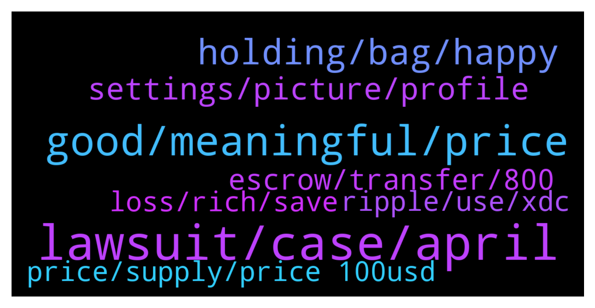

# **@Ripple**
 ## Analysis for **2022-01-01** - **2022-01-02**.

---

## 📊 **Basic Stats**

**n_messages_sent**: 179

---

---

## 🔝 **Top keywords and related messages**

1. **lawsuit, case, april**

    @SamSakamoto --- *Dutch lawyer says XRP lawsuit will end in April* **--->** [TG Discussion](https://t.me/Ripple/3033716)

    @Andy --- *You dont sound like an admin, this year of course iso20022* **--->** [TG Discussion](https://t.me/Ripple/3034007)

    @erik_sz91 --- *It would be nice to know which is the theorical maximum lenght the lawsuit could have. I mean, most of us think it will be solved this year, cause this year ISO20022 launches, and it would be strange if it starts with Ripple still in lawsuit. However can this case take like 10 years? Or that would be imposible?* **--->** [TG Discussion](https://t.me/Ripple/3034153)

    @erik_sz91 --- *Bitboy said the case would end in September. No one knows the future* **--->** [TG Discussion](https://t.me/Ripple/3034150)

    @MrstickGrowyourfund --- *Xrp case will end on 2022 april* **--->** [TG Discussion](https://t.me/Ripple/3033656)

    @regiokiller --- *A settlement could be reached by Q1 2022* **--->** [TG Discussion](https://t.me/Ripple/3034276)

2. **good, meaningful, price**

    @regiokiller --- *I dont see a realistic price for XRP over 1 USD... it cant even surpass 0.90 centile range... more than 1 USD is just hopium now* **--->** [TG Discussion](https://t.me/Ripple/3033700)

    @Cheapsuit --- *People don’t understand that XRP wasn’t meant for regular people like us. All the more reason to HODL it.* **--->** [TG Discussion](https://t.me/Ripple/3033719)

    @SamSakamoto --- *Can we all make a promise? When XRP hits 10$, we do a meet up in Lambos at the SEC In Washington?* **--->** [TG Discussion](https://t.me/Ripple/3033741)

    @DiegoferDF --- *2022 $XRP predictions. Most accurate TA.* **--->** [TG Discussion](https://t.me/Ripple/3033959)

    @Tinkabellagal --- *Calling xrp a stablecoin is trolling  Add meaningful content* **--->** [TG Discussion](https://t.me/Ripple/3034227)

    @NSantan --- *Not sure at what rate you've bought your XRP and what your situation is, but a general plan would be to not sell and just sit on the investment.   At least hold till you think you have found a better investment, again it isn't an actual loss till you hit the sell button* **--->** [TG Discussion](https://t.me/Ripple/3033691)

3. **holding, bag, happy**

    @Sky_Lurkz --- *Since when was factual statements classed as trolling 🤷🏻‍♀️  Read my comments in there entirety   I’m holding this bag till the very end* **--->** [TG Discussion](https://t.me/Ripple/3034271)

    @Lallulu --- *Wish y’all a very happy and prosperous new year* **--->** [TG Discussion](https://t.me/Ripple/3033957)

    @Sky_Lurkz --- *Lol… what do u actually know about that court case other than what you’ve bn spoon fed?  Genuinely….  I’m going to hold a bag all the way to zero if I have to but you can’t tell me 99% of people holding a bag haven’t got a scoobey doo what is actually occurring* **--->** [TG Discussion](https://t.me/Ripple/3034211)

    @omnikermit --- *Lol As you can see you are wrong again* **--->** [TG Discussion](https://t.me/Ripple/3034328)

    @jared1996z --- *Don't forget this TA  😉 https://youtu.be/yQkHwysgcxA* **--->** [TG Discussion](https://t.me/Ripple/3033968)

    @ReiTeh --- *Well since you say it is pumping then take profits🤓* **--->** [TG Discussion](https://t.me/Ripple/3034334)

4. **settings, picture, profile**

    @Jeffreezaa --- *I have a user name and profile picture?* **--->** [TG Discussion](https://t.me/Ripple/3034246)

    @Big_pumping --- *I have changed my settings 👍* **--->** [TG Discussion](https://t.me/Ripple/3034083)

    @JesusJames --- *please get a publicly visible profile picture per the rules can be a picture of anything* **--->** [TG Discussion](https://t.me/Ripple/3034082)

    @JustNNM --- *Please go to settings then edit and scroll down to @Username and add one there.  Than go to settings then privacy and set your profile photo to everybody.* **--->** [TG Discussion](https://t.me/Ripple/3034249)

    @Zertous --- *settings > privacy and security > turn everybody on profile picture  it's currently hidden.* **--->** [TG Discussion](https://t.me/Ripple/3034247)

    @JesusJames --- *that is why i asked it to be publicly visible its currently set to friends only* **--->** [TG Discussion](https://t.me/Ripple/3034085)

5. **escrow, transfer, 800**

    @JesusJames --- *that is what they put back into escrow* **--->** [TG Discussion](https://t.me/Ripple/3034046)

    @CocaFlorin --- *800 milions xrp escrow transfer ..what s happening* **--->** [TG Discussion](https://t.me/Ripple/3034037)

    @Big_pumping --- *Ripple locked nearly 1.3billion xrp from escrow strange.. just now?* **--->** [TG Discussion](https://t.me/Ripple/3034075)

    @JesusJames --- *1b unlocked 800m re locked into escrow* **--->** [TG Discussion](https://t.me/Ripple/3034078)

    @gerrymchugh --- *Is that not the usual monthly transfer?* **--->** [TG Discussion](https://t.me/Ripple/3034042)

    @Patrick --- *So if they transfer 800 Millionen coins, that means 8000 xrp are burned  right?🤔  So answer here pls lol* **--->** [TG Discussion](https://t.me/Ripple/3034054)

6. **price, supply, price 100usd**

    @gerrymchugh --- *One is market cap and other is the fully diluted market cap.* **--->** [TG Discussion](https://t.me/Ripple/3034186)

    @EML1993 --- *Isn’t it supposed to be circulation supply (47B) x price (100usd) and not max supply (100B) x price (100usd). Either way that’s huge, though not impossible especially in crypto.* **--->** [TG Discussion](https://t.me/Ripple/3034177)

    @gerrymchugh --- *Ok, so this one is different? Didn't look it up, just figured it was the standard one* **--->** [TG Discussion](https://t.me/Ripple/3034049)

    @Kingbtc1234 --- *Obviously I'm waiting if BTC below 40k then possible* **--->** [TG Discussion](https://t.me/Ripple/3033647)

    @Letum9 --- *That is particularly correct, I would add all crypto in the equation. 😀* **--->** [TG Discussion](https://t.me/Ripple/3033737)

    @EML1993 --- *Yes correct, but how do you compute? For me, it’s circulation supply x price.* **--->** [TG Discussion](https://t.me/Ripple/3034187)

7. **loss, rich, save**

    @Paisa_earn_through_cse --- *Bro i am already lost of money loss.* **--->** [TG Discussion](https://t.me/Ripple/3033679)

    @mohaferragamo --- *wrong because they buy high and sell low just hold thats the same thing as saving money you never lose untill you sell* **--->** [TG Discussion](https://t.me/Ripple/3033686)

    @BennyBennyBlanco --- *You don’t need to buy over and over keep what u have and save. Day trading there’s days u get lucky and there’s days u get destroyed. See if your at a gain for the year or at a loss. There’s the answer why many are broke* **--->** [TG Discussion](https://t.me/Ripple/3033685)

    @BennyBennyBlanco --- *You won’t get rich right now, market is in correction* **--->** [TG Discussion](https://t.me/Ripple/3033678)

    @BennyBennyBlanco --- *Suppose to be buy low sell high, u won’t be at a loss, if many are desperate for a profit and hate being down that’s why a lot keep doing the same mistakes over and over until realized it’s not working.* **--->** [TG Discussion](https://t.me/Ripple/3033689)

    @BennyBennyBlanco --- *You want to get rich, save save save money and stop buying. There’s your answer. Common sense* **--->** [TG Discussion](https://t.me/Ripple/3033682)

8. **ripple, use, xdc**

    @erik_sz91 --- *Ripplenet already exists. But if the net alone solves all problems, there would be not need for XRP. XRP will be used to convert any fiat to any other fiat in a simple way; that's why it will be useful. You send 1 dolar, it converts to XRP, arrives to, lets say Spain, and it converts to 0,90 euros (i dunno actual conversion rate)* **--->** [TG Discussion](https://t.me/Ripple/3034147)

    @Riiggo --- *I agree they will use ripple tech but will they use the xrp token? That's the question.  They always mention ripple never xrp* **--->** [TG Discussion](https://t.me/Ripple/3034134)

    @Rana_Barua --- *Banks don’t have to buy XRP to use ripple network. They are already using ripple network but XRP prices have not shot up.* **--->** [TG Discussion](https://t.me/Ripple/3033823)

    @tibertov --- *Banks will use ripplenet, and maybe in future xrp.* **--->** [TG Discussion](https://t.me/Ripple/3033806)

    @Madadaio --- *What is special about XDC?  There are promises like many other 10k coins. But where is the guaranty that banks, trade finance will jump into XDC network?  Ripple's high liquidity is the result of last 8 years of work. XDC  is a one man show, Andre Casterman. However, time will say what is what.* **--->** [TG Discussion](https://t.me/Ripple/3034112)

    @Jaiya --- *What do you guys think about XLM, XDC and ALGO, the other ISO20022 coins in relation to XRP adoption in the banking industry?  Are you investing in those as well or just XRP?* **--->** [TG Discussion](https://t.me/Ripple/3034109)

