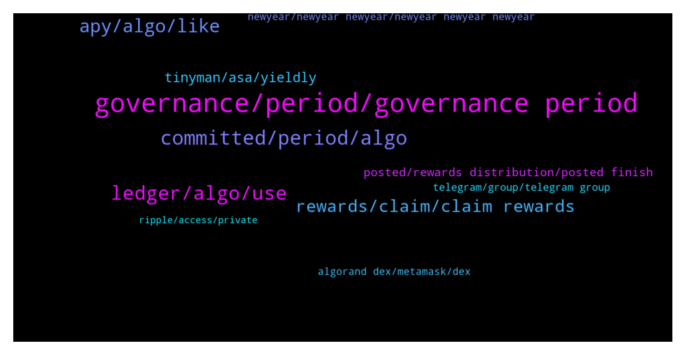

# **@algorand**
 ## Analysis for **2022-01-01** - **2022-01-02**.

---

## 📊 **Basic Stats**

**n_messages_sent**: 286

---

---

## 🔝 **Top keywords and related messages**

1. **governance, period, governance period**

    @Todd --- *It really is an easy process and the voting proposal are simply stated.  That link goes into greater detail,  much more than nessasary,  after the fact.   The actual vote was just the A and B option,  no further detail at time of voting.* **--->** [TG Discussion](https://t.me/algorand/328377)

    @Pradeepkumar156 --- *When algorand governance round 1 distribution* **--->** [TG Discussion](https://t.me/algorand/328655)

    @jumpfetus --- *the official algorand wallet has a banner that says Governance Period #2 registration window ends Jan 6, 16:00 UTC. Don't think that's accurate.* **--->** [TG Discussion](https://t.me/algorand/328329)

    @Raju --- *I'm so mad I missed out on governance* **--->** [TG Discussion](https://t.me/algorand/328333)

    @Crypt0Playa --- *How many items do we have to typically vote on during the period and how complex are the issues that require voting? Do people just randomly vote to get thru the period to get their rewards or do people actually spend the time to sincerely study the issues under consideration? This will be my first governance period so just curious about how it looks.* **--->** [TG Discussion](https://t.me/algorand/328374)

    @MackDenver --- *You are correct, currently sign up is ongoing. We will let you know when voting starts for G2.* **--->** [TG Discussion](https://t.me/algorand/328780)

2. **committed, period, algo**

    @cyodha --- *Yes, i commited my Algos during signing period for gov2 (i commited on 25th dec) what im asking is will i still receive my gov1 rewards because i commited my algos before 31 Dec (gov1 end period)* **--->** [TG Discussion](https://t.me/algorand/328767)

    @cyodha --- *Guys, i have a question, so i commited my Algos for gov period2 on 25th dec (before gov 1 ends) will i still be eligible to receive my gov1 rewards?* **--->** [TG Discussion](https://t.me/algorand/328759)

    @Borosniper77 --- *Yes but I dont want to commit my algo until I receive my rewards from gov 1 then I know how much I will get to commit* **--->** [TG Discussion](https://t.me/algorand/328563)

    @cyodha --- *if we commit our algos for gov period2, will we still receive our gov1 rewards?* **--->** [TG Discussion](https://t.me/algorand/328555)

    @aleks_qaz --- *I know we have to commit by the 7th* **--->** [TG Discussion](https://t.me/algorand/328779)

    @MackDenver --- *If you have committed your ALGO during the governance period 1, you will receive it.* **--->** [TG Discussion](https://t.me/algorand/328769)

3. **ledger, algo, use**

    @farnoudnik --- *No one has used ledger wallet to become a governor ?!* **--->** [TG Discussion](https://t.me/algorand/328722)

    @farnoudnik --- *But there is no note section in ledger wallet* **--->** [TG Discussion](https://t.me/algorand/328715)

    @AlgoDad --- *Go to https://wallet.myalgo.com/ and connect your ledger device.* **--->** [TG Discussion](https://t.me/algorand/328724)

    @cryptotuna --- *Hi there, when I deposit USDC to algo wallet what Network is erc20 or I can use polygon?* **--->** [TG Discussion](https://t.me/algorand/328429)

    @Mahngee1 --- *Hello admin pls I have problem sending out algo from my wallet. Its popping out an error message* **--->** [TG Discussion](https://t.me/algorand/328436)

    @Stranger36 --- *I want to connect my ledger to Linux myalgo but u cant* **--->** [TG Discussion](https://t.me/algorand/328305)

4. **apy, algo, like**

    @jumpfetus --- *1) if the APY is like 12%-20%, you'll get like 3-5 Algos for 100 algos staked in 3 months* **--->** [TG Discussion](https://t.me/algorand/328282)

    @Todd --- *14-17% apy and a vote in the direction of the protocol.  Accumulation of an undervalued asset as well.* **--->** [TG Discussion](https://t.me/algorand/328372)

    @NightAlgorand --- *The most popular one is this https://algorandwallet.com/* **--->** [TG Discussion](https://t.me/algorand/328589)

    @aleks_qaz --- *What APY is for g1 voting?* **--->** [TG Discussion](https://t.me/algorand/328783)

    @Lord_Shin_Chan_2_O --- *Just 3 to 5 algos for 3 months...🤦‍♂* **--->** [TG Discussion](https://t.me/algorand/328295)

    @Shane --- *Because the ship has sailed on those, and algo is still on boarding.* **--->** [TG Discussion](https://t.me/algorand/328402)

5. **rewards, claim, claim rewards**

    @cryptocoque 🍷 --- *I have 2 questions: 1) i put 100algo for gouvernance to the 2d period: how many rewards i will get? 2) how will be informed for sessions votes? Thanks* **--->** [TG Discussion](https://t.me/algorand/328276)

    @AlgoDad --- *Gov rewards have not gone out yet.  here's how to calculate your payout: https://algorewards.github.io/* **--->** [TG Discussion](https://t.me/algorand/328681)

    @Veganpolis --- *When can I claim my gov rewards?* **--->** [TG Discussion](https://t.me/algorand/328595)

    @Thomas_ZH --- *says rewards are given between now and the 5th* **--->** [TG Discussion](https://t.me/algorand/328279)

    @Malvo --- *And will rewards start to be distributed?* **--->** [TG Discussion](https://t.me/algorand/328570)

    @The Dude --- *Will we have to claim the rewards or will they just be added to our current balance automatically?* **--->** [TG Discussion](https://t.me/algorand/328746)

6. **tinyman, asa, yieldly**

    @Olami0920 --- *Saw it on my tinyman swap as I log in now* **--->** [TG Discussion](https://t.me/algorand/328844)

    @Olami0920 --- *There is a update about attack on algorand pool hw true is this pls* **--->** [TG Discussion](https://t.me/algorand/328842)

    @aBillionGrand --- *anyone know why ASAS 514665903 is mooning rn?* **--->** [TG Discussion](https://t.me/algorand/328553)

    @aBillionGrand --- *the best i can do is leave crumbs for  you all to  investigate, my lifes at risk and tinyman are witchhunting me and a few others* **--->** [TG Discussion](https://t.me/algorand/328888)

    @aBillionGrand --- *for the tinyman ASA liquidity hack* **--->** [TG Discussion](https://t.me/algorand/328885)

    @MackDenver --- *You should reach out to Tinyman about this please* **--->** [TG Discussion](https://t.me/algorand/328846)

7. **posted, rewards distribution, posted finish**

    @MackDenver --- *Hello Syed, we will keep you all posted when governance rewards distribution finished.* **--->** [TG Discussion](https://t.me/algorand/328422)

    @MackDenver --- *Hello Nam, we will keep you all posted when voting starts.* **--->** [TG Discussion](https://t.me/algorand/328789)

    @MackDenver --- *We will keep you all posted when we finish the governance rewards distribution.* **--->** [TG Discussion](https://t.me/algorand/328784)

    @MackDenver --- *Hello Boro, we will keep you all posted when we finish the governance rewards distribution.* **--->** [TG Discussion](https://t.me/algorand/328463)

    @MackDenver --- *Hello Sajjad, we will keep you posted when we finish the rewards distribution.* **--->** [TG Discussion](https://t.me/algorand/328446)

    @MackDenver --- *Yes, we will keep you all posted about it.* **--->** [TG Discussion](https://t.me/algorand/328832)

8. **telegram, group, telegram group**

    @MackDenver --- *Hey GC, You should ask this at https://t.me/algorand_price* **--->** [TG Discussion](https://t.me/algorand/328484)

    @Patdogbaby --- *Have a look at there telegram* **--->** [TG Discussion](https://t.me/algorand/328753)

    @AirdropsVe --- *fucking useless, read the chat. all day with the same question and they always answer it* **--->** [TG Discussion](https://t.me/algorand/328619)

    @NightAlgorand --- *Price chat at price channel please @algorand_price* **--->** [TG Discussion](https://t.me/algorand/328559)

    @MackDenver --- *You can DM me with a screenshot.* **--->** [TG Discussion](https://t.me/algorand/328450)

    @Eumehh --- *dm mate I help you out* **--->** [TG Discussion](https://t.me/algorand/328314)

9. **algorand dex, metamask, dex**

    @cityrttg --- *Has Algorand launch pad for ido?* **--->** [TG Discussion](https://t.me/algorand/328834)

    @NightAlgorand --- *Algorand is not supported on Metamask* **--->** [TG Discussion](https://t.me/algorand/328575)

    @Chocoim --- *Algorand have only one dex which got hacked today   https://twitter.com/tinymanorg/status/1477587672466083841* **--->** [TG Discussion](https://t.me/algorand/328739)

    @Manna --- *How to add algorand Mainet to metamask please?* **--->** [TG Discussion](https://t.me/algorand/328574)

    @Borahwizzy --- *Guys, doesn't Algorand has any other Dex aside from tinyman?* **--->** [TG Discussion](https://t.me/algorand/328897)

    @yukairex --- *so algorand defi is not on evm?* **--->** [TG Discussion](https://t.me/algorand/328682)

10. **newyear, newyear newyear, newyear newyear newyear**

    @Teo --- *thank you very much. For a special new year to the whole algo community* **--->** [TG Discussion](https://t.me/algorand/328408)

    @emilylogan097 --- *New year marks new beginnings I would encourage young, ambitious newcomers in crypto space to absorb themselves intellectually with the many possibilities that the technology affords, rather than paying too much attention to the speculative nature of chart and projects in the market... Wishing you all the best, happy new year🎉🎊🎉* **--->** [TG Discussion](https://t.me/algorand/328407)

    @Naro --- *💝💝HAPPY NEW YEAR 2022💝💝                          NewYear           NewYearNewYear         NewYear     NewYear     NewYear            NewYear    NewYear              NewYear           NewYear             NewYear                               NewYear                            NewYear                        NewYear                     Newa                  NewYear              NewYear        NewYear                NewYear                 NewYear    New YearNew YearNew Year    New YearNew YearNew Year                          NewYear            NewYNewYear Year       NewYearNewYearNewYear     NewYear                  NewYear     NewYear                  NewYear     NewYear                  NewYear     NewYear                  NewYear     NewYear                  NewYear     NewYear                  NewYear     NewYear                  NewYear     NewYear                  NewYear     NewYear                  NewYear     NewYear                 NewYear     NewYear                  NewYear     NewYear                  NewYear     NewYear                  NewYear      NewYearNewYearNewYear            New Year  New Year                    NewYear                    NewYear           NewYearNewYear         NewYear     NewYear     NewYear            NewYear    NewYear              NewYear           NewYear             NewYear                               NewYear                            NewYear                        NewYear                     NewYear                  NewYear              NewYear        NewYear                NewYear                 NewYear    New YearNew YearNew Year    New YearNew YearNew Year                                                         NewYear           NewYearNewYear         NewYear     NewYear     NewYear            NewYear    NewYear              NewYear           NewYear             NewYear                               NewYear                            NewYear                        NewYear                     NewYear                  NewYear              NewYear        NewYear                NewYear                 NewYear    New YearNew YearNew Year    New YearNew YearNew Year* **--->** [TG Discussion](https://t.me/algorand/328360)

    @Samueltumiseh --- *Who we do me new year gift like this* **--->** [TG Discussion](https://t.me/algorand/328355)

    @Samueltumiseh --- *Happy new year to everyone 🎉* **--->** [TG Discussion](https://t.me/algorand/328354)

    @hadiyat --- *Salam walekum Community   Happy new year Community , we made it to 2022,thanks to the source that creates life. Welcome to our year of financial breakthrough* **--->** [TG Discussion](https://t.me/algorand/328303)

