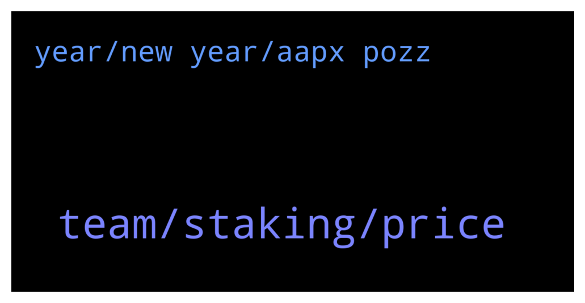

# **@ampnetapxchat**
 ## Analysis for **2021-12-28** - **2022-01-02**.

---

## 📊 **Basic Stats**

**n_messages_sent**: 30

---

---

## 🔝 **Top keywords and related messages**

1. **team, staking, price**

    @BMontana3 --- *You guys should allow us to stake, the price has completely got destroyed. Atleast get some people hope again and reward them for still holding the coin..* **--->** [TG Discussion](https://t.me/ampnetapxchat/35971)

    @PFCBLic --- *Also troop! We have to survive this ammount of food* **--->** [TG Discussion](https://t.me/ampnetapxchat/35855)

    @E_Don --- *Why's AAPX price dropping to zero?Is this project still alive or dead?* **--->** [TG Discussion](https://t.me/ampnetapxchat/35862)

    @arikthereal --- *Hi Team, who would I be able to disucss listing opportunity on BitMart with ? Verification will be provided if requested.* **--->** [TG Discussion](https://t.me/ampnetapxchat/35900)

    @<UNK> --- *You can check the latest update here https://t.me/ampnetapxchat/35378* **--->** [TG Discussion](https://t.me/ampnetapxchat/35863)

    @Hoetoevallig --- *AMPnet should be well funded, yet the level of participation and reciprocity seems to be at a minimum...* **--->** [TG Discussion](https://t.me/ampnetapxchat/35987)

2. **year, new year, aapx pozz**

    @<UNK> --- *Pozz Jakov, just working and waiting  for a new year, how about you ? 😁* **--->** [TG Discussion](https://t.me/ampnetapxchat/35945)

    @tradingjo98 --- *very excited for the new year AAPX* **--->** [TG Discussion](https://t.me/ampnetapxchat/35949)

    @<UNK> --- *Zvone here, all is well 😄* **--->** [TG Discussion](https://t.me/ampnetapxchat/35892)

    @Troop --- *Have seen this a few days ago... Quite a nice reputation! Sretan Bozic Rango! 🎄* **--->** [TG Discussion](https://t.me/ampnetapxchat/35854)

    @<UNK> --- *Merry Christmas everyone, enjoy the rest of your holidays and wish you all the best in the upcoming year🌲🎁🎉* **--->** [TG Discussion](https://t.me/ampnetapxchat/35842)

