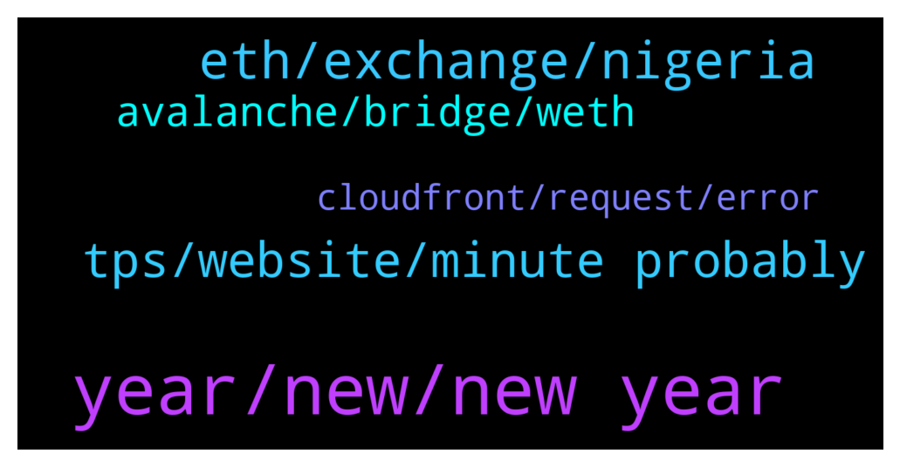

# **@avalancheavax**
 ## Analysis for **2022-01-01** - **2022-01-02**.

---

## 📊 **Basic Stats**

**n_messages_sent**: 78

---

---

## 🔝 **Top keywords and related messages**

1. **year, new, new year**

    @Michapraize --- *"Can you show me some groups for finding new upcoming avax projects?"* **--->** [TG Discussion](https://t.me/avalancheavax/319052)

    @Bebeumaf --- *2022 Starts in Red: AVAX is the Only Top 20 in Green https://cryptonews.net/2963339/?utm_source=CryptoNews&utm_medium=app&utm_campaign=shared* **--->** [TG Discussion](https://t.me/avalancheavax/318998)

    @ipeltek --- *How can I buy NFT through avax ecosystem ?* **--->** [TG Discussion](https://t.me/avalancheavax/319040)

    @Inv --- *Happy new year to the AVAX fam* **--->** [TG Discussion](https://t.me/avalancheavax/318944)

    @rolun21 --- *Happy new year! This year gonna be lit for avax 🌚* **--->** [TG Discussion](https://t.me/avalancheavax/318952)

    @Cyberks95 --- *Will avax 118 in coming hours? I am stuck with a massive long there.* **--->** [TG Discussion](https://t.me/avalancheavax/319065)

2. **eth, exchange, nigeria**

    @SumanBindra --- *How to buy BTC coin online in Nigeria* **--->** [TG Discussion](https://t.me/avalancheavax/318910)

    @ghoti42 --- *It appears I wrapped all my ETH, so now I don't have enough ETH to do part 2 lolol.  Rookie move.* **--->** [TG Discussion](https://t.me/avalancheavax/319023)

    @Nicolas_A --- *They are both decentralized exchange. TraderJoe also has lending so you could say its competing with BenQi, Aave* **--->** [TG Discussion](https://t.me/avalancheavax/319156)

    @Cyberks95 --- *Which stable coin you guys prefer over USDT?* **--->** [TG Discussion](https://t.me/avalancheavax/319074)

    @aco1731 --- *im living in Brazil.. My exchange fiat currency(real) is 6 times less valuable than usd. 60 reais is too much here..* **--->** [TG Discussion](https://t.me/avalancheavax/319031)

    @aco1731 --- *Thats the reason why i get out of eth.. you cant do nothing without losing at least 10 usd* **--->** [TG Discussion](https://t.me/avalancheavax/319030)

3. **tps, website, minute probably**

    @li --- *I need the list of validators* **--->** [TG Discussion](https://t.me/avalancheavax/319067)

    @oathtobarbatos --- *You'll find analysis and everything else here: https://t.me/avalanche_trading* **--->** [TG Discussion](https://t.me/avalancheavax/319071)

    @oathtobarbatos --- *Do you mean this one? https://avascan.info/staking/validators* **--->** [TG Discussion](https://t.me/avalancheavax/319077)

    @ghoti42 --- *It probably told me and I missed it though.* **--->** [TG Discussion](https://t.me/avalancheavax/319029)

    @Nicolas_A --- *You can find it in the link above* **--->** [TG Discussion](https://t.me/avalancheavax/318986)

    @wow1234567890 --- *This is the only website where I'm getting these by the way* **--->** [TG Discussion](https://t.me/avalancheavax/319109)

4. **avalanche, bridge, weth**

    @szh7940704 --- *Do we have an avalanche and BSC chain bridge* **--->** [TG Discussion](https://t.me/avalancheavax/319097)

    @Nicolas_A --- *You might have just wrapped your ETH into WETH and didn't yet bridge the WETH to Avalanche* **--->** [TG Discussion](https://t.me/avalancheavax/319020)

    @ghoti42 --- *I started a transfer on the Avalanche Bridge, ETH from Ethereum to Avalanche, about 20 minutes ago.  The avax bridge still shows the balance on Ethereum, even though my wallet doesn't agree.  How long does the bridge usually take?  Is there a 2nd step i'm missing?* **--->** [TG Discussion](https://t.me/avalancheavax/319016)

    @bestcoderna --- *Join us for our Avalanche Weekly Wrap-up https://twitter.com/i/spaces/1lDxLLOEwezxm* **--->** [TG Discussion](https://t.me/avalancheavax/318935)

    @hossein_barati_93 --- *Pangolin and JOE both have the same application on avalanche network?* **--->** [TG Discussion](https://t.me/avalancheavax/319155)

    @mcored --- *Hey guys, using the Avalanche ecosystem, which dApps are built for decentralized leveraged trading platform for Avalanche?* **--->** [TG Discussion](https://t.me/avalancheavax/318996)

5. **cloudfront, request, error**

    @oathtobarbatos --- *That is weird, mine works fine.* **--->** [TG Discussion](https://t.me/avalancheavax/319100)

    @Olayinka --- *Are you able to sort out the issue because I’m experiencing the same issue here as a newbie* **--->** [TG Discussion](https://t.me/avalancheavax/318994)

    @Mike --- *ok thanks, if access with vpn it returns a 403* **--->** [TG Discussion](https://t.me/avalancheavax/319149)

    @wow1234567890 --- *403 ERROR The request could not be satisfied.  Request blocked. We can't connect to the server for this app or website at this time. There might be too much traffic or a configuration error. Try again later, or contact the app or website owner.  If you provide content to customers through CloudFront, you can find steps to troubleshoot and help prevent this error by reviewing the CloudFront documentation.   Generated by cloudfront (CloudFront) Request ID:* **--->** [TG Discussion](https://t.me/avalancheavax/319110)

    @dougsmith7 --- *Hi can someone plz share the discord group link* **--->** [TG Discussion](https://t.me/avalancheavax/319034)

