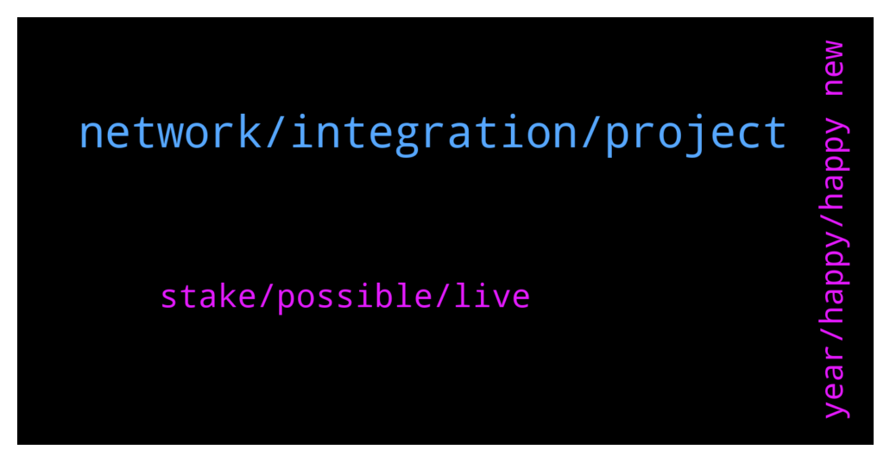

# **@chainlinkofficial**
 ## Analysis for **2022-01-01** - **2022-01-02**.

---

## 📊 **Basic Stats**

**n_messages_sent**: 58

---

---

## 🔝 **Top keywords and related messages**

1. **network, integration, project**

    @Hiroshi00 --- *Hello, I want to confirm whether chainlink partnered with a project. Who do I message* **--->** [TG Discussion](https://t.me/chainlinkofficial/358570)

    @marcromeron --- *Any integration will be announced through official channels like twitter.com/chainlink. Anything else can be considered speculation. Also you can check chainlinkecosystem.com* **--->** [TG Discussion](https://t.me/chainlinkofficial/358578)

    @CryptoMario --- *Hi,can you confirm partnership incoming with Megladoge ,thank you* **--->** [TG Discussion](https://t.me/chainlinkofficial/358727)

    @marcromeron --- *Welcome new members to the Official Chainlink Telegram Community!  Please review the pinned post for our community rules and resources.   Be aware that price/trading discussion is strictly prohibited.  New to Chainlink? Check out these resources:  - What is Chainlink? - Chainlink 2.0 Whitepaper Overview - The Community Factsheet - Explicit Staking in Chainlink 2.0  - 77 Smart Contract Use Cases Enabled By Chainlink  - The Ultimate Chainlink Deep Dive: Completing The God Protocols: A Comprehensive Overview of Chainlink in 2021   ‼️Remember: We will not PM you first. We will never ask for your passwords, keys, or funds for any reason. We don’t have special deals to offer you and there is not now nor will there ever be a Chainlink airdrop. See this article to learn how to avoid the most common scams.* **--->** [TG Discussion](https://t.me/chainlinkofficial/358547)

    @kp773 --- *Hello, in which Wallet do you recommend saving chainlink to have it in the long term?  I would not like to have it long term in an exchange.. and under what network would the chainlink be stored in a Wallet?  under the ETH network?  why for example, I use Trust Wallet, and there I can store chainlink, in ETH network and also in Binance's BEP2 network, but I don't know how good it would be to save them in Binance network .. the good thing about the network of Binance are the low commissions when sending them and when withdrawing them since in the ETH network the commissions are high .. but I feel that it is safer to save them in the ERC20 network .. what do you think?  any advice?  thank you very much group* **--->** [TG Discussion](https://t.me/chainlinkofficial/358581)

    @Shogun187 --- *Updated in what sense? CoinGecko has informstion related to current supply. The ICO detailed token allocation/usage. There is no release schedule* **--->** [TG Discussion](https://t.me/chainlinkofficial/358997)

2. **stake, possible, live**

    @nickytreez --- *I thought I read something about how link was one of 3 projects implementing a new kind of staking. Also, something about holder’s getting rewarded for partnerships* **--->** [TG Discussion](https://t.me/chainlinkofficial/358998)

    @PTournesol --- *But i try to find info about the staking with a ledger but if it s correct there is no staking. If you want to earn link you need to be an oracle to give Informations. Right ?* **--->** [TG Discussion](https://t.me/chainlinkofficial/358990)

    @PTournesol --- *So if i understand WE have to wait chainlink 2.0 before staking right ?* **--->** [TG Discussion](https://t.me/chainlinkofficial/358987)

    @Josep --- *Hello , does anyone know How much link will be required for oracles to stake?* **--->** [TG Discussion](https://t.me/chainlinkofficial/358719)

    @PTournesol --- *Hello is it possible to stake link from a ledger ?* **--->** [TG Discussion](https://t.me/chainlinkofficial/358955)

    @Linkederic --- *Staking isnt yet live, thats correct.  https://blog.chain.link/what-is-chainlink/ https://blog.chain.link/what-is-a-chainlink-node-operator/* **--->** [TG Discussion](https://t.me/chainlinkofficial/358992)

3. **year, happy, happy new**

    @Rachel165 --- *I named my dog ​​Dodge coin😂* **--->** [TG Discussion](https://t.me/chainlinkofficial/358462)

    @cnnrfr --- *Is Sergey happy with the amount of progress so far?* **--->** [TG Discussion](https://t.me/chainlinkofficial/358738)

    @Jared --- *Would love to pick his brain 1 day 🤣 he’s in 3022* **--->** [TG Discussion](https://t.me/chainlinkofficial/358888)

    @Jared --- *This will change life as we know it 🔥🔥🔥* **--->** [TG Discussion](https://t.me/chainlinkofficial/358717)

    @Heart of --- *Hello everyone . Happy new year to you all and I wish you a blessed year ahead in 2022 with great level of joy happiness and success* **--->** [TG Discussion](https://t.me/chainlinkofficial/358535)

    @WeAreTheGoodGuys --- *Happy new year 🎊🎆🎈 in 2 hours by me* **--->** [TG Discussion](https://t.me/chainlinkofficial/358485)

