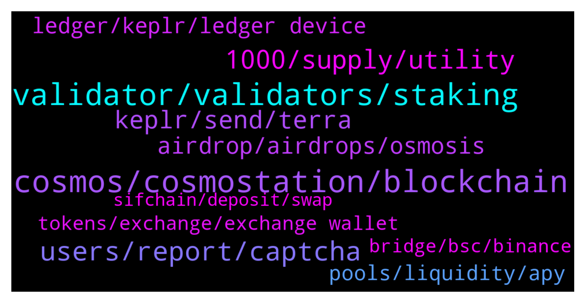

# **@cosmosproject**
 ## Analysis for **2022-01-01** - **2022-01-02**.

---

## 📊 **Basic Stats**

**n_messages_sent**: 381

---

---

## 🔝 **Top keywords and related messages**

1. **cosmos, cosmostation, blockchain**

    @anonym21 --- *Hey guys why is Cosmos doing so good in the last few days despite the bleed everywhere ? I know about interchain staking and all but that has been announced some few months ago.* **--->** [TG Discussion](https://t.me/cosmosproject/464459)

    @ZoltanAtom --- *Cosmostation has ibc feature and Osmosis dex feature too. I haven’t tried them on Cosmostation but check them out.* **--->** [TG Discussion](https://t.me/cosmosproject/465344)

    @AtomJazz --- *You need to move native Cosmos tokens form Binance to Cosmostation* **--->** [TG Discussion](https://t.me/cosmosproject/465209)

    @Cole_linz --- *I have, it's on osmosis.. I tried to send to kucoin but it fails. How can I transfer back to cosmos blockchain* **--->** [TG Discussion](https://t.me/cosmosproject/464905)

    @AtomJazz --- *It's better to use Keplr. Keplr is a specialized IBC wallet. Nothing comes close to it in Cosmos currently* **--->** [TG Discussion](https://t.me/cosmosproject/464638)

    @AtomJazz --- *Keplr or Cosmostation are the only suggested Cosmos wallets* **--->** [TG Discussion](https://t.me/cosmosproject/464410)

2. **validator, validators, staking**

    @ZoltanAtom --- *Check their uptime and also participation to the proposals  https://www.mintscan.io/cosmos/validators* **--->** [TG Discussion](https://t.me/cosmosproject/464519)

    @Matt_Blocks_United --- *You want to choose a validator that contributes to the community, has a website and a way to contact them, has some ATOM self staked so you know they have skin in the game, votes on proposals, has 100% uptime, charges between 1% and 10% commission since 0% nodes are a problem for network security and are sometimes excluded from airdrops, and is in the bottom 50 validators to help the network decentralize.   I hope that helps. You're welcome to stake with us at Blocks United. We are currently #134.  You can find us in Ledger Live, Keplr, Rainbow, Guarda, Trust wallet and Cosmostation. @jimmywh, @Brisky83, @Adammm23  We have a great staking tutorial on our blog, with video that walks you through the process from beginning to end. You can check it out here https://blocksunited.com/how-to-stake-cosmos-atom-tokens/  Happy new year!* **--->** [TG Discussion](https://t.me/cosmosproject/465330)

    @Tio --- *which validator is best to stake iyo?* **--->** [TG Discussion](https://t.me/cosmosproject/465433)

    @not a name --- *You also get a much higher apr (15% vs 5%). The only downside is 2 week unstaking period.  There is no bonding on Coinbase so you can sell your bag whenever.* **--->** [TG Discussion](https://t.me/cosmosproject/465097)

    @not a name --- *Validators verify transactions with proof of stake blockchains like cosmos. You want a healthy diverse group of validators too prevent one big validator from verifying a bad block or creating malicious transactions* **--->** [TG Discussion](https://t.me/cosmosproject/465025)

    @Cordtus --- *check their uptime and recognize that the more heavily self-delegated they are, the larger they will suffer from misbehavior or lack of performance* **--->** [TG Discussion](https://t.me/cosmosproject/465034)

3. **users, report, captcha**

    @AtomJazz --- *Yeah we know but we can't do anything about it. Be careful and trust no one. Also no admin will ever DM you first* **--->** [TG Discussion](https://t.me/cosmosproject/464652)

    @MrFalconi --- *actually if enough people report the fake groups, telegram will flag them and let users know its possibly a fake group* **--->** [TG Discussion](https://t.me/cosmosproject/464660)

    @Mark --- *is this an automated messasge all can see - re -bot-* **--->** [TG Discussion](https://t.me/cosmosproject/464453)

    @MrFalconi --- *use of a VPN to circumvent the restrictions is also prohibited,  oh well 😉* **--->** [TG Discussion](https://t.me/cosmosproject/464196)

    @bstbcl --- *can I talk to an admin* **--->** [TG Discussion](https://t.me/cosmosproject/464739)

    @M --- *Several users in private send me messages and want to enter the link* **--->** [TG Discussion](https://t.me/cosmosproject/464324)

4. **1000, supply, utility**

    @XMRTARI --- *Happy new year 🥳 could someone point me in the right direction to learn more about Atom and its utility. Ive been watching some youtube videos on it but most the stuff ive seen so far hasent been to great with the utility aspects of it.* **--->** [TG Discussion](https://t.me/cosmosproject/464836)

    @JasonOfArgonaut --- *I dont see atom going below 20 again tbh,* **--->** [TG Discussion](https://t.me/cosmosproject/464348)

    @OiKeii --- *Atom is inflationary token. Inflation is around %8,4 now.   No max. Supply. Please check current supply from cosmoscan.net* **--->** [TG Discussion](https://t.me/cosmosproject/464188)

    @Piskie13 --- *Does ATOM have a max supply, I find conflicting answers everywhere I look?* **--->** [TG Discussion](https://t.me/cosmosproject/464183)

    @rayamuro --- *Any news from atom? Why suddenly goes up these days?* **--->** [TG Discussion](https://t.me/cosmosproject/464258)

    @MrFalconi --- *I dont remember  atom ever leaving dot in the dust, I would  see dots price way ahead of atom* **--->** [TG Discussion](https://t.me/cosmosproject/464603)

5. **keplr, send, terra**

    @Tio --- *Hi, question, im trying to send my atom from exodus wallet to keplr, but it sends me a failed message, could anyone help?* **--->** [TG Discussion](https://t.me/cosmosproject/465280)

    @ZoltanAtom --- *Hi there,Juno is not supported on Keplr mobile. You should get Cosmostation app which is supported for Juno.* **--->** [TG Discussion](https://t.me/cosmosproject/465338)

    @Cole_linz --- *I'm trying to send some atom from keplr yo kucoin but it says the address is invalid :(* **--->** [TG Discussion](https://t.me/cosmosproject/464878)

    @g0_Hans --- *I can confirm that transferring Atom from Coinbase, Coinbase Pro and Binance.US to Exodus works. Thanks to all.* **--->** [TG Discussion](https://t.me/cosmosproject/465321)

    @Jorik --- *can i sell coins and get the money on my bank account with keplr* **--->** [TG Discussion](https://t.me/cosmosproject/464658)

    @DAD_DEFI --- *Problem is. When using keplr mobile and clicking terra banner. It only shows a shortcut of my keplr terra address.  So i cant send ust from terra station to kepler terra address* **--->** [TG Discussion](https://t.me/cosmosproject/465222)

6. **airdrop, airdrops, osmosis**

    @AtomJazz --- *Hey, we have a whole dedicated channel for airdrops. You'll get all your quet answered there https://t.me/CosmosAirdrops* **--->** [TG Discussion](https://t.me/cosmosproject/465184)

    @AtomJazz --- *Which other airdrop do you have in mind? Every airdrop is different. Some goes to stakeholders some to LP providers on Osmosis, some goes to JUNO stakeholders. There's no one rule when it comes to airdrops, people need to be active and keep up with developments* **--->** [TG Discussion](https://t.me/cosmosproject/465191)

    @Brisky83 --- *After that I get back atom, how about the the other airdrop?* **--->** [TG Discussion](https://t.me/cosmosproject/465182)

    @Ale_crypto89 --- *If I work into osmosis Am I eligible for airdrop!? Or I must have atom in stake!?* **--->** [TG Discussion](https://t.me/cosmosproject/465414)

    @AtomJazz --- *Yes, that's the best way. We're probably going to see massive amount of airdrops in the Cosmos ecosystem in 2022* **--->** [TG Discussion](https://t.me/cosmosproject/465193)

    @MrFalconi --- *I just noticed I have BTSG in my osmosis wallet, when did that get air dropped??* **--->** [TG Discussion](https://t.me/cosmosproject/464129)

7. **ledger, keplr, ledger device**

    @Manuel_Pregunta --- *Hello, is it possible to protect your kplr wallet with ledger I don't understand how to do it* **--->** [TG Discussion](https://t.me/cosmosproject/465232)

    @AtomJazz --- *You can connect your ledger device with Keplr and send them to the exchange from there* **--->** [TG Discussion](https://t.me/cosmosproject/464640)

    @FENiXWiN11 --- *sorry, please try later the server cannot process your request. please try again later or contact ledger support. api http 501* **--->** [TG Discussion](https://t.me/cosmosproject/465445)

    @Reus8888 --- *Hi , is there anyone have issue with 501 code error when undelegate the ATOM in ledger live ? Thanks* **--->** [TG Discussion](https://t.me/cosmosproject/465090)

    @Jorik --- *but the problem is i cant transfer atom with ledger so i cant transfer them to keplr* **--->** [TG Discussion](https://t.me/cosmosproject/464655)

    @AtomJazz --- *It is yes. All you need to to do is connect you Ledger device with Keplr wallet... https://medium.com/chainapsis/how-to-use-keplr-wallet-40afc80907f6?source=user_profile---------0----------------------------* **--->** [TG Discussion](https://t.me/cosmosproject/465233)

8. **pools, liquidity, apy**

    @shadow_dweller --- *Looking for an opinion on the osmosis liquidity pools ? First time adding liquidity via osmosis, am looking at the atom / osmo paying around 110%. Is this one of the higher performing pools ? Seeking opinions, wish to consider all things including returns, performance and IL, thanks* **--->** [TG Discussion](https://t.me/cosmosproject/465037)

    @Tio --- *just how risky are 100% apy liquidity pools ? 😬* **--->** [TG Discussion](https://t.me/cosmosproject/465466)

    @Cordtus --- *Depends where this pool is located* **--->** [TG Discussion](https://t.me/cosmosproject/465371)

    @FatiusHeadeus --- *Where can I go to solve an issue with a Liquidity pool?* **--->** [TG Discussion](https://t.me/cosmosproject/465368)

    @Cordtus --- *No more or less than 5 or 500% apy pools* **--->** [TG Discussion](https://t.me/cosmosproject/465469)

    @Cordtus --- *Provide some liquidity for the pair if you can. Many of their pools are super low liquidity I feel like the platform is just being milked for the strangely placed incentives and not many are really seriously investing there with any long term plans.* **--->** [TG Discussion](https://t.me/cosmosproject/464517)

9. **tokens, exchange, exchange wallet**

    @Mike --- *Yes I have them but I can’t send them to them to my BTSG wallet* **--->** [TG Discussion](https://t.me/cosmosproject/464833)

    @Peter Schiff --- *Send them an email describing the issue you are having. I had the same thing happen to me and it was resolved. Do not stress over it, but it might be a while as everyone is off from work* **--->** [TG Discussion](https://t.me/cosmosproject/464319)

    @Mike --- *How do we claim our BTSG tokens? Sorry if this has been asked already.* **--->** [TG Discussion](https://t.me/cosmosproject/464823)

    @Peter Schiff --- *Yeah, because of the holidays they are probably not working. The tokens are safe.. when you don’t add a memo it just ends up in the exchange’s wallet. All they have to do is track it down using the transaction ID* **--->** [TG Discussion](https://t.me/cosmosproject/464323)

    @Peter Schiff --- *If the tokens were send to an exchange wallet they can retrieve them* **--->** [TG Discussion](https://t.me/cosmosproject/464316)

    @M --- *I sent it three days ago* **--->** [TG Discussion](https://t.me/cosmosproject/464321)

10. **bridge, bsc, binance**

    @AtomJazz --- *There's no Cosmos - BSC bridge built by Cosmos devs. So whatever you use pls be careful, Binance is a centralized solution* **--->** [TG Discussion](https://t.me/cosmosproject/464402)

    @AtomJazz --- *IDK, the multisig design of those bridges is scary to say the least* **--->** [TG Discussion](https://t.me/cosmosproject/464408)

    @Ronak_PathFund --- *Greeting!  Does Cosmos provide cross-chain Token Bridge deployment service (BSC <> ETH) to other projects?* **--->** [TG Discussion](https://t.me/cosmosproject/465403)

    @interne7y --- *Do you know the best bridge to use for Cosmos to BSC?* **--->** [TG Discussion](https://t.me/cosmosproject/464396)

    @Cordtus --- *You have to use their bridge bridge.bitsong.io  (also don't trust links verify them)* **--->** [TG Discussion](https://t.me/cosmosproject/464865)

    @JasonOfArgonaut --- *Its the only atom bsc bridge i know of tbh  👍* **--->** [TG Discussion](https://t.me/cosmosproject/464411)

