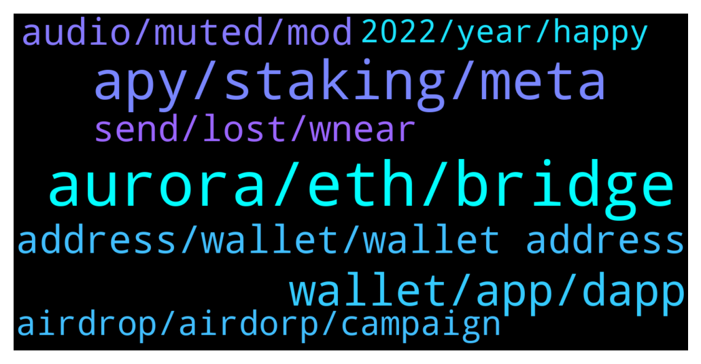

# **@cryptonear**
 ## Analysis for **2022-01-01** - **2022-01-02**.

---

## 📊 **Basic Stats**

**n_messages_sent**: 620

---

---

## 🔝 **Top keywords and related messages**

1. **aurora, eth, bridge**

    @SultanOfStock --- *https://twitter.com/synapseprotocol/status/1477382801095897088?s=21 $SYN bridge to NEAR soon , don’t sleep* **--->** [TG Discussion](https://t.me/cryptonear/258644)

    @Smart --- *aurora doesn't pay any near fees?* **--->** [TG Discussion](https://t.me/cryptonear/258599)

    @Albert --- *Idk. You said I check Aurora and I did and I gave you the answer.* **--->** [TG Discussion](https://t.me/cryptonear/257722)

    @vlhai --- *Aurora is a near staking validator with fee and they use it to cover the eth gas fee for whole aurora eco system.* **--->** [TG Discussion](https://t.me/cryptonear/258602)

    @NEARverse_xd --- *Dont deposit from your aurora mainnet. First swap it to near network and then send it to your binance's near deposit address using near network* **--->** [TG Discussion](https://t.me/cryptonear/257322)

    @DT220 --- *Morning, pinned tweets are not showing for me, could anyone help? Once I have added to Aurora Network to MM, how can I get aETH on there? Anyswap won't allow me to send anything across.* **--->** [TG Discussion](https://t.me/cryptonear/258816)

2. **apy, staking, meta**

    @Herman --- *hi guys i'm new with near protocol, is the staking like this should pick one of them? any feedback?* **--->** [TG Discussion](https://t.me/cryptonear/258912)

    @rob0008 --- *Any one know what those metapool tokens are for that we earn when staking in metapool ?* **--->** [TG Discussion](https://t.me/cryptonear/257403)

    @Herman --- *so each validator will offer different of APY?* **--->** [TG Discussion](https://t.me/cryptonear/258922)

    @rahulgoel007 --- *You can ask any questions related to validators here https://t.me/near_validators* **--->** [TG Discussion](https://t.me/cryptonear/258209)

    @Doganalpaslan1 --- *Are there any minimum limit to join as a chunk only validator?* **--->** [TG Discussion](https://t.me/cryptonear/257850)

    @Doganalpaslan1 --- *İ meant like if i have only 500 near , can i be chunk only validatör?* **--->** [TG Discussion](https://t.me/cryptonear/257851)

3. **wallet, app, dapp**

    @benloh8133 --- *Why near doesn't have a dapp wallet ?* **--->** [TG Discussion](https://t.me/cryptonear/258881)

    @pauloricarduz --- *Hello! This wallet NEAR have app Android?* **--->** [TG Discussion](https://t.me/cryptonear/258609)

    @thiszvincent --- *Please where can I download near wallet* **--->** [TG Discussion](https://t.me/cryptonear/257756)

    @thiszvincent --- *I think I like you guys wallet* **--->** [TG Discussion](https://t.me/cryptonear/257949)

    @FritzWagner --- *Yep the best advice when testing a new wallet* **--->** [TG Discussion](https://t.me/cryptonear/257625)

    @thiszvincent --- *Will there be an app later on?* **--->** [TG Discussion](https://t.me/cryptonear/257917)

4. **address, wallet, wallet address**

    @supersaiyan_goku --- *After you create a wallet address, you need to send small amount of Near to reserve the address And that's it* **--->** [TG Discussion](https://t.me/cryptonear/257877)

    @thiszvincent --- *How do I get my wallet address from the wallet 🤔* **--->** [TG Discussion](https://t.me/cryptonear/257927)

    @hvisdukane --- *I have to send it to wallet first right? When i go on pulse* **--->** [TG Discussion](https://t.me/cryptonear/258233)

    @supersaiyan_goku --- *So that is the problem you are talking about? You don't want to send small amount of Near to reserve the address, correct?* **--->** [TG Discussion](https://t.me/cryptonear/257883)

    @xingyiqi --- *How to view private key in NEAR wallet ?* **--->** [TG Discussion](https://t.me/cryptonear/258974)

    @larry_lang --- *if u want to create a NEAR wallet, i suggest u to follow this article: https://near.org/blog/getting-started-with-the-near-wallet/* **--->** [TG Discussion](https://t.me/cryptonear/258658)

5. **audio, muted, mod**

    @larry_lang --- *... well can u explain to us more on that muted incident?* **--->** [TG Discussion](https://t.me/cryptonear/258632)

    @SultanOfStock --- *There was no incident I posted a funny voice message song that brings joy to many* **--->** [TG Discussion](https://t.me/cryptonear/258633)

    @bailey_12 --- *let me play a song for everyone* **--->** [TG Discussion](https://t.me/cryptonear/257731)

    @SultanOfStock --- *And I put in a funny joyful audio message and get MUZZELED?!* **--->** [TG Discussion](https://t.me/cryptonear/258625)

    @bailey_12 --- *pls mind your language. I you will get muted next time.* **--->** [TG Discussion](https://t.me/cryptonear/257897)

    @SultanOfStock --- *Whose the admin that muted me* **--->** [TG Discussion](https://t.me/cryptonear/258622)

6. **send, lost, wnear**

    @butola_ravi --- *So if someone send wnear to exchange and in this case crypto.com they are not lost right* **--->** [TG Discussion](https://t.me/cryptonear/257605)

    @Kripto_Raptor --- *because it(that token: wNear) has a contract on the Near blockchain and they own the private key* **--->** [TG Discussion](https://t.me/cryptonear/257592)

    @kv9990 --- *Please contact Binance 🥲 looks like another case of Not your keys Not your crypto 😅* **--->** [TG Discussion](https://t.me/cryptonear/257995)

    @bailey_12 --- *If you send something to the exchange, it is always in their vault no matter it is a wrong network or wrong token to a wrong network  But it is not guaranteed for them to try to recover the fund (depending on the size and what kind of assets) . Because some vault can not be accessed since there might be no private key (or lost)* **--->** [TG Discussion](https://t.me/cryptonear/257613)

    @lordazekage --- *I don't understand the later part of this could you break it down... Not your keys not your crypto?* **--->** [TG Discussion](https://t.me/cryptonear/258003)

    @Rom --- *You should calm down mate, crypto in general are in the early phase like internet was 30 years ago, at that time you had to use command line just to send an email nowadays you can send one with a swipe of one finger. It takes times to create easy interaction. If you cannot accept this fact then just wait for it to be more mature but you will miss the huge opportunities of being an early investor. Thats your choice to make but please stop with your hate. People do no exist to satisfy your needs, you have to adapt yourself to reality, the other way around won't happen so learn to do your own research and learn patience you need it it seems* **--->** [TG Discussion](https://t.me/cryptonear/257911)

7. **airdrop, airdorp, campaign**

    @VanshMandot --- *So will there be any kind of airdrop from your side in future?* **--->** [TG Discussion](https://t.me/cryptonear/257791)

    @Neunk76 --- *well Instead of you telling me the conditions for receiving the airdorp, let me spend time watching videos, completing surveys, and knowing later that I need money. if people don't have money How will it find a solution? This melon is still like this .. and the reliability How much will I receive from someone who is disappointed? I don't want it anymore. Cock* **--->** [TG Discussion](https://t.me/cryptonear/258409)

    @GHOSTT6751 --- *Where can I see the results and winners of the near airdrop on coinmarketcap?* **--->** [TG Discussion](https://t.me/cryptonear/258857)

    @cuongdcc --- *yes, check ann, currently cmc running NEAR airdrop here: https://coinmarketcap.com/alexandria/article/learn-about-near-protocol-take-a-quiz-to-earn-400-000-of-near* **--->** [TG Discussion](https://t.me/cryptonear/257811)

    @Neunk76 --- *How do I get an Airdorp Study and NAER award? And I don't use my bag to pick up. Because I couldn't create a new wallet, because no money was transferred in 0.1 Naer, so I used Asdes from another wallet instead.* **--->** [TG Discussion](https://t.me/cryptonear/258375)

    @bailey_12 --- *Like you do some tasks and get paid in Near.* **--->** [TG Discussion](https://t.me/cryptonear/257796)

