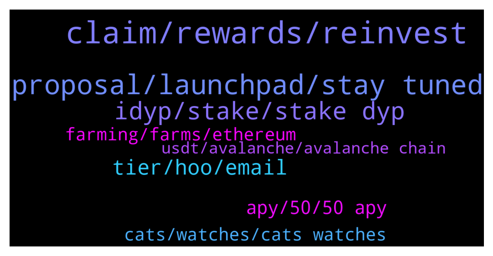

# **@dypfinance**
 ## Analysis for **2022-01-01** - **2022-01-02**.

---

## 📊 **Basic Stats**

**n_messages_sent**: 150

---

---

## 🔝 **Top keywords and related messages**

1. **claim, rewards, reinvest**

    @appliepietrade --- *now let me ask you another question. There is an option for reinvest for the staking reward. I don't quite understand it. Let's say I staked 1000 dyp and i have 10 dyp for the rewards, if I click reinvest, does this 10 dyp add back to the 1000 to get the compound?* **--->** [TG Discussion](https://t.me/dypfinance/235831)

    @robertqin86 --- *I just reinvested so I can answer this qn. Ur stake amt after reinvesting is 1010 dyp. If u are eligible to withdraw after ur lock in period it will also be 1010. Do note that reinvesting will require eth gas fees so do ur own calculations on when is the best time to reinvest.* **--->** [TG Discussion](https://t.me/dypfinance/235832)

    @appliepietrade --- *thanks sir!  I understand that reinvesting will need gas fee, so I will definitely take this into account when I do reinvest. Now thank you very much for answering my question. Happy new year to you Sir!* **--->** [TG Discussion](https://t.me/dypfinance/235836)

    @appliepietrade --- *Hi Admin, ask you a question regarding the staking 90 days, does it mean after 90 days is up, the staking amount will return back to me for withdraw or i can continue to do the staking?* **--->** [TG Discussion](https://t.me/dypfinance/235881)

    @rzm9899 --- *thanks and when i withdrawal my fund what happen? 75% was turn the selected crypto and 25% will be burned? . is mean we lose 25% of our fund?* **--->** [TG Discussion](https://t.me/dypfinance/236202)

    @JaySea99 --- *Hi, I have invested quite a bit of Eth in your Farm and was wondering what your strategy will be once Eth can no longer be mined probably 3rd quarter this year? How will rewards in Eth be maintained?.....or will Eth rewards stop altogether* **--->** [TG Discussion](https://t.me/dypfinance/236187)

2. **proposal, launchpad, stay tuned**

    @Jeffzon --- *I need a link to a launchpad.* **--->** [TG Discussion](https://t.me/dypfinance/236256)

    @BullishForeverr --- *when launchpad is going to live* **--->** [TG Discussion](https://t.me/dypfinance/236025)

    @LawrenceUncharted2 --- *Hi everybody!   Allow me to introduce myself. My name is Lawrence, I am the head of marketing at Uncharted Group. We have been searching for projects which we would like to help to achieve the next level/get more exposure. That’s why we noticed this project. We have a marketing proposal for DeFi Yield Protocol.  Who can I send the proposal?  Please refer me to right person 😀  PS please take a look at our website: uncharted . group & we are a doxxed agency!* **--->** [TG Discussion](https://t.me/dypfinance/236254)

    @DhoniMSD516 --- *The first project on launchpad will be announced soon can be by Mid Jan* **--->** [TG Discussion](https://t.me/dypfinance/236026)

    @DhoniMSD516 --- *Hey pls email your proposal to contact@dyp.finance* **--->** [TG Discussion](https://t.me/dypfinance/236000)

    @rachel_xt_agents --- *Hello iam Rachel, listing manager from XT exchange. I have a good listing proposal for you .Could you please tell me who I can talk with？* **--->** [TG Discussion](https://t.me/dypfinance/235999)

3. **idyp, stake, stake dyp**

    @v1ruzz --- *Any site where we can track LP breakdown for dyp* **--->** [TG Discussion](https://t.me/dypfinance/236016)

    @BullishForeverr --- *we need to commit our dyp ?* **--->** [TG Discussion](https://t.me/dypfinance/236029)

    @HawkeyeOz --- *tks sir, What is different of iDYP and DYP token?* **--->** [TG Discussion](https://t.me/dypfinance/236158)

    @Cengiz --- *Hey everyone. I need to move my DYP to another wallet but it is staked right now and I cannot unstake. The button just doesnt work. Is there a way around this?* **--->** [TG Discussion](https://t.me/dypfinance/236130)

    @dmitry_nv86 --- *Dear Administrator, how much do you need to block DYP for the bronze, silver, gold and platinum levels?* **--->** [TG Discussion](https://t.me/dypfinance/236238)

    @Lady --- *Pls guys can you teach me how to stake?* **--->** [TG Discussion](https://t.me/dypfinance/235896)

4. **tier, hoo, email**

    @nok_mun --- *Hoo. Com not tier 1. Rank on cmc at 129* **--->** [TG Discussion](https://t.me/dypfinance/235919)

    @nok_mun --- *I think tier 1 exchanger always use thats domain on their email. Not use yahoo..* **--->** [TG Discussion](https://t.me/dypfinance/235924)

    @ahuman516 --- *Lol what mate? If team says Tier 1 it will be tier 1 rest assured, the email id is half hidden so stop making false guess or confirmations* **--->** [TG Discussion](https://t.me/dypfinance/235923)

    @DhoniMSD516 --- *Top 5 cex are considered as tier 1* **--->** [TG Discussion](https://t.me/dypfinance/235959)

    @iamJubi --- *That is not hoo exchange. The exchange name is censored. The hoo there is the uncovered part of @yahoo.com* **--->** [TG Discussion](https://t.me/dypfinance/235920)

    @nok_mun --- *I saw it hoo. Hoo exchanger i think not tier 1 exchanger* **--->** [TG Discussion](https://t.me/dypfinance/235917)

5. **apy, 50, 50 apy**

    @iamJubi --- *Hello. APY is dynamic, it could go lower or higher.* **--->** [TG Discussion](https://t.me/dypfinance/236145)

    @ThunderChaos --- *why is bsc dyp (locked for 90 days) got such low APY (29% instead of 50%) for a long time now. what is going on? i locked for 90 days expecting at least 50%..* **--->** [TG Discussion](https://t.me/dypfinance/236144)

    @hemanrock --- *APY is dynamic and it can be decreased or increased.* **--->** [TG Discussion](https://t.me/dypfinance/235885)

    @ThunderChaos --- *and why is 50 APY advertised then?* **--->** [TG Discussion](https://t.me/dypfinance/236147)

    @appliepietrade --- *how about the apy? will it change after 3 month?* **--->** [TG Discussion](https://t.me/dypfinance/235884)

    @iamJubi --- *It was advertised as 50% APY because the pool have 50% before. APY is dynamic, it can change. APY depends on the TVL, total users, and price of tokens involed on the pool.* **--->** [TG Discussion](https://t.me/dypfinance/236148)

6. **cats, watches, cats watches**

    @EnLaMira --- *ok but the rarity will impact how much you get of that 20% delivered to cat holders? or just the quantity of cats you hold* **--->** [TG Discussion](https://t.me/dypfinance/236055)

    @iamJubi --- *#NFTGiveaway time🐱  🔥10 lucky people will get a Cats and Watches Society #NFT which starts minting on January 17, 2022👇 https://dyp.finance/nft  Enter to win: ✅Retweet ✅Tag 3 friends that loves #NFTs ✅Follow @dypfinance ✅Join https://t.me/dypfinance  #NFTCommunity #NFTdrop  👉https://twitter.com/dypfinance/status/1475805248887439360* **--->** [TG Discussion](https://t.me/dypfinance/236198)

    @hemanrock --- *the rarity will be also based on the watch value. The cats' with more expensive watches will be rarer.* **--->** [TG Discussion](https://t.me/dypfinance/236054)

    @EnLaMira --- *20% delivered to the Cats and Watches Society members.* **--->** [TG Discussion](https://t.me/dypfinance/236050)

    @dmitry_nv86 --- *good day! tell me, NFT cats can be bought for $ 250 in the BSC network?* **--->** [TG Discussion](https://t.me/dypfinance/236232)

    @EnLaMira --- *or just the quantity of cats you will be holding?* **--->** [TG Discussion](https://t.me/dypfinance/236053)

7. **farming, farms, ethereum**

    @hemanrock --- *https://www.youtube.com/watch?v=2pOUmRTMN1o&t=304s  please watch this video tutorial for reference (FARMS)   https://dyp.finance/farmv2* **--->** [TG Discussion](https://t.me/dypfinance/235825)

    @Marinecommandoz --- *Is farming here get to do with Ethereum? Admin!* **--->** [TG Discussion](https://t.me/dypfinance/235819)

    @Marinecommandoz --- *Is there any risk associated with the farming?* **--->** [TG Discussion](https://t.me/dypfinance/235830)

    @iamJubi --- *How to Farm on the #DeFiYieldProtocol and earn up to 595% APY  https://youtube.com/playlist?list=PL8K0d30DJYVPKtu_gWiu7vm73k_TnZOs4  #Avalanche #Ethereum #BinanceSmartChain #DYP  👉https://twitter.com/dypfinance/status/1476925772027858948* **--->** [TG Discussion](https://t.me/dypfinance/235913)

    @StalkerUkt --- *I have forgot on what farm I have stack how I can see it ?* **--->** [TG Discussion](https://t.me/dypfinance/236272)

    @hemanrock --- *https://dypfinance.medium.com/staking-farming-and-buyback-v2-is-live-on-binance-smart-chain-6be89f573f19  you can check about Staking, Farming, and Buyback from here* **--->** [TG Discussion](https://t.me/dypfinance/235856)

8. **usdt, avalanche, avalanche chain**

    @appliepietrade --- *Hi Heman, ask you another question. I have some USDT in my exchange, can i just send this usdt to metamask avalache network to do farming using usdt?   the reason i ask is that I try to add usdt to my metamask in avalanche network and it could not find the usdt token. The usdt token address i try to add is this:0xdac17f958d2ee523a2206206994597c13d831ec7* **--->** [TG Discussion](https://t.me/dypfinance/235889)

    @iamJubi --- *Hello. Avalanche have their version of usdt which is usdt.e.   These are the supported asset to farm on avalanche chain:  WAVAX, USDC.e, USDT.e, WETH.e, PNG, QI, XAVA, WBTC.e, LINK.e, or iDYP👇* **--->** [TG Discussion](https://t.me/dypfinance/235893)

    @DhoniMSD516 --- *BSC: https://app-bsc.dyp.finance/staking-stats AVAX: https://app-avax.dyp.finance/staking-stats ETH: https://app.dyp.finance/staking-stats-new These are the links* **--->** [TG Discussion](https://t.me/dypfinance/236020)

    @iamJubi --- *I don’t think you can. If you have avax on avalanche chain, you can swap it to usdt.e on pangolin https://app.pangolin.exchange/#/swap* **--->** [TG Discussion](https://t.me/dypfinance/235901)

    @appliepietrade --- *Thanks. so can i  swap dyp to avax and then transfer avax back to exchange, if it can be done, that will bypass the freaking eth high gas fee* **--->** [TG Discussion](https://t.me/dypfinance/235935)

    @Ye_Naing --- *I enjoyed with AVAX , APR😅* **--->** [TG Discussion](https://t.me/dypfinance/235911)

