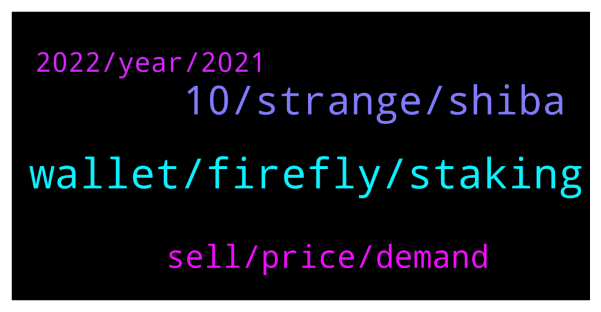

# **@iotatangle**
 ## Analysis for **2022-01-01** - **2022-01-02**.

---

## 📊 **Basic Stats**

**n_messages_sent**: 73

---

---

## 🔝 **Top keywords and related messages**

1. **wallet, firefly, staking**

    @ef4ort --- *What i mean is that  if you are not seeing it in your wallet its just as bad as you not having it the first place . and the evidence of convincing them without an email confirming the staking will be hard to prove even with the screenshot* **--->** [TG Discussion](https://t.me/iotatangle/305485)

    @ef4ort --- *But what evidence can the  crypto holder present to show there was a previous staking that disappeared except screen captures.  and what is he gurantee they will honor that  ? thanks for your contribution* **--->** [TG Discussion](https://t.me/iotatangle/305483)

    @ef4ort --- *But if that happens and you restore your wallet using your mnemonic phrase you should be able to get everything back as it was when u staked it with your staking rewards intact   i would expect but my friend found an empty wallet still showing no trace at all of any transactions whatsoever.. Could that have been an external intrusion happening within the last 24 hours while NY festivities was ongoing ?* **--->** [TG Discussion](https://t.me/iotatangle/305465)

    @Jul_Y5 --- *Crypto wallets are like web browsers. They only show what is on the server / blockchain. So if one restore his wallet he have to be able to see his funds as they were before.  All iotas are on the Tangle from technical view.* **--->** [TG Discussion](https://t.me/iotatangle/305470)

    @Tahmis --- *You do see it in your wallet. I don't understand what you mean* **--->** [TG Discussion](https://t.me/iotatangle/305488)

    @Tahmis --- *What do you mean? Staking profits can't disappear. They are on the tangle* **--->** [TG Discussion](https://t.me/iotatangle/305484)

2. **10, strange, shiba**

    @punikus --- *Guys, until the stake event I was not aware of IOTA's existence. I am about two years into crypto and I never saw a project like this. Now I believe that this one's gonna change everything. Happy holydays everybody* **--->** [TG Discussion](https://t.me/iotatangle/305468)

    @Pantra86 --- *What does shiba & doge & ..... have?* **--->** [TG Discussion](https://t.me/iotatangle/305443)

    @RevNine --- *Yeah iota is like german Car Company - Next Level shit 😎* **--->** [TG Discussion](https://t.me/iotatangle/305474)

    @lalit1414 --- *There is no one even knows about iota staking.. I talked to 10 people half of them don’t even heard about IOTA.. very strange 😎* **--->** [TG Discussion](https://t.me/iotatangle/305537)

    @Papa_Moose --- *But Shimmer and Assembly will do marketing and drag iota with them* **--->** [TG Discussion](https://t.me/iotatangle/305452)

    @antonionardella --- *Can you share what makes you so excited about IOTA?* **--->** [TG Discussion](https://t.me/iotatangle/305469)

3. **sell, price, demand**

    @Pantra86 --- *But i am wondering why there is no marketin & an strong community* **--->** [TG Discussion](https://t.me/iotatangle/305442)

    @Pantra86 --- *Ofcourse that is funny. I am talking about marketing not price for now* **--->** [TG Discussion](https://t.me/iotatangle/305445)

    @cryptokioskio --- *Dont talk like this here. Stay or sell. Only belivers here🖖* **--->** [TG Discussion](https://t.me/iotatangle/305439)

    @ElmettS96 --- *This things undoubtedly, but the question is if there is a real manipulation perpetrated by Binance (if yes how they can do that) or there are just a few holders that want to sell (not related to Binance)* **--->** [TG Discussion](https://t.me/iotatangle/305418)

    @lalit1414 --- *We are close to breakout the price but need one hard hit.. not possible without new buyers* **--->** [TG Discussion](https://t.me/iotatangle/305573)

    @satoshi_legend --- *Just put a sell order, much bigger than the market demand - and the demand will not be able to penetrate that level of equilibrium.  That said, it could be a few big individuals and not even Binance that is involved in this sell order.* **--->** [TG Discussion](https://t.me/iotatangle/305420)

4. **2022, year, 2021**

    @Cheng0228 --- *Wish everyone a happy new year.* **--->** [TG Discussion](https://t.me/iotatangle/305459)

    @elizabeth_baker --- *In 2021 the community made huge leaps which was the precursor to achieving the great milestone in 2022 💪* **--->** [TG Discussion](https://t.me/iotatangle/305500)

    @ef4ort --- *Wishing you and Everyone the same .  A prosperous and rewarding Year 2022* **--->** [TG Discussion](https://t.me/iotatangle/305467)

    @Midor --- *Don't even know what to say at the moment 😊* **--->** [TG Discussion](https://t.me/iotatangle/305580)

    @chenlin99 --- *What is your plan for today?* **--->** [TG Discussion](https://t.me/iotatangle/305567)

    @Midor --- *good morning everyone! What is not simple?* **--->** [TG Discussion](https://t.me/iotatangle/305550)

