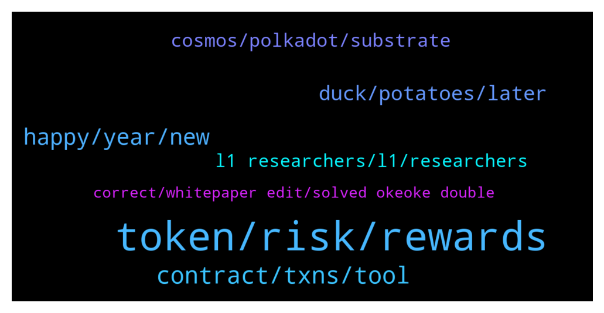

# **@lobsters_chat**
 ## Analysis for **2022-01-01** - **2022-01-02**.

---

## 📊 **Basic Stats**

**n_messages_sent**: 190

---

---

## 🔝 **Top keywords and related messages**

1. **token, risk, rewards**

    @SilkCE --- *The best strategies in DeFi for stablecoins  Aave (with leverage): Yield: 4–6% (lending interest + AVAX/MATIC rewards)  mStable: 10–20% (lending interest + swap fees + MTA rewards)  Liquity LUSD Stability Pool: 12% (ETH + LQTY rewards)  Maple Finance: 14.9%–28.5% (lending interest)  Anchor Protocol: 18%–20% (staking rewards + yield reserve)  Orion Money: 13.5%–20% (staking rewards + yield reserve + ORION rewards)  yEarn MIM-UST Vault: 21% (swap fees + CRV rewards + CVX rewards)  Trader Joe USDC.e / USDC LP: 21% (swap fees + JOE rewards)  Ribbon Finance USDC Put Selling Strategy: 19% –23% (option writing premium)  Abracadabra UST-MIM Degenbox: 20% – 156% (leveraged staking rewards + yield reserve)  —  https://stakingbits.medium.com/the-best-strategies-in-defi-for-stablecoins-e2ee102da1c4* **--->** [TG Discussion](https://t.me/lobsters_chat/312179)

    @ivangbi --- *How is “we bought some stuff early” = “reserve currency of the defi”? I am not dunking or anything, just wanna see if I missed some new narrative?* **--->** [TG Discussion](https://t.me/lobsters_chat/311991)

    @zes_eth --- *is there any papers that you are aware of that discusses potential interest rate models? I ran across this one https://members.delphidigital.io/reports/dynamic-interest-rate-model-based-on-control-theory/ but I'm looking for more literature* **--->** [TG Discussion](https://t.me/lobsters_chat/311864)

    @PmRiviere --- *Can this "[redacted] option vaults" works with so the current concentration of CVX / veCRV ?  https://blog.dopex.io/introducing-the-redacted-option-vaults-947ad9b03f9f?gi=52c82733fa0f* **--->** [TG Discussion](https://t.me/lobsters_chat/311999)

    @ivangbi --- *Will the airdrops even be enough anymore? So much sybiling and so many users now :/ Becomes too diluted* **--->** [TG Discussion](https://t.me/lobsters_chat/312021)

    @tandeloff --- *For backtests on previous strategies ribbon is expected to have some losses, but overall end up positive, see https://ribbonfinance.medium.com/theta-vault-backtest-results-6e8c59adf38c* **--->** [TG Discussion](https://t.me/lobsters_chat/312204)

2. **contract, txns, tool**

    @ivangbi --- *^ ctrl+f for more ser @MrMcflunday* **--->** [TG Discussion](https://t.me/lobsters_chat/312057)

    @PmRiviere --- *to be fair after a quick check it looked legit + no token. @Cryptocamel you can probably repost if there s something constructive to say about this* **--->** [TG Discussion](https://t.me/lobsters_chat/312138)

    @PmRiviere --- *thanks that explains the trick wonderfully. TIL Etherscan presently do not show cross-contract calls which sends 0 value. good to know!* **--->** [TG Discussion](https://t.me/lobsters_chat/311984)

    @ivangbi --- *Tbh a good level of ctrl+f + @coine_r replies work for this, some back from crypto code reviews* **--->** [TG Discussion](https://t.me/lobsters_chat/312121)

    @Caleb3th --- *Ah one thing on this though, Etherscan does that now 😁 (and I think we should).* **--->** [TG Discussion](https://t.me/lobsters_chat/311986)

    @ivangbi --- *U didn’t say this when u pirated the f out of @Dogetoshi tho :// s* **--->** [TG Discussion](https://t.me/lobsters_chat/312095)

3. **happy, year, new**

    @ivangbi --- *Ok let’s end here. Not gonna have 10K + “happy NY” posts. Enjoy u fucks and back to work in 9 hours.   Sharing foot(d) pics if ok* **--->** [TG Discussion](https://t.me/lobsters_chat/311885)

    @eceler --- *wow this is so cool, got addicted to it, there goes my new year resolutions on productiveness 😅* **--->** [TG Discussion](https://t.me/lobsters_chat/312025)

    @michael_p3711 --- *delet plz (jk been here a while its nice)* **--->** [TG Discussion](https://t.me/lobsters_chat/312197)

    @Sunny --- *Ban me if necessary, i understand* **--->** [TG Discussion](https://t.me/lobsters_chat/311906)

    @ivangbi --- *You are a sick fuck Sunny* **--->** [TG Discussion](https://t.me/lobsters_chat/311901)

    @ivangbi --- *Spam time. Share your foot(d) pics* **--->** [TG Discussion](https://t.me/lobsters_chat/311894)

4. **duck, potatoes, later**

    @ivangbi --- *Since this is a food channel tonight (ok fine!) I made a duck (+ there was a bunch of other stuff). There were roasted potatoes and stuff next to it later on. Messed up the skin a bit on the other side (not as crispy as would have liked). And no that is NOT A PENES but its neck.* **--->** [TG Discussion](https://t.me/lobsters_chat/311880)

    @Sunny --- *Looks dank af otherwise, what sauces going with it?* **--->** [TG Discussion](https://t.me/lobsters_chat/311889)

    @river0x --- *Will be putting a lot of soup on this 🤠* **--->** [TG Discussion](https://t.me/lobsters_chat/311908)

    @Caleb3th --- *Trick is in this tx: https://etherscan.io/address/0xd3c751aed3e0b6fef180bca7a98893c976df1665/advanced#internaltx  The answer was updated before the quiz started - So it isn't "lunch and dinner" but some other keccaked text* **--->** [TG Discussion](https://t.me/lobsters_chat/311982)

    @Sunny --- *All that juice down below can be used later, its heavily fatty and would be bomb af in potatoes later or like you could collect it in a mason jar and make a candle out of it to light at parties of people you don't like and their house will smell of duck forever* **--->** [TG Discussion](https://t.me/lobsters_chat/311897)

    @ivangbi --- *Just regular cranberry, no gravy (was lazy). Turned out aight, firs time making a duck (usually chicken). But roasted apples and potatoes were gud. Why the aluminum at the bottom btw?* **--->** [TG Discussion](https://t.me/lobsters_chat/311892)

5. **cosmos, polkadot, substrate**

    @Swader --- *No, Cosmos is very much a chain, a hub bridging other chains.* **--->** [TG Discussion](https://t.me/lobsters_chat/312104)

    @Swader --- *Substrate is the framework on which Polkadot and Kusama are built, yes.* **--->** [TG Discussion](https://t.me/lobsters_chat/312099)

    @tatai_007 --- *Also, I don't know why this never comes on Google when I searched for Cosmos vs polkadot comparison. Explains most of my doubts pretty well.* **--->** [TG Discussion](https://t.me/lobsters_chat/312110)

    @tatai_007 --- *So this is where I get confused about Cosmos all the time, I thought Cosmos was just an SDK that you can use to create blockchains. It doesn't have a chain itself.* **--->** [TG Discussion](https://t.me/lobsters_chat/312103)

    @Swader --- *No no, Polkadot is directly comparable to Cosmos. Cosmos is a product on whatever they use for development, Tendermint + Cosmos SDK. Polkadot is a product on Substrate.* **--->** [TG Discussion](https://t.me/lobsters_chat/312101)

    @Swader --- *Cosmos is built on its own SDK/tech, just like Polkadot is on Substrate* **--->** [TG Discussion](https://t.me/lobsters_chat/312105)

6. **l1 researchers, l1, researchers**

    @Swader --- *There is a pretty okay comparison in the wiki https://wiki.polkadot.network/docs/learn-comparisons-cosmos* **--->** [TG Discussion](https://t.me/lobsters_chat/312102)

    @Alphamint --- *What's a good channel with L1 researchers? For someone who has semi noob Qs* **--->** [TG Discussion](https://t.me/lobsters_chat/312120)

    @ivangbi --- *Biased but u can add some from mine https://twitter.com/ivangbi_/following* **--->** [TG Discussion](https://t.me/lobsters_chat/312150)

    @bernyn --- *Very agree with his post https://blknoiz06.substack.com/p/quarter-i-2022 If you are here, thanks for sharing* **--->** [TG Discussion](https://t.me/lobsters_chat/312004)

    @ivangbi --- *(sorry very not familiar, blz send links)* **--->** [TG Discussion](https://t.me/lobsters_chat/312158)

    @ivangbi --- *I feel like this stuff is still the biggest alpha* **--->** [TG Discussion](https://t.me/lobsters_chat/312134)

7. **correct, whitepaper edit, solved okeoke double**

    @danrobinson010 --- *It’s right in the whitepaper, https://uniswap.org/whitepaper.pdf* **--->** [TG Discussion](https://t.me/lobsters_chat/312084)

    @ivangbi --- *Yes u seem to be fully correct based on what I get. Ok solved, thanks.* **--->** [TG Discussion](https://t.me/lobsters_chat/312145)

    @ivangbi --- *Ah okeoke thanks for double-checking, then ye fine. Thx* **--->** [TG Discussion](https://t.me/lobsters_chat/312139)

    @tatai_007 --- *Okay okay, now it makes sense. Thanks.* **--->** [TG Discussion](https://t.me/lobsters_chat/312106)

    @vPEPO --- *Can't edit so deleted, I cross checked now and the 0x910 was correct (the first one) hehe* **--->** [TG Discussion](https://t.me/lobsters_chat/312059)

    @kuzzel --- *If you read our bug fix postmortem and Polygon’s timeline, it should be pretty clear.* **--->** [TG Discussion](https://t.me/lobsters_chat/311867)

