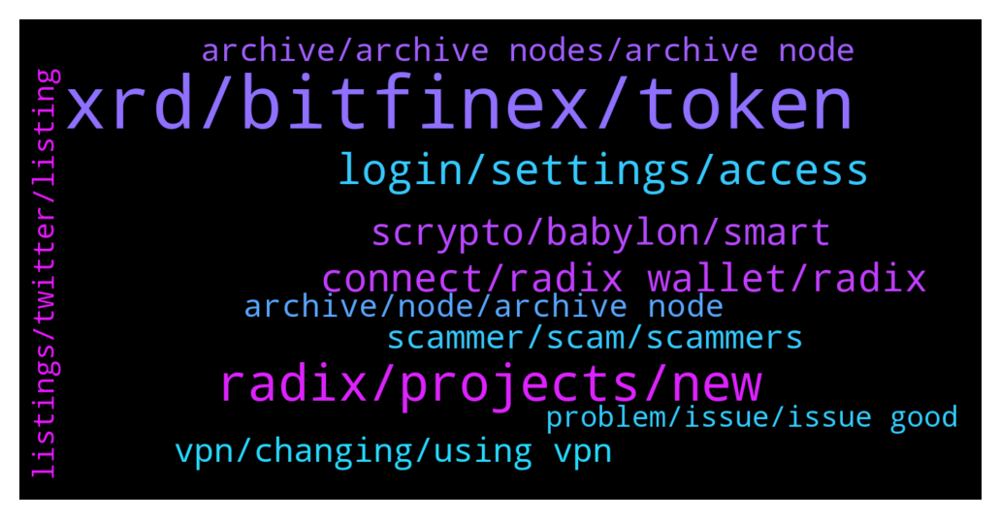

# **@radix_dlt**
 ## Analysis for **2022-01-01** - **2022-01-02**.

---

## 📊 **Basic Stats**

**n_messages_sent**: 800

---

---

## 🔝 **Top keywords and related messages**

1. **xrd, bitfinex, token**

    @redzhebhalil9 --- *Staking will end on 22 October or November this year? Is that true* **--->** [TG Discussion](https://t.me/radix_dlt/331840)

    @LetLoveLeadYou --- *Noted. I don’t like Bitfinex. Hope XRD gets listed on other exchanges soon* **--->** [TG Discussion](https://t.me/radix_dlt/331185)

    @Avaunt --- *L1 native crypto are generally referred to as 'coins'. XRD is a coin, eXRD is a token. But people quite often use either to describe the same thing.* **--->** [TG Discussion](https://t.me/radix_dlt/331497)

    @Adam --- *Strange it's asking me to do KYC to deposit a stablecoin* **--->** [TG Discussion](https://t.me/radix_dlt/331510)

    @mattalynjones --- *Is there an easier way to stake yet? Or do you still have to use the instapass?* **--->** [TG Discussion](https://t.me/radix_dlt/331975)

    @mx471 --- *slowly the main channel becomes more of an advertising channel* **--->** [TG Discussion](https://t.me/radix_dlt/331958)

2. **radix, projects, new**

    @groovelight --- *what is the roadmap in details for 2022 for radix* **--->** [TG Discussion](https://t.me/radix_dlt/331777)

    @Patrotheman --- *Hey guys a quick question, why do all projects in Radix looks like scam projects? Oci swap sounds like a meme and Doge 3 cerby… all looks like shitcoins! Why there is no serious projects? Jus a concern* **--->** [TG Discussion](https://t.me/radix_dlt/331011)

    @Steve7555 --- *Radix is clearly very advanced. But I just wonder who it will be used by. Are banks and institutions etc waiting on the sidelines?* **--->** [TG Discussion](https://t.me/radix_dlt/331122)

    @Cpt_Charles --- *We have Cassandra too. An actual live demonstration of radix tech* **--->** [TG Discussion](https://t.me/radix_dlt/331578)

    @Straydawg333 --- *Any idea when radix issue will be resolved* **--->** [TG Discussion](https://t.me/radix_dlt/331194)

    @erbseyer --- *I'm happy that the radix dev community doesnt tolerate anonymous project. I wish that would become SOP moving forward.* **--->** [TG Discussion](https://t.me/radix_dlt/331756)

3. **login, settings, access**

    @Eggplanteddie --- *Hey guys, having problems logging into my wallet. Password is 100% correct. Just nothing happens when I try to login.* **--->** [TG Discussion](https://t.me/radix_dlt/331928)

    @momoreina --- *don't you need to be logged in first for this to work? I can't even access my settings since the login page is the first thing that comes up* **--->** [TG Discussion](https://t.me/radix_dlt/331357)

    @Magal36 --- *If you can't go past the login, then what's left is to try a VPN from another region. The funds are safe and the network is functional, but indeed this wallet issue is a pain. If you can't try the VPN I suggest you wait a bit* **--->** [TG Discussion](https://t.me/radix_dlt/331306)

    @momoreina --- *Yeah the thing is that I can't login. I put in my pass and it just stays in the login page* **--->** [TG Discussion](https://t.me/radix_dlt/331360)

    @momoreina --- *though if i input a wrong password it'll tell me that it's wrong 😂* **--->** [TG Discussion](https://t.me/radix_dlt/331365)

    @Avaunt --- *Try entering your password and then waiting a minute or two* **--->** [TG Discussion](https://t.me/radix_dlt/331364)

4. **connect, radix wallet, radix**

    @Natasha --- *Actually I found it. Yesterday when wallet was down I followed steps to change to radixscan. But when I try to change to Mainet it won't allow me to?* **--->** [TG Discussion](https://t.me/radix_dlt/331819)

    @Magal36 --- *wallet.radixdlt.com Just download and install over the old one* **--->** [TG Discussion](https://t.me/radix_dlt/331233)

    @Angelica_Alonso_Pascual --- *Hello.  Happy New Year.  Since yesterday I have problems with the Radix wallet.  He lets me in, but keeps thinking and I don't see the content.   Anyone know what can it be ?.  Thanks* **--->** [TG Discussion](https://t.me/radix_dlt/331257)

    @peterjones126 --- *Hi guys, I am currently unable to access my Radix Wallet. When I click on "Connect", nothing happens. What can I do?* **--->** [TG Discussion](https://t.me/radix_dlt/330732)

    @Cpt_Charles --- *#walletissue - If you are having issues connecting with the Radix wallet, you can try to use an alternative community node in the wallet settings (see image for example)  Archive Node Addresses: https://radixtalk.com/t/what-community-archive-nodes-can-i-use-with-the-radix-desktop-wallet/156  Explorer Alternatives: https://radixscan.io* **--->** [TG Discussion](https://t.me/radix_dlt/331933)

    @mx471 --- *#walletissue - If you are having issues connecting with the Radix wallet, you can try to use an alternative community node in the wallet settings (see image for example)  Archive Node Addresses: https://radixtalk.com/t/what-community-archive-nodes-can-i-use-with-the-radix-desktop-wallet/156  Explorer Alternatives: https://radixscan.io* **--->** [TG Discussion](https://t.me/radix_dlt/331919)

5. **scrypto, babylon, smart**

    @TheCodeisTheLaw --- *I don't even know where to begin with this *criticism* 😂  "scrypto is for literal babies and hasnt been battle tested. thats like using drag and drop website templates and saying youre full stack"* **--->** [TG Discussion](https://t.me/radix_dlt/331964)

    @Bernardo --- *I believe in the vision and the fundamental (unbridgeable?) advantage in programmability and scalability.  But we need to prove that we can release quality code into the mainnet.  Consistently.  I believe we will and therefore I am staking a lot, but many large investors are not convinced yet.  Which might be ok, I guess…* **--->** [TG Discussion](https://t.me/radix_dlt/331603)

    @Jazzer9F --- *The third instalment in the blog series focusing on our new programming language, Scrypto, is now live on the blog!  https://www.radixdlt.com/post/scrypto-an-asset-oriented-smart-contract-language* **--->** [TG Discussion](https://t.me/radix_dlt/331602)

    @Jazzer9F --- *We’re pleased to announce that Radix Alexandria has launched!  Scrypto is a game-changer for DeFi, developers, you can get started with Scrypto now.  Full Announcement: https://www.radixdlt.com/post/alexandria-scrypto-is-here* **--->** [TG Discussion](https://t.me/radix_dlt/330855)

    @Ebmagic --- *Are we going to have any innovative défi apps come out with Babylon? A little like frog nation on AVAX ($time, $mim, $spell, $ice)?* **--->** [TG Discussion](https://t.me/radix_dlt/331037)

    @Jazzer9F --- *The ramp-up to Alexandria begins here 🚀  Part 1 in a series on Radix Engine and Scrypto, we break down how today's form of smart contracts are failing DeFi and failing developers.  📖 https://www.radixdlt.com/post/the-problem-with-smart-contracts-today* **--->** [TG Discussion](https://t.me/radix_dlt/331267)

6. **vpn, changing, using vpn**

    @Diablodalmabuena --- *I do not get it.  I already have a vpn.  but I don't know what I have to do* **--->** [TG Discussion](https://t.me/radix_dlt/331498)

    @d1scere --- *Your own ip, not via a vpn.* **--->** [TG Discussion](https://t.me/radix_dlt/331709)

    @pastet89 --- *As I said, I tried 3 countries from a VPN, no luck.* **--->** [TG Discussion](https://t.me/radix_dlt/331708)

    @MattToTheMoon --- *My vpn isn’t working either despite it being located in Austria. Bitfinex was still picking up my actual location. Either bitfinex upped their game or the vpn isn’t configured to mask your location.* **--->** [TG Discussion](https://t.me/radix_dlt/331509)

    @pastet89 --- *OK... I downloaded ProtonVPN but the free version provides just Netherlands, USA, Japan. Is it even worth trying with those? I don't want to install my wallet on a Windows PC if it would not work. Can you confirm only Portugal, India and UK work for the VPN?* **--->** [TG Discussion](https://t.me/radix_dlt/331387)

    @pastet89 --- *Just tried, didn't work. Looking for VPN now* **--->** [TG Discussion](https://t.me/radix_dlt/331327)

7. **scammer, scam, scammers**

    @HelmutSch --- *I assume Emre is a scammer as he just contacted me? In case he is please be aware and remove him from this group.* **--->** [TG Discussion](https://t.me/radix_dlt/330950)

    @MassieFur --- *He is a scammer and is not in this group. Thansk for flagging* **--->** [TG Discussion](https://t.me/radix_dlt/330952)

    @fpieper --- *@NotBen you joined the scammer business 😂😜* **--->** [TG Discussion](https://t.me/radix_dlt/331627)

    @AndreVon777 --- *I've been approached by 5 scammers today* **--->** [TG Discussion](https://t.me/radix_dlt/331427)

    @satoshixy --- *All scammers have terrible English. One way to know a scammer.* **--->** [TG Discussion](https://t.me/radix_dlt/330970)

    @Natasha --- *Ok thanks. So does that mean I can only allocate a certain amount to be reduced every two weeks? I have just had msg and phone call that I declined from scammer.* **--->** [TG Discussion](https://t.me/radix_dlt/331782)

8. **archive, archive nodes, archive node**

    @Magal36 --- *it's new years eve gguys. I wouldn't be looking into it if I were the team 😂😂😂 Funds are safu, consensus is working fine, just switch to a community archive node and you'll be ok* **--->** [TG Discussion](https://t.me/radix_dlt/330901)

    @fpieper --- *https://status.radixdlt.com/  when will the current issues with the archive nodes be resolved?* **--->** [TG Discussion](https://t.me/radix_dlt/331389)

    @MassieFur --- *If you logged in, you'll be send to settings where you can change the archive node* **--->** [TG Discussion](https://t.me/radix_dlt/331358)

    @Magal36 --- *When new archive node architecture is implemented after the new API. In a couple of weeks. Right now the solution is changing archive nodes as stated on pinned message* **--->** [TG Discussion](https://t.me/radix_dlt/331200)

    @Ashley --- *Read the pinned message, you need to change the archive node on the main net to one of the given trusted community archive nodes* **--->** [TG Discussion](https://t.me/radix_dlt/331553)

    @Frosties --- *Archive node is probably updating switch to another node as per Avaunts posts above* **--->** [TG Discussion](https://t.me/radix_dlt/331372)

9. **archive, node, archive node**

    @Magal36 --- *nope, I just noticed by the amount of people in here. But be sure the issue is only with archive nodes, validators are doing their job, consensus is fine, funds are safu* **--->** [TG Discussion](https://t.me/radix_dlt/330806)

    @Radstakes --- *All of the community archive nodes listed here are from well known validators and radvocates which should give some peace of mind.  https://radixtalk.com/t/what-community-archive-nodes-can-i-use-with-the-radix-desktop-wallet/156?u=faraz.* **--->** [TG Discussion](https://t.me/radix_dlt/331102)

    @ahsimon --- *Its a good question, but one I don't expect a definitive answer to until we are closer to Xi'an release.  Only with Xi'an is your scenario of 10,000 nodes even possible.  My best guess is that Xi'an will come with a whole new approach for validator and archive node business models.  And we will learn more about them as we approach 2023 EOY, and will have plenty of time to discuss before it is used.  One possible approach makes your questions moot.  Specifically one can allow any wallet owner to be responsible for their own node functionality.  That way you don't have to "trust" a validator or archive node you probably know nothing about.  You just have to trust that the code that allows you to upgrade to a new wallet has been audited, and has some form of spoof-proof update process, perhaps using a 2FA.    One future difference in the validator/node/archive model could be that it does not depend on 24/7 availability of your built-in node.  If you close your wallet when you are done with it, either for security reasons or to save battery life on your mobile, you have to anticipate some delay between when you load your wallet the next time and when it is ready for full use again.  During this delay your local archive node re-synchs with the Radix ledger before you can use it again.  You can avoid this start-up delay by keeping your wallet open until you are no longer actively using it.  I think you can see this effect today when you use https://radix.stream/.  I remember seeing it on some older software wallets I have used sporadically, such as iirc Daedalus.  The only other approach I know of is to provide some financial incentive for third party "trusted" node runners to run a 24/7 archive node (or load balanced archive node pool) for you (and others).  That is, for a zero delay archive node service to be self-supporting those users who want it must somehow pay for it.* **--->** [TG Discussion](https://t.me/radix_dlt/331557)

    @Peter (HAM) --- *Okay, I got that. But what can happen when using a bad guys archive node?* **--->** [TG Discussion](https://t.me/radix_dlt/331103)

    @MassieFur --- *Im not sure. But I believe you could trust most validators if not all* **--->** [TG Discussion](https://t.me/radix_dlt/331047)

    @Magal36 --- *Yes, they are trusted nodes runned by the community* **--->** [TG Discussion](https://t.me/radix_dlt/330838)

10. **problem, issue, issue good**

    @Radix_tothemoon --- *does anyone can solve the problem？* **--->** [TG Discussion](https://t.me/radix_dlt/331881)

    @Flint --- *Gotcha! Yeah that works work except I like a couple of them 😁* **--->** [TG Discussion](https://t.me/radix_dlt/331428)

    @pastet89 --- *Another use reported the same issue* **--->** [TG Discussion](https://t.me/radix_dlt/331318)

    @AndreVon777 --- *That's good to know! I'll just wait for the issue to be resolved rather than try it myself. Don't want to break anything* **--->** [TG Discussion](https://t.me/radix_dlt/331283)

    @Tokyorider1611 --- *ok good, then the problem is not on my side* **--->** [TG Discussion](https://t.me/radix_dlt/330699)

    @Blake --- *Read above. Someone posted a solution already* **--->** [TG Discussion](https://t.me/radix_dlt/330785)

