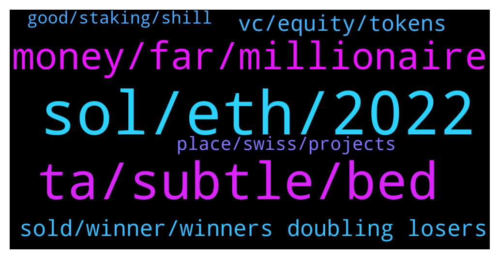

# **@shitpool**
 ## Analysis for **2022-01-01** - **2022-01-02**.

---

## 📊 **Basic Stats**

**n_messages_sent**: 167

---

---

## 🔝 **Top keywords and related messages**

1. **sol, eth, 2022**

    @goldencatpat --- *no, its over for sol too* **--->** [TG Discussion](https://t.me/shitpool/713496)

    @spaceVersity --- *Yeah I'm fuxkn with DYDX full time.. that's my pick from what you mentioned. Also have MANA, SOL and DOT* **--->** [TG Discussion](https://t.me/shitpool/713559)

    @BlockChainUp --- *Firstly, I dint said it is over for Sol, you said. Avax I just dont know.... My 2022 thesis is ETH is old tech* **--->** [TG Discussion](https://t.me/shitpool/713502)

    @MoneroPal --- *lol you have no clue brah, let me guess, Avalache is the new holy savior, there won’t be one overwhelmingly dominant L1. Hyper fragmentation coming for private and public chains, SOL definitely is not going absolutely anywhere, Terra and Solana will likely be top 3 along with ETH. Stables, institutional platforms, and well ETH.* **--->** [TG Discussion](https://t.me/shitpool/713499)

    @BeAMightyKing --- *I've been looking into Velas (VLX): Solana fork with their own EVM implementation, & Casper Network as of lately.  By "looking into" I mean I most likely won't buy until they > 10x and land on Binance, then cry later* **--->** [TG Discussion](https://t.me/shitpool/713384)

    @BeAMightyKing --- *There's also Kadena, initially mentioned here a thousand years ago, and Hathor. Both PoW L1s* **--->** [TG Discussion](https://t.me/shitpool/713387)

2. **ta, subtle, bed**

    @MoneroPal --- *If you’re refering to TA, sigh, just the very fact that you’re refering to TA…* **--->** [TG Discussion](https://t.me/shitpool/713509)

    @BeAMightyKing --- *nah I wasn't specifically referring to you, just in general* **--->** [TG Discussion](https://t.me/shitpool/713370)

    @wanker007 --- *Kidding. I don't touch this trash lol* **--->** [TG Discussion](https://t.me/shitpool/713565)

    @spaceVersity --- *They way you're talking, I'm trying to understand you. You're making sense and yet still putting some words out which I'm still trying to understand* **--->** [TG Discussion](https://t.me/shitpool/713539)

    @notdao --- *Yeah I'm aware :) though not sure what exactly we're doing together tbh. Must be above my pay grade* **--->** [TG Discussion](https://t.me/shitpool/713247)

    @goldencatpat --- *my entry was earl(ish) but not spectacular* **--->** [TG Discussion](https://t.me/shitpool/713441)

3. **money, far, millionaire**

    @grammi --- *Imagine being a multi millionaire from crypto but can’t do anything with it Bc you are too afraid to declare your gains* **--->** [TG Discussion](https://t.me/shitpool/713220)

    @kekurikekukaka --- *Imagine living in a shithole where you're afraid of being taxed.* **--->** [TG Discussion](https://t.me/shitpool/713214)

    @MoneroPal --- *Honestly, it is hyper repetitive. The majority of the people in this space lack a baisc understanding of how money, economies, and generally value work. They think everything has changed and somehow their ignorance will be rewarded and there will be some sort of shift of balance of power towards the ignorant and uneducated as if it was some sort of revolution to dethrone the world financial system.   What they don’t understand is all the money is still being made by the same people. The crypto VC and quant funds. The few lucky lottery winners made a bit more then they would’ve at their regular jobs, but are far from wealthy, and don’t know what to do next as it is getting far harder to build wealth.* **--->** [TG Discussion](https://t.me/shitpool/713546)

    @spaceVersity --- *I agree with you, but disagree with your statement saying "it's far harder to build wealth"* **--->** [TG Discussion](https://t.me/shitpool/713547)

    @grammi --- *My LP is a pain to do my taxes on due to IL and due to mix of fees you get back* **--->** [TG Discussion](https://t.me/shitpool/713210)

    @ThicccRacer --- *Lol whoever the multi millionaire in is in this scenario is fucking retarded. Pay the taxes and enjoy still being a millionaire* **--->** [TG Discussion](https://t.me/shitpool/713223)

4. **sold, winner, winners doubling losers**

    @BeAMightyKing --- *imagine selling winners & doubling down on losers* **--->** [TG Discussion](https://t.me/shitpool/713366)

    @goldencatpat --- *ah we got an emoooooootional trader amongst us fam* **--->** [TG Discussion](https://t.me/shitpool/713516)

    @Horselorde --- *I sold my DOT today lmao* **--->** [TG Discussion](https://t.me/shitpool/713475)

    @goldencatpat --- *ahhhhhhh im buying more based on my emooooooooootions* **--->** [TG Discussion](https://t.me/shitpool/713517)

    @sumtemm --- *nice glad you made some good money* **--->** [TG Discussion](https://t.me/shitpool/713472)

    @monkey993 --- *I sold winner and doubled down on winner* **--->** [TG Discussion](https://t.me/shitpool/713368)

5. **vc, equity, tokens**

    @MoneroPal --- *Almost all crypto VC’s invest solely in equity not tokens* **--->** [TG Discussion](https://t.me/shitpool/713550)

    @spaceVersity --- *What do you invest in Sir, equity or tokens?* **--->** [TG Discussion](https://t.me/shitpool/713555)

    @MoneroPal --- *Many dear ser are you in the VC space? Most VC’s do not want liquidity. They also need to be able to onboard investors and do things compliantly so equity is preferred. Most VC’s, even crypto focused, are registered in their respective jursidictions to onboard investors including offshore (BVI and so on) feeder funds. A few “vc’s” popped up, the gp was just some nobody who made a bit of money apeing his 9-5 salary into crypto, no even legal entity behind the funds.* **--->** [TG Discussion](https://t.me/shitpool/713558)

    @MoneroPal --- *There are a few tokens I like, but mostly equity, LUNA is one, UST has real use and it requires LUNA to mint UST. Trade finance, remittence, and general transactions, actual fundamentals on the Terra front. There are also many derivatives exchanges like Ribbon, Vega, DyDx and many more that are very profitable, again fundamentals, that are great investments. DyDx is the most profitable project after OpenSea.* **--->** [TG Discussion](https://t.me/shitpool/713557)

    @MoneroPal --- *Majority do invest in equity only, rarely tokens* **--->** [TG Discussion](https://t.me/shitpool/713554)

    @AsianFever --- *:: RAILGUN & METIS PARTNERSHIP ::  RAILGUN Project is partnered with METIS! The teams working on Metis and RAILGUN are excited to combine their forces to advance both causes, and bring privacy to scalability systems. The METIS team are clever and determined, and the RAILGUN contributors are thrilled to build on this partnership. Both teams were active presenters in the DEFICON conference earlier this month.  https://twitter.com/MetisDAO/status/1476589526797664257* **--->** [TG Discussion](https://t.me/shitpool/713245)

6. **place, swiss, projects**

    @goldencatpat --- *and no, i will not 'look them up'* **--->** [TG Discussion](https://t.me/shitpool/713537)

    @Horselorde --- *What about those that just found rekt city 😂* **--->** [TG Discussion](https://t.me/shitpool/713280)

    @MoneroPal --- *should blur the txid as well* **--->** [TG Discussion](https://t.me/shitpool/713538)

    @MoneroPal --- *you have no edge just chats and twitter lol* **--->** [TG Discussion](https://t.me/shitpool/713520)

    @Da123kek --- *If you want to call DOT a swiss project* **--->** [TG Discussion](https://t.me/shitpool/713404)

    @plus_plusplus --- *stop shilling your IDOs, this is not an appropriate place* **--->** [TG Discussion](https://t.me/shitpool/713314)

7. **good, staking, shill**

    @grammi --- *Yes I also like staking because it’s much easier tax wise since it’s 1 sided* **--->** [TG Discussion](https://t.me/shitpool/713209)

    @Gregoranus --- *Are you well up on it? Yield farming probably going to be a good play this this year if we crab for most of it. Shitpool needs to be on it, even if just a hedge of the hedge.* **--->** [TG Discussion](https://t.me/shitpool/713439)

    @Gregoranus --- *You see this? Staking this year apparently announced.* **--->** [TG Discussion](https://t.me/shitpool/713591)

    @pizza_dog --- *Yeah you could get the 0% loan, turn the mim into ust and collect the 19.5% interest* **--->** [TG Discussion](https://t.me/shitpool/713264)

    @pizza_dog --- *hmm 0% interest lending pool on abra for ether. Seems a little too good to be true* **--->** [TG Discussion](https://t.me/shitpool/713251)

    @Gregoranus --- *Ahh, I thought you was staking, you mean just the token. Is the price correlated to the pool size directly do you know or is a “no token needed” situation? You got a good shill before I deep dive?* **--->** [TG Discussion](https://t.me/shitpool/713445)

