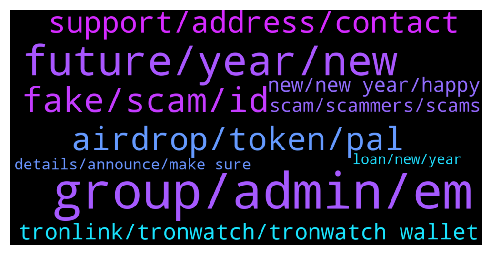

# **@tronnetworkEN**
 ## Analysis for **2022-01-01** - **2022-01-02**.

---

## 📊 **Basic Stats**

**n_messages_sent**: 248

---

---

## 🔝 **Top keywords and related messages**

1. **group, admin, em**

    @Carlos_TRX --- *He is impersonating me, an admin wont pm you* **--->** [TG Discussion](https://t.me/tronnetworkEN/3804094)

    @maestrostoic --- *Same name same profile is talking to me in pm, if you are here then who is that* **--->** [TG Discussion](https://t.me/tronnetworkEN/3804056)

    @Carlos_TRX --- *I told you that @PiterSpain answered you, if u have change something pls let him to know. Likewise, to access the group you have to be a reliable and participative person in the group showing that you collaborate, it is not enough to have 100k TRX* **--->** [TG Discussion](https://t.me/tronnetworkEN/3804102)

    @ccmedianetwork --- *Carlos, i write you direct, please look and answered, thx* **--->** [TG Discussion](https://t.me/tronnetworkEN/3804097)

    @ccmedianetwork --- *Carlos, i can write you directly first? thx. i have one question about whale group* **--->** [TG Discussion](https://t.me/tronnetworkEN/3802504)

    @ClaraJacob1 --- *Okay, makes sense that why I referred to an admin who's most likely got better info than the rest of us.* **--->** [TG Discussion](https://t.me/tronnetworkEN/3803991)

2. **future, year, new**

    @Tobby --- *Can somebody tell me what is future prospect of tron* **--->** [TG Discussion](https://t.me/tronnetworkEN/3803906)

    @Surender --- *Anyone tron team member who can help me. Please* **--->** [TG Discussion](https://t.me/tronnetworkEN/3803173)

    @thebigguns --- *Most of the TRX community doesn’t know that this is even happening* **--->** [TG Discussion](https://t.me/tronnetworkEN/3803815)

    @skyeyes83 --- *Good year to all Tron Community!* **--->** [TG Discussion](https://t.me/tronnetworkEN/3801611)

    @agentpiki --- *2022 and still give ghost followers* **--->** [TG Discussion](https://t.me/tronnetworkEN/3801957)

    @kthakar44 --- *In future any value or not??* **--->** [TG Discussion](https://t.me/tronnetworkEN/3804007)

3. **fake, scam, id**

    @Arjung15 --- *Tron nz problem, anybody know about it* **--->** [TG Discussion](https://t.me/tronnetworkEN/3801539)

    @A11997700 --- *Im not sure to be honest. I Participated on TronPad.Network ido.* **--->** [TG Discussion](https://t.me/tronnetworkEN/3804473)

    @Gasperinix --- *I tried but my post was deleted ... I got a link about tron and I wanted to know if it is legit* **--->** [TG Discussion](https://t.me/tronnetworkEN/3802664)

    @agentpiki --- *Did you know:  There are fake XRPs, fake ADAs, fake SHIBs, fake DOGEs   most of which in TRC10 form.   BSC and TRC are not interchangeable* **--->** [TG Discussion](https://t.me/tronnetworkEN/3802287)

    @Xieon1 --- *I know both of that. What threw me is that official website lists the TRN token ID as their official ID and their pancake swap for that chain.   I don't think it's a fake token like the others, maybe a slick way to drive up hype, but a ton of users will eventually come to them and say hey you said token #xxxx is official on Tron...whats going on.   I'll update you as I contacted them* **--->** [TG Discussion](https://t.me/tronnetworkEN/3802293)

    @onlinekeya --- *Why someone are talking me fake supports ...??? They need my phrase key ... Please send me true website and get tron 🙏* **--->** [TG Discussion](https://t.me/tronnetworkEN/3801521)

4. **airdrop, token, pal**

    @Hiffeh --- *Pls I have not gotten the token..why* **--->** [TG Discussion](https://t.me/tronnetworkEN/3801813)

    @Xieon1 --- *Yes, I know, I don't know if you know much about PAL, but it's actually a legit project, traded on BSC, and it's out of India.   I got airdropped the tokens worthless in August, then last month they became worth a lot, according to safepal still are.   Not sure what the end game was? Tokens you can't sell and didn't buy? Very strange to me.  But not going to beat a dead horse, thanks for talking 2 me about it* **--->** [TG Discussion](https://t.me/tronnetworkEN/3802280)

    @Xieon1 --- *Unfortunately Sunswap, and the one you listed dont have it listed, and theres a lot of mis info about it.   Sometimes people say it's worthless because I didn't trade it to dextrade in time becausse they were a sponsored exchange.   Just frustrating when I open my acccounts on Safepal and see hundrends in PAL(TRN-10) token and nothing to do with it :(* **--->** [TG Discussion](https://t.me/tronnetworkEN/3802265)

    @Lekco_23 --- *There's tron airdrop live now ?* **--->** [TG Discussion](https://t.me/tronnetworkEN/3803140)

    @Xieon1 --- *Hey guys, is there anything I can do with the TRC10 PAL Token?* **--->** [TG Discussion](https://t.me/tronnetworkEN/3802242)

    @Xieon1 --- *It says it's worth quite a bit but theres no way to do anything with it? I got it airdroped for staking a while back?* **--->** [TG Discussion](https://t.me/tronnetworkEN/3802246)

5. **support, address, contact**

    @Surender --- *From my zeb pay account to binanance account* **--->** [TG Discussion](https://t.me/tronnetworkEN/3803162)

    @rashidasari --- *Dear Sir why I'm not withdrawal my tron?* **--->** [TG Discussion](https://t.me/tronnetworkEN/3801868)

    @GajendraMahesh --- *I am withdrawing 473 trx on binance to Lbank, transfer is successful but I don't recived on lbank and i am also check on tronscan network what is issue* **--->** [TG Discussion](https://t.me/tronnetworkEN/3802358)

    @papara_x --- *guys i accidentally sent to usdt tether smart contract ( https://tronscan.org/#/contract/TR7NHqjeKQxGTCi8q8ZY4pL8otSzgjLj6t )  is there any way to revert it?  DEVELOPERS OF TRONLINK THERE IS HUGE UX PROBLEM IN YOUR CHROME EXTENSION when you click tether asset on tronlink there is an address which is clickable, has copy button. people mistakenly understands that it is their address but its actually contract address. why do you even make a copy icon on contract address?* **--->** [TG Discussion](https://t.me/tronnetworkEN/3802753)

    @Surender --- *Dear tron team Please🙏 help me I have transferred 8638.28 trx by trc20 network but not received till now. Time around 5hrs back.  Please help me.* **--->** [TG Discussion](https://t.me/tronnetworkEN/3803120)

    @templariotuga --- *No one can help you only the exchange where you withdraw it* **--->** [TG Discussion](https://t.me/tronnetworkEN/3803175)

6. **tronlink, tronwatch, tronwatch wallet**

    @Travis --- *Jason.. you must be new bro. lol.  Tronwatch wallet was shit.* **--->** [TG Discussion](https://t.me/tronnetworkEN/3803625)

    @Travis --- *well then you know the problem w the tronwatch wallet.* **--->** [TG Discussion](https://t.me/tronnetworkEN/3803630)

    @Travis --- *also,  the tronwatch wallet was completely shelved by the same developers as the tronlink wallet but the integration of the two is non existent.  too bad i forgot to get back to this issue a year or so ago and it would be easier but as it stands, tronwatch wallet gave shitty mnemonics and the keystore or the private key will not unlock my tokens.* **--->** [TG Discussion](https://t.me/tronnetworkEN/3803556)

    @Carlos_TRX --- *No  buy all that u need and open a wallet in tronlink, 1.1 TRX is needed to activate the account* **--->** [TG Discussion](https://t.me/tronnetworkEN/3804054)

    @ciptauntuknadzir --- *TronTxt wallet also in Tron group or no* **--->** [TG Discussion](https://t.me/tronnetworkEN/3801777)

    @... --- *Hello, why can't I convert or exchange PLAYANDLIKE TRX10 digital currency in tron ​​link pro wallet? Please help me* **--->** [TG Discussion](https://t.me/tronnetworkEN/3802778)

7. **new, new year, happy**

    @blacksheepbsc --- *Happy new year 🥳 from @blacksheepcoin* **--->** [TG Discussion](https://t.me/tronnetworkEN/3802360)

    @legalsahil --- *Wishing all a very happy new year!!* **--->** [TG Discussion](https://t.me/tronnetworkEN/3801928)

    @Elia724 --- *Hello, Happy New Year everyone! 🎉🪅🎊🙆‍♀️* **--->** [TG Discussion](https://t.me/tronnetworkEN/3801842)

    @AnaSs --- *Happy new year to you ❤️❤️❤️❤️❤️* **--->** [TG Discussion](https://t.me/tronnetworkEN/3801652)

    @simon866 --- *Same to you have a great new year 🍾👌* **--->** [TG Discussion](https://t.me/tronnetworkEN/3801613)

    @avisoloz --- *Happy new you Friends wish guys a blessed life ahead* **--->** [TG Discussion](https://t.me/tronnetworkEN/3802625)

8. **scam, scammers, scams**

    @Gasperinix --- *OMG I ask Carlo’s help and wtf 10 scammers in a second* **--->** [TG Discussion](https://t.me/tronnetworkEN/3802595)

    @Xieon1 --- *All of the chains need to increase the cost to pull these scams. BSC Is so cheap I have like trillions of scam tokens.   Dont get those on ETH anymore because of the gas fee to pull scam.   Wish there was some way to deal with all these scams and crap.   I've lost a lot of money, learned a lot, but still, I hate to see honest people get robbed* **--->** [TG Discussion](https://t.me/tronnetworkEN/3802300)

    @Excellent --- *Thanks. I see why scammers are on the rise... KYC should be looked into in connection to every wallet address...* **--->** [TG Discussion](https://t.me/tronnetworkEN/3803039)

    @MilNoslen --- *Sounds like a scam, so don't bother* **--->** [TG Discussion](https://t.me/tronnetworkEN/3803566)

    @Xieon1 --- *So frustrating. I can't stand what scammers to do the hard working people of these communities.   I didn't lose anything, but still its frustrating.* **--->** [TG Discussion](https://t.me/tronnetworkEN/3802276)

    @TERRIFICZ --- *Ofcourse they are mostly fake and scam 😜* **--->** [TG Discussion](https://t.me/tronnetworkEN/3803216)

9. **details, announce, make sure**

    @simon866 --- *We won, still waiting for Bitpay to update details regarding listing so let's keep an eye on them and make sure it's done 👊* **--->** [TG Discussion](https://t.me/tronnetworkEN/3804089)

    @Nobupalasar --- *So when do you think BitPay will announce ?* **--->** [TG Discussion](https://t.me/tronnetworkEN/3802107)

    @maestrostoic --- *Yes I will remember it for future😂* **--->** [TG Discussion](https://t.me/tronnetworkEN/3804096)

    @simon866 --- *Probably when most teams are back and they add the wallet details around second week of Jan but we will keep asking to make sure 👍* **--->** [TG Discussion](https://t.me/tronnetworkEN/3802414)

    @SchooleyD --- *What you should ask is when will BTC Hit bottom 🥳* **--->** [TG Discussion](https://t.me/tronnetworkEN/3801478)

    @PiterSpain --- *They have to announce it yet* **--->** [TG Discussion](https://t.me/tronnetworkEN/3803406)

10. **loan, new, year**

    @Gallant20 --- *I want to change with $5000 busd* **--->** [TG Discussion](https://t.me/tronnetworkEN/3803102)

    @Mehmood --- *I am invest 500$ tell me good coins  I am new* **--->** [TG Discussion](https://t.me/tronnetworkEN/3801408)

    @Hello --- *Hi. We loan for people who who wants to start up a little business, Can you?  ✍️ Who need a loan?  💰 How much we offer? $10,000 - $50 million.   Payment in crypto you like.  🔥 When to loan  Now!  💬 Interested? PM  👉@FR_TD* **--->** [TG Discussion](https://t.me/tronnetworkEN/3804564)

    @Alice --- *The cryptocurrency market is very volatile right now, and I wouldn't recommend any currency to you. If you want to learn more about crypto,* **--->** [TG Discussion](https://t.me/tronnetworkEN/3804528)

    @Sibbu_singh777 --- *Happy new year frnds.. i wish you all make huge amount of money in every crypto trade this year..* **--->** [TG Discussion](https://t.me/tronnetworkEN/3802623)

    @simon866 --- *Same as ETH and BTC there is no CEO as it's now decentralized 👍* **--->** [TG Discussion](https://t.me/tronnetworkEN/3802433)

