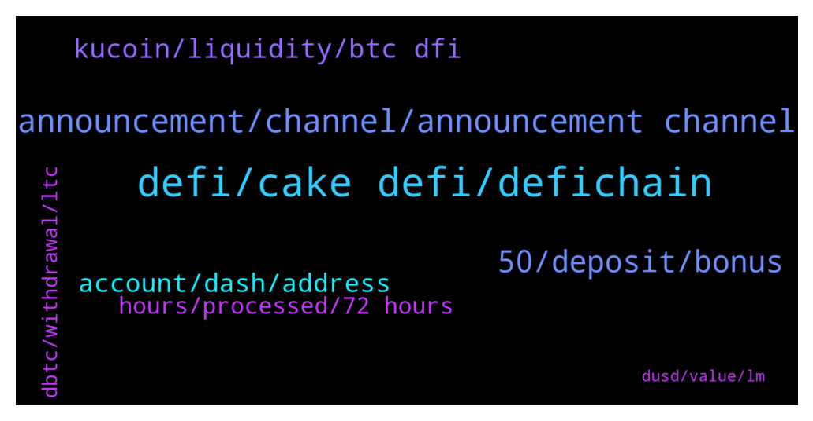

# **@CakeDeFi_EN**
 ## Analysis for **2022-01-02** - **2022-01-03**.

---

## 📊 **Basic Stats**

**n_messages_sent**: 427

---

---

## 🔝 **Top keywords and related messages**

1. **defi, cake defi, defichain**

    @eud --- *Hey there, I've made a DFI deposit on CAKE like I usually do, but it's not showing as either pending or completed despite having 35+ confirmations. Is this normal? I've double checked everything and it should be good* **--->** [TG Discussion](https://t.me/CakeDeFi_EN/159867)

    @moneydelics --- *Hey, Priya! I made a step by step tutorial for Cake DeFi new users. Hope it helps 😊  https://m.youtube.com/watch?v=D_98N4jx0fo&feature=youtu.be* **--->** [TG Discussion](https://t.me/CakeDeFi_EN/159145)

    @afiflotfi --- *Direct to cake defi.. no need defi chain wallet?* **--->** [TG Discussion](https://t.me/CakeDeFi_EN/159828)

    @MaveJ --- *Hi - chain is running. Why does not cake open deposits/withdrawals?* **--->** [TG Discussion](https://t.me/CakeDeFi_EN/159463)

    @sasha1330 --- *Does anyone here buying cake defi account* **--->** [TG Discussion](https://t.me/CakeDeFi_EN/159528)

    @enalettin --- *Maybe this is not the best time to reiterate my past criticism but it is better for the future of cake to make the withdrawals fast, easy and seamless however much cake insists that it is not a cex both withdrawal and deposit timings very important for customers.* **--->** [TG Discussion](https://t.me/CakeDeFi_EN/159066)

2. **announcement, channel, announcement channel**

    @DmgBautista --- *Please check and subscribe our announcement channels to be up to with the latest news.* **--->** [TG Discussion](https://t.me/CakeDeFi_EN/159082)

    @fabioandreatta --- *There will be a Twitter Space in around 5 hours where this is discussed* **--->** [TG Discussion](https://t.me/CakeDeFi_EN/159654)

    @MaveJ --- *Thats not what the announcement says - see pinned message* **--->** [TG Discussion](https://t.me/CakeDeFi_EN/158991)

    @jezzkng --- *The backlog is the midst of processing, also consider the issue from y’day, it just take a bit more time for the team to do* **--->** [TG Discussion](https://t.me/CakeDeFi_EN/159543)

    @AnimalLover91 --- *Hi guys-> Any update so far?* **--->** [TG Discussion](https://t.me/CakeDeFi_EN/159254)

    @patrickiphone --- *Any updates on when it will be resumed? Any schedule?* **--->** [TG Discussion](https://t.me/CakeDeFi_EN/159549)

3. **50, deposit, bonus**

    @Tyaslevesely --- *Thanks Daniel, ive not deposited yet so wanted to know if i need to deposit 25 or 50 to get the bonus now* **--->** [TG Discussion](https://t.me/CakeDeFi_EN/159738)

    @Michael_Schredl --- *This bonus is only for new users* **--->** [TG Discussion](https://t.me/CakeDeFi_EN/159669)

    @priyachakraborty --- *Hi I want to know if I diposit 50$ for the 1st time will I receive 30$ DFI bonus? And when can I withdraw my the 50$ that I deposited* **--->** [TG Discussion](https://t.me/CakeDeFi_EN/159134)

    @Kassius84 --- *Sign up with a refferal code and deposit or buy  crypto at least worth $50* **--->** [TG Discussion](https://t.me/CakeDeFi_EN/159217)

    @Michael_Schredl --- *You will still get the Bonus after your First deposit* **--->** [TG Discussion](https://t.me/CakeDeFi_EN/159345)

    @Tyaslevesely --- *Does in need to be usd 50 or can it be eg usd 50 worth of BTC?* **--->** [TG Discussion](https://t.me/CakeDeFi_EN/159757)

4. **kucoin, liquidity, btc dfi**

    @papai699 --- *Are the nodes updated? Cannot transfer on DFI network from Kucoin* **--->** [TG Discussion](https://t.me/CakeDeFi_EN/159439)

    @Jan-Niklas --- *When can we change dfi to BTC?* **--->** [TG Discussion](https://t.me/CakeDeFi_EN/158999)

    @helleoo --- *I cant swap dfi to btc right now on defichain wallet.  Also, can't seem to add liquidity as well* **--->** [TG Discussion](https://t.me/CakeDeFi_EN/159703)

    @sgabade --- *I deposited dfi from kucoin i didn't pay that, when did that 130 started* **--->** [TG Discussion](https://t.me/CakeDeFi_EN/158874)

    @BerndMack --- *DFI and all on defichain based tokens are temporarily paused* **--->** [TG Discussion](https://t.me/CakeDeFi_EN/158986)

    @MyNameIsIannn --- *Hi there, may I ask what is the best way to buy DFI? From Crypto.com to Kucoin!* **--->** [TG Discussion](https://t.me/CakeDeFi_EN/159608)

5. **account, dash, address**

    @zxcvz3 --- *When I search with a dash scan, there is no such transaction in the block, and the withdrawal request is not seen.* **--->** [TG Discussion](https://t.me/CakeDeFi_EN/159184)

    @emirrrrrrrrrrrrrrr --- *hello, i tryed depozit but my depozit is not showing in my cakedefi account. please help me* **--->** [TG Discussion](https://t.me/CakeDeFi_EN/159905)

    @Eray --- *I sent dogecoin from my binance account to cake defi dogecoin wallet but I still can't see it* **--->** [TG Discussion](https://t.me/CakeDeFi_EN/159377)

    @Michael_Schredl --- *No, that is not my account, that is a fake account* **--->** [TG Discussion](https://t.me/CakeDeFi_EN/159008)

    @cagri003 --- *Hi I sent Dogecoin to the account Not arrived yet* **--->** [TG Discussion](https://t.me/CakeDeFi_EN/159325)

    @emirrrrrrrrrrrrrrr --- *bro my dashs has not arrived to my wallet aq caktirma ben de turkum* **--->** [TG Discussion](https://t.me/CakeDeFi_EN/159342)

6. **hours, processed, 72 hours**

    @KBerger --- *Thats not true. Every of my withdrawels needed more than 24 hours. Maybe they are to big to do it automatic. But it sucks anyway. Should be good if i can decide to set up my security Level lower to have faster payout* **--->** [TG Discussion](https://t.me/CakeDeFi_EN/159196)

    @AIex_78 --- *How long will it take and whats the reason for? Did withdraw, got no message like this here and now Stuck half/half. Oben of the pair still in my wallet, other Part Pending* **--->** [TG Discussion](https://t.me/CakeDeFi_EN/159051)

    @Kassius84 --- *I can understand that well 😂😃  But be patient, most withdrawals are processed in under 60 minutes.  Only very few need the maximum time of 72 hours.* **--->** [TG Discussion](https://t.me/CakeDeFi_EN/159192)

    @Alex --- *Are noraml BTC (non-wrapped) withdraws being processed? I submitted one ~24 hours ago and it's still in process. Normally takes minutes.* **--->** [TG Discussion](https://t.me/CakeDeFi_EN/159014)

    @emirrrrrrrrrrrrrrr --- *Anyone else waiting for coin withdrawal? I received an e-mail that it will be processed within 72 hours. Even after 72 hours, I still haven't received my coins.* **--->** [TG Discussion](https://t.me/CakeDeFi_EN/159293)

    @AIex_78 --- *Some News? My LM withdraw pending aince 9 hours.* **--->** [TG Discussion](https://t.me/CakeDeFi_EN/159305)

7. **dbtc, withdrawal, ltc**

    @weng --- *Mine is btc withdrawal NOT dBTC, pls adhere to your 72 hours withdrawal policy* **--->** [TG Discussion](https://t.me/CakeDeFi_EN/159328)

    @Alex --- *@DmgBautista - Above, Michael said BTC withdraws *are* working normally. Can someone confirm which is accurate?* **--->** [TG Discussion](https://t.me/CakeDeFi_EN/159097)

    @MaveJ --- *What a mess. But dBtC are safe and still correlated to Btc? I have paid for them and in btc terms.* **--->** [TG Discussion](https://t.me/CakeDeFi_EN/159077)

    @Speedy089 --- *I did a LTC withdrawal 2,5 days ago but wasn’t processed yet :( I‘m patiently waiting because I know there is this big dbtc problem which devs try to solve. But anyways not the best feeling not knowing what happened to the withdrawal. But Cake and defi chain will solve everything as best as they can so we can hopefully get back the normal within the next days.* **--->** [TG Discussion](https://t.me/CakeDeFi_EN/159525)

    @Dcshel --- *Sit tight and it'll recover soon as this issue is resolved. It's ultimately worth what the market price is for BTC. Just don't sell your dBTC at moment on if even possible, because you'd lock in your loss* **--->** [TG Discussion](https://t.me/CakeDeFi_EN/159093)

    @MaveJ --- *Holy shit. dBTC is heavily dumping in DEX. All my dBTC are losing severe value* **--->** [TG Discussion](https://t.me/CakeDeFi_EN/159081)

