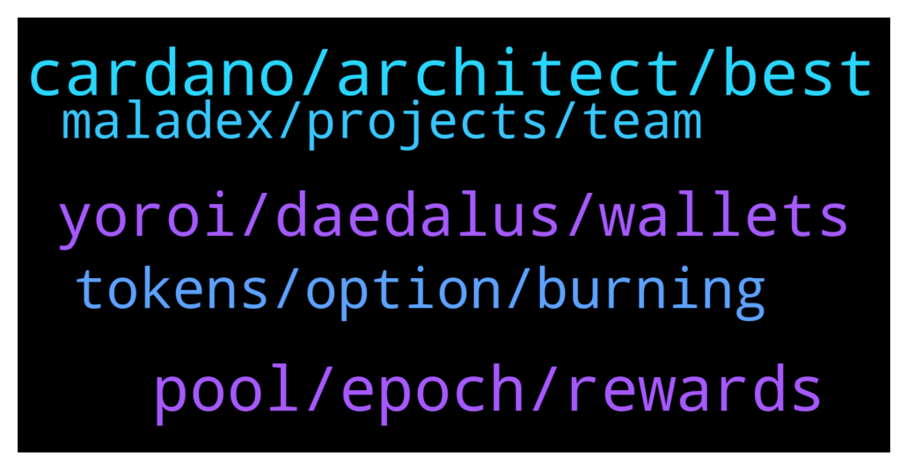

# **@Cardano**
 ## Analysis for **2022-01-02** - **2022-01-03**.

---

## 📊 **Basic Stats**

**n_messages_sent**: 95

---

---

## 🔝 **Top keywords and related messages**

1. **cardano, architect, best**

    @mensrea --- *For real? As architect of Cardano's main implementation it's a bit weird to not hear anything from the guy at all, even by proxy, especially in this time when we're talking about scaling limitations* **--->** [TG Discussion](https://t.me/Cardano/764788)

    @ivan_Koloff --- *Why people continue to say that Cardano is a ghost chain ?* **--->** [TG Discussion](https://t.me/Cardano/765023)

    @CryptoHorsey --- *Hi team,   Any updates on the native Cardano NFTs competition from the Cardano Summit? I've received them in my Terra account but haven't heard much of the next stage/competition.  Any updates would be good!   Thanks! Peter 😊* **--->** [TG Discussion](https://t.me/Cardano/765040)

    @mensrea --- *Thanks for clarifying Charles. Understandably he's a private person – maybe it's just the timing because it would be amazing to have him (active on IOG of course) and Well Typed joining forces with MLabs with all the work on Plutonomicon/Plutus optimizations to get these things right. Best to get inputs straight from the original architect in that sense.... at least we have the defi alliance now hopefully converging on best practices. But looking forward to Duncan's return regardless. Surely even the general Haskell community is missing him 👍* **--->** [TG Discussion](https://t.me/Cardano/765050)

    @Iohkcharles --- *Well-Typed is still working on cardano* **--->** [TG Discussion](https://t.me/Cardano/765051)

    @Micky --- *Oh... His dedication towards cardano is tremendous* **--->** [TG Discussion](https://t.me/Cardano/764732)

2. **pool, epoch, rewards**

    @Lgbeano --- *Your wallet is staked, not the ₳ inside, so you can use your ₳ whenever you want.   Simply select a pool to delegate to, which registers your wallets staking key.   When staking, your ₳ is never locked up, it's pretty much like not delegating, you are free to do what you want with your ₳. Any ₳ added to the wallet is auto staked, including your rewards. Your ₳ never leaves your wallet.   When you initially delegate to a pool it costs a transaction fee which is 0.17 ₳ and takes 2 ₳ as a deposit. That 2 ₳ you get back (minus the transaction fee) if you ever un delegate.   When delegating to a pool it takes 15 - 20 days for you to start seeing rewards, then it's every 5 days. Epochs are 5 days.   The reason it takes 15 - 20 days to get your first reward is because the first epoch doesn't count, it doesn't matter where you delegate within that epoch (5 days). Once the epoch finishes, snapshots are taken of ₳ within pools.   - 1st epoch, your ₳ is not included   - 2nd epoch your ₳ is ready to be included  - 3rd epoch your ₳ is included and earning rewards.   - End of 4th epoch you receive rewards for 3rd epoch.   When you receive rewards they are an epoch behind.  If you remove all your ₳ but keep your wallet delegated (do not de register), you will continue receiving rewards for three epochs before the rewards drop to match the ₳ in your wallet.   Same as if you add more ₳, it will take 3 epochs before you notice a difference in rewards.   If you want to move pools, you do not need to un delegate first, just select the pool you want to move to. You will continue to receive rewards from your old pool for three epochs (as long as it creates blocks) before you start receiving rewards from your new pool.   Your ₳ is never at risk, nor does it leave the wallet, you can not lose any ₳. If the pool you delegate to is shut down or doesn't get any blocks for what ever reason, the worst that happens is you wont receive any rewards. But you never lose your ₳.   This video is really good at explaining what staking is  https://youtu.be/Cs_stEnEvpg* **--->** [TG Discussion](https://t.me/Cardano/764564)

    @Cat --- *Hi everybody, hope you all are doing great in the new year! I have a question. I am about to start staking some ADA with Nano Ledger. I am wondering what is the best setup with Daedleus wallet. Is it possible to split out a part of the amount staked once I need some liquidity? How is your setup? Do you have one paired wallet where you stake all ADAs you put in there or maybe you use two wallets within Daedleus? (I am happy to research myself but need to find right resources to read but I am also trying this shortcut and asking here:) and ofc I am curious how you do it, I am super grateful for your support and help). Thanks for helping a newbie!* **--->** [TG Discussion](https://t.me/Cardano/764563)

    @milhk --- *I have already delegated to a staking pool to participate in SundaeSwap ISO. I want to buy more ADA and increase my stake but on the staking pool that I'm currently using, the delegate button is grayed out. Does it mean I cannot participate anymore?* **--->** [TG Discussion](https://t.me/Cardano/765193)

    @rockogs --- *Check the SundaeSwap medium article which lists the pool winners… https://sundaeswap-finance.medium.com/meet-your-sundaeswap-scoopers-76476dafa744* **--->** [TG Discussion](https://t.me/Cardano/765227)

    @Rabbitholepools --- *There are a number of great pools. There are not many things to avoid, other than pools that are oversaturated or entities which spin new pools all the time* **--->** [TG Discussion](https://t.me/Cardano/764780)

    @Zyroxa --- *You cant really predict the exact rewards for a specific pool, because it also has alot to do with luck.* **--->** [TG Discussion](https://t.me/Cardano/764771)

3. **yoroi, daedalus, wallets**

    @Rabbitholepools --- *#daedalus and #yoroi are by far the most commonly used wallets. They need multidelegation.  They would also greatly benefit from staking URIs being finally implemented.* **--->** [TG Discussion](https://t.me/Cardano/764982)

    @Mr_Mont420 --- *Does Yoroi have multi-pool delegation feature? Or do I need to create a separate wallet to delegate to a second pool?* **--->** [TG Discussion](https://t.me/Cardano/764952)

    @sul4x --- *Is this the original yoroi wallet?: https://yoroi-wallet.com* **--->** [TG Discussion](https://t.me/Cardano/764748)

    @glitch04 --- *Nobody is bound to using any one wallet they are free to choose which wallet/delegation method they prefer* **--->** [TG Discussion](https://t.me/Cardano/764984)

    @Tonyno456 --- *Multi delegation is already available, just not from Daedalus and yoroi, why wait ? 🤷‍♂  Ccvault* **--->** [TG Discussion](https://t.me/Cardano/764977)

    @glitch04 --- *It's recommended they use hardware secured wallets along side those options though* **--->** [TG Discussion](https://t.me/Cardano/764985)

4. **tokens, option, burning**

    @sul4x --- *Is there a calculator which shows how much ADA you would get by delegating to a specific validator?* **--->** [TG Discussion](https://t.me/Cardano/764769)

    @sul4x --- *I delegated to it but I think I got fairly few ADA.* **--->** [TG Discussion](https://t.me/Cardano/764779)

    @PipSqueak --- *Just a thought, how do we burn tokens we don’t want. I claimed a lot on dripdropz, I am not sure I want to keep all of them as some seem useless. Basically, I know CH is against burning ada but I am thinking in terms of burning things like inappropriate tokens or abusive NFTs.* **--->** [TG Discussion](https://t.me/Cardano/765138)

    @tham3rr --- *Why is it legit, I mean the 90%of the tokens distributed is quistionable?* **--->** [TG Discussion](https://t.me/Cardano/765012)

    @glitch04 --- *So gifting them is an option or returning them to the same address but you still will lose some ada along the way* **--->** [TG Discussion](https://t.me/Cardano/765142)

    @glitch04 --- *There are a few created burn addresses but that also burns your own ada that is bound to those transfers..* **--->** [TG Discussion](https://t.me/Cardano/765141)

5. **maladex, projects, team**

    @Block101 --- *The features look cool on Maladex, its whether or not the team delivers. The roadmap doesn't even have dates.  + I don't invest in projects without seeing who's building it.* **--->** [TG Discussion](https://t.me/Cardano/764623)

    @Greg --- *I also know about vyfi going live in about two weeks maybe sooner.* **--->** [TG Discussion](https://t.me/Cardano/764542)

    @Muneeb1988 --- *Watched the video but there are some dapps being released this month I know about meld that will launch 31 Jan* **--->** [TG Discussion](https://t.me/Cardano/764541)

    @yutazzz --- *“Whiteboard: DApps and Development”  i wrote a summary and a detailed post!!! 🎉 (Please refer to the linked article for details!)  https://forum.cardano.org/t/dapps-3/90683* **--->** [TG Discussion](https://t.me/Cardano/765014)

    @glitch04 --- *They repeat what others say most are not part of the community so if they can't see it to them it's not there even if these projects are actively building out on test net* **--->** [TG Discussion](https://t.me/Cardano/765037)

    @Rabbitholepools --- *That's fair enough. But some development milestones can be discussed.* **--->** [TG Discussion](https://t.me/Cardano/764989)

