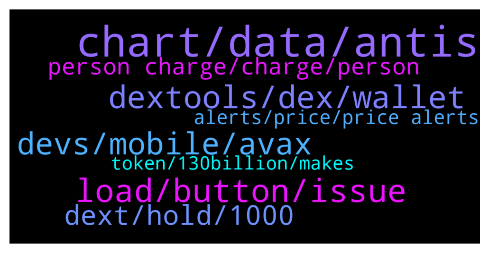

# **@DEXToolsCommunity**
 ## Analysis for **2022-01-01** - **2022-01-03**.

---

## 📊 **Basic Stats**

**n_messages_sent**: 297

---

---

## 🔝 **Top keywords and related messages**

1. **chart, data, antis**

    @napascual --- *Nothing to fix there. A candle normalization has already been done, those candles just cannot be avoided. That's just blockchain data. You can still stretch the candles to display the chart dates you're interested in.* **--->** [TG Discussion](https://t.me/DEXToolsCommunity/320928)

    @Mojomagick --- *Please can you fix or tell me what the issue is:  The chart for AVT a few times wicks have been removed after a few days. This has happened on several different occassions for a few weeks.  For example yesterday  Price went to $1.82 But today that price was removed from the chart. Even though 2 transactions at that price are still on the transaction log under the chart.  https://www.dextools.io/app/ether/pair-explorer/0xcdff6ddfc9e4807c9927fd58708c2ef3484cc305  @napascual* **--->** [TG Discussion](https://t.me/DEXToolsCommunity/321028)

    @wealthyhobo --- *Fix the chart for ANTIS Inu, someone added liquidity before the launch date to sabotage it, and we need that resolved ASAP.* **--->** [TG Discussion](https://t.me/DEXToolsCommunity/320916)

    @wealthyhobo --- *If you zoom out of the chart you will see a massive red candle way before that current chart. The first green candle you see is the actual day the project was launched* **--->** [TG Discussion](https://t.me/DEXToolsCommunity/320931)

    @Reza --- *Please look at the full chart... There is a big red candle that occurred prior to launching. It's inaccurate and misleading. Please take appropriate action, as this can be detrimental.* **--->** [TG Discussion](https://t.me/DEXToolsCommunity/321044)

    @gumbercules --- *As stated...no action can be taken. That's the data that's been picked up from when the token was launched* **--->** [TG Discussion](https://t.me/DEXToolsCommunity/321045)

2. **load, button, issue**

    @BuyTheCheeseDip --- *just stays at the loading screen* **--->** [TG Discussion](https://t.me/DEXToolsCommunity/320657)

    @Mojomagick --- *Can this be fixed please ?* **--->** [TG Discussion](https://t.me/DEXToolsCommunity/321098)

    @cl1mb3rs --- *and not beeing able to use them aty* **--->** [TG Discussion](https://t.me/DEXToolsCommunity/321455)

    @stanes --- *Please try to clear you cache.* **--->** [TG Discussion](https://t.me/DEXToolsCommunity/321404)

    @Flashbang665 --- *Ok, but still cant load them as they dont get listed when pressing the load layaout button* **--->** [TG Discussion](https://t.me/DEXToolsCommunity/321362)

    @Flashbang665 --- *Hi. Im using the saving button to save the layaout. But afterwards when trying to load a layout it doesnt list any saved ones :(* **--->** [TG Discussion](https://t.me/DEXToolsCommunity/321273)

3. **dextools, dex, wallet**

    @masterFrogda --- *there was an incident a few days ago with dextools, so that's why I was wondering...* **--->** [TG Discussion](https://t.me/DEXToolsCommunity/320606)

    @Ucup_kom --- *Hello everyone, I am Ucup Business Development Advisor of KOMmunitas. We are looking for  partnership collaboration with DEXTools,who is the right person to contact? Thank you!* **--->** [TG Discussion](https://t.me/DEXToolsCommunity/321119)

    @Firepoke --- *Why don't you create your own dex, maybe something like sushiswap operating on your platform but your own* **--->** [TG Discussion](https://t.me/DEXToolsCommunity/321177)

    @stanes --- *Click on the Dextools logo on the top right then "my account".* **--->** [TG Discussion](https://t.me/DEXToolsCommunity/320498)

    @LIRItheBobm --- *How can i subscribe on dextool ??? I have dex on my wallet that i connect.* **--->** [TG Discussion](https://t.me/DEXToolsCommunity/320496)

    @CliffordGrows --- *Thank you!  Can you do the pair creation on Dextools?  Is there a video tutorial on how to do this?* **--->** [TG Discussion](https://t.me/DEXToolsCommunity/320474)

4. **devs, mobile, avax**

    @stanes --- *It's currently 10 o'clock on January 1st in Spain 😅 but be sure devs will take care of it as soon as they can. Just give them couple hours should be fine.* **--->** [TG Discussion](https://t.me/DEXToolsCommunity/320799)

    @gumbercules --- *Not going to say it again sir. Devs have answered you* **--->** [TG Discussion](https://t.me/DEXToolsCommunity/321100)

    @AJ --- *any ETAs please so that I can remind you after that again !* **--->** [TG Discussion](https://t.me/DEXToolsCommunity/320797)

    @Elcocote --- *@stanes tell dev that I received notification now. Maybe they have changed something* **--->** [TG Discussion](https://t.me/DEXToolsCommunity/321563)

    @stanes --- *Ok, forwarding that to the devs rn, thanks for reporting.* **--->** [TG Discussion](https://t.me/DEXToolsCommunity/321553)

    @Dome --- *Any planning to launch mobile app for ios & android ?* **--->** [TG Discussion](https://t.me/DEXToolsCommunity/321413)

5. **dext, hold, 1000**

    @stanes --- *I mean, you have to be a standard member. So yes, standard sub or by holding 1k DEXT.* **--->** [TG Discussion](https://t.me/DEXToolsCommunity/320502)

    @nulldull --- *hi if i hold dextool coin what benefits do i get* **--->** [TG Discussion](https://t.me/DEXToolsCommunity/320745)

    @taisui2 --- *I brought 10759 DEXT one year ago. When I connected DEXT app to Matamask Wallet, it shows your balance is 0. I am wondering. what is this? How can I get my DEXT token?* **--->** [TG Discussion](https://t.me/DEXToolsCommunity/320646)

    @peter031 --- *Any one ? How many I need to hold to update?* **--->** [TG Discussion](https://t.me/DEXToolsCommunity/320841)

    @David 01 --- *David 01, [03/01/2022 2:06 AM] good morning and happy new year. I but 1000+ DEX and transferred 240 DEX as advised but I am yet to get confirmation of the transaction. admin, respond please.* **--->** [TG Discussion](https://t.me/DEXToolsCommunity/321492)

    @bastardganpunk --- *@FredericDEXT can help you if you transferred the coins already to activate your account.   anyway with holding 1000 dext in your wallet you have lifetime access to the standard version.* **--->** [TG Discussion](https://t.me/DEXToolsCommunity/321503)

6. **person charge, charge, person**

    @stanes --- *ADMINS NEVER DM FIRST. You probably received a lot of DMs from scammers.* **--->** [TG Discussion](https://t.me/DEXToolsCommunity/321548)

    @stanes --- *You have to DM @guillermorodriguez78 he is the person-in-charge. He will give you all the informations and assist you in the process. And ofc don't trust anybody DMing you first.* **--->** [TG Discussion](https://t.me/DEXToolsCommunity/321286)

    @stanes --- *It's a good point, I will see with the person in charge what he can do for that 👍* **--->** [TG Discussion](https://t.me/DEXToolsCommunity/321220)

    @napascual --- *@guillermorodriguez78 for marketing. He will never dm first* **--->** [TG Discussion](https://t.me/DEXToolsCommunity/320602)

    @stanes --- *Hi, For promotion you have to DM @guillermorodriguez78 he is the person-in-charge.  Be aware of scammers, HE WILL NEVER DM YOU FIRST.* **--->** [TG Discussion](https://t.me/DEXToolsCommunity/320566)

    @stanes --- *The real one is @guillermorodriguez78 you can check he is admin in this group.* **--->** [TG Discussion](https://t.me/DEXToolsCommunity/321436)

7. **alerts, price, price alerts**

    @stanes --- *Yes you can set price alerts. Standard users can even get alerts on TG and email. Indeed devs are working on a native mobile app.* **--->** [TG Discussion](https://t.me/DEXToolsCommunity/321150)

    @DogecointotheMoon --- *yea I see that, but I only see where i input a price target, I am looking for % change rather that specific price* **--->** [TG Discussion](https://t.me/DEXToolsCommunity/321064)

    @gumbercules --- *yes there's price alerts on DEXTools* **--->** [TG Discussion](https://t.me/DEXToolsCommunity/321063)

    @spfr236 --- *can u make setting alarm for a price availible? is that possible from a browser? do u have any plan for an app?* **--->** [TG Discussion](https://t.me/DEXToolsCommunity/321148)

    @DogecointotheMoon --- *sorry to repeat, but is it possible to receive % cahnge price alerts on dextools?* **--->** [TG Discussion](https://t.me/DEXToolsCommunity/321060)

    @stanes --- *Free users can only set alerts for ETH pairs.* **--->** [TG Discussion](https://t.me/DEXToolsCommunity/321152)

