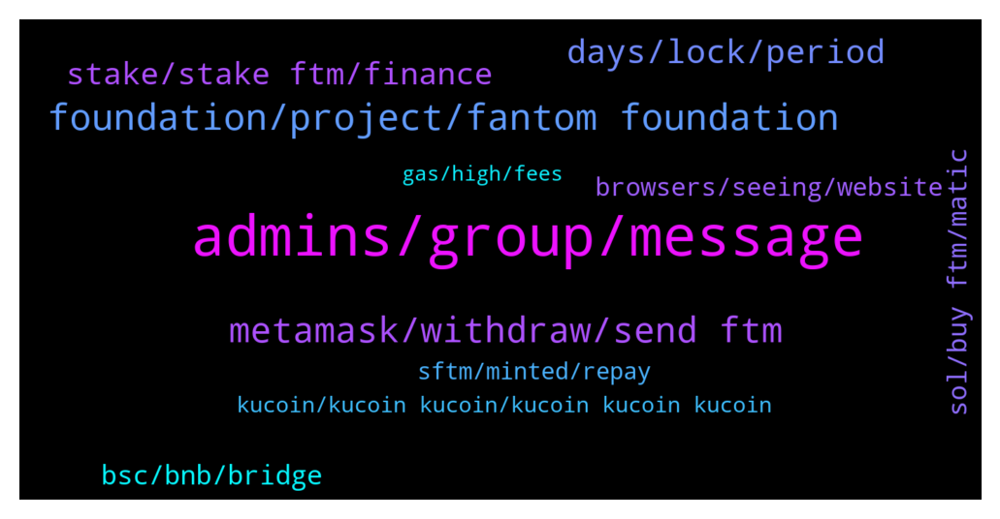

# **@Fantom_English**
 ## Analysis for **2022-01-02** - **2022-01-03**.

---

## 📊 **Basic Stats**

**n_messages_sent**: 329

---

---

## 🔝 **Top keywords and related messages**

1. **admins, group, message**

    @Johnnyfantom --- *The user DM me and sent me his wallet address, when I checked there were no tx from his wallet, funds were never there in the first place* **--->** [TG Discussion](https://t.me/Fantom_English/620082)

    @Mcjig --- *thats why we will never message first. only scammers using the same name message first* **--->** [TG Discussion](https://t.me/Fantom_English/620045)

    @Johnnyfantom --- *But when you realise you are wrong, you may apologise to @Mcjig* **--->** [TG Discussion](https://t.me/Fantom_English/620008)

    @kelvinDirh --- *Same thing I'm asking too buddy* **--->** [TG Discussion](https://t.me/Fantom_English/620089)

    @Ziga --- *is this some sort of a scam/spam? saw mention of this wallet too much today lol* **--->** [TG Discussion](https://t.me/Fantom_English/620087)

    @PricesSlahed --- *I'm new to this group, but the same as any crypto telegram group, admin never DM, and would never steel your funds* **--->** [TG Discussion](https://t.me/Fantom_English/620054)

2. **foundation, project, fantom foundation**

    @Peaky_23_Blinders --- *Hey everyone, I'm new to fantom, what are the biggest launchpads on ftm? thanks* **--->** [TG Discussion](https://t.me/Fantom_English/620549)

    @Victor --- *I'm not seeing anywhere on the fantom foundation website to get a hold of them other than here and discord or twitter, reddit.  just the social icons.  looking for an email address* **--->** [TG Discussion](https://t.me/Fantom_English/620678)

    @pajamasfreak --- *Scroll up a bit you find one* **--->** [TG Discussion](https://t.me/Fantom_English/620265)

    @thena_beger --- *Fantom unique addresses grew over 29,000% in just a year* **--->** [TG Discussion](https://t.me/Fantom_English/619864)

    @getat7 --- *Moreover, I believe Fantom can emulate some of its features. WaykiChain runs a charity campaign which I think is making the ecosystem have more adoption everyday. Fantom can also adopt this idea.* **--->** [TG Discussion](https://t.me/Fantom_English/619986)

    @MizoHosry --- *There is a new project will be launched on Fantom chain* **--->** [TG Discussion](https://t.me/Fantom_English/621084)

3. **metamask, withdraw, send ftm**

    @Alberto --- *My FTM on metamask are shown as BNB ... and all transactions fails* **--->** [TG Discussion](https://t.me/Fantom_English/619918)

    @LordTorcia --- *After I send Ftm to Binance how can I withdraw on Fantom since the tokens are on Bep2? Thank you* **--->** [TG Discussion](https://t.me/Fantom_English/619882)

    @ColinClark --- *Yes mainnet withdrawals when their not shut ? Hardly great. Your missing the point. Surely FTM should be standalone and have the direct facility so we don’t need to wait when it suits exchanges, spend additional monies to bridge, exchange, wrap etc etc* **--->** [TG Discussion](https://t.me/Fantom_English/620230)

    @LordTorcia --- *Hi, I have Fantom on Bep2, how can I transfer my Ftm to the Fantom MainNet? In the official wallet the option to receive from Erc20 or Bep2 is disabled. Thank you* **--->** [TG Discussion](https://t.me/Fantom_English/619850)

    @Niels --- *Just set up my first Fantom Wallet! I want to transfer FTM from Kucoin to this wallet. i can only select I’m receiving from ‘Fantom Opera’* **--->** [TG Discussion](https://t.me/Fantom_English/621024)

    @ColinClark --- *What I struggle to understand is why is it so awkward to work with Ftm  1) Fantom wallet stopped accepting erc20 facility  2) I have to wrap Fantom which isn’t easy 3) can’t buy Fantom direct on opera chain  4) have to use Metamask to use multichain.xyz and Metamask is awful and expensive  5) exchanges block withdrawals  Come on guys there must be an easy way. If I have to buy FTM in an ERC 20 please please please make it easy to swap to opera and simply to wrap* **--->** [TG Discussion](https://t.me/Fantom_English/620225)

4. **days, lock, period**

    @Mcjig --- *of course there are no rewards for 7 days. because your no longer staking* **--->** [TG Discussion](https://t.me/Fantom_English/620554)

    @Quantanamoto👻 --- *You will get a penalty if you unstake before the end of the locking period.* **--->** [TG Discussion](https://t.me/Fantom_English/620520)

    @Mcjig --- *if you lock for 14 days and the timer is finished. you would be on no lock at 4% interest. still have a 7 day wait if you undelegate* **--->** [TG Discussion](https://t.me/Fantom_English/620550)

    @Mcjig --- *some chains have 30 day unbonding times* **--->** [TG Discussion](https://t.me/Fantom_English/620556)

    @Nida --- *Like say I plan to stake for 30 days, should I still choose 365 days, just to get highest APR* **--->** [TG Discussion](https://t.me/Fantom_English/620513)

    @Nida --- *For staking locking period, does everyone choose the max (like 200+ days) to get the high apr, and then you can unstake at any time , only 7 days ???* **--->** [TG Discussion](https://t.me/Fantom_English/620512)

5. **stake, stake ftm, finance**

    @Thaddaeus --- *Hey guys. I’m new to cryptocurrency , please I need some guidelines on how to stake Ftm correctly. I need help atm, anyone ? 🙏. Scammers should stay off please* **--->** [TG Discussion](https://t.me/Fantom_English/619927)

    @Luke --- *I found staking via spookyswap to be easiest, you’ll need to stake as a pair (ftm-boo for example) though. Same with Tomb finance.* **--->** [TG Discussion](https://t.me/Fantom_English/619939)

    @pajamasfreak --- *Officially you can stake on fwallet* **--->** [TG Discussion](https://t.me/Fantom_English/620959)

    @Paper_Prophet --- *Ok so far so good. I have weth. Which platform is cheapest please?* **--->** [TG Discussion](https://t.me/Fantom_English/620478)

    @jaywillizigah --- *Yah, it's possible to stake ftm on waykichain,  Don't know if the team are planning on integrating ftm on the waykichain network* **--->** [TG Discussion](https://t.me/Fantom_English/619831)

    @Kahn29 --- *does FTM has single stake? thank you* **--->** [TG Discussion](https://t.me/Fantom_English/620272)

6. **bsc, bnb, bridge**

    @Janevietani --- *why dont bridge BNB BEP20 to BNB Fantom then you can swap BNB Fantom for FTM on spookyswap later* **--->** [TG Discussion](https://t.me/Fantom_English/620311)

    @Paper_Prophet --- *Need to bridge some ETH from fantom to etherium. What’s the best cheapest way please?* **--->** [TG Discussion](https://t.me/Fantom_English/620475)

    @Mcjig --- *no its not possible at this time. you can look at anyswap router to see what networks it supports* **--->** [TG Discussion](https://t.me/Fantom_English/619872)

    @Janevietani --- *sorry , i dont use BSC so i dont know apeswap link.* **--->** [TG Discussion](https://t.me/Fantom_English/620310)

    @Janevietani --- *you can check DEX on BSC. try check apeswap on BSC* **--->** [TG Discussion](https://t.me/Fantom_English/620308)

    @Janevietani --- *example bridge BNB BEP20 to BNB Fantom with https://spookyswap.finance/bridge* **--->** [TG Discussion](https://t.me/Fantom_English/620318)

7. **sol, buy ftm, matic**

    @NO1BOSS6969 --- *Pls can someone put me through on ftm farming. I'll really appreciate* **--->** [TG Discussion](https://t.me/Fantom_English/620928)

    @lifesgoodman --- *hi guys where do you buy ftm* **--->** [TG Discussion](https://t.me/Fantom_English/620806)

    @A24694 --- *What do you earn in return? Ftm or boo* **--->** [TG Discussion](https://t.me/Fantom_English/619956)

    @getat7 --- *Exactly! It's as if you read my mind. That's just what I intend doing with my Ftm tokens.* **--->** [TG Discussion](https://t.me/Fantom_English/619814)

    @mamdouhta --- *guys is there any way to get my ftm ?* **--->** [TG Discussion](https://t.me/Fantom_English/620134)

    @jondtran --- *FTM has a TVL higher than MATIC and more than half of SOL. The inflow of money is increasing day by day. While Cap is only 1/3 of Matic, 1/9 of Sol.* **--->** [TG Discussion](https://t.me/Fantom_English/621030)

8. **browsers, seeing, website**

    @Ziga --- *https://coinmarketcap.com/currencies/waykichain/  if you click the waykichain the website doesnt even run anymore. whatever it is, seems like a project that is not being up to date* **--->** [TG Discussion](https://t.me/Fantom_English/620092)

    @Ziga --- *just seems suspicious heh, id stick to bigger names or native ftm wallet. you never know when dealing with smaller projects.  website doesnt load here, maybe regionally blocked* **--->** [TG Discussion](https://t.me/Fantom_English/620101)

    @Marten42 --- *Googling the error, I see it's origin is in a go package. So it's server-side. Am I the only one having issues?* **--->** [TG Discussion](https://t.me/Fantom_English/621006)

    @Victor --- *and yall are seeing it on your browsers?   I'm not seeing it on 3 different browsers.  let me try on brave browser* **--->** [TG Discussion](https://t.me/Fantom_English/620685)

    @kelvinDirh --- *And it's quite active. Cmc not updated them? I am scared of links now, would have used your link to check 😂* **--->** [TG Discussion](https://t.me/Fantom_English/620095)

    @Alberto --- *the wierd thing is that it has been working fine until today* **--->** [TG Discussion](https://t.me/Fantom_English/619923)

9. **sftm, minted, repay**

    @Mcjig --- *exactly what it says. you minted sftm and used it in fmint. now you need to give back the sftm to undelegate* **--->** [TG Discussion](https://t.me/Fantom_English/620479)

    @Nida --- *So if I press “repay sFTM”, then I’ll get all of it back and I delegate? Sorry I know I sound like a newbie, coz I’m one ;)* **--->** [TG Discussion](https://t.me/Fantom_English/620480)

    @Nida --- *Can someone help me unstake? What does “repay sFTM” mean?* **--->** [TG Discussion](https://t.me/Fantom_English/620477)

    @Nida --- *It just sounds scary when it says “repay sFTM”.  I feel  like I’m gonna loose all my tokens or something 🙀* **--->** [TG Discussion](https://t.me/Fantom_English/620486)

    @Mcjig --- *then repay back what you minted and unlock the sftm* **--->** [TG Discussion](https://t.me/Fantom_English/620493)

    @Nida --- *Yes I minted, I wasn’t sure what that meant at the time, tbh* **--->** [TG Discussion](https://t.me/Fantom_English/620491)

10. **kucoin, kucoin kucoin, kucoin kucoin kucoin**

    @KoinLuc --- *I don't have this wtf kucoin* **--->** [TG Discussion](https://t.me/Fantom_English/620820)

    @smashingdollars --- *mine is on kucoin. u can check on cmc* **--->** [TG Discussion](https://t.me/Fantom_English/620807)

    @lifesgoodman --- *So whats the difference between Kucoin and kucoin s ?* **--->** [TG Discussion](https://t.me/Fantom_English/620810)

    @smashingdollars --- *you only need to swipe down from your kucoin app* **--->** [TG Discussion](https://t.me/Fantom_English/620817)

    @Mills --- *Assalamualaikum, contact Kucoin. You will get it back* **--->** [TG Discussion](https://t.me/Fantom_English/620138)

    @lifesgoodman --- *what is kucoin s you were talking above?* **--->** [TG Discussion](https://t.me/Fantom_English/620808)

