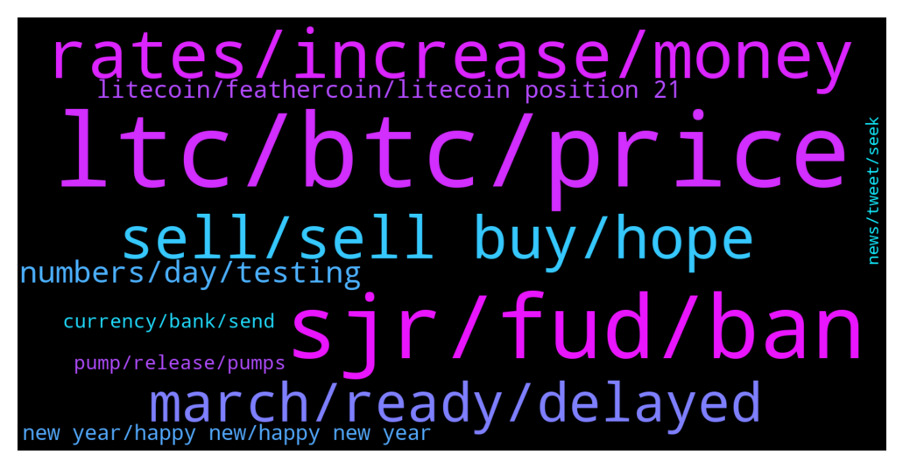

# **@Litecoin**
 ## Analysis for **2022-01-02** - **2022-01-03**.

---

## 📊 **Basic Stats**

**n_messages_sent**: 324

---

---

## 🔝 **Top keywords and related messages**

1. **ltc, btc, price**

    @thena_beger --- *Ltc will make it although it's so undervalued at the moment, patience will be key in 2022* **--->** [TG Discussion](https://t.me/Litecoin/2038612)

    @RorschachTesst --- *Anyone thinking btc will do a 100x is just nuts. The mcap is too high. You'll just end up seeing more solanas this year* **--->** [TG Discussion](https://t.me/Litecoin/2038531)

    @jrx486 --- *Look at how ltc went from 2014 to 2017. People thought they were cucked too.* **--->** [TG Discussion](https://t.me/Litecoin/2038838)

    @PepeTheFrog --- *it's time to move on with ltc. don't be like those feathercoin guys* **--->** [TG Discussion](https://t.me/Litecoin/2039336)

    @TrojanHorshe --- *Even Charlie prediction was wrong on making new ATH in December 2021 . I think LTC is pretty much frocked* **--->** [TG Discussion](https://t.me/Litecoin/2039405)

    @RorschachTesst --- *How convenient that you treat  2013-2017 and 2018-2021 as two separate eras. Ltc just retraced its 2017 price in 2021. It did not shatter records* **--->** [TG Discussion](https://t.me/Litecoin/2039020)

2. **sjr, fud, ban**

    @TonyNakamoto --- *Wat abouP me other coims th0 sjr* **--->** [TG Discussion](https://t.me/Litecoin/2038654)

    @TonyNakamoto --- *Wow ur mask fell off sjr* **--->** [TG Discussion](https://t.me/Litecoin/2039079)

    @TonyNakamoto --- *R came 2 late 2 B a whale sjr* **--->** [TG Discussion](https://t.me/Litecoin/2038661)

    @ken_xmas --- *@morningzone  WE TIRED OF THIS FUD ALL THE TIME FUD FUD  BAN THEM AND DONT ALLOW THEM BACK HERE* **--->** [TG Discussion](https://t.me/Litecoin/2038709)

    @DutchSkywalker --- *You are not moonsie so stfu* **--->** [TG Discussion](https://t.me/Litecoin/2038629)

    @peace_warrior --- *Getting rekt is the name of the game son* **--->** [TG Discussion](https://t.me/Litecoin/2038628)

3. **rates, increase, money**

    @Jim --- *People are afraid of lockdowns and all the situation... thats why they dont invest now. If i remember right inflation in usa this year is 6.3 or 6.7%* **--->** [TG Discussion](https://t.me/Litecoin/2039179)

    @ck42069 --- *They will increase i terest rates and we ll all get rekt not just crypto but all the damn markets* **--->** [TG Discussion](https://t.me/Litecoin/2038500)

    @jrx486 --- *so good news is only good news when the coin pumps and leads the market?* **--->** [TG Discussion](https://t.me/Litecoin/2038586)

    @Amine0101 --- *There are predictions that cryptos value will increase up to 30% by the first week of the new Year, is this true ?* **--->** [TG Discussion](https://t.me/Litecoin/2038722)

    @moonsie --- *this is how fast things can change. within 1 year a well-established ancient coin can go from relevant to irrelevant and stomped into the dirt shitcoin* **--->** [TG Discussion](https://t.me/Litecoin/2039372)

    @ck42069 --- *The exchanges cannot support shit once interest rates fo up* **--->** [TG Discussion](https://t.me/Litecoin/2038476)

4. **sell, sell buy, hope**

    @BillyRoc --- *Yes. Undervalued. The fudders here want you to buy high and sell low while they accumulate.   Research and pick your prices; fudders try to tell people what to do at a loss while doing the opposite.* **--->** [TG Discussion](https://t.me/Litecoin/2038615)

    @JIMMY G --- *So if you are so sure of this why not cash out now ?* **--->** [TG Discussion](https://t.me/Litecoin/2038509)

    @DutchSkywalker --- *Well, this did the price very well, did it? 🤮* **--->** [TG Discussion](https://t.me/Litecoin/2038585)

    @ken_xmas --- *No I scare hé dump price again* **--->** [TG Discussion](https://t.me/Litecoin/2038604)

    @standard211 --- *Is it real Is there a way to mine it Can I do it without investing* **--->** [TG Discussion](https://t.me/Litecoin/2039206)

    @ck42069 --- *I dont wanna sell at a loss* **--->** [TG Discussion](https://t.me/Litecoin/2038493)

5. **march, ready, delayed**

    @ck42069 --- *Of course delayed maybe next decade serr* **--->** [TG Discussion](https://t.me/Litecoin/2038703)

    @jrx486 --- *Lol so your theory is that it will get delayed indefinitely then? What a load of crap.* **--->** [TG Discussion](https://t.me/Litecoin/2038720)

    @khalid --- *As i heared it was supposed to be on jan* **--->** [TG Discussion](https://t.me/Litecoin/2038597)

    @DutchSkywalker --- *They have to wait untill may* **--->** [TG Discussion](https://t.me/Litecoin/2038567)

    @ck42069 --- *Yeah they were calling for the same thing last year at the beginning of 2021* **--->** [TG Discussion](https://t.me/Litecoin/2038511)

    @ck42069 --- *Now he calls for february and march* **--->** [TG Discussion](https://t.me/Litecoin/2038522)

6. **numbers, day, testing**

    @Jim --- *Guys just wait covid cases fall and then here we go up* **--->** [TG Discussion](https://t.me/Litecoin/2039028)

    @ArchSter --- *Chrimbo and new year over so expect numbers to go down until schools and people go back to work make numbers go up again.* **--->** [TG Discussion](https://t.me/Litecoin/2039147)

    @ArchSter --- *Numbers are only accurate if people are testing. Coming up to end of year people are more concerned about meeting up and therefore testing more so numbers are probably more accurate in terms of cases...* **--->** [TG Discussion](https://t.me/Litecoin/2039166)

    @Carlos_PRO_Holder --- *Volume is low, we are going down* **--->** [TG Discussion](https://t.me/Litecoin/2039471)

    @ArchSter --- *One day up then another day down.* **--->** [TG Discussion](https://t.me/Litecoin/2039146)

    @TonyNakamoto --- *This round might B over within a day* **--->** [TG Discussion](https://t.me/Litecoin/2038548)

7. **litecoin, feathercoin, litecoin position 21**

    @moonsie --- *litecoin performed worst than feathercoin last year* **--->** [TG Discussion](https://t.me/Litecoin/2039361)

    @nunya --- *I cant believe bitcoin is FORTY fkn 7 thousand and litecoin is not even 200 measely dollars lmao* **--->** [TG Discussion](https://t.me/Litecoin/2038836)

    @jrx486 --- *Ok, but Litecoin is one of the most adopted altcoins, while basically feathercoin can only be exchanged on bittrex and a short list of shit places.* **--->** [TG Discussion](https://t.me/Litecoin/2039348)

    @moonsie --- *litecoin performance last year was absolutelty disugistng* **--->** [TG Discussion](https://t.me/Litecoin/2039003)

    @Safu_LTC --- *BUT yes Litecoin is a little boring 😁* **--->** [TG Discussion](https://t.me/Litecoin/2038844)

    @runjune001 --- *litecoin community has been making noise lately.. lets keep it up* **--->** [TG Discussion](https://t.me/Litecoin/2038431)

8. **new year, happy new, happy new year**

    @BillyRoc --- *Be aware. Good luck, everyone. Think for yourselves, and happy New Year. Good times here. :)* **--->** [TG Discussion](https://t.me/Litecoin/2038679)

    @TonyNakamoto --- *That's actually a charitable description lol* **--->** [TG Discussion](https://t.me/Litecoin/2038505)

    @Alexia558 --- *everyone a healthy and happy new year* **--->** [TG Discussion](https://t.me/Litecoin/2038834)

    @RorschachTesst --- *Welcome to the dark side. And the first complaints have started. Love this group* **--->** [TG Discussion](https://t.me/Litecoin/2038408)

    @sugarunited --- *You finally started giving some positive vibes, i appreciate it. That can easily happens I agree with you* **--->** [TG Discussion](https://t.me/Litecoin/2038405)

    @RorschachTesst --- *Its 11 hours into the new year. Where my fellow complainers at?* **--->** [TG Discussion](https://t.me/Litecoin/2038385)

9. **pump, release, pumps**

    @DutchSkywalker --- *Well, LTC has not had any decent pumps for many years, so YESS?!?!* **--->** [TG Discussion](https://t.me/Litecoin/2038591)

    @JIMMY G --- *Yes that gives us from now till the. To pump.* **--->** [TG Discussion](https://t.me/Litecoin/2038439)

    @RorschachTesst --- *They gonna release it in the bear market so that they can't be blamed for no pump after mweb release* **--->** [TG Discussion](https://t.me/Litecoin/2038565)

    @PepeTheFrog --- *there's still people holding and waiting for pump* **--->** [TG Discussion](https://t.me/Litecoin/2039346)

    @JIMMY G --- *Yes and LTC is always the last one to pump ..* **--->** [TG Discussion](https://t.me/Litecoin/2039329)

    @ken_xmas --- *Hidden div on LTC chart Let’s pump it* **--->** [TG Discussion](https://t.me/Litecoin/2039233)

10. **currency, bank, send**

    @kuntpuncher --- *Sooooo……this is the pitch for crypto currency. Let’s say I want to buy some bread. Instead of just swiping my bank card, I go make an account on coin base, link my bank account, send real money to coin base, buy a currency coin like litecoin, learn how to use wallets, send litecoin to wallet, then find a shop that sells bread and accepts litecoin, open my phone, and then send litecoin payment. Did I get the gist of using crypto currency?* **--->** [TG Discussion](https://t.me/Litecoin/2039288)

    @ArchSter --- *I will say this is not a true reflection on the true story of crypto... Otherwise I would not have invested in it. Would have bought tulips instead...😭😭😭* **--->** [TG Discussion](https://t.me/Litecoin/2039210)

    @ArchSter --- *It's a secure form of currency.* **--->** [TG Discussion](https://t.me/Litecoin/2039196)

    @standard211 --- *Yes bro I want you to tell me more about cryptocurrency* **--->** [TG Discussion](https://t.me/Litecoin/2039194)

    @ken_xmas --- *I’m the best person even there in world you study and discuss cryptocurrency with him  You can get to know more crypto currency’s peaple and comumicat with uoy do not doubt* **--->** [TG Discussion](https://t.me/Litecoin/2038616)

    @JohnTheApostle --- *Soooo ...... This is the pitch for fiat currency. Let's say you want to send money to your friend living in a developing country. Instead of just scanning his wallet's qr code, I go open a bank account, he go open a bank account, I link his personal details as a registered payee and wait for bank approval (they may ask for further clarifications and it may take a few days), then I have to swap into his own fiat currency with high fees, send the money to him, then wait that the money arrives with an international swift transfer which can take many days, and all of that if the sending bank or receiving bank doesn't block the transaction for any reason to do a background check, ask for documentation/verifications or even flag the transaction to some authorities  Did I get the gist of using fiat currency?* **--->** [TG Discussion](https://t.me/Litecoin/2039297)

