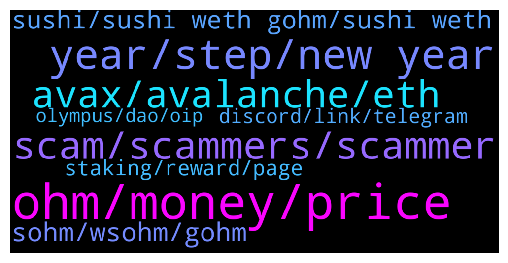

# **@OlympusTG**
 ## Analysis for **2022-01-02** - **2022-01-03**.

---

## 📊 **Basic Stats**

**n_messages_sent**: 869

---

---

## 🔝 **Top keywords and related messages**

1. **ohm, money, price**

    @apexfxtrading --- *Hey guys does anyone know much about the project plans with OHM for next year and what might cause a price to increase as a result, as I know at the moment we’re on a downwards cycle.* **--->** [TG Discussion](https://t.me/OlympusTG/140492)

    @Rumple4skin71 --- *OHM has been dropping like a stone and I want to try to make up some losses.* **--->** [TG Discussion](https://t.me/OlympusTG/141089)

    @WeltonBarbosa --- *What is happening with the price of ohm in coinmarketcap ?* **--->** [TG Discussion](https://t.me/OlympusTG/140872)

    @Ejfuwn --- *I mean the moving of ohm price is natural?* **--->** [TG Discussion](https://t.me/OlympusTG/141365)

    @NeonFlow --- *What's the realistic ROI for ohm in the next 6 months?* **--->** [TG Discussion](https://t.me/OlympusTG/141329)

    @SMNFT7 --- *Damn average wallet size 53.016 OHM* **--->** [TG Discussion](https://t.me/OlympusTG/140547)

2. **year, step, new year**

    @dragonsaints --- *well see you all in an year unless there is someother change and we need to manually do something 😊* **--->** [TG Discussion](https://t.me/OlympusTG/141029)

    @Sait --- *You are the best bro:)) you have discussion culture👏* **--->** [TG Discussion](https://t.me/OlympusTG/139993)

    @nfwaple --- *Im glad you're asking this question though 🙏* **--->** [TG Discussion](https://t.me/OlympusTG/140944)

    @cdp279 --- *Funny story is I am from Africa! 😆* **--->** [TG Discussion](https://t.me/OlympusTG/140252)

    @stacyd82d --- *Happy New Year All. Just want to say how great full I am to be a part of this community.* **--->** [TG Discussion](https://t.me/OlympusTG/140151)

    @Liu2699 --- *The road of life needs to be walked step by step* **--->** [TG Discussion](https://t.me/OlympusTG/141562)

3. **scam, scammers, scammer**

    @muzna123 --- *ok...but some said that its scam project is it???* **--->** [TG Discussion](https://t.me/OlympusTG/141468)

    @zelko --- *it's someone from this group who speaks to me in DM and who offers me this link to lower the costs lol* **--->** [TG Discussion](https://t.me/OlympusTG/140396)

    @stacyd82d --- *Yeah. I’m having trust issues these days especially with the ring and safemoon scams. Can’t be careful enough these days* **--->** [TG Discussion](https://t.me/OlympusTG/140207)

    @cdp279 --- *No dude. It’s a scammer. Ignore those bitches* **--->** [TG Discussion](https://t.me/OlympusTG/140246)

    @Mark --- *And you sure there’s no scam here?* **--->** [TG Discussion](https://t.me/OlympusTG/139851)

    @andywang1 --- *Just sell now if you think it's a scam* **--->** [TG Discussion](https://t.me/OlympusTG/141470)

4. **avax, avalanche, eth**

    @David IL --- *Big problem. I'm trying to convert AVAX to WSOHM and it says "Price Impact too high"  Help please🙏🙏🙏* **--->** [TG Discussion](https://t.me/OlympusTG/140700)

    @Rumple4skin71 --- *Anyone farming the Gohm-Avax LP on avalanche? I want to but I’m worried about IL.* **--->** [TG Discussion](https://t.me/OlympusTG/141088)

    @marcus_long --- *When will we be able to check price of gohm on AVAX* **--->** [TG Discussion](https://t.me/OlympusTG/140117)

    @Ap0l1o --- *Not sure to be honest, I just use eth and avalanche* **--->** [TG Discussion](https://t.me/OlympusTG/139950)

    @Ap0l1o --- *Yup, and you can buy it for example on traderjoe on avalanche for very low fees* **--->** [TG Discussion](https://t.me/OlympusTG/139941)

    @Ap0l1o --- *I would not know, I am mostly on eth, bought just to test on avalanche* **--->** [TG Discussion](https://t.me/OlympusTG/140001)

5. **sohm, wsohm, gohm**

    @Alex --- *so we keep both sohm and gohm* **--->** [TG Discussion](https://t.me/OlympusTG/141383)

    @eatsandtravels --- *When I strike should I be selecting sohm or Gohm!* **--->** [TG Discussion](https://t.me/OlympusTG/140875)

    @Alex --- *is sohm the one I should follow?* **--->** [TG Discussion](https://t.me/OlympusTG/141411)

    @Danimal84 --- *For gOhm?  I noticed wsOhm.. just want to make sure* **--->** [TG Discussion](https://t.me/OlympusTG/141073)

    @A --- *Wsohm and gohm are they the same* **--->** [TG Discussion](https://t.me/OlympusTG/139894)

    @dragonsaints --- *aka can we trade both sOhm and gOhm individually seperately* **--->** [TG Discussion](https://t.me/OlympusTG/140984)

6. **sushi, sushi weth gohm, sushi weth**

    @nfwaple --- *How to buy gOHM:   https://docs.olympusdao.finance/main/contracts/tokens  ETH - Sushi: ETH/OHMv2, FDT/gOHM; Uniswap: ETH/gOHM Avalanche - Traderjoe, Pangolin: AVAX/gOHM Arbitrum - Sushi: wETH/gOHM Polygon - Sushi: wETH/gOHM Fantom - Spiritswap: gOHM* **--->** [TG Discussion](https://t.me/OlympusTG/140963)

    @nfwaple --- *OHM v2 and stake it, or just buy gOHM (already in staked form):  https://docs.olympusdao.finance/main/contracts/tokens  ETH - Sushi: ETH/OHMv2, FDT/gOHM; Uniswap: ETH/gOHM Avalanche - Traderjoe, Pangolin: AVAX/gOHM Arbitrum - Sushi: wETH/gOHM Polygon - Sushi: wETH/gOHM Fantom - Spiritswap: gOHM* **--->** [TG Discussion](https://t.me/OlympusTG/140228)

    @nfwaple --- *sohm liquidity isnt great, prolly gohm, or ohm v2 then stake on the website: https://docs.olympusdao.finance/main/contracts/tokens  ETH - Sushi: ETH/OHMv2, FDT/gOHM; Uniswap: ETH/gOHM Avalanche - Traderjoe, Pangolin: AVAX/gOHM Arbitrum - Sushi: wETH/gOHM Polygon - Sushi: wETH/gOHM Fantom - Spiritswap: gOHM* **--->** [TG Discussion](https://t.me/OlympusTG/140780)

    @Coolfrijoles --- *Hey everyone, I was wondering what the slippage was for purchasing Ohm in sushiswap? Any help is much appreciated thanks* **--->** [TG Discussion](https://t.me/OlympusTG/140911)

    @nfwaple --- *https://docs.olympusdao.finance/main/contracts/tokens  ETH - Sushi: ETH/OHMv2, FDT/gOHM; Uniswap: ETH/gOHM Avalanche - Traderjoe, Pangolin: AVAX/gOHM Arbitrum - Sushi: wETH/gOHM Polygon - Sushi: wETH/gOHM Fantom - Spiritswap: gOHM* **--->** [TG Discussion](https://t.me/OlympusTG/141116)

    @nfwaple --- *make sure you're buying the right version, OHM v2 or gOHM.  https://docs.olympusdao.finance/main/contracts/tokens  ETH - Sushi: ETH/OHMv2, FDT/gOHM; Uniswap: ETH/gOHM Avalanche - Traderjoe, Pangolin: AVAX/gOHM Arbitrum - Sushi: wETH/gOHM Polygon - Sushi: wETH/gOHM Fantom - Spiritswap: gOHM* **--->** [TG Discussion](https://t.me/OlympusTG/140914)

7. **staking, reward, page**

    @Solomon --- *Please how can I go about in staking* **--->** [TG Discussion](https://t.me/OlympusTG/140838)

    @miansatar --- *Is any compulsory time frame for staking?* **--->** [TG Discussion](https://t.me/OlympusTG/140160)

    @eatsandtravels --- *Thanks so much! I just thought I was staking and getting something with the wrong value or no Value in return* **--->** [TG Discussion](https://t.me/OlympusTG/140895)

    @KingThanosx --- *Okay I found it now, just having a little problem with the staking and understanding my rewards, because I understand there was a recent migration, just wanna know Exactly how much return to be making also would I have any issues selling an undertaking* **--->** [TG Discussion](https://t.me/OlympusTG/141239)

    @xtechnologylimited --- *Do I need to upgrade to v2 to get staking reward ?* **--->** [TG Discussion](https://t.me/OlympusTG/140092)

    @Ingrid Adam --- *Hi guys. I'm new here. I bought some wsohm and gohm on traderjoe yesterday (bought them both). Are they already staking? If not, what do I need to do to stake them?* **--->** [TG Discussion](https://t.me/OlympusTG/140338)

8. **discord, link, telegram**

    @bike4peace --- *reading in discord trading, very interesting* **--->** [TG Discussion](https://t.me/OlympusTG/140057)

    @mandingo_0 --- *they should merge the chats of Discord and TG so that everyone can be able to see* **--->** [TG Discussion](https://t.me/OlympusTG/140072)

    @stacyd82d --- *They say it is on there telegram* **--->** [TG Discussion](https://t.me/OlympusTG/140205)

    @sreee4u --- *Can anyone send discord link of olympus dao?* **--->** [TG Discussion](https://t.me/OlympusTG/140286)

    @nfwaple --- *the link in my previous message* **--->** [TG Discussion](https://t.me/OlympusTG/141247)

    @nfwaple --- *Join the discord to see the latest announcement* **--->** [TG Discussion](https://t.me/OlympusTG/140079)

