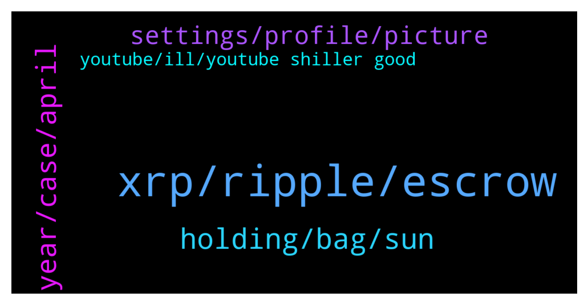

# **@Ripple**
 ## Analysis for **2022-01-02** - **2022-01-03**.

---

## 📊 **Basic Stats**

**n_messages_sent**: 111

---

---

## 🔝 **Top keywords and related messages**

1. **xrp, ripple, escrow**

    @DiegoferDF --- *2022 $XRP predictions. Most accurate TA.* **--->** [TG Discussion](https://t.me/Ripple/3033959)

    @JesusJames --- *that is what they put back into escrow* **--->** [TG Discussion](https://t.me/Ripple/3034046)

    @Riiggo --- *I agree they will use ripple tech but will they use the xrp token? That's the question.  They always mention ripple never xrp* **--->** [TG Discussion](https://t.me/Ripple/3034134)

    @gerrymchugh --- *One is market cap and other is the fully diluted market cap.* **--->** [TG Discussion](https://t.me/Ripple/3034186)

    @Madadaio --- *What is special about XDC?  There are promises like many other 10k coins. But where is the guaranty that banks, trade finance will jump into XDC network?  Ripple's high liquidity is the result of last 8 years of work. XDC  is a one man show, Andre Casterman. However, time will say what is what.* **--->** [TG Discussion](https://t.me/Ripple/3034112)

    @gerrymchugh --- *Ok, so this one is different? Didn't look it up, just figured it was the standard one* **--->** [TG Discussion](https://t.me/Ripple/3034049)

2. **holding, bag, sun**

    @MrstickGrowyourfund --- *my son agree with your dad* **--->** [TG Discussion](https://t.me/Ripple/3034526)

    @Whale_Group_Orcas --- *My dad say your mom is correct* **--->** [TG Discussion](https://t.me/Ripple/3034525)

    @omnikermit --- *Lol As you can see you are wrong again* **--->** [TG Discussion](https://t.me/Ripple/3034328)

    @Sky_Lurkz --- *Since when was factual statements classed as trolling 🤷🏻‍♀️  Read my comments in there entirety   I’m holding this bag till the very end* **--->** [TG Discussion](https://t.me/Ripple/3034271)

    @Sky_Lurkz --- *Lol… what do u actually know about that court case other than what you’ve bn spoon fed?  Genuinely….  I’m going to hold a bag all the way to zero if I have to but you can’t tell me 99% of people holding a bag haven’t got a scoobey doo what is actually occurring* **--->** [TG Discussion](https://t.me/Ripple/3034211)

    @ApoIIyon --- *Assumption is the mother of all bi***es* **--->** [TG Discussion](https://t.me/Ripple/3034563)

3. **year, case, april**

    @erik_sz91 --- *It would be nice to know which is the theorical maximum lenght the lawsuit could have. I mean, most of us think it will be solved this year, cause this year ISO20022 launches, and it would be strange if it starts with Ripple still in lawsuit. However can this case take like 10 years? Or that would be imposible?* **--->** [TG Discussion](https://t.me/Ripple/3034153)

    @Andy --- *You dont sound like an admin, this year of course iso20022* **--->** [TG Discussion](https://t.me/Ripple/3034007)

    @erik_sz91 --- *Bitboy said the case would end in September. No one knows the future* **--->** [TG Discussion](https://t.me/Ripple/3034150)

    @JesusJames --- *i believe that is the last day of discovery but they may have pushed it out a few days if i remember correctly* **--->** [TG Discussion](https://t.me/Ripple/3034089)

    @regiokiller --- *A settlement could be reached by Q1 2022* **--->** [TG Discussion](https://t.me/Ripple/3034276)

    @NialPial --- *I read Jeremy Hogan say, that the lawsuit will probably end by the end of April, cause of some documents that are still on hold, which should take 3-4 months to be processed.* **--->** [TG Discussion](https://t.me/Ripple/3034195)

4. **settings, profile, picture**

    @Jeffreezaa --- *I have a user name and profile picture?* **--->** [TG Discussion](https://t.me/Ripple/3034246)

    @Big_pumping --- *I have changed my settings 👍* **--->** [TG Discussion](https://t.me/Ripple/3034083)

    @JesusJames --- *please get a publicly visible profile picture per the rules can be a picture of anything* **--->** [TG Discussion](https://t.me/Ripple/3034082)

    @JustNNM --- *Please go to settings then edit and scroll down to @Username and add one there.  Than go to settings then privacy and set your profile photo to everybody.* **--->** [TG Discussion](https://t.me/Ripple/3034249)

    @Zertous --- *settings > privacy and security > turn everybody on profile picture  it's currently hidden.* **--->** [TG Discussion](https://t.me/Ripple/3034247)

    @JesusJames --- *that is why i asked it to be publicly visible its currently set to friends only* **--->** [TG Discussion](https://t.me/Ripple/3034085)

5. **youtube, ill, youtube shiller good**

    @Big_pumping --- *Oh ok ill try do some research thanks* **--->** [TG Discussion](https://t.me/Ripple/3034090)

    @kramercrypto --- *Did they actually though I could never find anything concrete just some fake memes* **--->** [TG Discussion](https://t.me/Ripple/3034491)

    @LincolnXtamc4 --- *Bitboi is Bitboy a youtube crypto shiller* **--->** [TG Discussion](https://t.me/Ripple/3034224)

    @EML1993 --- *He also has some good interviews in youtube.* **--->** [TG Discussion](https://t.me/Ripple/3034193)

    @NialPial --- *Where tho? Can’t find much on it yet :/* **--->** [TG Discussion](https://t.me/Ripple/3034189)

