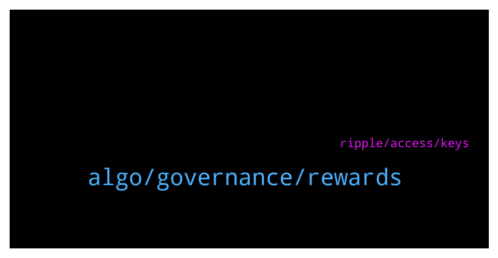

# **@algorand**
 ## Analysis for **2022-01-02** - **2022-01-03**.

---

## 📊 **Basic Stats**

**n_messages_sent**: 248

---

---

## 🔝 **Top keywords and related messages**

1. **algo, governance, rewards**

    @NightAlgorand --- *Nope, reward will be distributed to your wallet.* **--->** [TG Discussion](https://t.me/algorand/329015)

    @farnoudnik --- *No one has used ledger wallet to become a governor ?!* **--->** [TG Discussion](https://t.me/algorand/328722)

    @Gknows --- *Please anyone to help with 1 algo. Need for  swap fees* **--->** [TG Discussion](https://t.me/algorand/329003)

    @RCTurbo --- *ok sent me 100 Algo and i sent you 200 back* **--->** [TG Discussion](https://t.me/algorand/329005)

    @cyodha --- *Yes, i commited my Algos during signing period for gov2 (i commited on 25th dec) what im asking is will i still receive my gov1 rewards because i commited my algos before 31 Dec (gov1 end period)* **--->** [TG Discussion](https://t.me/algorand/328767)

    @NightAlgorand --- *The most popular one is this https://algorandwallet.com/* **--->** [TG Discussion](https://t.me/algorand/328589)

2. **ripple, access, keys**

    @Crypt0Playa --- *He didn't make the arrangement his Attorneys and Ripple did after he died. The question is how can Ripple unilaterally give assess to a wallet without knowledge of the private keys.* **--->** [TG Discussion](https://t.me/algorand/328901)

    @Crypt0Playa --- *I had a technical question - not sure how many of the engineers and technical experts here are familiar with the Mathew Mellon case whereby Mellon's Estate Lawyers after his death were able to gain access to his XRP wallets by entering into an arrangement with Ripple. They gained access to Mellon's wallets without having the private keys that controlled the funds in his wallets.  I don't know how this is even possible unless Ripple has backdoor access to the XRP ledger and even then it still doesn't make sense to me from a security and technical stand point how Ripple can unilaterally give courts/governments access to a wallet without knowledge of the private keys.  That said, I wanted to ask the experts here whether this is possible on the ALGORAND Network or part of some ISO 20022 regulation requirement.  The Mathew Mellon case with Ripple is a scary thought if Blockchain security can be bypassed with backdoor access to give any entity access to people's wallets without knowledge of the private keys.* **--->** [TG Discussion](https://t.me/algorand/328892)

    @Crypt0Playa --- *It's either Ripple had Mellon's private keys or Ripple has back door access to all wallets on the XRP ledger. No other way they could give Mellon's Estate Lawyers access to his wallets* **--->** [TG Discussion](https://t.me/algorand/328938)

    @Crypt0Playa --- *Even a deal made with ripple on how much can be sold makes no sense. It's a public ledger. Anyone can sell however much they want whenever they want.  Maybe that was when he was alive but when he died his wallets and his private keys went with him.... Well that is what one would have thought until his Estate Lawyers were able to gain access to his wallet(s) by approaching Ripple, which makes me wonder about the security of the XRP ledger.* **--->** [TG Discussion](https://t.me/algorand/328915)

    @zentaurion --- *Exactly. Because ripple is a private company like a bank they can just get ur money for some reason that’s embedded in their terms of service or not they can make one. The wallet is most likely held by ripple in that case. Just like when buying crypto on exchanges like coinbase or robinhood, u do not hold or own that wallet.* **--->** [TG Discussion](https://t.me/algorand/328905)

    @zentaurion --- *It was created to benefit the creators and private investors. Ripple created a hundred billion XRP and kept 80% for themselves and their clients and the other 20% they gave as a bonus to the founders.* **--->** [TG Discussion](https://t.me/algorand/328900)

